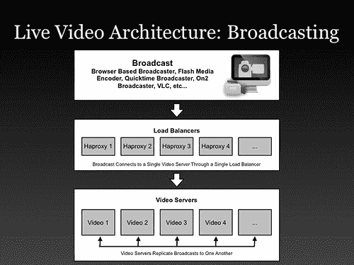
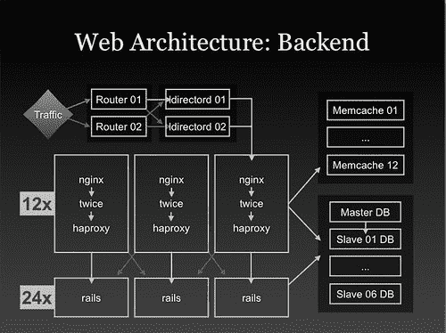

# Justin.tv 的实时视频广播架构

> 原文： [http://highscalability.com/blog/2010/3/16/justintvs-live-video-broadcasting-architecture.html](http://highscalability.com/blog/2010/3/16/justintvs-live-video-broadcasting-architecture.html)

未来是活的。 未来是实时的。 未来是现在。 无论如何，这是炒作。 由于它有做事的习惯，因此炒作正逐渐成为现实。 我们正在看到实时搜索，实时推文，实时位置，实时现实增强，实时螃蟹（新鲜和本地）以及实时事件发布。 所有直播技术中最具挑战性的一项是直播视频广播。 想象一下一个世界，每个人都是实时的广播人和视频流的使用者（< 250 毫秒延迟），所有这些使您可以直接进行对话和交互，而不会感到自己处于时移之中 战争。 实现这一目标所需的资源和工程必须足够。 你是怎样做的？

为了找到答案，我与 Justin.tv 创始人兼工程副总裁 Kyle Vogt 进行了交谈。 Justin.tv 当然有这个数字。 据报道，他们每月有 3000 万独立访问者在视频上传游戏中的表现甚至超过了 YouTube，据报道每分钟上传视频的时间比 You​​Tube 的 23 小时多了近 30 小时。我在听了另一位 Justin Kan 的[采访后要求接受采访 同名](http://www.gabrielweinberg.com/blog/2010/03/justin-kan-on-getting-traction.html) [Justin.tv](http://www.justin.tv) 的创始人。 贾斯汀（Justin）谈到实况视频与 YouTube 的批处理视频方法有本质的区别，后者将所有视频存储在磁盘上，然后按需播放。 实时视频无法通过更快地推送视频来制作，它采用了完全不同的架构。 由于 [YouTube 体系结构](http://highscalability.com/youtube-architecture)文章是该网站上最受欢迎的文章，因此我认为人们也可能会喜欢学习视频世界的现场知识。 凯尔（Kyle）投入大量时间和洞察力，对贾斯汀（Justin.tv）如何使所有实时视频魔术发生的事情产生了极大的兴趣，远远超出了通话范围，提供了大量多汁的细节。 任何构建系统的人都可以从他们的业务运作中学习到一些东西。 我非常感谢 Kyle 忍受着我永无止境的努力。

随着重点从批处理转移到实时，Justin.tv 正在采取的步骤在整个行业中也正在发生。 我们基本上已经学习了如何创建可伸缩的批处理系统。 实时性需要不同的架构。 例如，LinkedIn 已花费大量精力来构建[实时搜索](http://thenoisychannel.com/2010/01/31/linkedin-search-a-look-beneath-the-hood/)，即使对于复杂的查询，该查询也几乎是即时更新的。 他们通过在内存中对数据进行分区并编写自己的高度专业化的系统来使其工作来实现此目的。

Google 也许是实时更改的完美典范。 当 Google 有点笨拙时，他们每个月都会懒惰地更新搜索索引。 这是一个批处理模型，这意味着需要设计用于存储大量数据的基础结构，这需要高吞吐量而不是低延迟。 时代变了。 现在，谷歌大肆宣传[咖啡因](http://www.theregister.co.uk/2009/08/14/google_caffeine_truth)和[不断更新](http://cacm.acm.org/magazines/2010/3/76283-gfs-evolution-on-fast-forward/fulltext)。 他们必须进行许多架构更改，并彻底改革其堆栈，以支持延迟至关重要的面向客户的应用程序（例如 Gmail）。 而且，谷歌将不是唯一必须学习如何处理新实时技术的公司。

## 信息来源

1.  Justin.tv 创始人兼工程副总裁 Kyle Vogt 访谈。
2.  [贾斯汀·坎（Justin Kan）着作加布里埃尔·温伯格（Gabriel Weinberg）的著作](http://www.gabrielweinberg.com/blog/2010/03/justin-kan-on-getting-traction.html)
3.  [AWS Kyle Vogt 的启动项目](http://www.slideshare.net/tracylaxdal/justintv-aws-the-startup-project)。 这是 3 年前的 Justin.tv 的体系结构。
4.  [内部实时视频服务 Justin.tv](http://www.building43.com/videos/2010/01/12/inside-live-video-service-justin-tv) 。 Robert Scoble 对 Justin.tv 市场营销副总裁 Evan Solomon 的采访。

## 平台

1.  两次-自定义 Web 缓存系统。 （http://code.google.com/p/twicecache/）
2.  XFS-文件系统。
3.  HAProxy-软件负载平衡。
4.  LVS 堆栈和 ldirectord-高可用性。
5.  Ruby on Rails-应用程序服务器
6.  Nginx-Web 服务器。
7.  PostgreSQL-用于用户和其他元数据的数据库。
8.  MongoDB-用于其内部分析工具。
9.  MemcachedDB-用于处理高写入数据，例如视图计数器。
10.  Syslog-ng-日志记录服务。
11.  RabitMQ-用于作业系统。
12.  木偶-用于构建服务器。
13.  Git-用于源代码控制。
14.  Wowza-Flash / H.264 视频服务器，以及许多用 Java 编写的定制模块。
15.  Usher-用于播放视频流的自定义业务逻辑服务器。
16.  S3-小图像存储。

## 统计资料

1.  4 个数据中心遍布全国。
2.  在任何给定时间，都会有近 2,000 个传入流。
3.  每天每分钟增加 30 个小时的视频。
4.  每月有 3000 万独立访问者。
5.  平均实时带宽约为每秒 45 吉比特。 每日峰值带宽约为 110 Gbps。 最大峰值是 500 Gbps。
6.  基于商用硬件的大约 200 台视频服务器，每个服务器都可以发送 1Gbps 的视频。 比大多数 CDN 小，但比大多数视频网站大。
7.  每周可节省约 100TB 的档案存储空间。
8.  观看者开始失去实时交谈和交互功能之前，完整的视频路径的延迟不得超过 250 毫秒。

## 实时视频架构

1.  为什么直播视频很难？ 似乎您只需要很多带宽，将其全部保留在内存中，将流重新排序，就可以完成了。 简单。 没那么简单。 如果您不能仅通过 YouTube 更快地处理实时视频，是什么使实时视频成为挑战？
    1.  实时视频不会打 h，这意味着您无法超额订阅带宽。 当 YouTube 从订阅带宽开始时。 他们在 8 个演出管道中有 10 个演出的流量。 那行得通，因为玩家只需要缓冲即可。 使用实时视频，即使您超出网络容量一秒钟，也可以让每个观众同时观看所有视频。 如果您的需求超出容量，它将无法正常工作，每个人都会不断看到缓冲。 拥有网络容量非常重要，他们必须做正确的事情。 因此，他们提出了他们的对等架构。 如果需要，它们还具有比所需可用容量更多的容量。
    2.  当 CDN 溢出时，它们会优雅地溢出到 CDN。 有时它们确实会用完容量，并且努力地努力使 CDN 溢出。 Usher 处理此逻辑。 一旦容量不足，新的观看者将被发送到 CDN。
    3.  建筑系统似乎具有 100％的正常运行时间，但能够将机器缓慢地逐步停产以进行维护。 当观众可以迅速注意到任何问题并立即通过聊天与每个人谈论时，这是非常困难的。 使用聊天功能，没有隐藏问题。 用户对服务的期望很高，因此必须妥善处理问题。 他们必须等到每个人都使用完服务器后才能进入维护模式。 旋转速度非常慢。 会话永不中断。 您通常的网站可能会有一些错误，很少有人会注意到。
2.  当许多人想同时观看同一件事时，他们最大的问题就是控制闪光灯人群。 这是巨大的传入流量。 因此，他们需要创建一种在所有视频服务器和数据中心之间实时调整负载的方法。 该机制就是 Usher。
3.  Usher 是他们创建的自定义软件，用于管理负载均衡，身份验证和其他播放流的业务逻辑。 Usher 会计算要发送每个流的服务器数量，以确保始终保持最佳负载。 这是他们的特殊调味料，也是使他们的系统与众不同的地方。 它基于以下因素实时决定如何将流复制到服务器：
    1.  特定数据中心的负载量。
    2.  所有服务器的单独负载。
    3.  延迟优化。
    4.  流可用的服务器列表。
    5.  您的 IP 地址，以了解您来自哪个国家。
    6.  您在其路由数据库中的 IP 地址，以查看他们是否与您的 ISP 对等。
    7.  请求来自哪个数据中心，他们尝试将您发送到同一数据中心中的视频服务器。
4.  使用这些指标，Usher 可以优化纯成本，以将您发送到免费的服务器，或者将您发送到最接近要优化其延迟和性能的服务器。 他们有很多拨盘可以转动，并且具有非常精细的控制。
5.  每个服务器都可以充当边缘服务器（视频在其中流传输到查看器）和原始服务器（视频在其中从广播公司流式传输）。 根据负载，流可能在网络中的一台服务器或每台服务器上可用。 这是一个动态且不断变化的过程。
6.  服务器之间如何复制流的连接看起来像一棵加权树。 流的数量不断采样。 如果某个流具有很高的新传入查看器速度，则该流将被复制到其他几个服务器。 然后重复该过程，建立树形结构，可能包括网络中的所有服务器。 此过程仅需三秒钟即可执行。
7.  从命中原始服务器到将其复制到其他服务器以及将其复制到观众时，整个视频流都保留在内存中。 不涉及磁盘路径。
8.  过去，Flash 尽可能使用 RTMP 协议进行访问。 每个流都有一个独立的会话。 由于该协议，它相当昂贵。 不使用多播或 P2P 技术。 下游 ISP 不支持多播。 他们确实考虑过在内部使用多播在服务器之间复制流，但是由于他们可以控制网络并在内部拥有大量廉价的带宽，因此没有太多好处。 由于它们的算法已经过优化，可以在每台服务器上放置最少数量的流，因此在精细级别上也很难做到。 这比获得的收益要复杂得多。
9.  通过 HTTP 请求，使用 Usher 来决定使用哪个视频服务器来处理流。 视频服务器相当笨，控制服务拓扑的叠加逻辑由 Usher 管理。
10.  最初始于 AWS，然后移至 Akamai，然后移至其自己的数据中心。
    1.  之所以离开 AWS 是因为：1）成本； 2）网络太慢，无法满足他们的需求。 实时视频占用大量带宽，因此拥有快速，可靠，一致，低延迟的网络至关重要。 使用 AWS，您无法控制这些因素。 您的服务器运行在一个共享的网络上，该网络被过度订阅，它们的速度不能超过 300 Mbps。 他们非常喜欢动态扩展和云 API 的功能，但无法解决性能和成本问题。
    2.  三年前，他们使用以下各种解决方案计算的每位客户成本：CDN $ .135，AWS $ .0074 数据中心$ .0017。 CDN 成本有所下降，但其数据中心成本却大致相同。
11.  具有多个数据中心的目的不是为了冗余，而应尽可能与所有[主要对等交换](http://en.wikipedia.org/wiki/Peering)（“管理上独立的 Internet 网络的自愿互连，目的是为了在每个客户之间交换流量” 网络”）。 他们选择了该国最好的地理位置，因此可以接触到最多的同行。
    1.  节约成本。 这意味着它们的大部分流量不会花任何钱，因为它们直接连接到其他网络。
    2.  性能提升。 它们直接连接到所谓的“眼球”网络。 眼球网络是指网络中有许多有线/ DSL 用户的网络。 与 Justing.tv 主要为最终用户提供流量相比，与“内容”网络（如 CDN，其他网站等）进行对等互连更有意义。 它们距网络仅一跳之遥，这对于性能非常有用。 在大多数情况下，这些安排都是免费的，没有人支付任何钱，您只需挂上电话即可。
12.  他们有一个骨干网络来获取数据中心之间的视频流。
13.  查找对等方的选择过程是选择愿意与之对等的人。 很难找到合作伙伴。
14.  批量购买时，带宽计费非常复杂且不规范。 他们按 90％和 95％的百分比计费，而不是实际使用率。
15.  虽然没有从磁盘流式传输视频流，但视频已存档到磁盘。 原始服务器是为处理传入流而选择的服务器，它将流记录在本地磁盘上，然后将该记录上载到长期存储中。
    1.  视频的每一秒都会被记录和存档。
    2.  存档存储看起来就像 YouTube，只是一堆磁盘。 XFS 用作文件系统。
    3.  这种体系结构将广播的写入传播到整个服务器。 同时编写数千个流需要大量的工作。
    4.  默认情况下，流将保留 7 天。 用户可以手动指定可以永久存储的剪辑。
    5.  视频文件可以轻松地跨磁盘分区。
16.  他们的操作系统已经过优化，可以应付大量的闪存，因为闪存给系统带来了很大压力。 网络堆栈已调整为每秒处理大量传入连接。 由于它们没有大量的磁盘活动，因此不需要进行其他调整。
17.  客户端参与负载平衡逻辑，这是他们要求使用自己的播放器的原因之一。 TCP 非常擅长处理几百 kbps 的典型数据速率，因此无需对 TCP 设置进行特殊处理。
18.  视频服务器的数量似乎很少，因为使用 Usher 可以将每个视频服务器运行到最大容量。 负载平衡确保它们永远不会超出其限制。 负载主要在内存中，因此它们可以以最大容量驱动网络。
19.  一次从 Rackable 购买整个机架的服务器。 他们只是在所有预接线中滚动它们。
20.  添加了实时转码功能，可以采用任何格式的流，更改传输层和编解码器，然后以新格式将其流式传输。 有一个代码转换集群可以处理代码转换。 转码会话是通过作业系统安排的，该作业系统在集群中产生转码会话。 如果需求超过其转码服务器场，则它们的所有服务器都可以是转码服务器。
21.  对于从繁重的协议转向使用 HTTP 流的趋势感到满意，HTTP 流在现有技术的基础上可以很好地扩展。 一个问题是没有重点关注延迟和实时性。 人们忽悠了一下，说它是实时的，如果晚 5 到 30 秒，但是对于成千上万试图实时交谈和互动的人来说，这是不能正常工作的。 延迟不能超过 1/4 秒。

## 网络架构

1.  高峰请求量是其稳态流量的 10 倍。 他们必须能够处理重大事件。
2.  Ruby on Rails 被用作前端。
3.  系统中的每个页面都使用其自定义的称为 Twice 的缓存系统进行缓存。 两次充当轻量级反向代理和模板系统的组合。 想法是缓存每个页面，然后使合并每个用户的内容变得容易。
4.  使用两次，每个进程每秒可以处理 150 个请求，而后端每秒可以处理 10-20 个请求，它们可以服务的网页数量增加了 7 倍至 10 倍。 超过 95％的页面超出了缓存的速度。
5.  由于所需的处理量很少，因此大多数动态网页浏览均在 5 毫秒内呈现。
6.  Twice 具有插件架构，因此可以支持特定于应用程序的功能，例如：
    1.  添加地理信息。
    2.  查找两次高速缓存密钥或 MemcacheDB 密钥。
    3.  自动缓存用户名等数据，而无需触摸应用程序服务器。
7.  两次量身定制，以适应他们的需求和环境。 如果启动一个新的 Rails 应用程序，一位工程师认为使用 Varnish 可能是一个更好的主意。 
8.  Web 流量由一个数据中心提供。 其他数据中心在那里提供视频。
9.  他们已经添加了对所有内容的监视。 每次点击，页面浏览和操作都会得到衡量，以帮助改善服务。 来自前端，Web 调用或来自应用程序服务器的日志消息将转换为 syslog 消息，并通过 syslog-ng 转发到单个日志主机。 他们扫描数据，将其加载到 MongoDB 中，然后在 MongoDB 上运行查询。
10.  他们的 API 由与网站相同的应用服务器提供。 它使用相同的缓存引擎，因此可以通过扩展网站来扩展 API。
11.  PostegreSQL 是他们的主要数据库。 具有主控器和一组读取从属器的结构很简单。
12.  对于他们的网站类型，他们没有太多的写作。 缓存系统处理读取。
13.  他们发现 PostgreSQL 不能很好地处理大量的少量写入，这确实使它陷入困境。 因此，MemcachedDB 用于处理高写入数据，例如视图计数器。
14.  他们有一个聊天集群来处理其聊天功能。 如果您转到某个频道，则会被发送到五个不同的聊天服务器。 缩放聊天比缩放视频更容易，因为它是文本并且可以很好地分区。 人们可以分成不同的房间，可以在不同的服务器上使用。 他们也没有与 10 万观看频道的人聊天。 他们所做的是将人员分配到每个 200 人的房间中，以便您可以在较小的组中进行有意义的互动。 这也有助于缩放。 我认为这是一个非常聪明的策略。
15.  AWS 用于存储配置文件图像。 他们没有建立任何可以存储很多小图像的东西，因此使用 S3 更容易。 它非常方便，而且成本也不高，因此没有理由花时间在上面。 如果确实有问题，他们会处理。 它们的图像经常使用，因此非常易于缓存，没有长尾巴问题要处理。

## 网络拓扑与设计

1.  网络拓扑非常简单且平坦。 每个服务器在机架顶部都有两个 1 gig 卡。 每个机架有多个 10 gig 接口连接到核心路由器。 对于交换机，他们发现了 Dell Power Edge 交换机，它对 L3（TCP / IP）并不是很好，但是对 L2（以太网）则很好。 一整天它将推动每个交换机 20 个演出，而且非常便宜。 核心路由器是 Cisco 6500 系列。 把事情简单化。 他们希望最小化跳数以最小化等待时间，并且还最小化每个数据包的处理量。 Usher 处理所有访问控制和其他逻辑，而不是网络硬件。
2.  使用多个数据中心来利用对等关系，并能够将流量尽可能移近用户。
3.  大量的对等和与其他网络的互连。 多个提供程序的供应商，因此他们可以选择最佳路径。 如果他们发现某个网络出现拥塞，则可以选择其他路由。 他们可以查看 IP 地址，查看时间并找出 ISP。

## 开发与部署

1.  Puppet 用于从裸机构建服务器。 他们有大约 20 种不同类型的服务器。 从数据库从站到内存缓存框的任何内容。 有了 Puppet，他们可以将盒子变成想要的东西。
2.  他们有两个软件团队。 一个是产品团队，另一个是基础架构团队。 团队非常平坦，每个团队大约有七八个人。 每个团队都有一名产品经理。
3.  他们通常聘请通才，但确实有网络架构和数据库专家。
4.  使用基于 Web 的部署系统，可以在几分钟之内将任何分支机构推入阶段或生产。
5.  质量检查必须先签字才能投入生产。 通常需要 5 到 10 分钟。
6.  Git 用于源代码控制。 他们喜欢您可以编写一个分支（20 或 30 行功能），并将其与当前正在生产的其他所有分支合并。 事情是非常独立和模块化的。 您可以轻松地撤回与 Subversion 相适应的某些功能，在该版本中，您必须撤回整个提交，而提交某些非违规代码的任何人都不走运。
7.  每隔几天，每个人都会尝试合并到 master 分支中，以消除冲突。
8.  他们发布了许多小功能：每天生产 5 到 15 个部署！ 范围表格 1 行错误修复可用于更大的实验。
9.  数据库模式升级是手工完成的。 ActiveRecord 迁移的功能强大的版本可在其复制的数据库中工作。 在将变更部署到生产中之前，有许多不同的登台环境在其中进行测试。
10.  配置文件更改由 Puppet 处理。
11.  每个功能基本上都是实验。 他们正在跟踪病毒性和对所做的每项重大更改的保留。 这是一个实验，因为他们试图找出哪些更改实际上可以改善他们关注的指标。

## 未来

他们的目标是增长一个数量级。 为此，他们计划进行以下更改：

1.  分割他们的视频元数据系统。 元数据负载随流的数量和服务器的数量呈指数增长，因此随着分片的增长，需要扩展以扩展。 正在考虑卡桑德拉。
2.  分割其 Web 数据库。
3.  为灾难恢复目的而构建其主数据中心的副本。

## 得到教训

1.  **建立与购买**。 过去，他们在构建自己的产品或购买现成的东西时做出了许多错误的决定。 例如，当他们确实应该购买时，他们首先构建了视频服务器。 软件工程师喜欢构建定制的软件，但是使用开源社区维护的软件有很多好处。 因此，他们提出了一个更好的决策流程：
    1.  这个项目活跃吗？ 保持？ 打补丁？
    2.  有人在用吗？ 你能问别人如何修改吗？
    3.  可扩展性很重要。 他们通常需要进行更改。
    4.  如果我们可以自己构建，可以更快地构建它，获得更好的性能，还是获得我们需要的某些功能？ 这是一个滑坡，因为可以随时使用 feature 参数自行构建它。 现在，与 Usher 一样，他们考虑是否可以在另一个系统的外部和顶部构建功能。 在相对笨拙的视频服务器之上构建 Usher 作为其视频可伸缩性的核心主干，是该策略的一个很好的例子。
2.  **担心您所​​做的事情，而不是别人在做什么**。 他们的目标是拥有最好的系统，最多的运行时间和完善的可伸缩性。 开发该技术以处理数百万个同时广播需要花费 3 年的时间。
3.  **不要外包**。 您学到的东西的价值在于经验。 不在代码或硬件中。
4.  **将所有内容视为实验**。 衡量一切。 拆分测试。 跟踪。 测量。 这很值得。 从头开始。 做好仪器。 例如，他们将＃标签附加到复制的 URL 上，以便告诉您是否共享链接。 他们从没有测量到过度测量的时期。 通过改写广播过程，他们将转换率提高了 700％。 他们希望网站能够快速响应，以使页面加载速度更快，从而更好地提供视频。 从系统中挤出的每毫秒延迟都会带来更多广播公司。 他们希望进行 40 个实验，以使用户成为广播公司。 对于每个实验，他们希望随后查看广播公司的保留率，广播公司的病毒性，转换率，然后做出明智的决定以进行更改。
5.  **最重要的是要了解如何共享您的站点并对其进行优化**。 通过减少共享链接所需的菜单深度，他们能够将共享增加 500％。
6.  **峰的增长速度不及其他峰**快。 提供 10 倍的总视频观看次数，只需要将系统缩放 3 到 4 倍即可。
7.  **使用本地可互换零件**。 使用通用的构建基块和基础结构意味着可以响应动态负载立即重新利用系统。
8.  **确定重要内容并执行**。 网络容量非常重要，从一开始他们就必须做些事情。
9.  **运行系统热**。 利用系统的全部容量。 为什么要把钱放在桌子上？ 构建可以通过适当分配负载来响应负载的系统。
10.  **不要将时间花在无关紧要的**上。 如果它非常方便且成本不高，则没有理由花时间在上面。 对配置文件图像使用 S3 是此策略的一个示例。
11.  **支持用户他们想做的事情，而不是您认为他们应该做的事情**。 Justin.tv 的最终目标似乎是使每个人都成为广播公司。 他们正在尝试通过在用户进行实验时尽可能多地摆脱用户的方式来尽可能简化该过程。 在此过程中，他们发现游戏是一个巨大的用例。 用户喜欢捕获 Xbox 输出并直播并谈论它。 您可能不会想到要纳入业务计划的内容。
12.  **峰值负载**的设计。 如果您只是为稳定状态而设计，那么在出现峰值负载时，您的站点将被压碎。 在现场视频中，这通常是一件大事，如果您搞砸了，很多人都会散布关于您的坏话。 为峰值负载进行设计需要其他技术水平以及在架构上做正确的事情的意愿。 工程问题。
13.  **使网络架构保持简单**。 使用多个数据中心。 使用繁重的对等和网络互连。
14.  **不要害怕将事情分成更多可扩展的块**。 例如，与其在聊天频道上拥有 100,000 个人，不如将他们分成更具社交性和可扩展性的组。
15.  **实时系统无法向用户隐藏任何内容，这可能很难说服用户您的站点可靠**。 用户由于与实时系统保持不断的互动，因此他们会注意到每个问题和每个故障。 你不能躲藏 大家注意。 每个人都可以实时就发生的事情相互交流。 当用户经常遇到问题时，用户很快就会发现您的网站存在问题。 很难说服人们您的站点可靠。 在这种情况下，与用户进行交流变得更加重要。 从头开始建立可靠性，质量，可伸缩性和性能； 并设计尽可能简单且无痛苦的用户体验。

## 相关文章

1.  [YouTube 体系结构](http://highscalability.com/youtube-architecture)。
2.  [热门新趋势：通过廉价的 IP VPN 而非私有线路链接云](http://highscalability.com/blog/2009/6/30/hot-new-trend-linking-clouds-through-cheap-ip-vpns-instead-o.html)
3.  [凝视数据中心知识](http://www.datacenterknowledge.com/archives/category/peering/)
4.  [Internet 对等知识中心](http://drpeering.net/a/Home.html) -关于对等的非常酷的图表和论文。 
5.  [创业时的生活](http://abstractnonsense.com/life-at-a-startup/)，作者 Bill Moorier。

托德，很棒的文章。 感谢您的信息。

史诗般的帖子。

有了对最重要（对我而言）网站之一的惊人见解，您就使这个书呆子感到非常高兴，我很高兴:-)他们提供了出色的服务，其背后的技术令人 jaw 目结舌，但仍然证实了 KISS 的设计 原理。 荣誉！

此页面（http://blog.justin.tv/about/）显示了他们的媒体服务器是用 python 编写的，并且他们正在使用 Twisted 聊天服务器。 这仍然准确吗？

很棒的帖子！

很棒的文章。 谢谢！

很棒的文章，谢谢分享。

出色的写作。

我很好奇谁管理他们的“ Usher”系统？ 谁可以转动它支持的所有旋钮？
知道有关基于 Web 的源部署系统的更多详细信息将很有趣。 它是定制的还是一些现有的产品？
他们有多少个系统管理员？
他们使用哪种 Linux（？）发行版？
nginex 是用作反向代理还是常规的直接 http Web 服务器？
他们对 flash / h264 / html5 视频标签/ ogg theora 有何想法？

哦，还有，他们说他们使用 Amazon S3 托管小型图像，是仅使用 S3 还是 S3 + CloudFront？

您提到 Jtv 成功的“数字”大多被夸大了，因为大量的“观看者”从未直接访问该站点，而是通过诸如 ATDHE.net 之类的站点进入。 所有这些所谓的查看器永远不会看到任何 Jtv 广告，也不属于 Jtv 聊天的一部分。 相反，他们是虚假的观众，似乎 Jtv 迫切希望增加其数字...

谢谢你的好帖子..

这可能是我读过的有关可扩展性的最佳文章。 贾斯汀真的成了流媒体的圣地。

有趣的写...有时有点沉重！ 我最基本的观察是广播是关于传输/路由的，而本文在这方面有点过分……似乎主要集中在服务器端的考虑因素和负载平衡上。 当然这些很重要，但是当广播（实时或回放内容）是关键考虑因素时，它们并不是最重要的。

只有 200 台服务器如何处理如此庞大的客户群和极端的流媒体？ 关于哪种硬件有任何详细信息吗？ 本文只讨论对等和带宽，没有具体介绍 Usher 和如何平衡 200 台服务器上的多个流。