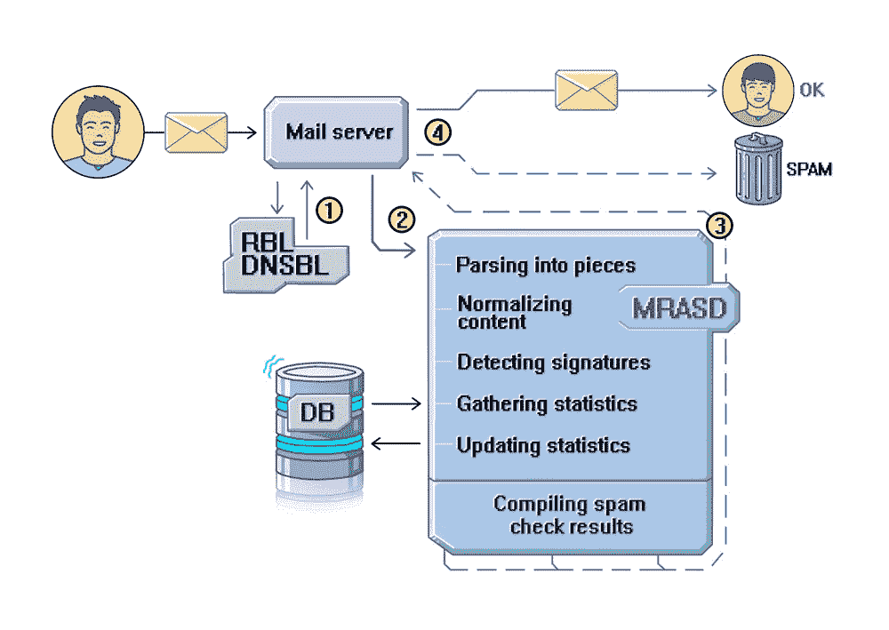
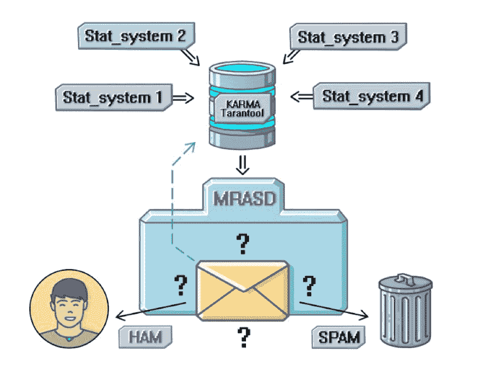
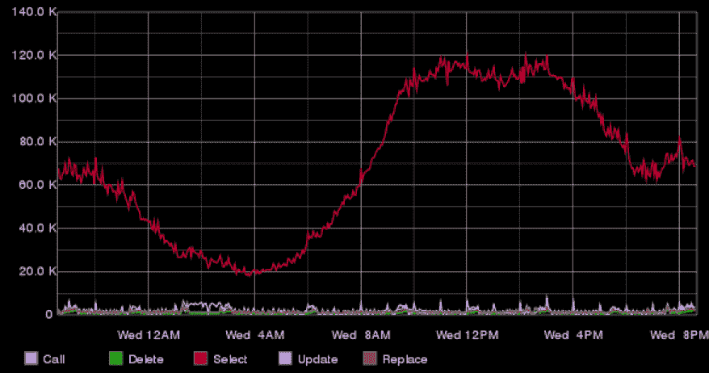
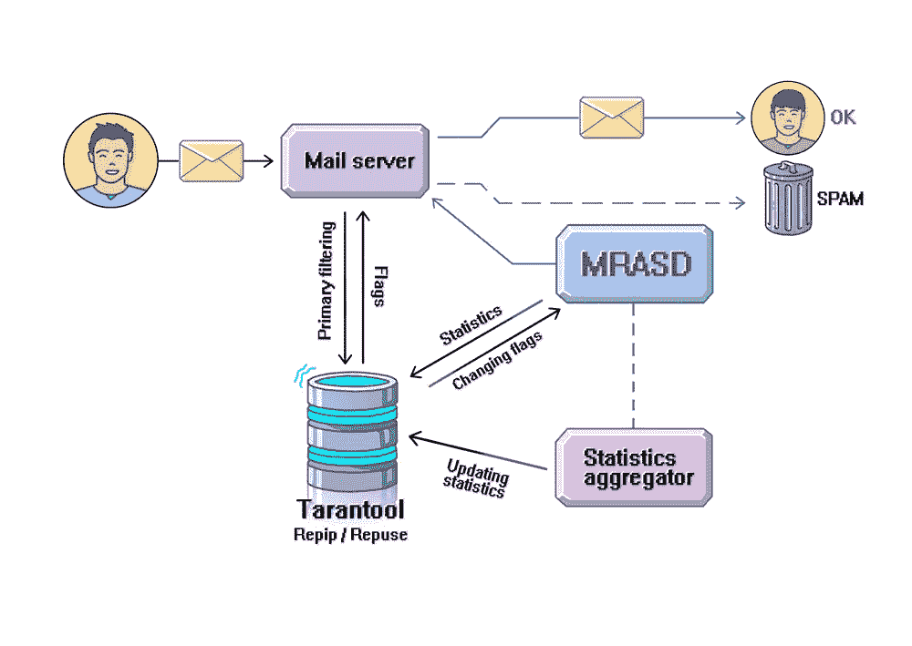
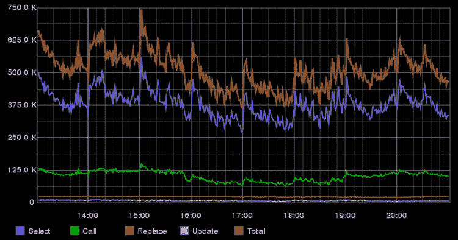

# 为 Mail.Ru Group 的电子邮件服务实施反垃圾邮件的猫捉老鼠的故事，以及 Tarantool 与此相关的内容

> 原文： [http://highscalability.com/blog/2016/8/30/the-cat-and-mouse-story-of-implementing-anti-spam-for-mailru.html](http://highscalability.com/blog/2016/8/30/the-cat-and-mouse-story-of-implementing-anti-spam-for-mailru.html)

大家好！

在本文中，我想向您介绍一个为 Mail.Ru Group 的电子邮件服务实现反垃圾邮件系统的故事，并分享我们在此项目中使用 [Tarantool](https://tarantool.org/) 数据库的经验：Tarantool 的任务是什么 ，我们面临的局限性和整合性问题，陷入的陷阱以及我们最终如何得到启示。

让我从简短的回溯开始。 大约十年前，我们开始为电子邮件服务引入反垃圾邮件。 我们的第一个过滤解决方案是卡巴斯基反垃圾邮件和 RBL（*实时黑洞列表-*是与垃圾邮件发送有关的 IP 地址的实时列表）。 这样可以减少垃圾邮件的发送，但是由于系统的惯性，我们无法足够快地（即实时）抑制垃圾邮件的邮寄。 另一个没有满足的要求是速度：用户应该以最小的延迟接收经过验证的电子邮件，但是集成解决方案的速度还不足以赶上垃圾邮件发送者。 垃圾邮件发件人在发现垃圾邮件未送达时，可以非常快速地更改其行为模型和垃圾邮件内容的外观。 因此，我们无法忍受系统的惯性，而开始开发自己的垃圾邮件过滤器。

我们的第二个系统是 MRASD-Mail.Ru 反垃圾邮件守护程序。 实际上，这是一个非常简单的解决方案。 客户的电子邮件到达 [Exim](http://www.exim.org) 邮件服务器，并通过充当主要过滤器的 RBL 到达，然后到达 MRASD，在那里发生了所有不可思议的事情。 反垃圾邮件守护程序将邮件分解为几部分：标头和正文。 然后，它使用基本算法对每个片段进行归一化，例如对字符大小写进行归一化（全部以小写或大写形式），将外观相似的符号转换为特定形式（例如，使用一个符号表示俄语和英语“ O”）等 标准化后，守护程序提取了所谓的“实体”或电子邮件签名。 我们的垃圾邮件过滤器会分析电子邮件的不同部分，并在发现任何可疑内容时将其阻止。 例如，我们可以为“ viagra”一词定义一个签名，所有包含该词的消息都会被阻止。 实体也可以是 URL，图像，附件等。 在反垃圾邮件检查过程中完成的另一件事是为已验证的电子邮件计算指纹。 计算为少数棘手的哈希函数的指纹是邮件的独特特征。 基于计算出的哈希值和收集的哈希统计信息，反垃圾邮件系统可以将邮件过滤为垃圾邮件或让其通过。 当哈希值或实体达到某个频率阈值时，服务器开始阻止所有匹配的电子邮件。 为此，我们维护了统计数据（计数器）来跟踪遇到某个实体的频率，接收者抱怨该实体的频率，并设置了一个实体标志 SPAM / HAM（在与垃圾邮件相关的术语中，“ ham”与“ 垃圾邮件”，表示经过验证的电子邮件不包含垃圾内容。

MRASD 的核心部分是使用 C ++实现的，而其相当多的业务逻辑是使用解释性语言 Lua 来实现的。 正如我已经说过的那样，垃圾邮件发送者是非常有活力的人，他们会很快改变其行为。 我们的目标是尽快对垃圾邮件发送者的每项更改做出响应，这就是为什么我们使用解释性语言实施业务逻辑的原因（借助 Lua，我们不必每次都在所有服务器上重新编译系统并进行更新）。 另一个要求是速度：Lua 中的代码在性能测试中显示出良好的结果。 最后，很容易与 C ++中的代码集成。

上面的方案说明了我们的反垃圾邮件过滤器的简化工作流程：电子邮件从发件人发送到我们的邮件服务器； 如果该消息已成功通过主过滤器（1），则它进一步进入 MRASD（2）。 MRASD 将其检查结果返回到邮件服务器（3），并根据这些结果将邮件传递到收件人的“垃圾邮件”文件夹或收件箱中。

MRASD 允许我们将未过滤的垃圾邮件数量减少十倍。 随着时间的流逝，我们不断改进系统：添加了新的子系统和组件，引入了新的工具。 因此，系统不断发展，变得更加复杂，反垃圾邮件任务也变得更加多样化。 这些变化无助于影响我们的技术堆栈。 这就是本故事的下一部分。

**技术堆栈的演进**

在电子邮件服务时代的曙光中，消息流以及消息内容比今天明显稀缺。 但是工具和计算能力的选择也较差。 从上面描述的 MRASD“父母”模型可以看出，有必要存储各种统计数据。 这些数据的很大一部分是“热”的（即经常使用），这对数据存储系统提出了某些要求。 结果，我们选择了 MySQL 作为“冷”数据的存储系统，但是对于“热”统计数据仍然不确定。 我们分析了所有可能的解决方案（它们的性能和功能适用于“热”数据，但不适用于关键任务数据），最终到达 [Memcached](https://memcached.org/) -那时，此解决方案已经足够稳定。 但是我们在存储“热”和关键数据方面仍然存在问题。 与任何其他缓存解决方案一样，Memcached 也有其局限性，包括不进行复制以及缓存关闭（并刷新）后的长时间预热时间。 我们的进一步搜索将我们带到了[京都内阁](http://fallabs.com/kyotocabinet/)，这是一个非关系键值数据库系统。

时间过去了，电子邮件工作量增加了，反垃圾邮件工作量也增加了。 出现了需要存储更多数据的新服务（Hadoop，Hypertable）。 顺便说一句，今天的高峰处理工作量达到每分钟 55 万封电子邮件（如果我们每天计算平均值，则每分钟大约有 35 万封电子邮件），每天要分析的日志文件量超过 10 TB。 让我们回到过去：尽管工作量不断增加，但我们对数据处理（加载，保存）的要求却保持不变。 有一天，我们意识到京都议定书无法管理所需的数据量。 此外，我们需要一种存储系统，它具有针对“热”和关键数据的更广泛功能。 也就是说，是时候到处寻找更好的替代方案了，这些替代方案将更灵活，更易于使用，并具有更高的性能和故障转移功能。 那时，一个名为 Tarantool 的 NoSQL 数据库在我们公司中获得了普及。 Tarantool 是公司内部开发的，完全满足了我们的“ wannas”。 顺便说一句，我最近一直在修改我们的服务，当我遇到最早的 Tarantool 版本之一时[HT HTG0] Tarantool / Silverbox ，我感到自己是一名考古学家。 我们决定尝试一下 Tarantool，因为它的基准测试涵盖了我们所需的数据量（该时期我没有确切的工作量数据），并且也满足了我们对内存使用的要求。 另一个重要因素是项目团队位于隔壁，我们可以使用 JIRA 快速提出功能请求。 我们是决定在他们的项目中尝试使用 Tarantool 的先驱者之一，我认为其他先驱者的积极经验大大鼓舞了我们迈向 Tarantool 的第一步。

那就是我们的“ Tarantool 时代”开始的时候。 我们积极地将 Tarantool 引入了我们的反垃圾邮件体系结构。 今天，我们有了基于 Tarantool 的队列，用于存储各种统计数据的高工作量服务：用户信誉，发件人 IP 信誉，用户可信度（“业力”统计信息）等。我们目前的活动是将升级的数据存储系统集成到我们的 实体统计处理器。 您可能想知道为什么我们只针对我们的反垃圾邮件项目专注于一个数据库解决方案，而不考虑迁移到其他存储。 嗯，事实并非如此。 我们也考虑和分析竞争系统，但是暂时，Tarantool 可以很好地处理项目中所需的所有任务和工作负载。 引入新的（未知的，以前未使用的）系统总是有风险的，并且会花费大量时间和资源。 同时，Tarantool 是我们（以及许多其他项目）的知名工具。 我们的开发人员和系统管理员已经了解使用和配置 Tarantool 的所有知识，以及如何充分利用它。 另一个优势是 Tarantool 的开发团队不断改进其产品并提供良好的支持（这些人正在隔壁工作，这很不错:)）。 当我们仍在实施另一个基于 Tarantool 的解决方案时，我们获得了所有必要的帮助和支持（我稍后会告诉您）。

接下来，我将为您概述我们的反垃圾邮件项目中使用 Tarantool 的几个系统，这些系统将涉及我们面临的问题。

**我们使用 Tarantool** 的系统概述

**业力**

**业力**是一个数字值，表示用户的信任度。 它最初是为不需要复杂的从属系统的用户提供的通用“胡萝卜和棍子”系统的基础。 业力是基于从其他用户信誉系统接收到的数据的汇总值。 业力系统背后的想法很简单：每个用户都有其业力-越高，我们对这个用户的信任就越高； 越低，我们在反垃圾邮件检查期间评估他们的电子邮件时就越严格。 例如，如果发件人发送的电子邮件中包含可疑内容，并且发件人的业障评分很高，则此类邮件会打入收件人的收件箱。 较低的业障评级将是反垃圾邮件系统的悲观因素。 这个系统使我想到了老师在学校考试中查阅的一本考勤书。 参加所有班级的学生只会得到几个额外的问题，然后休假，而错过许多班级的学生则必须回答很多问题才能获得高分。

用于存储与业力相关的数据的 Tarantool 在单个服务器上工作。 下图说明了每分钟一个这样的实例执行的请求数。

**RepIP / RepUser**

**RepIP** 和 **RepUser** （信誉 IP 和信誉用户）是一种高工作负载服务，用于处理与具有特定 IP 以及与发送者（用户）的活动和动作有关的统计信息 与用户在一定时间内使用电子邮件服务的强度有关的统计信息。 该系统使我们知道用户已发送了多少电子邮件，其中有多少已被阅读，以及有多少被标记为垃圾邮件。 该系统的优势在于，它提供了时间轴，而不是用户活动的快照。 为什么这对于行为分析很重要？ 想象一下，您在没有任何沟通手段的情况下已移居国外，所有朋友都留在家里。 然后，几年后，您的小屋里有了网线。 哇！ 您浏览到自己喜欢的社交网络的网站，然后看到朋友的照片-嗯，他已经发生了很大变化……您可以从该照片中获得多少信息？ 我想不是太多。 现在想象一下，您观看了一个视频，该视频显示了您的朋友变迁，结婚等等……-那是一段简短的传记片段。 我敢打赌，在第二种情况下，您会更好地了解朋友的生活。 数据分析也是如此：我们拥有的信息越多，我们就可以更好地评估用户的行为。 我们可以注意到发件人的邮件活动趋势，了解发件人的习惯。 根据这种统计信息，为每个用户和 IP 地址分配“信任等级点”和一个特殊标志。 此标志用于主要过滤器中，该过滤器甚至可以在垃圾邮件到达我们的邮件服务器之前过滤掉多达 70％的垃圾邮件。 这个百分比说明信誉服务的重要性。 这就是为什么此服务需要最大的性能和容错能力的原因。 这就是为什么我们在这里使用 Tarantool 的原因。

信誉统计信息存储在两台服务器上，每台服务器有四个 Tarantool 实例。 下图说明了每分钟 RepIP 请求的平均数量。

在实施信誉服务时，Tarantool 遇到了许多配置问题。 与我们之前讨论的系统不同，RepIP / RepUser 的数据包更大：这里的平均包大小为 471,97 字节（最大大小为 16 KB）。 从逻辑上讲，数据包包括两个部分：一个小的“基本”部分（标志，汇总统计信息）和一个很大的统计部分（详细的按动作统计信息）。 对整个数据包进行寻址会导致大量的网络使用，因此加载和保存记录会花费更多时间。 许多系统仅需要数据包的基本部分，但是我们如何将其从元组中剥离（“元组”是 Tarantool 的记录术语）？ 这是存储过程很方便的地方。 我们在 Tarantool 的 **init.lua** 文件中添加了所需的函数，并从客户端对其进行了调用（从 Tarantool 1.6 版开始，您可以使用纯 C 语言编写存储过程）。

**1.5.20 之前的 Tarantool 版本存在问题**

说我们从未遇到过 Tarantool 问题是错误的。 是的，我们有一些。 例如，在计划的重新启动后，Tarantool 客户端（超过 500 个）由于超时而无法重新连接。 当出现故障后，下次尝试重新连接的尝试被延迟了一段时间后，我们尝试引入渐进式超时，但这无济于事。 我们发现，问题在于 Tarantool 在其事件循环的每个周期内仅接受一个连接请求，尽管有数百个请求在等待。 我们有两种选择：安装新的 Tarantool 版本（1.5.20 或更高版本）或修改 Tarantool 的配置（禁用 *io_collect_interval* 选项可以解决此问题）。 Tarantool 开发人员很快修复了此错误，因此 Tarantool 1.6 或 1.7 将不会提供它。

**RepEntity-实体信誉**

我们当前正在集成一个新组件，用于存储实体统计信息（URL，图像，附件等）。 **RepEntity** 。 RepEntity 的目的类似于已经讨论的 RepIP / RepUser 的目的：它提供有关实体行为的详细信息，这是我们的反垃圾邮件过滤器的决策标准。 借助 RepEntity 统计信息，我们可以根据电子邮件的实体过滤出垃圾邮件。 例如，邮件可能包含可疑的 URL（例如，其中可能包含垃圾内容或导致[网络钓鱼](https://en.wikipedia.org/wiki/Phishing)网站），而 RepEntity 可以帮助我们更快地注意到并阻止此类邮件。 怎么样？ 我们可以看到该 URL 的动态发送，并且可以检测到其行为的变化，这对于“固定”计数器是不可能的。

除了不同的数据包格式外，RepEntity 和 RepIP 系统之间的基本区别是 RepEntity 在我们的服务上产生了明显更高的工作负载（处理和存储的数据量更大，请求数量也更多）。 一封电子邮件最多可以包含一百个实体（最多 10 个 IP 地址），对于大多数这些实体，我们必须加载并保存完整的统计信息包。 值得注意的是，数据包由特殊的聚合器保存，该聚合器首先等待积累足够的统计信息。 因此，所有这些都意味着数据库系统要承担更多的工作量，并且需要准确的设计和实现。 **让我强调一下，由于某些项目限制，对于 RepEntity，我们使用了 Tarantool 1.5（因此，我将继续撰写此版本）。**

首先，我们估计了存储所有统计信息所需的内存量。 为了更好地说明此任务的重要性，让我带来一些数字：在预期的工作量下，将数据包增加 1 个字节意味着将数据总量增加 1 GB。 如您所见，我们的任务是以最紧凑的方式将数据存储在一个元组中（正如我已经说过的，我们无法将整个数据包存储在一个元组中，因为我们经常要求仅检索一部分数据包数据） 。 要计算要存储在 Tarantool 中的数据量，我们还需要考虑：

*   存储索引的额外空间
*   用于在元组中存储数据大小的额外空间（1 个字节）
*   最大元组大小的限制为 1 MB（对于 1.7 版，请参见 [http://tarantool.org/doc/book/box/limitations.html](http://tarantool.org/doc/book/box/limitations.html) ）

Tarantool 增加了各种请求（读取，插入，删除）的数量，从而产生超时错误。 我们的调查表明，在频繁插入和删除的情况下，Tarantool 启动了一个复杂的树重新平衡过程（我们的所有索引均为 TREE 类型）。 Tarantool 中的树索引具有棘手的自平衡逻辑，仅在满足某些“不平衡”条件时才会启动。 因此，当一棵树“失去足够的平衡”时，Tarantool 启动了重新平衡过程，这使得 Tarantool 变得口吃。 在日志中，我们发现消息*资源暂时不可用（errno：11）*，这些消息在几秒钟后消失了。 但是，尽管发生了这些错误，客户端仍无法获取请求的数据。 Tarantool 团队的同事提出了一个解决方案：尝试使用其他类型的树索引 AVLTREE，该索引在每次插入/删除/更改时都会重新平衡。 实际上，尽管重新平衡呼叫的数量有所增加，但其总成本却更低。 在更新架构并重新启动数据库之后，该问题永远消失了。

我们面临的另一个问题是清理过时的记录。 不幸的是，Tarantool（据我所知，对于 1.7 版也是如此）不允许为某个记录定义 TTL（生存时间），而忘记了它，而所有清理活动都委托给了数据库。 好了，您仍然可以自己使用 Lua 和 [box.fiber](http://stable.tarantool.org/doc/mpage/stored-procedures.html#sp-box-fiber) 实现所需的清理逻辑。 从好的方面来说，这提供了更大的灵活性：您可以定义复杂的清除条件，而不仅仅是基于 TTL 的条件。 但是，要正确实现清除逻辑，您需要注意一些细微差别。 我实施的第一根清洁纤维使 Tarantool 的速度非常慢。 事实是，我们可以删除的数据量大大少于记录的总数。 为了减少要删除的记录候选者的数量，我引入了基于所需字段的二级索引。 之后，我实现了一个遍历所有候选对象的光纤（其上次修改的时间戳早于指示的时间戳），检查了其他清除条件（例如，当前是否为记录设置了“正在进行写入”标志），并且 如果满足所有条件，则光纤会删除该记录。 当我在零工作负载下测试逻辑时，一切工作正常。 在低工作量的情况下也很好。 但是，当我将工作量增加到预期水平的一半时，我遇到了问题。 我的请求开始失败，并显示超时错误。 我知道我一定已经溜了。 当我深入研究这个问题时，我意识到我对光纤的工作方式有一个错误的认识。 在我的世界中，光纤是一个独立的线程，对接收和处理客户端请求没有任何影响（上下文切换除外）。 但是不久，我发现我的光纤使用了与请求处理线程相同的事件循环。 这样，我循环遍历大量记录而不删除任何内容，只是阻止了事件循环，因此未处理客户端请求。 为什么提到删除操作？ 您会看到，每次删除一些记录时，都会发生一次 yield 操作，该操作解除了事件循环的阻塞并允许处理下一个事件。 在这一点上，我得出的结论是，如果执行了一些 N 操作（其中 N 是一个经验推导的值，我取 N = 100）而没有产生屈服，则有必要强制屈服（例如，使用 *wrap.sleep（ 0）*）。 要记住的另一件事是，删除记录可能会触发索引更新，因此在遍历记录时我可能会丢失一些要删除的数据。 这是另一个解决方案。 在一个周期中，我可以选择一小部分元素（低于 1000 个）并遍历这些元素，删除所需的元素，并跟踪最后一个未删除的元素。 在下一次迭代中，我将从最后一个未删除的元素中选择另一小部分元素。

我们还尝试过实施一种解决方案，该解决方案可以在将来实现平滑的分片，但此尝试失败了：实现的机制开销太大，因此我们暂时放弃了分片。 希望我们可以在较新版本的 Tarantool 中找到重新分片功能。

这是一些性能提示。

要提高 Tarantool 的性能，您可以禁用* .xlog 文件。 但是请记住，在这种情况下，Tarantool 仅作为高速缓存工作，并具有所有的限制（我的意思是没有复制，重新启动后等待时间很长）。 这里的解决方法是不时制作快照，并在需要时使用它来还原数据。

如果一台计算机上有多个 Tarantool 实例，则可以将每个实例“精确定位”到某个 CPU 内核以提高性能。 但是，如果您说 12 个物理内核，那么开始 12 个实例就不好了，因为每个 Tarantool 实例与执行线程一起还具有一个 WAL 线程。

所需功能：

*   分片。
*   基于集群的方法，可以进行动态集群配置，例如在添加节点或节点出现故障的情况下派上用场，类似于 MongoDB（mongos）和 Redis（redis sentinel）。
*   可以为记录清除定义 TTL（生存时间）。

**的结论**

Tarantool 是我们反垃圾邮件系统的基石，我们许多重要的高工作量服务都基于此。 现成的[连接器](http://stable.tarantool.org/doc/mpage/connectors.html)使轻松将 Tarantool 与使用不同编程语言实现的组件集成在一起成为可能。 Tarantool 的成功历史悠久：多年来，在我们的反垃圾邮件项目中使用 Tarantool 以来，我们在操作或稳定性方面都没有遇到严重问题。 但是，要充分利用该数据库，您需要考虑一些配置上的细微差别（在这里我们一直在谈论 Tarantool 1.5 版的细微差别）。

关于我们未来计划的几句话：

*   在我们的项目中增加基于 Tarantool 的服务的数量。
*   迁移到 Tarantool 1.7。
*   开始使用 Vinyl 引擎，尤其是对于 RepEntity 来说，真正的“热”数据量并不大。

[关于 HackerNews](https://news.ycombinator.com/item?id=12397570)

保存

反垃圾邮件系统内部邮件处理的平均延迟是多少？ 是否有关于典型请求分解的任何分析信息？