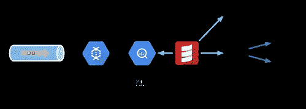
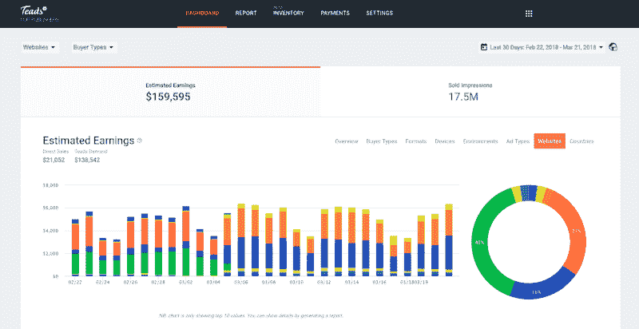
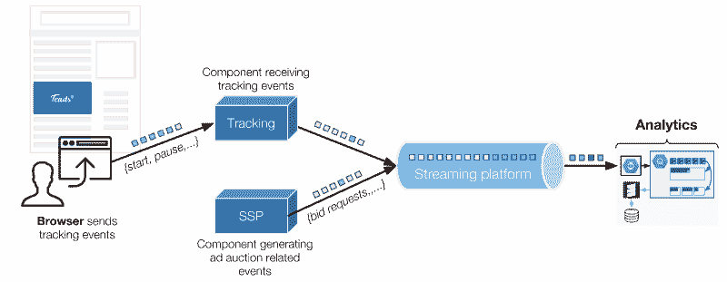
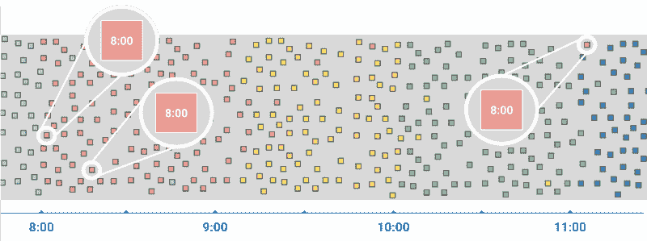
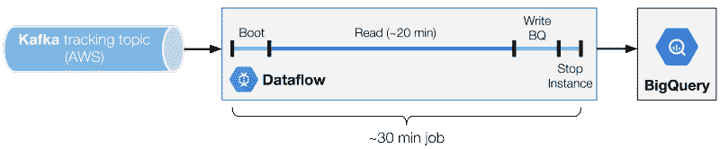
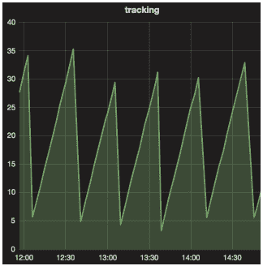
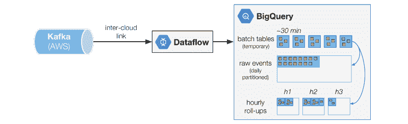
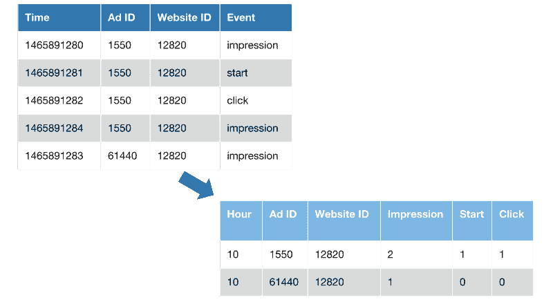
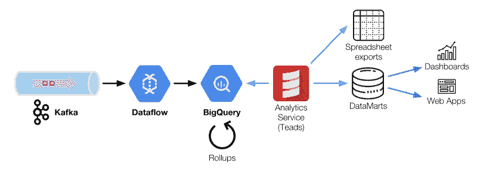

# 每天为 1000 亿个事件赋予意义-Teads 的 Analytics（分析）管道

> 原文： [http://highscalability.com/blog/2018/4/9/give-meaning-to-100-billion-events-a-day-the-analytics-pipel.html](http://highscalability.com/blog/2018/4/9/give-meaning-to-100-billion-events-a-day-the-analytics-pipel.html)

*这是 Teads.tv 的软件工程师* *[Alban Perillat-Merceroz](https://www.linkedin.com/in/albanperillatmerceroz/?locale=en_US)* *的来宾帖子。*

在本文中，我们描述了如何将 Kafka，Dataflow 和 BigQuery 一起编排以摄取和转换大量事件。 当添加规模和等待时间约束时，对它们进行协调和重新排序成为一个挑战，这是我们如何解决的。

Teads for Publisher, one of the webapps powered by Analytics

在数字广告中，日常运营会产生许多我们需要跟踪的事件，以便透明地报告广告系列的效果。 这些事件来自：

*   用户与与浏览器发送的广告的互动。 这些事件称为跟踪事件，可以是标准事件（开始，完成，暂停，继续等），也可以是自定义事件，这些事件来自使用 [Teads Studio](https://teads.tv/studio/) 构建的交互式广告素材。 我们每天大约收到 100 亿个跟踪事件。
*   来自后端的事件大部分与广告拍卖的详细信息有关（实时出价过程）。 在采样之前，我们每天会产生超过 600 亿个此类事件，并且应当在 2018 年使这一数字增加一倍。

在文章中，我们将重点放在跟踪事件上，因为它们是我们业务中最关键的路径。

Simplified overview of our technical context with the two main event sources

跟踪事件由浏览器通过 HTTP 发送到专用组件，该组件除其他外将它们排入 [Kafka](https://kafka.apache.org/) 主题。 Analytics 是这些事件的使用者之一（更多内容请参见下文）。

我们有一个分析团队，其任务是处理这些事件，其定义如下：

> 我们摄取了越来越多的原木

> 我们将它们转换为面向业务的数据，

> 我们为每个观众提供高效且量身定制的服务。

为了完成此任务，我们构建并维护了一组处理工具和管道。 由于公司的有机增长和对新产品的要求，我们经常挑战我们的体系结构。

## 为什么我们搬到 BigQuery

早在 2016 年，我们的 Analytics（分析）堆栈基于 [lambda 架构](http://lambda-architecture.net/)（Storm，Spark，Cassandra），但我们遇到了几个问题：

*   数据规模使得不可能将所有数据都存储在单个 Cassandra 表中，这阻止了有效的交叉查询，
*   这是一个复杂的基础架构，具有用于批处理层和速度层的代码重复，从而阻止了我们有效地发布新功能，
*   最后，难以扩展且成本效益不高，

当时我们有几种可能的选择。 首先，我们可以构建一个增强的 lambda，但这只会推迟我们面临的问题。

我们考虑了几种有前途的替代方案，例如 [Druid](http://druid.io/druid.html) 和 [BigQuery](https://cloud.google.com/bigquery/) 。 我们最终因其强大的功能而选择迁移到 BigQuery 。

使用 BigQuery，我们能够：

*   处理原始事件，
*   使用 SQL 作为一种有效的数据处理语言，
*   使用 BigQuery 作为处理引擎，
*   使对日期的解释性访问更容易（与 Spark SQL 或 Hive 相比），

多亏了 [固定费用计划](https://cloud.google.com/bigquery/pricing#flat_rate_pricing) ，我们密集的使用（在查询和存储方面）具有成本效益。

但是，我们的技术背景对于 BigQuery 而言并不理想。 我们想使用它来存储和转换来自多个 Kafka 主题的所有事件。 我们无法将 Kafka 群集移出 AWS 或使用 [Pub / Sub](https://cloud.google.com/pubsub/docs/overview) （在 GCP 上与 Kafka 托管的等效版本），因为这些群集也由我们托管在 AWS 上的某些广告投放组件使用。 结果，我们不得不应对运行多云基础架构的挑战。

今天， BigQuery 是我们的数据仓库系统，在这里我们的跟踪事件与其他数据源保持一致。

## 摄取

在处理跟踪事件时，您面临的第一个问题是您必须无序处理，并且延迟未知。

事件实际发生的时间（事件时间）与系统观察到事件的时间（处理时间）之间的差为毫秒至几小时。 这些大的延迟并不是那么罕见，当用户在两次浏览会话之间失去连接或激活飞行模式时可能会发生。

Difference between event time and processing time

有关流数据处理挑战的更多信息，建议您看一下 Google Cloud Next '17 演讲« [在批处理和流处理之间来回移动](https://www.youtube.com/watch?v=PGTSZvBK8-Y) »，来自 Tyler Akidau （Google 的数据处理技术负责人）和 LoïcJaures（Teads 的联合创始人兼 SVP Technology）。 本文受此演讲启发。

## 流媒体的艰难现实

[数据流](https://cloud.google.com/dataflow/?hl=en)是一种托管流系统，旨在解决事件的混乱性质，以解决我们面临的挑战。 Dataflow 具有统一的流和批处理编程模型，流是旗舰功能。

我们按照 Dataflow 的承诺被出售，并坦率地尝试了流模式。 不幸的是，在将其投入实际生产流量后，我们意外地感到惊讶： BigQuery 的流媒体插入成本。

我们是根据压缩数据大小（即通过网络的实际字节数）而不是 BigQuery 的原始数据格式大小来估算的。 幸运的是，现在已记录在中，用于[每种数据类型](https://cloud.google.com/bigquery/pricing#data)。因此您可以进行数学计算。

那时，我们低估了这笔额外费用 100 倍，这几乎使我们整个提取流程（Dataflow + BigQuery）的费用增加了一倍。 我们还面临其他限制，例如 [100,000 个事件/秒速率限制](https://cloud.google.com/bigquery/quotas#streaminginserts)，这很危险地接近我们所做的事情。

好消息是，有一种方法可以完全避免流插入限制：批量加载到 BigQuery 中。

理想情况下，我们希望将数据流以流方式与 BigQuery 以批处理方式一起使用。 那时，Dataflow SDK 中没有没有 BigQuery 批处理接收器用于无限制的数据流。

然后，我们考虑开发自己的自定义接收器。 不幸的是，当时无法向无界数据流添加自定义接收器（请参阅 [Dataflow 计划添加对在未来版本](https://cloud.google.com/dataflow/model/custom-io)中写入无界数据的自定义接收器的支持-BeamBeam 现在有可能 是官方的 Dataflow SDK）。

我们别无选择，只能将我们的数据流作业切换到批处理模式。 多亏了 Dataflow 的统一模型，仅需几行代码即可。 对我们来说幸运的是，我们能够承受因切换到批处理模式而引入的额外数据处理延迟。

展望未来，我们当前的摄取架构基于 [Scio](https://github.com/spotify/scio) ，这是 Spotify 开源的用于数据流的 Scala API。 如前所述，Dataflow 本机支持 Pub / Sub，但 Kafka 集成还不成熟。 我们必须扩展 Scio 以实现偏移量检查点持久性并实现有效的并行性。

## 微量批次管道

我们得到的架构是一个由 30 分钟的 Dataflow 批处理作业组成的链，这些作业按顺序安排为读取 Kafka 主题并使用加载作业写入 BigQuery。

Phases of a Dataflow micro batch

关键之一是找到理想批次持续时间。 我们发现在成本和读取性能（因此延迟）之间具有最佳折衷的最佳选择。 要调整的变量是 Kafka 读取阶段的持续时间。

为了获得完整的批处理持续时间，您必须将写入操作添加到 BigQuery 阶段（不成比例，但与读取持续时间紧密相关），并添加一个常数，即引导和关闭持续时间。

值得注意的是：

*   读取阶段太短会降低读取阶段和非读取阶段之间的比率。 在理想的世界中，1：1 的比例意味着您必须能够像写作一样快地阅读。 在上面的示例中，我们有一个 20 分钟的读取阶段，一个 30 分钟的批处理（比率为 3：2）。 这意味着我们必须能够比写入速度快 1.5 倍。 较小的比率意味着需要更大的实例。
*   太长的读取阶段只会增加事件发生到 BigQuery 可用之间的延迟。

## 性能调优

数据流作业是按顺序启动的，这是出于简单原因和更容易进行故障管理。 这是我们愿意采取的延迟权衡。 如果作业失败，我们只需返回到最后提交的 Kafka 偏移量即可。

我们必须修改 Kafka 群集的拓扑，并增加分区数量，以便能够更快地对邮件进行堆栈。 根据您在数据流中进行的转换，限制因素很可能是处理能力或网络吞吐量。 为了实现高效的并行性，您应始终尝试保持一定数量的 CPU 线程数作为分区数量的除数（推论：最好有很多[数量多的 Kafka 分区 复合数字](https://en.wikipedia.org/wiki/Highly_composite_number)）。

在极少的延迟情况下，我们可以使用更长的读取序列来微调作业。 通过使用更大的批次，我们还能够以延迟为代价来赶上延迟。

为了处理大多数情况，我们将 Dataflow 的大小设置为能够读取的速度比实际速度快 3 倍。 使用单个 [*n1-highcpu-16*](https://cloud.google.com/compute/docs/machine-types) 实例读取 20 分钟可以释放 60 分钟的邮件。

Ingestion latency (minutes) over time

在我们的用例中，我们以锯齿延迟结束，该锯齿延迟在 3 分钟（Write BQ 阶段的最小持续时间）和 30 分钟（作业的总持续时间）之间振荡。

## 转型

原始数据不可避免地会庞大，我们有太多事件，无法按原样查询。 我们需要汇总这些原始数据以保持较低的*读取时间*和紧凑的卷。 这是我们在 BigQuery 中的处理方式：

Architecture overview spanning between AWS and GCP

与传统的 [ETL 流程](https://en.wikipedia.org/wiki/Extract,_transform,_load)之前的数据*转换*之前，*加载*之前，我们选择先将其（ELT）原始存储 格式。

它有两个主要优点：

*   它使我们能够访问每个原始事件，以进行精细的分析和调试，
*   通过让 BigQuery 使用简单但功能强大的 SQL 方言进行转换，它简化了整个链。

我们本来希望直接写入每天分区的*原始事件*表。 我们之所以无法这样做，是因为必须使用特定的目的地（表或分区）定义数据流批处理，并且其中可能包含用于不同分区的数据。 我们通过将每个批次加载到临时表中然后开始对其进行转换来解决此问题。

对于这些临时批处理表中的每一个，我们运行一组转换，具体化为输出到其他表的 SQL 查询。 这些转换之一只是将所有数据追加到按天划分的大型原始事件表中。

这些转换的另一个是汇总：给定一组维度的数据汇总。 所有这些转换都是幂等的，可以在发生错误或需要数据重新处理的情况下安全地重新运行  。

## 汇总

直接查询原始事件表对于调试和深度分析非常有用，但是查询这种规模的表不可能获得可接受的性能，更不用说这种操作的[成本](https://cloud.google.com/bigquery/pricing)了。

为了让您有个想法，此表仅保留 4 个月，包含 1 万亿个事件，大小接近 250TB 。

Example of a rollup transformation

在上面的示例中，我们汇总了 3 个维度的事件计数：*小时*，*广告 ID* 和*网站 ID* 。 事件也被透视并转换为列。 该示例显示尺寸缩小了 2.5 倍，而实际情况更接近 70 倍。

在 BigQuery 的大规模并行上下文中，查询运行时的影响不大，改进程度取决于所使用的广告位数量。

汇总还使我们可以将数据划分为小块：在给定的小时（事件时间的小时，而不是处理时间）中，事件被分组到小表中。 因此，如果您需要查询给定时间的数据，则将查询一个表（< 10M 行，< 10GB）。

汇总是一种通用汇总，我们可以在给定大量维度的情况下更高效地查询所有事件。 在其他一些用例中，我们需要专用的数据视图。 他们每个人都可以实施一组特定的转换，以最终得到一个专门的优化表。

## 托管服务的限制

BigQuery 功能强大，但有其局限性：

*   BigQuery 不允许查询具有[不同架构](https://cloud.google.com/bigquery/docs/querying-wildcard-tables#schema_used_for_query_evaluation)的多个表（即使查询未使用不同的字段）。 当需要添加字段时，我们有一个脚本可以批量更新数百个表。
*   BigQuery [不支持列删除](https://stackoverflow.com/a/45822880)。 没什么大不了的，但无助于偿还技术债务。
*   查询多个小时：BigQuery [支持表名](https://cloud.google.com/bigquery/docs/querying-wildcard-tables#best_practices)中的通配符，但是性能太差了，我们必须生成查询以 UNION ALL 显式查询每个表。
*   我们始终需要将这些事件与托管在其他数据库上的数据结合起来（例如，将事件与广告活动的更多信息结合在一起），但是 BigQuery 不支持（目前）。 我们目前必须定期将整个表复制到 BigQuery，以便能够在单个查询中联接数据。

## 云间数据传输的乐趣

借助 AWS 中 Teads 的广告投放基础设施以及与许多其他组件共享的 Kafka 集群，我们别无选择，只能在 AWS 和 GCP 云之间移动大量数据，这并不容易，而且肯定不会 贱。 我们将 Dataflow 实例（因此是主要 GCP 入口点）放置在离我们 AWS 基础设施尽可能近的位置，幸运的是，AWS 和 GCP 之间的现有链接足够好，因此我们可以简单地使用托管 VPN。

尽管我们在运行这些 VPN 时遇到了一些不稳定因素，但是我们还是设法使用一个简单的脚本将其关闭然后重新打开，以进行分类。 我们从来没有遇到足够大的问题来证明专用链接的成本合理。

再一次，[成本是您必须密切注意的](https://medium.com/teads-engineering/real-life-aws-cost-optimization-strategy-at-teads-135268b0860f)成本，并且就出口而言，很难在看到账单之前进行评估。 仔细选择压缩数据的方式是降低这些成本的最佳方法之一。

## 只有一半

Teads’ Analytics big picture

在 BigQuery 中仅包含所有这些事件还不够。 为了为业务带来价值，必须使用不同的规则和指标对数据进行合并。 此外，BigQuery 并非针对实时用例量身定制。

由于并发限制和 3 到 5 秒钟的不可压缩查询延迟（这是其设计的可接受和固有的），因此必须将 BigQuery 与其他工具（服务于仪表板，Web UI 等）组合使用。

此任务由我们的 Analytics 服务执行，这是一个 Scala 组件，可利用 BigQuery 生成按需报告（电子表格）和量身定制的数据集市（每天或每小时更新）。 需要此特定服务来处理业务逻辑。 否则很难维护为 SQL 并使用管道转换生成数据集市。

我们选择了 AWS [Redshift](https://aws.amazon.com/redshift/) 来存储和服务我们的数据集市。 尽管服务面向用户的应用似乎不是一个显而易见的选择，但是 Redshift 对我们有用，因为我们的并发用户数量有限。

同样，使用键/值存储将需要更多的开发工作。 通过保留中间关系数据库，可以简化数据集市的使用。

在上有很多话要说，我们如何以规模构建，维护和查询这些数据集市，但这将是另一篇文章的主题。

* * *

如果您喜欢，大规模事件处理和与 Analytics（分析）相关的挑战，请大声疾呼。 我们正在积极[寻找](https://teads.tv/teads-jobs/)，以供工程师构建未来的架构。