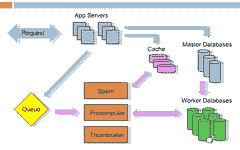

# 每月将 Reddit 打造为 2.7 亿页面浏览量时汲取的 7 个教训

> 原文： [http://highscalability.com/blog/2010/5/17/7-lessons-learned-while-building-reddit-to-270-million-page.html](http://highscalability.com/blog/2010/5/17/7-lessons-learned-while-building-reddit-to-270-million-page.html)

 [社交新闻网站](http://en.wikipedia.org/wiki/Steve_Huffman) [Reddit](http://www.reddit.com/) 的共同创始人史蒂夫·霍夫曼做了出色的[演示文稿](http://vimeo.com/10506751)。（[幻灯片](http://www.slideshare.net/carsonified/steve-huffman-lessons-learned-while-at-redditcom)和[文字](http://carsonified.com/blog/dev/steve-huffman-on-lessons-learned-at-reddit/) ），学习他在将 Reddit 建立和发展到每月有 750 万用户，每月有 2.7 亿页面浏览以及 20 多个数据库服务器的过程中吸取的教训。

史蒂夫（Steve）说，很多课程确实很明显，因此您可能在演示文稿中找不到很多全新的想法。 但是史蒂夫对他有一种真诚和真诚，这显然是建立在经验基础上的，以至于您不禁要深思一下自己可能会做些什么。 如果史蒂夫不了解这些课程，我敢打赌其他人也不会。

有七个课程，每个课程都有自己的摘要部分：第一课：经常崩溃； 第二课：服务分离； 第 3 课：开放式架构； 第四课：保持无状态； 第 5 课：内存缓存； 第 6 课：存储冗余数据； 第 7 课：脱机工作。

到目前为止，其体系结构最令人惊讶的功能是在第六课中，其基本思想是：速度的关键是预先计算所有内容并将其缓存。 他们将预计算[旋钮最多旋转 11](http://en.wikipedia.org/wiki/Up_to_eleven) 。 听起来您在 Reddit 上看到的几乎所有内容都已被预先计算和缓存，无论它们需要创建多少版本。 例如，当有人提交链接时，他们会预先计算所有 15 种不同的排序顺序（热门，新，热门，旧，本周等）以用于列表。 通常，开发人员会害怕走极端，浪费时间。 但是他们认为浪费前期总比拖延慢。 **浪费磁盘和内存比让用户等待**更好。 因此，如果您一直坚持下去，请转到 11，这是一个很好的先例。

## 第一课：经常崩溃

本课的实质是：**自动重新启动失败的癌性服务**。

在 colo 中运行自己的系统的不利之处在于您需要进行维护。 服务中断后，您必须立即修复，即使在凌晨 2 点。 这是您生活中持续不断的紧张感。 您必须随身携带一台计算机，并且您知道，任何时候只要有人打来电话，那都是您必须解决的另一场灾难。 它毁了你的生活。

缓解此问题的一种方法是重新启动过程，该过程已经死亡或变得癌变。 Reddit 使用[监督](http://cr.yp.to/daemontools/supervise.html)自动重启应用程序。 特殊的监视程序会杀死使用过多内存，使用过多 CPU 或无响应的进程。 不必担心，只需重新启动即可启动系统。 当然，您必须阅读日志并找到根本原因，但是在那之前，它会使您保持理智。

## 第 2 课：服务分离

本课的实质是：**将过程和数据分组在不同的盒子**上。

在一个盒子上做太多的工作会导致**在作业**之间进行大量上下文切换。 尝试使每个数据库服务器以相同的方式服务于相同类型的数据库。 这意味着您的所有索引都将被缓存，并且不会被调入和调出。 保持所有内容尽可能相似。 不要使用 Python 线程。 他们很慢。 他们将所有内容放在单独的多个流程中。 垃圾邮件，缩略图等服务可查询缓存。 它使您可以轻松地将它们放在不同的计算机上。 您已经解决了流程之间通信的问题。 一旦解决，它就可以保持体系结构整洁，并且易于扩展。

## 第 3 课：开放式架构

本课程的本质是：**不必担心模式**。

他们过去经常花费大量时间来担心数据库，以保持一切正常和正常。 **您不必担心数据库**。 当您变大时，架构更新将非常缓慢。 将一列添加到一千万行需要锁定，因此不起作用。 他们使用复制进行备份和扩展。 模式更新和维护复制是一件痛苦的事情。 他们将不得不重新启动复制，并且可能一天没有备份。 部署是一件痛苦的事情，因为您必须协调新软件和新数据库的升级方式。

相反，他们保留了事物表和数据表。 Reddit 中的所有内容都是事物：用户，链接，评论，subreddit，奖项等。事物具有共同的属性，例如上下投票，类型和创建日期。 数据表具有三列：事物 ID，键，值。 每个属性都有一行。 标题，URL，作者，垃圾邮件票等都有一行。当他们添加新功能时，他们不必再担心数据库了。 他们不必为新事物添加新表，也不必担心升级。 更易于开发，部署，维护。 代价是您不能使用很棒的关系功能。 数据库中没有联接，您必须手动执行一致性。 没有联接意味着将数据分发到不同的机器真的很容易。 您不必担心外键正在执行联接或如何拆分数据。 工作得很好。 使用关系数据库的烦恼已经成为过去。

## 第 4 课：保持无状态

目标是让每个应用服务器处理每种类型的请求。 随着他们的成长，他们拥有更多的计算机，因此他们不再依赖于应用内服务器缓存。 他们最初将状态复制到每个应用程序服务器，这浪费了内存。 他们无法使用内存缓存，因为它们保留了大量的细粒度文件，这太慢了。 他们重写使用内存缓存，并且不将任何状态存储在应用服务器中。 如果应用服务器发生故障，则很容易。 为了扩展，您可以添加更多应用服务器。

## 第 5 课：内存缓存

本课的实质是：**内存缓存所有内容**。

它们将所有内容存储在内存缓存中：1.数据库数据 2.会话数据 3.呈现的页面 4.记忆（记住以前计算的结果）内部功能 5.限制用户操作，爬网程序的速率 6.存储预先计算的列表/页面 7.全局 锁定。

他们现在在 Memcachedb 中存储的数据比 Postgres 多。 就像记忆快取一样，但是会储存在磁碟上。 非常快。 所有查询均由同一控件生成，并缓存在 memcached 中。 更改密码链接和关联状态被缓存 20 分钟左右。 验证码也一样。 用于他们不想永久存储的链接。

他们在其框架中内置了备忘录。 计算结果也将被缓存：标准化页面，列表，所有内容。

使用 memcache +到期日期对所有内容进行速率限制。 保护您的系统免受攻击的好方法。 没有速率限制子系统，单个恶意用户可能会破坏系统。 不好。 因此，对于用户和爬网程序，他们将很多内容保留在内存缓存中。 如果用户在一秒钟内再次出现，他们将被弹跳。 普通用户的点击速度不太快，因此他们希望引起注意。 Google 搜寻器会以您希望的速度打击您，因此，当速度变慢时，只需提高限速器的速度，即可使系统安静下来而不会伤害用户。

Reddit 上的所有内容都是清单：首页，方框中的评论页。 所有这些都预先计算并转储到缓存中。 当您获得列表时，它将从缓存中获取。 每个链接和每个注释可能都存储在 100 个不同的版本中。 例如，具有 30 秒钟旧 2 票的链接是单独呈现和缓存的。 播放 30 秒后会再次呈现。 等等。 HTML 的每个小片段都来自缓存，因此不会浪费 CPU 渲染时间。 当事情变慢时，只需添加更多缓存即可。

当弄乱他们脆弱的不一致数据库时，他们使用内存缓存作为全局锁。 为他们工作甚至认为这不是最好的方法。

## 第 6 课：存储冗余数据

本课程的实质是：**速度的关键是预先计算所有内容并将其缓存**。

建立慢速网站的方法是拥有一个完全标准化的数据库，按需收集所有内容，然后进行渲染。 它永远需要每个单独的请求。 因此，如果您有可能以几种不同格式显示的数据（例如首页，收件箱或个人资料中的链接），请分别存储所有这些表示形式。 因此，当有人来获取数据时，该数据已经存在。

每个列表都有 15 个不同的排序顺序（本周热门，新，热门，旧）。 当某人提交链接时，他们会重新计算该链接可能影响的所有可能的列表。 前期可能有点浪费，但前期浪费比缓慢要好。 浪费磁盘和内存比让用户等待更好。

## 第 7 课：脱机工作

本课程的本质是：**在后端上进行最少的工作，并告诉用户您已完成**。

如果您需要做某事，请在用户不在等您时进行。 放入队列中。 当用户对可更新列表的 Reddit 进行投票时，该用户的 Karma 以及许多其他内容。 因此，一经表决，数据库便会更新以知道发生了表决，然后将作业放入队列中，该作业知道需要更新的 20 件事。 当用户回来时，一切都已经为他们预缓存了。

他们离线进行工作：1.预计算清单 2.提取缩略图 3.检测作弊。 4.删除垃圾邮件 5.计算奖励 6.更新搜索索引。

用户正在等待您时，无需执行**这些操作。 例如，随着 Reddit 变得越来越大，现在作弊的动机越来越高，因此当人们投票检测作弊时，他们在后端花费了大量时间。 但是它们确实是在后台运行的，因此不会降低用户体验。 演示文稿中的体系结构图为：**

蓝色箭头表示当请求进入时发生的情况。假设某人提交了链接或投票，它将转到高速缓存，主数据库和作业队列。 然后他们返回给用户。 然后其余的事件会离线发生，这些由粉红色箭头表示。 诸如 Spam，Precomputer 和 Thumnailer 之类的服务从队列中读取，进行工作并根据需要更新数据库。 关键技术是 RabbitMQ。

## 相关文章

*   [关于可扩展性的队列相关文章](http://highscalability.com/blog/category/queue)
*   **[Reddit 于 2010 年 5 月发布的“服务器状态”报告](http://blog.reddit.com/2010/05/reddits-may-2010-state-of-servers.html)**

对我而言，最有趣的部分是数据库中糟糕的 EAV 解决方案。 不带模式和模式验证的所有内容都作为字符串。 这通常会导致维护和效率方面的一些可怕问题，但这一次它可以正常工作。 可能是因为该模型非常简单，在其他许多情况下却无法正常工作

很棒的文章！ 绝对提供了一些非常新的性能思考方式。

“但是它们确实是在后台运行的，因此不会降低用户体验”

“但是他们活着”

“现场直播”

好文章！ 很好读

对于那些喜欢数学的人来说，每月 2.7 亿的页面浏览量就是每秒 100 个页面浏览量。 绝对不会出现需要 20 台数据库服务器的情况。

请谨慎选择您的建议。 互联网上很少有网站像 Reddit 一样频繁出现故障或性能不佳。

我总觉得这些家伙在后台做些聪明的事。 感谢您告诉我更多有关我最喜欢的社交书签网站的信息！

哦，我只是喜欢这种性能知识。

我们在设计架构以及随后像 Reddit 一样更新它们时也遇到了很多麻烦。 但是我必须同意 Simon 的观点，Reddit 的解决方案在许多其他情况下都行不通。

我同意 Haugeland 先生的观点，即必须拥有 20 台数据库服务器来处理负载似乎太过分了。 通过阅读评论，我看来原始作者未能认识到真正的教训。 这样的设计通常是开发团队不了解如何为底层数据库进行设计和编码的结果。 也许根据预期的使用情况和负载来选择错误的基础数据库。

这个已经过期了。 reddit 迁移到 Cassandra。

http://www.reddit.com/r/programming/comments/bcqhi/reddits_now_running_on_cassandra/

记忆快取不见了

哇！ 这是一项很好的工作！

换句话说，运行可伸缩网站不该做什么。 我键入此内容时，Reddit 尚未再次打开。

我是 Reddit 的粉丝，我希望它会改变其基础设施以提供更多可用性。

MySQL（尤其是 MyISAM）给 RDBMSes 起了一个不好的名字。

我有一个以 Poststars 为后盾的应用程序，该应用程序以“星型模式”组织，有一个主事件表，我们平均每秒对其进行 200 次 INSERT 插入，例如高峰时为 400 ish，有 24 列，其中大多数是外键 动态增长的查询表，我们在同一秒内结合在一起执行了十二打 INSERT / SELECT。 这些查询表之一具有超过 2.13 亿行。 向该表中添加另一列是即时的，并为应用程序带来了零延迟。 这是因为 Postgres 将列视为元数据。

在 MySQL 中尝试这样做确实会“自杀”，而且绝对不是一种选择，因为 MySQL 需要重建整个表。 我不确定你们使用的是哪个版本的 Postgres，但是我发现锁定声明令人惊讶。

如果您热衷于使用 MySQL，那么请尽一切可能不使用 MyISAM 的方法，尝试将所有基于文本的索引和搜索推迟到 Sphinx 之类。 并尽可能保留尽可能多的表。

实际上，“对所有内容进行预先计算”实际上是扩展应用程序的第一条规则。 他们只是把它带到了大多数人无法接受的地方。

很棒的帖子！ 我喜欢这种东西。

因此，您基本上将简单的键值存储入侵了 MySQL？ 为什么不使用 Cassandra，couchdb，东京暴君，redis？

我想知道 Reddit 使用什么队列解决方案，以及迁移到 Cassandra 后是否仍在使用它（我认为它仍然有用）

比较 Digg 和 Reddit 的加载时间，我想说 Digg 做得正确，而 Reddit 做错了。

您是否真的复制了本文的编辑内容？ 它充满了尴尬的写作，就像您在演示过程中起草并发布时一样，没有进行编辑。 第 4 课几乎是难以理解的。

达克，我同意第 4 课不是很好。 我要做的是总结发言者的发言，使其更简短，更直接地适用。 有时我不知道该怎么做，所以我只保留原理图版本。有几条衬里我认为不值得在一个点上阐述，但我还是留了一点 如果您真的有兴趣，可以决定观看视频。

哦，瞧，又一家没有实际客户的网络创业公司，因此他们不必担心数据完整性，而且显然无力聘请知道数据库工作原理的人来决定适当的 RDBMS 设计是否起作用 首先，他们的问题显然不适合于关系模型。 现在他们有 40 台服务器从事 2 台服务器的工作，应该给我们留下深刻的印象吗？ 伙计们，雇用 DBA 比重塑持久性存储便宜得多。

开放模式部分使它看起来像是 NoSql 的理想候选者...

chris h：只有确实要添加列时，Postgres 中的 no-locking 选项才可用。 如果要更改列的数据类型，或将列移到其他表，会发生什么？

ChronicDB 声称将实时模式更改应用于 Postgres。

@WayneB-digg 也不正确。 他们有 200 台服务器，现在处理的流量少于 reddit。

@John Haugeland：我完全同意你的看法。 这是一篇有关开发团队如何找到经验不足的解决方法的文章。

这是一篇很有帮助的文章。 感谢您分享所有这些很棒的技巧。 希望他们能对您有所帮助！

Reddit 太慢了……我想他们有一些新的挑战和教训要学习，因为在大多数情况下它似乎无法使用。