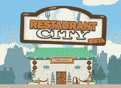
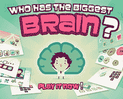

# Playfish 的社交游戏架构-每月有 5000 万用户并且不断增长

> 原文： [http://highscalability.com/blog/2010/9/21/playfishs-social-gaming-architecture-50-million-monthly-user.html](http://highscalability.com/blog/2010/9/21/playfishs-social-gaming-architecture-50-million-monthly-user.html)

每天有 1000 万玩家，每月超过 5000 万玩家使用 Facebook，MySpace 和 iPhone 等社交平台上的 [Playfish](http://playfish.com) 游戏与朋友进行社交互动。 Playfish 是游戏行业发展最快的细分市场中的早期创新者：[社交游戏](http://radoff.com/blog/2010/05/24/history-social-games/)，这是休闲游戏和社交网络之间的挚爱。 Playfish 还是 Amazon 云的早期采用者，其系统完全在 100 台云服务器上运行。 Playfish 发现自己处于某些热门趋势（可能是 EA 为什么以 [3 亿美元](http://mashable.com/2009/11/09/ea-acquires-playfish-2/)买下它们，并认为 [10 亿美元游戏](http://venturebeat.com/2010/04/20/ea-playfish-president-the-billion-dollar-social-game-is-achievable/)成为可能）的趋势：在社交网络上构建游戏， 在云中构建应用程序，移动游戏，利用数据驱动的设计来不断发展和改进系统，敏捷开发和部署，以及将[出售为商业模型。](http://blogs.forbes.com/velocity/2010/02/23/eas-playfish-big-real-world-sales-in-virtual-goods-game/)

一家小公司如何实现所有这些目标？ 为了解释这种魔术，我采访了 Playfish 的工程高级总监 Jodi Moran 和 Playfish 的首席建筑师，第一任工程师兼运营总监 Martin Frost。 很多好东西，让我们继续讲究细节。

网站： [playfish.com](http://playfish.com/)

## 统计资料

1.  每月 5000 万活跃用户
2.  每天有 1000 万活跃用户
3.  100 台服务器计算机
4.  10 款游戏，一直在发布
5.  已下载，安装和播放了 2 亿个游戏
6.  服务器与操作人员的比例为 100：1
7.  4 间工作室中的约 200 名员工和 250 名承包商

## 平台

1.  客户端上的 Flash
2.  服务器端的 Java
3.  一些 PHP 工具
4.  亚马逊：EC2，CloudFront，S3，Hadoop /弹性地图简化，Hive，一些 SQS，一些 SimpleDB
5.  HAProxy 用于负载平衡
6.  MySQL 用于分片，blob 存储
7.  码头应用服务器
8.  [YAMI4](http://www.inspirel.com/yami4/) 用于服务传输。 提供点对点连接，低延迟。

## 关键力量

塑造 Playfish 体系结构的主要力量是什么？

1.  **游戏是免费（F2P）**。 Playfish 游戏是免费的：它们不需要花钱就可以玩，但仍然需要花钱来运行。 这种模型的结果是不可能简单地将硬件扔到问题上。 成本必须得到控制，因此它们试图精益高效地运行。 与其他游戏机型一起，每月订阅可补贴硬件和产品投资。 [MMO](http://en.wikipedia.org/wiki/Massively_multiplayer_online_game) （大型多人在线游戏），例如，每台服务器可运行数百或数千个用户。 Playfish 的目标是在此数量级以上。 MMO 可提供服务器密集型游戏体验，但它们唯一的方法是每月收取 10 至 50 美元的订阅费，这是一个完全不同的空间。
2.  **游戏是社交游戏**。 Playfish 专注于社交游戏，这意味着您与朋友互动和互动。 实际上，您只能和真正的朋友一起玩，也可以和您的社交游戏一起玩。 游戏并不是真正赢球。 结果是按分数和水平排序的，但是人们会发挥更多的作用来表达自己并炫耀其设计技巧。 这是另一种游戏类型。 例如，在[餐厅城市](http://www.youtube.com/watch?v=a8AyQ7xBAZ0)中，目标不是成为最富有或最好的餐厅，而是拥有最具创意和表现力的餐厅。 较新的游戏甚至不再使用全球排行榜。 较早的游戏使用全球排行榜，每个人都与其他人竞争。 游戏的结构传统上更具挑战性，并且“看我的得分比你的得分还要大”。 现在他们有了一个排行榜，但它只是在您和您的朋友之间。 现在更亲密了。 人们不在乎是否比其他国家的人更好，而在乎是否比朋友的人更好。
3.  **游戏是异步**。 异步游戏是玩家可以在不同时间玩的游戏。 由于您的朋友很少同时在线，因此社交游戏是异步进行的。 你们不必都同时玩。 例如，在类似 MMO 的《魔兽世界》中，玩家同时存在于同一空间中并且可以同时行动，这使得他们对延迟非常敏感并且难以扩展。 Playfish 的游戏有所不同，它们是异步播放的单人或多人游戏。 玩家不会同时出现在同一个游戏空间中，而是在其本地客户端中玩。 与朋友一起玩耍时，您不会受到朋友的阻拦，可以自己进步。 该模型导致各种专业设计的可能性。 异步游戏的例子是熟悉的游戏，如 Scrabble 或 Texas Hold'em，玩家轮流玩。 更具创新性的游戏是 Playfish 的“最大大脑”游戏，该游戏中的朋友不断尝试证明谁更聪明，它使用排行榜显示您的朋友及其分数的图片，因此您始终可以看到谁在领先。 这是异步的，因为每个玩家都独立游戏，但排行榜允许所有玩家检查彼此的进度。
4.  **游戏是休闲游戏**。 异步游戏可以是硬核策略游戏，例如 1950 年代的[外交棋盘游戏](http://en.wikipedia.org/wiki/Diplomacy_(game))。 [社交游戏](http://radoff.com/blog/2010/05/24/history-social-games/)往往是[休闲游戏](http://en.wikipedia.org/wiki/Casual_game)，它们确实很容易玩，只要在短时间内从任何位置单击几下鼠标，就可以玩。 Playfish 通过高产值 3D 图形，易于控制，自定义角色和多人游戏挑战扩展了该模型，从而带来了很高的[用户参与度](http://www.workatplay.com/think/what-user-engagement-anyway-part-1)。
5.  **规模受限于各个社交网络**的规模。 与社交意味着[难以扩展](http://highscalability.com/blog/2009/10/13/why-are-facebook-digg-and-twitter-so-hard-to-scale.html)的其他应用领域相反，对于 Playfish 社交来说，这不仅是一个扩展问题，还是一个扩展解决方案。 Playfish 游戏并不具有全球意义，因为有一百万人不会尝试同时玩同一游戏。 Playfish 游戏是社交性的。 他们与您的朋友一起玩的乐趣更多，而不是艰难和肮脏的比赛。 这样的结果是，个别游戏固有地可扩展，因为它们只涉及很少的玩家。 以一个拥有 5000 万用户的全球排行榜为例。 在单个数据结构上需要大量写入，并且可能需要分片以使其扩展。 由几个参与者组成的社交网络的排行榜更容易实现。
6.  **大量用户**。 积极玩游戏的用户数量众多，这给他们的体系结构带来了压力，要求它们扩展为整个系统。 每个单独的游戏可能都相对容易扩展，但是对于这么多的活动游戏来说，完整的系统并不是那么容易扩展。
7.  **快速增长**。 通过设计，这些游戏具有病毒性，因为它们利用了社交图谱。 它们也很有趣，易于玩耍并有助于维持朋友之间的关系。 所有这些因素都促进了社交游戏的快速发展，这意味着 Playfish 不仅需要应对大量用户，还必须应对持续不断的新用户。
8.  **快速更改**。 游戏市场发展迅速，竞争激烈。 这也是一个非常新的领域，每个人仍在学习什么有效，哪些无效，流失很多。 Playfish 不能等待漫长的采购流程，漫长的设计周期或漫长的发布周期。 他们必须保持敏捷。
9.  **游戏的热门驱动性质**。 很难预测哪些游戏会成功，因此当一款游戏成功起飞时，它必须能够立即扩展。 游戏盛行时，没有时间利用新资源。 为每个游戏的最大预期增长分配资源根本行不通。 他们的游戏太多了，这将需要大量的服务器，而这些服务器很可能将不使用。
10.  **实验性游戏发布**。 游戏可以看作是针对利基市场的实验。 有些实验会比其他实验更成功。 这回到了社交游戏行业非常敏捷的本质。
11.  **多个游戏**。 Playfish 不是一家单一产品公司。 其他公司仅支持一个游戏。 Playfish 必须同时支持和开发多个游戏，并且新游戏总是按计划进行。 这给开发和运营带来很大压力。
12.  **智能客户端**。 Playfish 游戏是用 Flash 编写的，这是一个非常强大的富客户端。 它可以智能地缓存数据，支持本地操作并消除大量服务器负载。
13.  **游戏是应用程序，而不是网站**。 由于智能客户端会删除许多读取，因此大多数数据库活动都是**大量写入**。 典型数据库主机上 60％的负载是写操作，而大多数网站往往读起来很繁琐。 由于游戏是通过网络进行的，因此很容易将它们视为网站，但实际上它们是通过网络交付的应用程序。
14.  **重负载时间延迟**。 Playfish 游戏具有全球用户的意义，因此具有全球性。 由于游戏是在智能客户端中异步进行的，因此游戏等待时间并不重要，这意味着在加载游戏（即 Flash 游戏+资产）时，用户会遇到最明显的等待时间，因此，他们必须尽可能减少这种情况。
15.  **来自用户**的实时反馈。 社交游戏通过网络以数字方式在社交网络上分发，从而完全绕开了通过商店或电信公司的传统分发渠道。 第一次没有中间人控制游戏发行。 任何用户都可以坐在家里，随时随地与他们一起玩。 游戏制作者现在可以以前所未有的方式与观众建立联系。 可以直接与用户群联系，以帮助发展和改进游戏。 用户可以向游戏设计师提供实时反馈，并影响他们玩的游戏的设计。
16.  **社交游戏是服务，而不是盒子**。 传统游戏是在盒子中的架子上购买的，而发行商则控制频道。 他们向同一位 25 岁的硬核游戏玩家销售产品。 社交游戏正在扩展到[新市场](http://venturebeat.com/2010/08/23/one-in-five-americans-plays-games-on-social-networks/)，吸引了从未玩过游戏的人。 作为一项服务的游戏在玩家和游戏背后的创意团队之间建立了非常长的关系。 可以每周发布一次，一起培养游戏，并不断学习玩家的需求。 在拥有多年的开发周期之前，这是不可能的。
17.  **人们已断开连接，正在寻找连接**的方法。 宠物协会是一个虚拟的世界，玩家在这里装饰自己的房屋和朋友的房屋。 在圣诞节前后，他们开始以每个 2 美元的价格出售虚拟圣诞节和装饰品。 他们出售了价值 4000 万美元的虚拟货币。 行为分析的忠实拥护者，他们问用户为什么要这么做？ 归结为与断开联系的人们建立联系。 以前，他们家里会有一棵树，人们会看到树和他们的创造力。 现在人们都断开了连接，因此 3-4 个朋友可以看到真实的圣诞树，而他们所有的朋友都可以看到 Facebook 上的虚拟圣诞树。 在吸引人方面，您的虚拟货币有更大的优势。 推动购买的是对社交表达自我的渴望，虚拟商品是手段，社交网络是新领域。 就像在现实世界中一样，购买虚拟礼物是为了在与朋友互动中获得感知的价值。
18.  **背景模拟**。 像 Restaurant City 这样的游戏开始具有后台模拟组件，即使用户不在网上也可以运行。 这导致游戏以鼓励玩家定期回头的方式发展。 例如，在《餐厅城》中，玩家需要确保为餐厅员工提供食物。 此模拟组件是一个有趣的新负载，必须将其集成到游戏基础结构中。
19.  **需要一次缩放几个不同的维度**。 Playfish 需要扩展以支持更多的用户，更多的游戏，每位用户更多的数据，每位用户更多的访问权限，更多的开发人员和更多的运营人员。 扩展最困难的事情是扩展支持一切的人员。

## 关键扩展策略

为了应对这些力量，Playfish 遵循了一些关键的扩展策略：

1.  **乐趣**。 为了推动增长，关键的设计指标是创造一款如此有趣的游戏，以至于它会产生强烈的情感，使人们感到他们只需要玩游戏，就必须邀请他们的朋友加入游戏，以获得更多的乐趣。 在朋友的社交网络中分享情感时，情感会最大化。 传统游戏是具有出色声音和图形的沉浸式体验。 Playfish 尝试设计用于社交互动的游戏，通过邀请朋友让您从游戏中受益。 您可以自己玩 Restaurant City，但邀请您的朋友在您的餐厅做饭会更有趣。 通过在游戏中添加朋友，您会逐渐获得更多乐趣。 用户希望与朋友互动以获得更多乐趣的愿望推动了更大的发行量和增长。
2.  **基于微交易的收入模型**。 [微型交易](http://blogcritics.org/gaming/article/microtransactions-in-games/)通常是高交易量，低价值的交易。 为了支付服务费用，Playfish 通过玩家购买游戏内虚拟物品和服务来赚钱。 Playfish 还从广告和[产品展示位置](http://venturebeat.com/2010/04/20/ea-playfish-president-the-billion-dollar-social-game-is-achievable/)中获利。 该策略支持免费游戏模式，同时基于自然游戏收入提供收入。
3.  **云**。 Playfish 从一开始就一直是 100％基于云的，并于 2007 年在 EC2 上发布了他们的第一款测试版游戏。云几乎是我们上一节所介绍的众多力量的完美答案。 我不会谈论云的所有[奇观，但您很容易看到弹性如何帮助解决他们的许多可变需求问题。 如果游戏变得流行，它们可以增加更多资源来处理负载。 无需采购流程。 如果需求下降，他们可以简单地将实例退还给您。 云的 API / IaaS（基础设施即服务）性质可以轻松满足其对敏捷性的需求，保持团队规模的需求以及早期及经常发布的要求。 您可能会认为按使用付费模式的云太昂贵了，我们将在云部分中对此进行更多讨论，但是他们并不这么认为。 他们更加担心无法在快速发展的市场中开发新游戏和改进现有游戏的机会成本。](http://highscalability.com/how-do-you-explain-cloud-computing-your-grandma)
4.  **SOA（面向服务的体系结构）**。 他们在 SOA 方面非常重要。 这是他们架构的组织原则以及他们如何构造团队。 每个游戏都被视为单独的服务，并且彼此独立发行。 内部组织成提供 API 的组件的软件，并且这些组件分别进行管理和可伸缩。
5.  **分片**。 Playfish 是一项写重服务。 为了处理写入，Playfish 采用了[分片架构](http://highscalability.com/blog/category/shard)，因为这是扩展写入的唯一真正方法。
6.  **BLOB** 。 没有为用户存储多个记录。 相反，用户数据存储在 MySQL 中的 [BLOB](http://en.wikipedia.org/wiki/Blob_(computing)) （二进制大对象）中，因此可以通过键值方法快速访问它。
7.  **异步**。 在服务器上进行写操作与游戏是异步的。 用户不必等待服务器上的写入完成就可以继续玩游戏。 他们试图尽可能向用户隐藏延迟。 在 MMO 中​​，每一步都必须传达给所有用户，而延迟是关键。 Playfish 游戏并非如此。
8.  **智能客户端**。 通过使用智能 Flash 客户端，Playfish 能够利用客户端计算机上更高的处理能力。 随着他们添加更多用户，他们还增加了更多的计算能力。 他们必须正确平衡服务器端和客户端端的内容。 适当的组合因游戏而异。 智能客户端缓存读取内容，但它也允许游戏在客户端上独立进行，而无需与服务器对话。
9.  **数据驱动的游戏改进**。 Playfish 收集了大量的游戏数据，用于持续改进现有游戏并帮助确定接下来要发明的游戏。 他们正在使用 Amazon 的 Elastic Map Reduce 作为其分析平台。
10.  **敏捷**。 Playfish 的所有思想中的一个共同点是对灵活性的不懈需求，以便能够快速，轻松，高效地应对各种情况。 敏捷性体现在他们对云的选择上，围绕服务进行组织，快速发布周期，保持团队规模小和有能力，并通过数据挖掘和客户反馈不断改进游戏设计。

## 基本游戏架构

1.  游戏在 Flash 客户端中运行。
2.  客户端以服务级别 API 的形式将请求发送到 HAProxy 服务器，该服务器在 Amazon 云中运行的 Jetty 应用程序服务器之间负载均衡请求。
3.  所有后端应用程序均使用 Java 编写，并使用面向服务的体系结构进行组织。
4.  Jetty 服务器都是无状态的，从而简化了部署，升级并提高了可用性。
5.  MySQL 被用作数据层。 数据在 MySQL 服务器之间进行分片，并以 BLOB 格式存储。
6.  Playfish 是 Amazon 云的早期采用者，因此他们无法利用诸如负载平衡之类的 Amazon 后来的开发。 如果他们必须从头开始，他们可能会朝这个方向发展。
7.  更改被异步推送到服务器。 该系统的设计不是让用户单击按钮，而是将操作发送到服务器以查看发生了什么，而是使系统有权让客户端决定操作是什么，然后由服务器检查该操作是否有效。 处理在客户端。 如果用户和服务之间存在高延迟，则由于异步保存和智能客户端，用户将看不到它。 在一天结束时，用户看到的才是最重要的。 重要的是，当网络中出现故障或等待时间较长时，用户将获得有趣的游戏体验。
8.  Playfish 的前几款游戏是简单的单人游戏，例如《谁拥有最大的大脑》，并具有高分和挑战等功能。 在服务器端不是很复杂，也不是很沉重。 从项目开始到结束，他们只有 5 周的时间。 其中包括对 Facebook API 的学习和编码，对 AWS 的学习和编码，对游戏服务器的编码以及建立生产基础架构。 前三场比赛延续了这种模式：高分和挑战。 这给了他们一些喘息的空间，可以开始建立自己的基础架构。 改变事物的第一款游戏是 2008 年的宠物协会。这是第一款大量使用虚拟物品的游戏。 数据存储从为每个用户存储一些属性（如化身定制和高分）到为每个虚拟项目存储每个用户潜在的数千个项目。 这给系统带来很大压力。 早期，随着服务增长非常迅速，出现了一些大服务问题。 然后他们进行分片，系统变得更加稳定。 但是首先，他们尝试了其他各种技术。 他们尝试一次添加更多的只读副本，例如一次添加 12 个，但这并没有真正起作用。 他们尝试尽最大可能修补系统。 然后他们咬住子弹并放入分片中。 从开始到推出共花了 2 周的时间。 在该游戏中，所有性能问题都消失了。 随着时间的流逝，用户获得了很多虚拟物品，因此行的数量爆炸了。 每个项目都存储在其自己的行中。 即使您将用户划分为旧用户的碎片，即使用户数量保持不变，碎片也会不断增长。 这是转到 BLOB 的原始驱动程序之一。 BLOB 摆脱了导致此类性能问题的多个行。 随着时间的流逝，游戏开始变得越来越复杂。 宠物协会没有任何模拟元素。 然后，他们在 2008 年底推出了“餐厅城市”，该餐厅具有第一个离线模拟元素。 当玩家不在时，您的餐厅继续营业并赚钱。 这带来了挑战，但是在云中添加额外的处理相对简单。 模拟逻辑是在客户端中实现的，服务器将执行诸如检查欺诈的操作。

## 面向服务的架构

1.  Playfish 确实是 SOA 的主要倡导者。 SOA 将数据和功能封装在一起，可以通过分布式系统独立部署。 分布式组件通过称为*服务合同*的 API 进行通信。
2.  服务确保系统所有部分之间的依赖性是众所周知的，并且尽可能松散耦合。
3.  支持复杂性管理。 该系统可以组成单独的易于理解的组件。
4.  组件是独立部署和升级的，这提供了灵活性和敏捷性，并使得扩展开发和运营团队变得更加容易。
5.  可以独立于其他服务来优化独立服务。
6.  服务失败时，更容易正常降级。
7.  每个游戏都被视为一项服务。 UI 和后端是一个包。 他们没有分别发布 UI 和后端。

## 云端

1.  Playfish 从一开始就是 100％基于云的，于 2007 年在 Beta 版 EC2 上发布了他们的第一款游戏。
2.  Cloud 使 Playfish 能够以极低的摩擦力进行创新并尝试新功能和新游戏，这是快速发展的市场的关键。 从他们的多个只读副本系统迁移到分片系统需要 2 个星期，如果没有云的灵活性，这是不可能完成的。
3.  云使他们能够专注于使他们与众不同的地方，而不是构建和管理服务器。 由于云运营无需专注于机器维护，因此他们可以专注于更高价值的服务，例如跨所有不同服务器和游戏开发自动化。
4.  现在，在设计应用程序时将容量视为一种商品。
5.  服务器与操作人员的比例为 100：1。 由于云基础架构，如此高的比率是可能的。
6.  服务器发生故障，因此必须从头开始计划。
7.  不可能继续向服务器添加内存，因此您可能必须提前扩展。
8.  云的关键特征是*灵活性*。 您可以根据需要灵活地进行操作。 当您突然得到大量流量时，您无需感到惊讶。 您不必等待服务器的采购。
9.  您永远都不知道游戏将以多快的速度起飞。 有时您确实知道，体育游戏发展很快，但其他游戏可能会突然爆炸。 在云中，这不一定是问题。
10.  从一开始，就从来没有想到它们可以在云中进行扩展。 一切都旨在通过添加更多计算机来扩展。
11.  他们不能使用所有的 Amazon 服务，因为必须自己滚动。 离开他们所了解的自己的系统会带来不必要的风险。 例如，没有 ELB 和 RDS，因此必须自己构建。 现在切换到那些服务没有任何意义。
12.  Playfish 是云的核心。 他们充分利用了云中的一切。 轻松获取更多容量。 他们根本没有内部服务器。 所有开发机器都在云中。 云使启动新环境变得轻而易举。 例如，要测试分片很容易，只需使用新配置复制所有内容即可。 在数据中心中运行时，这要困难得多。
13.  考虑到所有因素，**云比裸机更昂贵**。
    1.  基于带宽和机架空间的单位，裸机可能看起来更便宜，但是如果您查看所获得的所有东西，那将是很多工作。 以高级可用性功能为例。 更改 API 调用，您将获得双数据中心。 在裸机情况下，您无法做到这一点。 仅考虑设置和维护的人员成本。 云看起来确实很昂贵，但是当您获得真正大容量时，中断就开始了。
    2.  要考虑的主要成本是**机会成本**。 这是最大的优势。 例如，当他们第一次在 Pet Society 中实施分片时，从开始到部署需要 2 周。 用户立即感到高兴。 它们的实现速度取决于能够在生产中激发整个服务器负载以及测试和迁移数据。 如果您有两个月的交货时间，那么您将有两个月不满意的用户。
14.  Playfish 在同一区域内的多个可用区中运行。 服务器相对靠近，这减少了延迟。 它们不会像 MMO 系统那样散布开来。 使用异步写入，客户端中的缓存和 CDN 中的缓存在更高级别上处理延迟。 在服务器上执行游戏操作可能需要 3 秒钟，但是由于它是异步的，因此用户不会注意到。 CDN 有助于减少他们注意到的内容，即资产和游戏的负载。
15.  CloudFront 用于减少负载延迟。 从某种意义上说，Playfish 是全球性的，拥有世界各地的用户。 游戏的加载时间（包括 Flash 代码和游戏资产）是它们最明显的延迟。 CloudFront 可以在分发内容时减少这种延迟。

## 数据库系统

1.  MySQL 被用作存储 BLOB 的分片键值数据库。
2.  用户跨多个数据库集群进行分片，每个集群都有自己的主副本和只读副本。
    1.  他们拥有更多副本的好处不多，因为它们写得很重。 几乎所有流量都是写操作。 写入很难缩放。 无法缓存，更多的只读副本无济于事。
    2.  在较早的体系结构中，他们有一个具有 12 个读取从属设备的主设备，表现不佳。
    3.  通过分片，他们从一个母版和 12 个只读副本变成了两个母版和两个只读副本，这对读写都有帮助。
3.  分片意味着索引变小，这意味着它们可以容纳在内存中。 将索引保留在缓存中可确保用户查找不必打到磁盘，可以从 RAM 提供查找。
4.  通过分片，他们可以控制每个分片中有多少用户，因此，他们可以确保自己不会破坏内存索引缓存并开始访问磁盘。
5.  他们试图优化用户记录的大小，以便更多用户可以容纳在内存中。 这就是为什么他们去存储 BLOB 而不是使用标准化为行的数据的原因。 现在，每个用户只有一个数据库记录。
6.  工作从数据库服务器中取出并移到应用程序服务器，这些服务器很容易在云中水平扩展。
7.  大多数网站都使用诸如内存缓存之类的扩展技术来进行读取缓存，而这些技术对 Playfish 并不那么有用。 使用 Flash 客户端时，将在 memcache 中缓存的大部分内容都将缓存在客户端中。 将其发送到服务器一次并存储。
8.  分片用于获得更高的写入性能。
    1.  写操作占 60％的工作量。 通常情况下是 10：1。 他们仍然使用 MySQL 进行数据存储，因为他们对负载等情况下的性能统计非常满意。
    2.  每个分片都有一个母版，至少在只读副本上。 大多数情况下，只有一个只读副本，但这取决于服务的访问模式。 读取将拆分为读取副本。 对于确实具有更多读取的一些地方，它们具有更多的读取副本。 只读副本还用于远程保留数据作为备份。
9.  Playfish 是由纯粹的必需品驱动的。 他们建立了自己的键值存储，因为必须这样做。 为什么不使用 NoSQL？ 他们正在研究选项，但同时他们有一个可行的解决方案，他们知道它将如何工作。 对 NoSQL 解决方案感兴趣，用于操作端，用于管理多个数据库。 进入运行 NoSQL 的模式并不容易，但这是由其需求驱动的。
10.  在横向扩展情况下，您必须进行分片之类的操作，此时许多 SQL 功能都将消失。 您必须自己做很多工作。 现在，当您进行大批拆分时，您将无法添加索引。
11.  使用 NoSQL 时，您将放弃访问模式的灵活性。 关系数据库非常好，因为您可以随时以所需的方式访问数据。 例如，由于他们不能再使用 SQL 来汇总字段，因此它们都可以即时聚合或使用批处理过程进行聚合。
12.  备份到 S3。

## Flash-客户端

1.  客户端的 CPU 和资源随用户数量的增加而扩展，因此明智地利用客户端。 将尽可能多的处理推送给客户端。
2.  更改被异步写回到服务器，这有助于向用户隐藏网络延迟。
3.  在服务器端检查更改以检测作弊。
4.  Flash 使用服务级别 API 与 Jav​​a 应用程序服务器对话。
5.  使处理过程更接近客户端可为用户带来更好的体验。 网站使服务器更靠近用户。 Playfish 在客户端上使处理过程更加紧密。

## YAMI4-讯息

1.  经过长时间的评估，YAMI4 是 Playfish 决定使用的消息传递系统。 它提供点对点连接，低延迟，无单点故障以及异步消息传递，以在多个后端服务中进行事件驱动的处理和并行处理。
2.  服务经过发现阶段以了解每个端点的位置后，消息将直接在服务之间传输。 这是一种无经纪人的模式。 消息不会集中到集中式服务中，然后再重新分发。 使用此模型，消息传递非常有效，因为没有中间跃点，因此减少了延迟。 他们特别不想让一个单独的组件来处理流量，然后传递消息。 这种方法减少了故障点和延迟。
3.  被认为是节俭的，但是 YAMI4 因其异步操作而获胜。 Thrift 使用看起来像本地函数调用的 RPC 模型，这使得处理错误，超时等更加困难。YAMI4 是消息传递模型，而不是 RPC 模型。
4.  YAMI4 不处理服务发现方面，而是在发现阶段然后直接与其他服务对话的基础上构建自己的服务。 互联网的运作方式更多。
5.  作为消息传递系统，消息不会调用对象上的方法。 也没有对象在网络上流动。 对象存在于服务中。 每个服务负责激活，钝化和调度操作。

## 处理多个社交网络

1.  他们的主要挑战之一是能够支持这么多不同且越来越不同类型的游戏。
2.  尽可能使用*松耦合*的原理：
    1.  团队拥有的服务使团队结构与体系结构相匹配。
    2.  服务保持良好定义的接口，以便每个团队可以迭代并部署自己的服务，而不会影响其他团队。
    3.  当需要更改接口时，将对接口进行版本控制。 他们试图保持向后兼容性，以便其他团队不必推出更改。
3.  为了促进所有这些，将一套通用的标准应用于所有服务：
    1.  公共服务运输（YAMI4）
    2.  通用操作标准，例如如何配置服务以及它们如何提供监视信息。
4.  通用标准和松散耦合的结合使开发和运营团队既灵活又高效。

## 开发与运营

1.  服务彼此独立发布。
2.  资源按服务分开。 一项服务出现问题不会影响不相关的服务。
3.  团队是按服务组织的，尽管有一些重叠。
4.  尽管存在密切的关系，但运营团队与开发团队是分开的。 没有大的交接阶段。 他们不只是在墙上扔一个释放。 操作包括在设计中。
5.  开发人员不发布代码。 他们将其检入并由操作人员将其捡起。
6.  团队在部署方面具有很大的灵活性。 大多数游戏每周发布一次。 一切都是迭代的，这意味着代码足以投入使用，但功能不一定完全完成。 每周发布周期对于带有虚拟物品的游戏特别有价值，因为用户喜欢每周都知道有新的令人兴奋的东西。 其他团队可以使用更长的功能块。 这取决于。 这是从事 SOA 的优势之一。 团队可以独立工作。 不需要一个发布周期。

## Java-服务器

1.  Java 支持创建干净的可重用组件。
2.  有大量的开源库。
3.  Java 是灵活的：它可用于实现 Web 应用程序，流程请求，批处理和事件驱动的系统。
4.  Java 有许多调优选项。 他们做了很多工作来调整垃圾回收以提高性能。

## 游戏设计

1.  为了使游戏用户享受 Playfish 的乐趣，它将数据驱动的设计与良好的，受人启发的古老游戏设计结合在一起。 数据可用于指导用户制作游戏的许多决策。 他们可以从数据中看到用户最擅长的事情。 这告诉了他们如何使游戏和个人游戏变得更好，以及在设计新游戏时该怎么做。
2.  Playfish 喜欢行为分析。 他们查看人们在游戏中正在做什么，然后问他们为什么。 在支持方面，客户端和服务器具有很大的能力来生成有关用户操作的事件。 然后处理这些事件，以创建有关用户在游戏中所做操作的汇总信息。 他们现在正在使用 EMR / Hadoop / Hive 来通过类似 SQL 的界面访问大量的数据。 在云中使用 EMR 的效果非常好，他们对此非常满意。 大量数据可以粒度形式存储，并且由于所有内容都可以并行工作，因此仍然可以快速找出所需内容，非常适合游戏产生的事件类型数据。
3.  用户想要什么真是令人惊讶。 他们甚至可能自己都不知道。 人们认为他们想要的与人们实际使用的有所不同。 有时，用户会说他们确实想要一些昂贵的功能，但最终却没有使用它们。 然后是没有人提及但人们一直在使用的功能。 在论坛上发帖的人通常是不喜欢事物的人，因此很容易获得一种非常不平衡的观点，因为他们对游戏充满热情，讨厌任何变化。 数据有助于找出人们真正喜欢的东西。
4.  游戏设计不能只是数据驱动的，否则游戏将毫无生气。 您必须正确获得数据驱动的平衡。 您不能仅仅按照数据说明的去做。 随您的灵感去增加或增加游戏中的内容，然后使用数据来完善游戏。
5.  某些功能需要大量的工作来创建，但由于功能太复杂，用户并没有最终完成。 他们设置了渠道，以了解人们是否在完成功能之前就放弃了功能，然后他们就能找出原因。 也许某个功能需要调整或放弃。 参与度是用户对游戏的热爱程度的衡量标准。 然后，他们投资使人们回头的内容，以便生态系统得以发展。
6.  敏捷+数据+设计=允许快速试用新启发的功能，以查看它们是否有效。 结果是一个有趣的游戏。
7.  团队分为紧密的小组，这些小组具有完全的创作自由。 所有团队成员都对什么使游戏更有趣发表了意见。
8.  运行游戏实验是为了寻找合适的位置，以查看合适的位置。 有些会成功，有些会失败。

## 得到教训

1.  **建立一个利用应用程序特殊性质的体系结构。** Playfish 已针对其特定需求量身定制了一种体系结构。 不要尝试构建可以扩展所有内容的通用体系结构。 利用空间的本质，使生活尽可能轻松。
2.  **不用担心第一次正确**。 把东西拿出来，开始学习。 如果他们试图达到 3 年前的现状，那么他们仍然会构建系统。 他们提出了一些根本无法扩展的东西，但他们在 5 周内就解决了。 这是关键。
3.  **不要害怕坚持知道和了解的东西**。 选择您熟悉的东西。 您不需要选择最新和最酷的产品。 充分了解产品并能够预测产品在您的用例中的运作方式具有很多价值。 这样，您将减少很多麻烦。
4.  **首先保持简单，然后在需要时进行扩展**。 利用该提前期来构建您所需的内容。
5.  **碎片和 BLOB** 。 使用分片扩展写操作。 使用 BLOB 将每个用户的记录数减少到一。 这样可以加快对象访问速度，并允许在 RAM 中添加更多对象。
6.  **总是有一个粗略的想法，你将如何扩展**。 不要过早设计功能，但不要创建破坏性的依赖关系。 例如，可以在不进行适当缩放的情况下启动就可以了，拥有在分片后无法使用的功能也不是一件很酷的事情。
7.  **缩放数据比缩放处理**困难。 您在哪里存储数据？ 有多少人需要读写？ 无状态应用程序服务器使添加更多处理变得容易，而数据扩展则困难得多。
8.  **不要过度复杂**。 扩展简单系统更容易。 保持尽可能长的简单性。 这使您可以了解痛点所在，然后可以专门解决这些痛点。 许多人认为他们必须从第一天开始就建造巨大的东西。 例如，如果您不需要多级缓存，则不要放入它，因为您必须支持它。
9.  **使用 SOA 管理复杂性**。 随着新游戏的添加，将代码分成由不同团队管理的不同组件有助于降低系统的整体复杂性，从而使一切易于扩展。
10.  **承担计算的风险**。 Playfish 进入了云环境，但是有一个备份计划，以防万一失败。 这是一种风险，但也有很多好处。 如果亚马逊取消了他们的服务，那么如果他们真的需要，他们可以搬家。 这就是使用“基础架构即服务”的好处。 使用“平台即服务”存在更大的风险，因为您建立了更深的依赖关系。 例如，当 fPlayfish 拥有自己的有效键值数据库时，转移到 NoSQL 产品的风险也太大。
11.  **运营和开发应了解系统如何在生产中工作**。 容易管理吗？ 支持客户容易吗？ 如何配置和监视它？ 开发您需要实现所有这些的东西。 开发人员不能只是在墙上扔代码。 应该没有墙。
12.  **使用数据可以帮助您找到人们真正喜欢的东西。** 用户并不总是知道自己最喜欢什么。 检测您的代码并分析数据以找到有意义的模式，并使用该信息来不断改进系统。
13.  **最难扩展的是人**。 必须使人们的工作变得非常容易。 获得更多的服务器要比获得更多的人容易得多。

我要感谢 Playfish 抽出宝贵时间进行了这次翔实而有见地的采访。 如果您希望 HighScalability.com 上具有您的体系结构，请[与我](http://highscalability.com/contact/)联系以开始使用。

Playfish 正在寻找人。 有关职业机会，请参见其[职位页面](http://www.playfish.com/?page=jobs)。 从我与几个人的交往中，一个 Playfish，他们似乎把他们的东西放在一起。 值得一看的是，他们有很多空缺职位，他们正在寻找服务器端工程师。 他们希望构建新系统，以使用 EMR / Haddop / Hive 更好地了解用户，并扩展整个系统以添加更多用户和游戏。

## 相关文章

1.  [Playfish 展示了“游戏即服务”如何在云中扩展](http://www.readwriteweb.com/cloud/2010/08/playfish-shows-how-games-as-a-.php)
2.  [访谈：Playfish 通过我的帝国在简单的动作中寻找意义](http://www.gamesetwatch.com/2010/08/interview_playfish_on_finding.php)
3.  [AWS 案例研究：Playfish](http://aws.amazon.com/solutions/case-studies/playfish/)
4.  [EA Playfish 高管吹捧下一代 Facebook 游戏](http://venturebeat.com/2010/05/14/ea-playfish-exec-sebastien-dehalleux-touts-next-generation-facebook-games/)
5.  [深入了解：Playfish](http://blog.kissmetrics.com/an-in-depth-look-playfish/)
6.  [介绍 Playfish](http://www.slideshare.net/sdehalleux/introducing-playfish)
7.  [在社交游戏峰会](http://www.insidesocialgames.com/2008/06/13/lives-notes-from-asynchronous-games-on-social-networks-at-social-gaming-summit/)上直播“社交网络异步游戏”的笔记
8.  视频： [SGS09：大规模构建社交游戏](http://www.youtube.com/watch?v=dLCSGm_tkfM)。
9.  视频： [SGS2008：社交网络上的异步游戏](http://www.youtube.com/watch?v=3zIXY1upwTI)。
10.  [异步游戏](http://www.cs.vu.nl/~eliens/media/pattern-asynchronousgames.html)。
11.  [异步多人游戏：Ian Bogost 的休闲多人游戏体验](http://www.bogost.com/writing/asynchronous_multiplay_futures.shtml)的未来。

非常有趣的东西-感谢分享！

我真的没有这样的句子：“要招募更多的人要比招募更多的人容易得多。” 请解释。

谢谢托德，它非常有用。

顺便说一句，我喜欢 Playfish 的运作方式：

> 由于您的朋友很少同时在线，因此社交游戏是异步进行的。

如果您认为 Cloud 最好，那显然是因为您尚未大规模使用它。 我们在亚马逊上运行着数百台服务器，而连接问题的数量（即无法到达实例，x 可用区网络问题）和它们具有的 I / O 性能让我们感到“惊讶”； 在过去的六个月中，他们最长可以无问题地停留的时间是 8 天，这意味着我们每周或更少的时间都会因为亚马逊的“超级云”而获得生产“成功”。
我的建议：使用云来扩展和稳定，然后移开地狱。 干杯。

这是拼写错误的塞巴斯蒂安，谢谢。

克里斯，那是您的现代时代:-)

很棒的文章 Tood，感谢您提供。 Playfish 在数据库分片方面的经验与我们在快速增长的 dbShards 实现中所发现的完全一样。 如上文所述，由于利用内存来实现数据库平衡，因此我们的社交应用程序以出色的性能运行。

关于此报价：

> 在横向扩展情况下，您必须进行分片之类的操作，此时许多 SQL 功能都将消失。 您必须自己做很多工作。 现在，当您进行大批拆分时，您将无法添加索引。

我们可以轻松支持混合使用典型表和键/值 blob 数据，就像 Playfish 一样。

我想知道其他人怎么想：传统表结构与键/值 Blob 的无缝结合？ 在这两种情况下，我们都可以支持高可用性操作，而无需开发人员的任何努力。 这样，您可以从常规表中获得所有索引/搜索优势，并且它们可以在适当的地方指向 Blob 值（例如，用户个人资料信息）。

很棒的文章。

他们使用什么 Web 服务器？