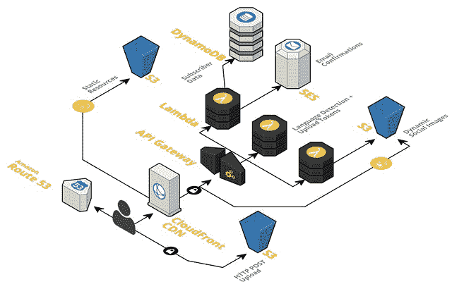
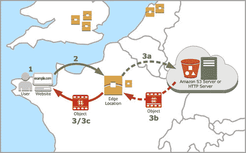
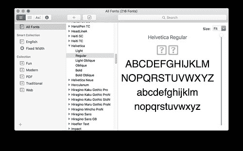
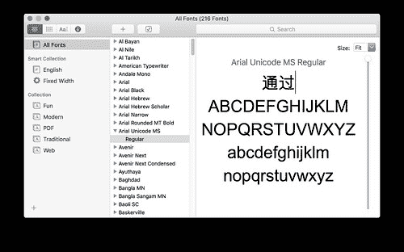
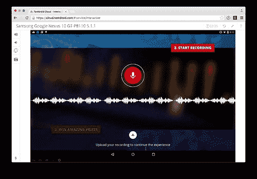

# 为 David Guetta 建立无限可扩展的在线录制活动

> 原文： [http://highscalability.com/blog/2016/1/20/building-an-infinitely-scaleable-online-recording-campaign-f.html](http://highscalability.com/blog/2016/1/20/building-an-infinitely-scaleable-online-recording-campaign-f.html)

*这是 [Ryan S. Brown](https://twitter.com/ryan_sb)* 最初发布在 [serverlesscode.com](https://serverlesscode.com/post/david-guetta-online-recording-with-lambda/) 上的一次采访*的来宾帖子。 它继续了我们对 Lambda 顶部建筑系统的探索。*

分页 [David Guetta](https://en.wikipedia.org/wiki/David_Guetta) 粉丝：本周，我们采访了在其最新广告系列背后建立网站的团队。 在网站上，歌迷可以录制自己演唱的单曲“ This One’s For You”，并制作专辑封面。

后台**该站点建立在 Lambda，API Gateway 和 CloudFront** 上。 社交广告系列通常会变得很尖刻–当大量媒体报道时，如果您还没有准备好，大量的用户涌入便可以使基础架构开始爬行。 [parall.ax](https://parall.ax/) 的团队之所以选择 Lambda，是因为它没有使用寿命长的服务器，而且他们可以根据亚马逊的需求来分担上下扩展应用程序的所有工作。

来自 [parall.ax](https://parall.ax/) 的 James Hall 将会告诉我们他们如何构建一个国际化的应用程序，该应用程序可以在短短六周之内满足任何水平的需求。

# 面试

## 什么是 [parall.ax](https://parall.ax) ？ 告诉我您的公司（规模，专长等）

Parallax 是一家数字代理商。 我们提供一系列服务，包括应用程序开发，安全性和设计服务。 我们有 25 名全职员工以及一些外部承包商。 我们专注于提供可大规模扩展的解决方案，尤其专注于体育，广告和快速消费品（FMCG）。

## 告诉我一些有关该应用程序的信息，它可以解决什么问题？

该应用程序是 David Guetta 的新发行版“ T [他的一生为您](https://www.youtube.com/watch?v=MAQIb2lYFV0)”（这是 2016 年 UEFA EURO 决赛的官方主题曲）的大规模营销活动的一部分。 我们正在邀请粉丝-希望到三月时达到一百万-进入虚拟录音室，并为他们提供与 Guetta 一起唱歌的机会。 不仅他们的声音会出现在最后一首歌中，我们还将用他们的名字和最喜欢的团队创作个性化的专辑插图。 可以在朋友之间共享，从而增加参与度，并允许更多粉丝加入广告系列。 整个网站以十二种语言构建，融合了 DJ 自己的视频内容以及赢得巴黎之旅的机会。 您可以在 [thisonesforyou.com](https://thisonesforyou.com/) 上进行检查。

## 除了 Lambda 之外，该应用程序还使用哪些其他技术？ 这包括前端，移动数据库以及任何您可以共享的数据库。

   *图片来源：Parallax Agency Ltd.*

在后端，我们使用各种技术来提供完全可伸缩的体系结构。 我们使用[无服务器](http://serverless.com)（以前称为 JAWS）和 CloudFormation 在代码中协调整个平台。

请求通过 CloudFront 路由，静态资产缓存在距离请求它们的用户最近的 Edge 位置。 页面首次加载时，所有内容都是完全静态的。 在客户端浏览器中会生成一个 UUID-该 UUID 用于将来的所有 API 请求，并允许我们将页面中的不同操作关联在一起，而不必提供 Cookie。 此值的随机性很重要，因此该库使用计时和加密函数（如果可用）来导出随机种子数据。

   *图片来源：Amazon Web Services*

静态资产的来源是一个简单的 S3 存储桶。 这些通过部署脚本上载。

然后，语言检测端点发送回 Accept-Language 标头以及接收请求的国家代码。 这是使用基本的 Lambda 函数。 另一个端点将订户数据添加到 DynamoDB，以及通过 Amazon SES 向他们发送欢迎电子邮件。 为了使录制工作正常进行，我们有一个端点，该端点为以提供的 UUID 命名的路径发行 S3 令牌。 然后，将上传的内容从浏览器直接发布到 S3。

Lambda 最有用的应用是图像生成端点。 我们拍摄用户最喜欢的球队标志的图像，覆盖 Guetta 的照片，然后添加他们的名字。 然后将其与 Facebook 和 Twitter 大小的图形一起上传到 S3。 我们还上传了一个静态 HTML 文件，该文件指向此唯一的图形。 这样可以确保当人们共享 URL 时将显示其自定义插图。 为此，我们在页面中使用 Open Graph 图像标签。

在前端，我们使用 Brunch 来编译车把模板，编译 SASS，为 CSS 加上前缀以及任何其他构建任务。

记录接口本身具有三种实现。 WebRTC 录音机是“ A 级”体验，它使用新的 HTML5 功能直接从麦克风录音。 然后，我们会有一个 Flash 回退来获得相同的体验，这适用于不支持 WebRTC 的桌面浏览器。 最后，我们有一个文件输入，提示用户在手机上进行录制。

## 您是否考虑过其他解决方案？ 如果是，还有哪些其他选择？ 如何决定使用 Lambda？

是的，一点没错。 我们的常规堆栈是 LAMP，构建在 CloudFront，Elastic Load Balancer 和 EC2 节点之上。 这本来可以扩展，但要像使用基于 Lambda 的体系结构一样快速和简单地扩展，则要困难得多。 我们必须构建一个用于生成图像的排队系统，然后启动专用于根据吞吐量制作这些图像的 EC2 节点。

编写简单的 Lambda 函数并让 Amazon 进行所有艰苦的工作似乎是显而易见的选择。

## 团队有多大？ 是否有/已经有过 Lambda 的经验，或者他们来自其他专业领域？

Parallax 的团队由五人组成。 Tom Faller 是客户经理，负责项目的日常运行。 我是后端开发人员，创建 Lambda 函数并设计云架构。 阿米特·辛格（Amit Singh）主要是前端，但是从事接口和后端 JS 之间的许多粘合部分的工作。 克里斯·米尔斯（Chris Mills）是质量保证和系统部门的负责人，并首先链接到无服务器（以前的 JAWS）项目。 杰米·塞夫顿（Jamie Sefton）是另一位 JS 开发人员，致力于将兼容性后备功能集成到代码库中，包括基于 Flash 和基于输入的录制体验，作为不支持 WebRTC 的设备的后备功能。 我以前有过 Lambda 的经验，但这对其他团队成员来说是新的。

## 您花了多长时间开发应用程序？ 它比在其他框架中编写要快吗？ （Express，Rails，无论您的“家庭草皮”是什么）

我总共要花大约 6 到 7 周的时间，尽管事先进行了大量的研究和原型设计才能得出正确的架构设计。 对于所需的可伸缩性，要使用我们的“家用草皮”确保它具有同等的健壮性，将花费更长的时间。

## 您如何部署应用程序？ 您是否正在使用 CI / CD 服务？

该应用程序是从 Atlassian Bamboo 部署的。 该代码库位于 Stash 中。 每个分支机构都有自己的部署 URL，一旦构建，该 URL 就会发布到我们公司的聊天室中。 这使我们可以快速测试并确定更改是否可合并。

   *图片来源：Parallax Agency Ltd.*

## 您有什么监控？ 您有什么要监视但不需要/无法监视的东西吗？

对于前端 JS 错误，我们使用 Bugsnag。 对于这种类型的应用程序，这是查看堆栈中是否存在问题的最简单方法。 如果错误峰值大于流量峰值，您就会知道有些问题。 我们通常将 NewRelic 用于后端，但是由于所有后端代码都存在于 Lambda 函数中，因此我们选择使用 CloudWatch。

## 在变更投入生产之前，您如何进行测试？ 您有测试/暂存环境吗？

是的，绝对是。 推送到 Stash 的每个提交和分支都部署到测试环境。 对于静态资产和前端 JavaScript，它使用 Bamboo，并为每个分支和内部版本号创建一个新文件夹。 对于 lambda 函数，已使用`serverless dash`将其更新到每个环境。

## 一路上有什么让您感到惊讶的吗？ 某些任务比您预期的要难还是难？

运行 Lambda 的服务器上缺少日文和中文字符的字体，这是可以预料的，但是这并不是我们在开发中计划的。 当操作系统呈现特定字体并且不包含特定字形时，它将回退到系统安装的多语言 Unicode 字体。 这会自动在网络上发生，但是在裸机上的 ImageMagick 内部不会发生。 这意味着我们必须在端点中附带大型 Unicode 字体。 通过仅将非拉丁名称路由到 Unicode 端点，我们减少了此功能对性能的影响。

例如，  Helvetica 不包含任何亚洲字形  

## 您发现开发过程中有痛点吗？您想如何解决它们？

多个分支机构和早期的无服务器（以前的 JAWS）框架存在一些问题。 假设我们要在一个分支中添加一个端点，而在另一个分支中添加另一个端点，则不能将它们都部署到同一环境阶段。 这是我们正在努力解决的问题，我们将寻求为 Serverless 提供一些有用的工具来解决此问题。

## 您是否想找到让更多人了解的特别有用的工具或库？

我强烈建议您使用几种测试工具。 相机和麦克风在仿真器中的行为有很大不同-有时甚至根本没有仿真！ 这意味着我们必须使用真实的设备进行测试。 我们使用了 [Vanamco 设备实验室](https://www.vanamco.com/devicelab/)以及五个我们认为是很好的传播设备。 我们将其与 Ghostlab 一起使用，这使我们能够在所有设备上打开同一页面，并使它们保持同步。 它包括一个 Web 检查器，用于调整 CSS 并运行调试 JS。 然后，为了增加 Android 覆盖率，我们使用了 [testdroid](http://testdroid.com/) 。 这是一项出色的服务，可让您远程使用真实设备。 打开相机应用程序，您可以在数据中心内看到。 我一直在热切地等待着一个测试机器人工程师，将他的头戳进架子，但是到目前为止，我感到失望！

   * Testdroid 使用 Google Nexus 10*

# 包起来

再次感谢 James Hall 提供有关所有 Lambda 后端的 CI，移动测试和 Unicode 解决方法的内部视图。 要了解有关无服务器应用程序框架的更多信息，请查看其[网站](http://serverless.com)或 [gitter.im 聊天室](https://gitter.im/serverless/serverless)。

**披露：**我与 Parallax Agency Ltd.没有关系，但是他们建立了很酷的项目，而这次采访只涉及其中一个。

订阅[无服务器代码邮件列表](https://serverlesscode.com/mail/)，以跟上以后的帖子。 如果您有任何建议，问题或意见，请通过 [[受电子邮件保护]](/cdn-cgi/l/email-protection#7b171a16191f1a3b09021a15081955181416) 给我发送电子邮件。

[关于 HackerNews](https://news.ycombinator.com/item?id=10955158)