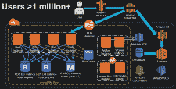

# 在 Amazon AWS 上扩展至 1100 万以上用户的入门指南

> 原文： [http://highscalability.com/blog/2016/1/11/a-beginners-guide-to-scaling-to-11-million-users-on-amazons.html](http://highscalability.com/blog/2016/1/11/a-beginners-guide-to-scaling-to-11-million-users-on-amazons.html)

您如何将系统从一个用户扩展到超过 1100 万用户？ [Joel Williams](https://www.linkedin.com/in/joel-williams-70257b7) ，亚马逊网络服务解决方案架构师，就该主题发表了精彩的演讲： [AWS re：Invent 2015 扩展到您的前 1000 万用户](https://www.youtube.com/watch?v=vg5onp8TU6Q&list=PLhr1KZpdzukdRxs_pGJm-qSy5LayL6W_Y)。

如果您是 AWS 的高级用户，那么本演讲不适合您，但是如果您是 AWS 的新手，云的新手或的入门者，那么这是上手的好方法 不断涌现的新功能 Amazon 不断涌现。

正如您可能期望的那样，由于这是 Amazon 的一次讲话，因此 Amazon 服务始终是解决任何问题的中心。 他们的平台表现令人印象深刻且具有启发性。 通过将各个部分组合在一起，很明显，亚马逊在确定用户需求并确保他们拥有该领域的产品方面做得非常出色。

一些有趣的外卖：

*   从 SQL 开始，仅在必要时移至 NoSQL。
*   一致的主题是将组件分离出来。 这使这些组件可以独立扩展和失败。 它适用于拆分层并创建微服务。
*   仅投资于使您的企业与众不同的任务，不要重蹈覆辙。
*   可伸缩性和冗余不是两个独立的概念，您通常可以同时进行。
*   没有提及费用。 这将是演讲的一个很好的补充，因为这是对 AWS 解决方案的主要批评之一。

## 基础知识

*   AWS 在全球 12 个地区中。

    *   区域是世界上亚马逊具有多个可用区的物理位置。 中有 [地区：北美； 南美洲; 欧洲; 中东; 非洲; 亚太地区。](https://aws.amazon.com/about-aws/global-infrastructure/)

    *   可用区（AZ）通常是单个数据中心，尽管它们可以由多个数据中心构成。

    *   每个可用区都足够独立，因此它们具有独立的电源和 Internet 连接。

    *   可用区之间的唯一连接是低延迟网络。 例如，可用区可以相隔 5 或 15 英里。 网络足够快，您的应用程序就可以像所有可用区都在同一个数据中心中一样工作。

    *   每个区域至少有两个可用区。 共有 32 个可用区。

    *   使用可用区可以为您的应用程序创建高可用性架构。

    *   2016 年将至少有 9 个可用区和 4 个地区。

*   AWS 在全球拥有 53 个边缘位置。

    *   边缘位置由 Amazon 的内容分发网络（CDN）CloudFront 和 Amazon 的托管 DNS 服务器 Route53 使用。

    *   边缘位置使用户无论身在何处都可以以极低的延迟访问内容。

*   构建基块服务

    *   AWS 创建了许多服务，这些服务在内部使用多个可用区来实现高可用性和容错能力。 [是其中](https://aws.amazon.com/about-aws/global-infrastructure/regional-product-services/) [提供哪些服务的列表](http://docs.aws.amazon.com/general/latest/gr/rande.html) ，其中 可用。

    *   您可以付费在应用程序中使用这些服务，而不必担心使它们自己高度可用。

    *   可用区内存在的一些服务：CloudFront，Route 53，S3，DynamoDB，弹性负载平衡，EFS，Lambda，SQS，SNS，SES，SWF。

    *   即使服务位于单个 AZ 中，也可以使用服务创建高可用的体系结构。

## 1 个用户

*   在这种情况下，您是唯一的用户，并且您要运行一个网站。

*   您的架构将类似于：

    *   在单个实例上运行，可能是 [t2.micro](http://docs.aws.amazon.com/AWSEC2/latest/UserGuide/t2-instances.html) 类型。 实例类型包括 CPU，内存，存储和网络容量的各种组合，使您可以灵活地为应用程序选择适当的资源组合。

    *   一个实例将运行整个 [Web 堆栈]( http://whatis.techtarget.com/definition/Web-stack) ，例如：Web 应用程序，数据库，管理等。

    *   将 Amazon [路由 53](https://aws.amazon.com/route53/) 用作 DNS。

    *   将单个 [弹性 IP](http://docs.aws.amazon.com/AWSEC2/latest/UserGuide/elastic-ip-addresses-eip.html) 地址附加到实例。

    *   运作良好，持续了一段时间。

## 垂直缩放

*   您需要一个更大的盒子。 最简单的扩展方法是选择更大的实例类型。 例如，也许 [c4.8xlarge](http://docs.aws.amazon.com/AWSEC2/latest/UserGuide/c4-instances.html) 或 [m3.2xlarge](https://aws.amazon.com/ec2/instance-types/) 。

*   这种方法称为 [垂直缩放](https://en.wikipedia.org/wiki/Scalability) 。

*   只需停止实例并选择一种新的实例类型，您就可以以更高的功率运行。

*   有多种不同的硬件配置可供选择。 您可以拥有一个带有 244 GB RAM 的系统（即将推出 2TB RAM 类型）。 或一个 40 核。 有高 I / O 实例，高 CPU 实例，高存储实例。

*   某些 Amazon 服务随附 [预置 IOPS](http://serverfault.com/questions/580568/amazon-how-do-i-know-if-i-need-provisioned-iops) 选项，以确保性能。 这个想法是，您也许可以为服务使用较小的实例类型，并利用 DynamoDB 之类的 Amazon 服务来提供可扩展的服务，因此您不必这样做。

*   垂直扩展存在一个大问题：没有故障转移，也没有冗余。 如果实例出现问题，则您的网站将死亡。 你所有的鸡蛋都放在一个篮子里。

*   最终，单个实例只能变得如此之大。 您需要做其他事情。

## 用户> 10

*   将单个 主机分离为多个主机

    *   该网站的主机。

    *   数据库的一台主机。 运行所需的任何数据库，但是您需要进行数据库管理。

    *   使用单独的主机可以使网站和数据库彼此独立地扩展。 例如，也许您的数据库将需要比网站更大的计算机。

*   或者，也可以使用数据库服务代替运行自己的数据库。

    *   您是数据库管理员吗？ 您真的要担心备份吗？ 高可用性？ 补丁？ 操作系统？

    *   使用服务的一大优势在于，您只需单击即可设置多个可用区数据库。 您无需担心复制或任何此类事情。 您的数据库将高度可用且可靠。

*   您可能会想像到亚马逊有几项完全托​​管的数据库服务可以卖给您：

    *   [Amazon RDS](https://aws.amazon.com/rds/) （关系数据库服务）。 有很多选项：Microsoft SQL Server，Oracle，MySQL，PostgreSQL，MariaDB，Amazon Aurora。

    *   [Amazon DynamoDB](https://aws.amazon.com/dynamodb/) 。 NoSQL 管理的数据库。

    *   [Amazon Redshift](https://aws.amazon.com/redshift/) 。 PB 级数据仓库系统。

*   更多 [Amazon Aurora](https://aws.amazon.com/rds/aurora/) ：

    *   自动存储扩展到 64TB。 您不再需要为数据配置存储。

    *   最多 15 个读只读副本

    *   连续（增量）备份到 S3。

    *   跨 3 个 AZ 进行 6 向复制。 这可以帮助您处理故障。

    *   MySQL 兼容。

*   从 SQL 数据库而不是 NoSQL 数据库开始。

    *   建议从 SQL 数据库开始。

    *   该技术已建立。

    *   有很多现有的代码，社区，支持小组，书籍和工具。

    *   您不会破坏前 1000 万用户的 SQL 数据库。 差远了。 （除非您的数据很大）。

    *   清晰的模式可扩展。

*   您何时需要从 NoSQL 数据库开始？

    *   如果您需要在第一年存储 5 TB 的>数据，或者您的数据处理工作量非常大。

    *   您的应用程序具有超低延迟要求。

    *   您需要非常高的吞吐量。 您需要真正调整在读取和写入中都得到的 IO。

    *   您没有任何关系数据。

## 用户> 100

*   将 单独的主机用于 Web 层 。

*   将 数据库存储在 Amazon RDS 上。 它照顾一切。

*   这就是您要做的。

## 用户> 1000

*   按照架构，您的应用程序存在可用性问题。 如果您的 Web 服务主机出现故障，则您的网站将关闭。

*   因此，您 在另一个可用区 中需要另一个 Web 实例。 可以，因为 AZ 之间的等待时间只有几位毫秒，几乎就像它们彼此相邻一样。

*   您还需要一个 从属数据库到在另一个 AZ 中运行的 RDS 。 如果主服务器有问题，您的应用程序将自动切换到从属服务器。 故障转移无需对应用程序进行任何更改，因为您的应用程序始终使用相同的端点。

*   弹性负载均衡器（ELB）已添加到配置中，以在两个可用区中的两个 Web 主机实例之间负载均衡用户。

*   弹性负载平衡器（ELB）：

    *   ELB 是高度可用的托管负载均衡器。 ELB 存在于所有可用区中。 它是您的应用程序的单个 DNS 终结点。 只需将其放在 Route 53 中，它将在您的 Web 主机实例之间实现负载平衡。

    *   ELB 具有运行状况检查，以确保流量不会流向发生故障的主机。

    *   无需任何操作即可缩放。 如果看到额外的流量，它将在水平和垂直方向上扩展到幕后。 您不必管理它。 随着应用程序规模的扩展，ELB 也随之扩展。

## 用户> 10,000s-100,000s

*   先前的配置在 ELB 后面有 2 个实例，实际上，您可以在 ELB 后面有 1000 个实例。 这是 [水平缩放](https://en.wikipedia.org/wiki/Scalability) 。

*   您需要向数据库和 RDS 添加更多只读副本。 这将减轻写主机的负担。

*   通过将 通过将一些流量转移到其他地方来减轻 Web 层 服务器的负载，从而考虑性能和效率。 将 Web 应用程序中的静态内容移动到 Amazon S3 和 Amazon CloudFront。 CloudFront 是 Amazon 的 CDN，可将您的数据存储在全球 53 个边缘位置。

*   Amazon S3 是对象库。

    *   它与 EBS 不同，它不是连接到 EC2 实例的存储，而是对象存储，而不是块存储。

    *   这是存储静态内容（如 javascript，css，图像，视频）的好地方。 此类内容无需位于 EC2 实例上。

    *   高度耐用，可靠性 11 9。

    *   无限扩展，可根据需要抛出尽可能多的数据。 客户在 S3 中存储多个 PB 的数据。

    *   支持最大 5TB 的对象。

    *   支持加密。 您可以使用 Amazon 的加密，您的加密或加密服务。

*   Amazon CloudFront 缓存了您的内容。

    *   它在边缘位置缓存内容，以为用户提供尽可能低的延迟访问。

    *   如果没有 CDN，您的用户将遇到对您的内容的更高延迟访问。 您的服务器在提供内容以及处理 Web 请求时也将承受更高的负载。

    *   一位客户需要以 60 Gbps 的速度提供内容。 网络层甚至都不知道这是怎么回事，CloudFront 处理了所有事情。

*   您还可以通过将会话状态移出 Web 层来减轻负载。

    *   将会话状态存储在 [ElastiCache](https://aws.amazon.com/elasticache/) 或 DynamoDB 中。

    *   这种方法还可以设置系统以支持将来的自动缩放。

*   您还可以通过将数据从数据库缓存到 ElastiCache 中来减轻负载。

    *   您的数据库不需要处理所有数据获取。 缓存可以处理很多工作，而数据库则可以处理更重要的流量。

*   Amazon DynamoDB-托管的 NoSQL 数据库

    *   您可以配置所需的吞吐量。 您可以提高要支付的读写性能。

    *   支持快速，可预测的性能。

    *   完全分布式且具有容错能力。 它存在于多个可用区中。

    *   这是一个键值存储。 支持 JSON。

    *   支持最大 400KB 的文档。

*   Amazon Elasticache-托管的 Memcached 或 Redis

    *   管理内存缓存集群并不能为您带来更多收益，因此让 Amazon 为您做到这一点。 那就是球场。

    *   将自动为您缩放群集。 这是一种自我修复的基础架构，如果节点发生故障，则会自动启动新节点。

*   您还可以通过将动态内容转移到 CloudFront 来减轻负载。

    *   许多人都知道 CloudFront 可以处理静态内容（例如文件），但也可以处理一些动态内容。 谈话中没有进一步讨论该主题，但这里的 [链接](https://aws.amazon.com/cloudfront/dynamic-content/) 。

## [自动缩放](https://aws.amazon.com/autoscaling/)

*   如果您提供足够的容量来始终处理高峰流量，例如黑色星期五，那是在浪费钱。 将计算能力与需求匹配起来会更好。 这就是 Auto Scaling 的工作，即自动调整计算群集的大小。

*   您可以定义池的最小和最大大小。 作为用户，您可以确定集群中最少的实例数和最多的实例数。

*   [CloudWatch](https://aws.amazon.com/cloudwatch/) 是一项管理服务，已嵌入到所有应用程序中。

    *   CloudWatch 事件驱动扩展。

    *   您要扩展 CPU 使用率吗？ 您要扩展延迟吗？ 在网络流量上？

    *   您也可以将自己的自定义指标推送到 CloudWatch。 如果要按特定的应用程序扩展，可以将该指标推送到 CloudWatch，然后告诉 Auto Scaling 您要按该指标扩展。

## 用户> 500,000+

*   从先前配置中添加的是 [自动缩放组](http://docs.aws.amazon.com/gettingstarted/latest/wah/getting-started-create-as.html) 已添加到 Web 层 。 自动缩放组包括两个 AZ，但可以扩展到 3 个 AZ，最多可以位于同一区域。 实例可以在多个可用区中弹出，不仅是为了实现可伸缩性，还在于可用性。

*   该示例在每个可用区中都有 3 个 Web 层实例，但可能是数千个实例。 您可以说您要最少 10 个实例，最多 1000 个实例。

*   ElastiCache 用于卸载数据库中的流行读取。

*   DynamoDB 用于卸载会话数据。

*   您需要添加监视，指标和日志记录。

    *   主机级别指标。 查看自动扩展组中的单个 CPU 实例，找出问题所在。

    *   聚合级别指标。 查看 Elastic Load Balancer 上的指标，以了解整个实例集的性能。

    *   日志分析。 查看应用程序使用 [CloudWatch](https://aws.amazon.com/about-aws/whats-new/2014/07/10/introducing-amazon-cloudwatch-logs/) 日志告诉您什么。 [CloudTrail](https://aws.amazon.com/cloudtrail/) 可帮助您分析和管理日志。

    *   外部站点性能。 了解您的客户看到的最终用户。 使用新遗物或 Pingdom 之类的服务。

*   您需要知道客户在说什么。 他们的延迟不好吗？ 他们转到您的网页时会收到错误消息吗？

*   尽可能从配置中压缩性能。 Auto Scaling 可以提供帮助。 您不希望 CPU 使用率达到 20％的系统。

## 自动化

*   基础架构越来越大，可以扩展到数千个实例。 我们已经阅读过副本，可以水平缩放，但是我们需要一些自动化来帮助管理所有内容，我们不想管理每个实例。

*   自动化工具具有层次结构。

    *   自己做 ：Amazon EC2，AWS CloudFormation。

    *   更高级别的服务 ：AWS Elastic Beanstalk，AWS OpsWorks

*   [AWS Elastic Beanstalk](https://aws.amazon.com/elasticbeanstalk/) ：自动管理应用程序的基础架构。 这很方便，但没有太多控制权。

*   [AWS OpsWorks](https://aws.amazon.com/opsworks/) ：一个在其中分层构建应用程序的环境，您可以使用 Chef 食谱来管理应用程序的层。

    *   还使您能够进行持续集成和部署。

*   [AWS CloudFormation](https://aws.amazon.com/cloudformation/) ：使用时间最长。

    *   提供了最大的灵活性，因为它提供了堆栈的模板化视图。 它可以用于构建整个堆栈或仅堆栈的组件。

    *   如果要更新堆栈，请更新 Cloud Formation 模板，它将仅更新应用程序的这一部分。

    *   有很多控制权，但不太方便。

*   [AWS CodeDeploy](https://aws.amazon.com/codedeploy/) ：将代码部署到一组 EC2 实例。

    *   可以部署到一个或数千个实例。

    *   代码部署可以指向自动扩展配置，因此代码可以部署到一组实例。

    *   也可以与 Chef 和 Puppet 结合使用。

## 解耦基础架构

*   使用 [SOA](https://en.wikipedia.org/wiki/Service-oriented_architecture) / [微服务](http://techblog.netflix.com/2015/02/a-microscope-on-microservices.html) 。 从您的层中取出组件并将它们分开。 创建单独的服务 ，就像将 Web 层与数据库层分开一样。

*   然后可以独立扩展各个服务。 这为扩展和高可用性提供了很大的灵活性。

*   SOA 是 Amazon 构建的架构的关键组成部分。

*   松耦合使您自由。

    *   您可以分别缩放组件和使组件失败。

    *   如果工作程序节点无法从 SQS 提取工作，这有关系吗？ 不，只是开始另一个。 事情将会失败，让我们建立一个处理失败的架构。

    *   将所有内容设计为黑匣子。

    *   解耦交互。

    *   支持具有内置冗余和可伸缩性的服务，而不是自己构建。

## 不要重新发明轮子

*   仅投资于使您的业务与众不同的任务。

*   亚马逊拥有许多固有的容错服务，因为它们跨越多个可用区。 例如：排队，电子邮件，代码转换，搜索，数据库，监视，指标，日志记录，计算。 您不必自己构建这些。

*   [SQS](https://aws.amazon.com/sqs/) ：排队服务。

    *   提供的第一个 Amazon 服务。

    *   它跨越多个可用区，因此具有容错能力。

    *   它具有可扩展性，安全性和简单性。

    *   排队可以通过帮助您在基础结构的不同组件之间传递消息来帮助您的基础结构。

    *   以 Photo CMS 为例。 收集照片并对其进行处理的系统应该是两个不同的系统。 他们应该能够独立扩展。 它们应该松耦合。 摄取照片并将其放入队列中，工作人员可以将照片从队列中拉出并对其进行处理。

*   [AWS Lambda](https://aws.amazon.com/lambda/) ：您可以在不配置或管理服务器的情况下运行代码。

    *   出色的工具，可让您解耦应用程序。

    *   在 Photo CMS 示例中，Lambda 可以响应 S3 事件，因此，当添加 S3 文件时，将自动触发要处理的 Lambda 函数。

    *   我们已经取消了 EC2。 它可以为您进行扩展，并且无需管理任何操作系统。

## 用户> 1,000,000+

*   要达到一百万个以上的用户，则需要满足以上所有条件：

    *   多可用区

    *   层之间的弹性负载平衡。 不仅在 Web 层上，而且在应用程序层，数据层和您拥有的任何其他层上。

    *   自动缩放

    *   面向服务的体系结构

    *   使用 S3 和 CloudFront 巧妙地服务内容

    *   将缓存放在数据库前面

    *   将状态移出 Web 层。

*   使用 [Amazon SES](https://aws.amazon.com/ses/) 发送电子邮件。

*   使用 CloudWatch 进行监视。

## 用户> 10,000,000+

*   随着规模的扩大，我们会遇到数据层的问题。 与 [写入主机](https://en.wikipedia.org/wiki/Multi-master_replication) 争用时，您的数据库可能会遇到问题。 。

*   您如何解决？

    *   联盟

    *   分片

    *   将某些功能移至其他类型的数据库（NoSQL，图形等）

*   联合身份验证-基于功能分为多个 DB

    *   例如，创建一个论坛数据库，一个用户数据库，一个产品数据库。 您以前可能将它们放在单个数据库中，现在将它们分发出去。

    *   不同的数据库可以彼此独立地扩展。

    *   缺点：您无法进行跨数据库查询； 这会延迟进入下一个分片策略。

*   分片-在多个主机之间拆分一个数据集

    *   在应用层更加复杂，但是对可伸缩性没有实际限制。

    *   例如，在用户数据库中，用户的⅓可能会发送到一个分片，最后三分之一发送到另一个分片，另一个分片发送到另外三分之一。

*   将某些功能移至其他类型的数据库

    *   开始考虑 NoSQL 数据库。

    *   如果您的数据不需要排行榜，例如排行榜，快速获取点击流/日志数据，临时数据，热点表，元数据/查找表，则可以考虑将其移至 NoSQL 数据库。

    *   这意味着它们可以彼此独立缩放。

## 用户> 1100 万

*   缩放是一个迭代过程。 随着您变得更大，总会有更多您可以做。

*   微调您的应用程序。

*   更多 SOA 的功能/特性。

*   从多可用区转到多区域。

*   开始构建自定义解决方案，以解决您以前从未有人做过的特定问题。 如果您需要为十亿客户提供服务，则可能需要定制解决方案。

*   深入分析整个堆栈。

## 审核中

*   使用多可用区基础结构来提高可靠性。

*   利用自扩展服务，例如 ELB，S3，SQS，SNS，DynamoDB 等。

*   在每个级别构建冗余。 可伸缩性和冗余不是两个独立的概念，您通常可以同时进行。

*   从传统的关系 SQL 数据库开始。

*   在基础结构内部和外部缓存数据。

*   在基础架构中使用自动化工具。

*   确保您具有良好的指标/监视/日志记录。 确保您正在查找客户对应用程序的体验。

*   将层划分为单独的服务（SOA），以便它们可以彼此独立地扩展和失败。

*   准备使用自动缩放功能。

*   除非绝对必要，否则不要重新发明轮子，而是使用托管服务而不是自己编写代码。

*   如果可行，请转移到 NoSQL。

## 延伸阅读

*   [在 HackerNews](https://news.ycombinator.com/item?id=10885727) 上/ [在 Reddit](https://www.reddit.com/r/sysadmin/comments/40hon7/a_beginners_guide_to_scaling_to_11_million_users/) 上

*   [http://aws.amazon.com/documentation](http://aws.amazon.com/documentation/)

*   [http://aws.amazon.com/architecture](http://aws.amazon.com/architecture/)

*   [http://aws.amazon.com/start-ups](http://aws.amazon.com/start-ups)

*   [http://aws.amazon.com/free](http://aws.amazon.com/free)

*   从 2007 年开始： [Amazon Architecture](http://highscalability.com/blog/2007/9/18/amazon-architecture.html)

不错的文章。 请更正用于启动的链接。 （对 http：//aws.amazon.comstart-ups 的开放应该是 http://aws.amazon.com/start-ups/）

即使对于可伸缩性专业人员来说，这也是一篇出色的，易于上手的文章。 做得好

此设置每月将耗费疯狂的$。 AWS 是一种将 VC 美元间接注入亚马逊银行账户的好方法。

如果人们实际上对 TCO / ROI 持认真态度，那么人们就必须停止对价格过高的 VM 的炒作，而回到裸机解决方案。

这是非常依赖于应用程序的，但是对于每个级别的用户，可以期望每秒钟的事务/请求范围是多少？

@帕特里克

是的，但是没有。

正是在这个主题上，我们进行了荒谬的成本分析。 实际上，在我们系统运营的每个领域中，AWS 都能为我们节省大量资金。 某些 AWS 服务的成本仅为内部成本的 1/3。

每当您看到整个世界都朝着某种趋势发展时，尤其是当该“世界”主要由聪明人和百万富翁（他们真的很喜欢保留/赚钱）组成时，您应该假设其可能不仅仅是“炒作”或 “时尚”。

五年前的数字有所不同，但是自那时以来，AWS 已将价格降低了一半或更多。 除非您的计算器坏了，否则我将很难得出任何其他结论。

我的经验主要是在 AWS ..上，但是 Google 的云的价格相当，并且我认为其他 IaS 和 PaS 提供商的价格差异可以忽略不计。

所以，我的建议是：仔细看..然后跳上马车或开始计划退休

AWS CloudFormation 的问题一直是大型 JSON 脚本的笨拙-没有一致的添加注释的方式，笨拙的模块化故事以及没有向后引用。

通过使用 yaml 编写模板，然后使用 [YAML Stratus](https://github.com/kikinteractive/yaml-stratus) 转换为所需的 JSON，我们一直在解决此问题。 Yaml 支持注释，向后引用，并且 yaml stratus 添加 yaml 扩展以包括其他具有覆盖的 yaml 脚本以及编译时参数化。

@卢克·查弗斯

是的，但是你错了。

AWS 总是比裸机中的裸机贵，大约是 10 到 100 倍。 部署这样的复杂设置（更糟糕的是，大多数应用程序永远都不需要）时，情况更糟。

Modern 的速度非常快，基本的中型服务器每天可以支持数百万个请求，而将高可用性加倍则很便宜。 即使在云中，除非您确实需要，最好还是坚持使用基本 VM 而不是所有托管服务。

从您的评论来看，好像是您的计算器坏了，或者您只是在为 AWS 工作。

我有点不同意 RDS 观点。 如果您甚至具有基本的 db-administraton 技能，请不要使用 RDS。AmazonsRDS 对数据库使用 EBS 驱动器的速度非常非常慢。一种更好的方法是将实例存储 SSD 驱动器用于您不需要的临时存储物 需要持久化（tempdb，事务日志（如果您知道自己在做什么以及如何在没有日志的情况下还原数据库）等）。

除了我的这个小小的评论-很棒的帖子，谢谢

你好

我已经将 RDS 用于我的应用程序之一，该应用程序处理数百万个实时社交媒体数据。 通过所有优化，我们可以在中等亚马逊实例中使用 mysql mysql 来处理 1 或 2 周的数据。 随着数据量的增长，RDS 是我们关系数据库设计的帮助。

事实是，与普通解决方案相比，这是非常昂贵的，但是当您必须处理潜在的大量数据时，则值得花费。

哈哈@ colo。 当然，如果您喜欢停机和昂贵的带宽费用，请选择合适的颜色！

嘿@Alex：这个[1]说 Amazon RDS 是否支持 SSD？

[1] http://docs.aws.amazon.com/AmazonRDS/latest/UserGuide/CHAP_Storage.html

真正使我担心的是在 AWS 上进行扩展，这就是为什么喜欢 Cloudways 的原因，因为他们可以按比例缩放服务器规模。

非常不错的文章，但我会缓和一个事实，那就是我们应该从 SQL DB 开始，然后将可能的方式切换到 No-SQL。 从 SQL 转换为 No-SQL 可能会非常痛苦（模型转换，业务代码重写，数据迁移等），而且风险很大，您永远也不会做。

因此，我建议您采取以下措施：如果您怀疑您的应用程序将支持超过 10 万个用户（并且您的业务肯定是与 No-SQL 兼容的），请直接使用 No-SQL 数据库。 您将能够轻松进行分片，使用 No-SQL 进行开发并不昂贵，并且您的应用程序可以自然扩展，而无需重新定义体系结构。

让·马克

关于裸机颜色的问题是，您需要考虑所有“成本”。 大多数决定采用裸机的人都严重低估了所需的时间和精力，其中最少的是硬件（但是，假设您使用的是专业质量的服务器硬件，而不是垃圾邮件，那么硬件仍然比您想象的要昂贵得多）。 您当地的回收场）。 特别是，您将需要一个实施团队来进行初始部署，然后*至少*由一名工作人员负责，只负责服务器的维护和维护以及最重要的虚拟化基础架构，每年的费用为 15 万美元以上 仅针对一个人-假设您可以和一个人一起停下来。 然后是数据中心不同区域的机架之间的光纤互连成本（数据中心通常具有电源和网络区域-机架位于不同的 UPS 和路由器上，但​​是如果您想在两个前哨站之间实现 10 GB 的快速互连， 您必须为此支付$$）。 当然，硬件本身的成本-用于互连数据库服务器和计算服务器的 10 吉比特交换机，所需的 10 吉比特卡，以及专业质量好的服务器和企业级 SSD 的价格并不便宜。 我已经为自己的业务工作了一个交叉点，这种交叉点在内部而不是通过亚马逊来进行比较便宜，尽管该交叉点的用户数远远少于 1000 万，但肯定比我们现在花费的更多 在 AWS 服务上。

关于 NoSQL，最好将其用于大量非结构化数据，例如日志数据（例如 ElasticSearch），但是现代 SQL 数据库的 ACID 保证在许多方面都非常重要。 与将 SQL 数据库简单地优化和扩展到所需的位置相比，尝试将它们横向入侵 NoSQL 数据库通常会花费更多的时间。 Twitter 使用 MySQL 处理 1.5 亿活跃用户。 已为您的时间表授予 Redis 缓存和一些自定义复制代码，但仍然：MySQL。

这是一个很棒的帖子！ 我认为在某些时候提高网站效率可能比服务器规模更有效。 例如，有人说通过使用微缓存和 nginx，他们每天可以在微型 VPS 服务器上处理数百万的网页浏览。

但是话又说回来，我从来没有承受过太大的服务器负载，所以我知道什么。

非常有用的信息，请不断更新我们，.....

谢谢。 我是这个领域的初学者。 由于 AWS 昂贵，因此我使用 Linode VPS 进行托管。 这将非常有助于我在上下文中使用。 但是，如果您有关于该/其他廉价服务的经验，请与我们分享，因为 Linode 没有 AWS 提供的一些自动化服务。

人们没有解决一些问题，亚马逊可能会更昂贵，但是每当怀疑/涉及欺诈时，他们的确会听取买卖双方的意见，而 ebay 不会这样做。

超级清晰，写得很好。 谢谢