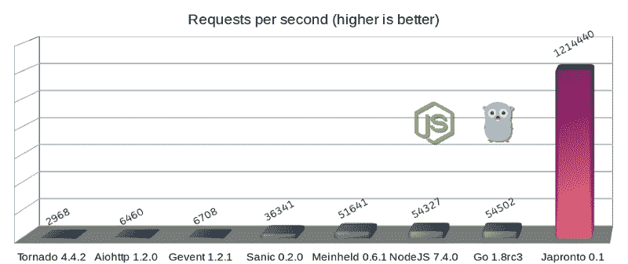
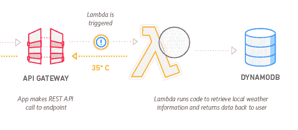
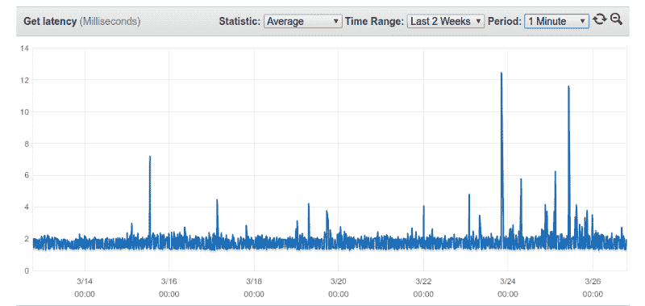
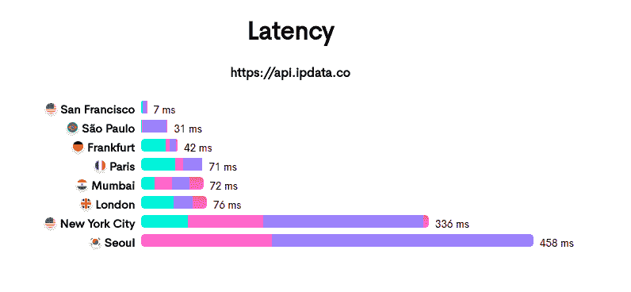
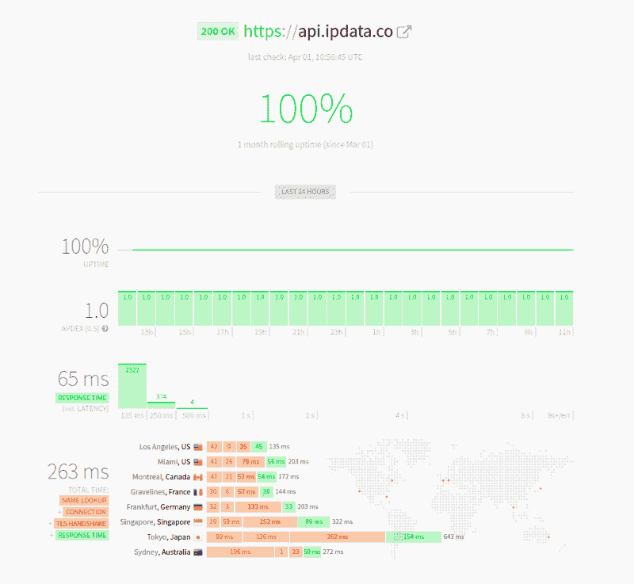
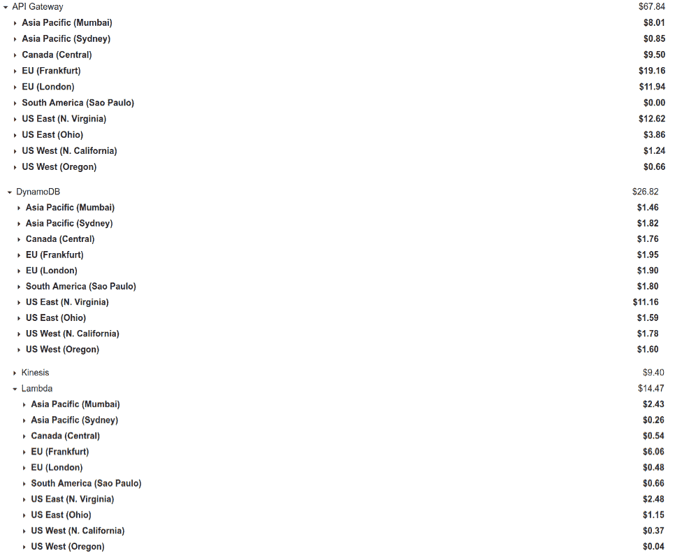

# ipdata 如何以每月 150 美元的价格为来自 10 个无限扩展的全球端点的 2500 万个 API 调用提供服务

> 原文： [http://highscalability.com/blog/2018/4/2/how-ipdata-serves-25m-api-calls-from-10-infinitely-scalable.html](http://highscalability.com/blog/2018/4/2/how-ipdata-serves-25m-api-calls-from-10-infinitely-scalable.html)


*这是 IP 地理位置 API [ipdata](https://ipdata.co/) 的创建者 [Jonathan Kosgei](https://twitter.com/jonathan_trev) 的来宾帖子。*

我在去年的黑色星期五醒来，收到了来自用户的大量电子邮件，报告来自 [ipdata](https://ipdata.co/) API 的 503 错误。

我们的用户通常会在其网站上的每个页面请求上调用我们的 API，以对用户进行地理位置定位和本地化其内容。 因此，这一特殊故障在一年中最大的销售日直接影响了我们用户的网站。

那天我只失去了一个用户，但差点失去了更多。

事件的顺序及其无法解释的性质-cpu，mem 和 i / o 远没有达到容量。 考虑到停机，我们担心扩展规模（如果有的话），这是一个重新考虑现有基础架构的重大呼吁。

## 当时的技术堆栈



*   Japronto Python 框架
*   雷迪斯
*   AWS EC2 节点
*   AWS 弹性负载平衡器
*   基于 Route53 延迟的路由

我已经在几个新的，有希望的 Python 微框架上进行了测试。

在使用 [https://github.com/samuelcolvin/aiohttp-vs-sanic-vs-japronto 对基准 3 进行基准测试后，我在[aiohttp]，[sanic]和[japronto]之间进行选择，选择了](https://github.com/samuelcolvin/aiohttp-vs-sanic-vs-japronto) [Japronto](https://medium.freecodecamp.org/million-requests-per-second-with-python-95c137af319) 。 并发现它具有最高的吞吐量。

该 API 在 ELB 负载平衡器后面 3 个区域中的 3 个 EC2 节点上运行，并具有基于 Route53 延迟的路由，可将请求路由到距离用户最近的区域，以确保低延迟。

## 选择一个新的技术堆栈


An Example Weather API using our current stack

大约在这个时候，我开始认真研究将 API 网关与 AWS Lambda 结合使用的原因：

1.  优惠的价格：API 网关每百万美元约 3.50 美元，AWS Lambda 每百万美元约 0.20 美元。
2.  无限规模和高吞吐量-API API 网关的帐户限制为每秒 10、000 个请求或每天约 864M 调用。 通过打开支持请求可以解除的限制。

这也使在众多 AWS 区域中拥有端点在经济上可行，从而为全球所有用户提供低延迟。

## 设计多区域 API 网关 API

为了使之可行，已经解决了许多架构难题。

1.  每个区域中的每个 lambda 函数都需要能够在同一区域中的数据库中查找使用情况数据，以最大程度地减少延迟
2.  我需要找出一种方法来确定每个 IP 地址，引荐来源网址和 API 密钥进行的 API 调用次数。
3.  一种同步所有区域中的使用情况数据的方法。 例如，如果 Route53 向我们的悉尼端点发送了 10000 个请求，然后决定向其首尔端点发送下一个 50000 个请求（具体取决于那个时间点的网络延迟最小）。 每个 lambda 函数都需要知道用户总共发出了 60 000 个请求才能正确处理速率限制。
4.  授权-API 网关提供使用计划和 API 密钥生成，并允许您将 API 密钥链接到使用计划。 此外，您无需为用户超出配额的请求付费，而无需支付额外费用。 但是，我无法使用此功能，因为对我来说，提供不注册，不使用信用卡的免费套餐非常重要。

通过大量的工作，我能够以创造性的方式解决这些问题。

## 在本地访问使用情况数据（针对每个 lambda 函数）

显而易见的解决方案是使用 Dynamodb，它在规模和速度上都具有成本效益！ 每月前 200M 个请求免费。

Dynamodb 还提供 1-2 ms 的始终较低的读取延迟。



可以使用 [Dynamodb Accelarator](https://aws.amazon.com/dynamodb/dax/) （DAX）将其加速到微秒范围。

> DAX 通过每秒数百万个请求处理大量读取工作负载的响应时间（以微秒为单位），将性能提升到一个新的水平。

## 收集所有标识符的使用情况数据

下一个挑战是如何实时计算每个 IP 地址，引荐来源网址或 API 密钥发出的请求数。

最简单，最直接的方法是在每次调用时更新动态表中的计数。

但是，这会在每次调用我们的 API 时引入数据库写操作，从而可能导致显着的延迟。

我能够找到一个简单而优雅的解决方案：

1.  首先，在每个请求上打印包含所有请求标识符的日志（JSON 对象）。 这是 IP 地址，引荐来源网址和 API 密钥（如果存在）。 真是 print（事件）
2.  将 [Cloudwatch 订阅过滤器](https://docs.aws.amazon.com/AmazonCloudWatch/latest/logs/Subscriptions.html)添加到每个区域中每个 Lambda 函数的 Cloudwatch 日志流中，并将所有日志推送到 Kinesis 流中。 这将使我能够处理中心位置中每个区域的日志事件。 由于可以回放事件，因此我选择了 Kinesis 而不是 SQS（亚马逊的简单队列服务）。 SQS 会在使用者读取事件后立即删除事件。 我希望能够从节点故障和数据丢失中恢复。
3.  从 Kinesis 流中读取并使用使用情况数据更新 [Local Dynamodb](https://docs.aws.amazon.com/amazondynamodb/latest/developerguide/DynamoDBLocal.html) 实例
4.  使用 [Dynamodb 跨区域复制库](https://github.com/awslabs/dynamodb-cross-region-library)实时将对我的本地 dynamodb 实例的所有更改实时流式传输到所有区域中的所有表。

## 验证请求

我通过在注册时将密钥复制到每个区域来处理此问题，因此无论用户点击哪个端点，他们点击的 lambda 函数都可以通过在毫秒内检入本地 Dynamodb 表来验证其密钥。 它还可以存储用户的计划配额，并且可以在一次读取中验证密钥，如果密钥存在，则可以获取计划配额以与使用情况进行比较并确定是否接受或拒绝请求。

## 情况如何

今天，我们每月提供 2500 万个 API 调用，每天大约提供 100 万个调用。

它们中的大多数都在 30 毫秒之内，提供了业界最快的基于 SSL 的 IP 地理位置查找。

#### [Hyperping.io](https://hyperping.io/)



### [我们的状态页面](https://updown.io/ndkd)



延迟几乎是开发人员不愿意使用第三方 API 进行 GeoIP 查找的最大原因。

但是，我们的低延迟和冗余的全球基础架构正逐渐将大型企业吸引到我们的服务中。

## 费用



## 经验教训

1.  Cloudwatch 的成本可能出乎意料的高-而不是日志存储-我们只能将 Cloudwatch 日志存储 24 小时。 警报，指标和 cloudwatch 请求确实可以加起来。
2.  在 API 网关上，由于冷启动次数减少，您获得的请求越少，延迟就越低，因此我发现在我们最繁忙的地区（法兰克福）的延迟低至 17 毫秒，而在悉尼等不那么繁忙的区域则只有 40 毫秒。
3.  Dynamodb 的速度快，花费比您想象的要少（或者不，请参阅 [https://segment.com/blog/the-million-dollar-eng-problem/](https://segment.com/blog/the-million-dollar-eng-problem/) ）。 最初，我认为应该按我提供的 RCU 和 WCU 的数量收费。 但是，计费似乎只是标准用法，因此，如果您提供 1000 个 RCU 和 1000 个 WCU，但仅使用 5 个 RCU 和 WCU，则只需要为使用付费。 Dynamodb 定价的这一方面在刚开始时很难确定。
4.  增加 lambda RAM 可以使执行时间减半，并使的响应时间更加一致（同时使您的成本增加一倍！）
5.  Kinesis 已被证明在高吞吐量下非常可靠。 中继我们的所有日志事件以进行近实时处理。
6.  本地 Dynamodb 仅受系统资源的限制，这使其非常适合运行表扫描或查询（例如，在生成报告时），否则这些扫描或查询在 AWS 的 Dynamodb 上进行将非常昂贵。 请记住，Local Dynamodb 实际上只是 SQLite 周围的 Dynamo 包装:)。 对于我们的用例来说，它既有用又方便，但对您而言可能并非如此。

## 笔记

*   AWS 去年在 Re：invent 上宣布了 Dynamodb Global 表，该表将所有表（“跨区域”）中的所有写入彼此同步。 我们目前不打算使用此功能，因为它仅在 5 个地区提供。
*   亚马逊还推出了`REQUEST`类型的自定义授权者。 这可能使您可以通过 IP 地址以及任何标头，查询或路径参数对速率进行限制。

[关于 HackerNews](https://news.ycombinator.com/item?id=16745376)

您的 DynamoDB 成本令人惊讶是因为默认情况下启用了“自动缩放”以读取/写入卷。 只要您的峰值不大，就永远不会看到配置错误...

我对此声明感到困惑：

-----
我最初以为我要提供的 RCU 和 WCU 数量付费。 但是，计费似乎只是标准用法，因此，如果您提供 1000 个 RCU 和 1000 个 WCU，但仅使用 5 个 RCU 和 WCU，则只需要为使用付费。 Dynamodb 定价的这一方面在刚开始时很难确定。
-----

定价页面（https://aws.amazon.com/dynamodb/pricing/）指出，您需要为您提供的吞吐量付费

也许因为仍在免费套餐中而未向您收费？

嘿 Cads，

我完全理解混乱，我也和您一样。

但是我很确定我们不在免费领域，因为我们要为 Dynamodb 付费。

而且，我们只收取使用费用，并不超出表中的规定。

这似乎与亚马逊的定价页面上所说的相反，但这是我在 AWS 账单上看到的。

感谢您的有趣文章。 关于本地 DynamoDB，我有一个问题：您在哪里运行此程序？ 作为 EC2 实例？

嗨 Tobi，

谢谢！ 我实际上在 Azure 节点上运行它。 但是，它可以作为实例在 DO 或 EC2 上运行。

该图显然是不真诚的。 从来没有太大的区别。 在这种情况下，可能是因为作者只是在测试管道而不是没有管道。 此外，他将 go pro 限制为 1 cpu。 同样，仓库也不再存在。 我把废话统称为“基准”。

顺便说一句，Japronto 主要是 C，请检查代码。

（我偏向于 Go，但是这不像 node，其他人无法应付自己）

我记得在中篇文章上有很多类似的评论，请参阅 https://medium.freecodecamp.org/million-requests-per-second-with-python-95c137af319

我还能够找到另一个基准，使 japronto 紧随 Rust
https://github.com/tbrand/which_is_the_fastest

每月 2500 万个请求是每秒 10 个请求...

每秒高峰请求呢？

写得很好的文章。 感谢您分享您的体验。 我对以下部分有疑问：

“首先，在每个请求上打印一个带有所有请求标识符的日志（JSON 对象）。这是 IP 地址，引荐来源网址和 API 密钥（如果存在的话）。确实是;```print（event）```“

只是想知道为什么不将这些消息直接发送给运动机能？ 为什么要先登录？

Esko，API 网关可以处理 10k req / s 的峰值

Kaivalya，这会为用户带来延迟，打印日志是最便宜的（就延迟而言）和最简单的解决方案。

> > SQS 会在使用者读取事件后立即将其删除。
这是不正确的，一旦您从 SQS 读取了一条消息，直到可见性超时，任何人都看不到它。 您需要确认对 SQS 的读取，以便它可以删除消息。 我们通常要做的是处理消息，然后仅在处理实例发生故障的情况下进行确认，这样我们的消息仍然完好无损。 只需调整可见性超时以确保提供足够的时间即可。

很棒的文章。 感谢您与社区分享。

嗨，您如何处理每秒 1,000 个 Lambda 呼叫限制？ AWS 的架构师建议我们不要在具有高使用率和高并发性的大多数项目中使用 Lambda-他们说，这仅对中小型项目更好，并且没有您所说的无限规模-我们被告知的一个大问题 当以最大速度运行时，AWS 团队将耗尽 VPC 中所有可用的 IP 地址。 超出 1,000 个限制的呼叫也会被拒绝，您的客户也会出错。

为了计算并发执行的次数，我们使用公式：

每秒事件（或请求）数*功能持续时间

如 https://docs.aws.amazon.com/lambda/latest/dg/scaling.html 所记录。
自这篇文章上线以来，我们平均每天平均有 2M API 调用，大约每秒 12 次。我们的最大 lambda 使用上面公式中的值，调用时间为 20ms；

12 * 0.020

我们得到的并发级别为 0.24。

这意味着我们可以在目前的 1000 lambda 调用限制下，每秒处理 50，000 个请求，每天约 43.2 亿个请求。

嗨，
单个订户的运动流事件有多个订户吗？
只是想知道为什么如果所有数据都存储在一个中央（本地）dynamo 数据库实例中，则跨区域 dynamo 数据库进行复制。

因此，您为 9 req / s 支付 150 美元？

对于许可证密钥检查，您是否考虑过使用 Bloom 或 Cuckoo 过滤器？ 您可以将过滤器保存在内存中，并避免数据库调用。

首次使用 ipdata.co 的用户，我们最近切换到了另一个 IP 地理位置提供商。 延迟在过去几个月中增加了很多，并且在全球范围内不一致（请参阅 https://status.ipdata.co/）。 此外，该服务缺少监视仪表板。

如果您处于类似情况，我建议尝试 Ipregistry（https://ipregistry.co），其全局端点延迟实在令人难以置信（https://status.ipregistry.co/）！ 我联系了他们的支持，建议在此博客上写一篇文章，因为他们的体系结构可能很有趣。