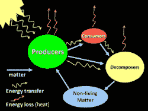

# Google 和 eBay 关于构建微服务生态系统的深刻教训

> 原文： [http://highscalability.com/blog/2015/12/1/deep-lessons-from-google-and-ebay-on-building-ecosystems-of.html](http://highscalability.com/blog/2015/12/1/deep-lessons-from-google-and-ebay-on-building-ecosystems-of.html)

当您查看 Google，Twitter，eBay 和 Amazon 的大型系统时，它们的体系结构已演变为类似的东西：**一组多语言微服务**。

当您处于多语言微服务最终状态时，会是什么样？ [Randy Shoup](https://www.linkedin.com/in/randyshoup) 曾在 Google 和 eBay 的高层职位上进行过非常有趣的演讲，探讨了这个想法：[大规模服务体系结构：Google 和 eBay 的经验](http://www.infoq.com/presentations/service-arch-scale-google-ebay)。

我真正喜欢 Randy 的演讲的是，他如何自我意识地使您沉浸于您可能没有经验的事物的体验中：创建，使用，持久化和保护大型体系结构。

在演讲的*服务生态系统*部分中，Randy 问：拥有一个多语言微服务的大规模生态系统看起来像什么？ 在*大规模运营服务*部分中，他问：作为服务提供商，运营这样的服务感觉如何？ 在*建立服务*部分中，他问：当您是服务所有者时，它是什么样的？ 在 *Service Anti-Patterns* 部分中，他问：哪里会出问题？

一个非常强大的方法。

对我来说，这次演讲的重点是**，**，**激励动机，**，一致主题的想法，这些主题贯穿了整个工作。 尽管从来没有明确地提出将其作为单独的策略，但这是为什么您希望小型团队开发小型清洁服务，内部服务的收费模型如此强大，架构如何在没有架构师的情况下可以发展，清洁设计可以如何发展的背后动机。 从下至上的过程，以及没有中央委员会如何发展标准。

我的收获是**动机的故意调整是您如何扩展大型动态组织和大型动态代码库**。 引入适当的激励措施[会使](https://en.wikipedia.org/wiki/Nudge_(book))事情在没有显式控制的情况下发生，几乎就像在删除锁，不共享状态，与消息进行通信并并行化所有内容时，分布式系统中的更多工作一样 。

让我们看看现代系统是如何构建大规模系统的。

## 多语言微服务是终局游戏

*   大型系统最终演变成看起来非常相似的东西： **一组多语言微服务** 。 多种语言意味着微服务可以用多种语言编写。

*   **eBay** 成立于 1995 年。根据您的计算方式，它们属于其体系结构的第 5 代。

    *   最初是创始人在 1995 年劳动节周末写的一个整体式 Perl 应用程序。

    *   然后，它移至一个整体的 C ++应用程序，最终在单个 DLL 中包含了 340 万行代码。

    *   以前的经验促使人们转向 Java 中分布更分散的分区系统。

    *   当今的 eBay 具有相当多的 Java，但是一组多语言的微服务。

*   **Twitter** 的演变非常相似。 根据您的计算方式，它们取决于其体系结构的第三代。

    *   开始于单片 Ruby on Rails 应用程序。

    *   在前端转移到 Javascript 和 Rails 的组合，在后端转移了很多 Scala。

    *   最终，他们已经迁移到我们今天所说的一套多语言微服务。

*   **Amazon** 遵循类似的路径。

    *   从单片 C ++应用程序开始。

    *   然后用 Java 和 Scala 编写的服务。

    *   最后得到了一组多语言微服务。

## 服务生态系统

*   拥有多语种微服务的大规模生态系统看起来如何？

*   在 eBay 和 Google 上，成百上千的独立服务一起工作。

    *   现代大型系统以关系图而不是层次结构或层级集合来构成服务。

    *   服务依赖于许多其他服务，同时又依赖于许多服务。

    *   较旧的大型系统通常按严格的等级进行组织。

### 如何创建服务生态系统？

*   这些性能最佳的系统比智能设计更是进化的**产品。 例如，在 Google，从来没有一个集中的自上而下的系统设计。 随着时间的流逝，它以一种非常有机的方式进化和成长。**

*   变异和自然选择。 当需要解决问题时，会创建新服务，或更经常地从现有服务或产品中提取新服务。 **服务只要被使用**就可以生存，只要它们能够提供价值，否则它们将被弃用。

*   这些大型系统**从下至上**发展。 **干净的设计可以是一种紧急特性，而不是自上而下的设计**的产物。

*   作为示例，请考虑 Google App Engine 的一些服务分层。

    *   Cloud Datastore（NoSQL 服务）基于 Megastore（地理规模结构化数据库），Megastore 基于 Bigtable（集群级结构化服务）构建，Bigtable 基于 Colossus（下一代集群文件系统）构建 ）（基于 Borg（集群管理基础架构）构建）。

    *   分层很干净。 每个图层都会添加不属于下方图层的内容。 它不是自上而下设计的产品。

    *   它是自下而上构建的。 Colossus，首先建立了 Google 文件系统。 几年后，Bigtable 建成了。 几年后，Megastore 建成了。 几年后，云数据库迁移到 Megastore。

    *   如果没有自上而下的体系结构，则可以将关注点分离得如此美妙。

*   **这是没有架构师**的体系结构。 Google 的所有人都没有 Architect 的头衔。 技术决策没有中央批准。 大多数技术决策是由各个团队根据自己的目的在本地做出的，而不是全球范围内做出的。

*   与 2004 年的 eBay 形成对比。有一个体系结构审查委员会，该委员会必须批准所有大型项目。

    *   通常，只有在更改项目为时已晚时，他们才参与项目。

    *   集中批准机构成为瓶颈。 通常，它唯一的影响是在最后一分钟说不。

*   eBay 处理此问题的更好方法是**在审查委员会中编码聪明有经验的人的知识**，然后将**放入各个团队可以重用的**。 将这些经验编码到一个库或服务中，或者甚至是一组指南，人们可以自己使用它们，而不必在最后一刻才进入流程。

### 没有架构师，标准将如何发展？

*   没有中央控制的**可能最终以**标准化。

    *   服务和公共基础架构之间的通信趋向于发生**标准化。**

    *   标准之所以成为标准，是因为它们比替代的更适合**。**

*   通常标准化的通信部分：

    *   **网络协议**。 Google 使用称为 [Stubby](https://www.quora.com/What-functionality-does-Google-have-around-Protocol-Buffers-that-isnt-included-in-the-current-public-release) 的专有协议。 eBay 使用 REST。

    *   **数据格式**。 Google 使用协议缓冲区。 eBay 倾向于使用 JSON。

    *   **接口模式标准**。 Google 使用协议缓冲区。 对于 JSON，有 JSON 模式。

*   通常标准化的常见基础设施：

    *   源代码控制。

    *   配置管理。

    *   集群管理器。

    *   监视系统。

    *   警报系统。

    *   诊断工具。

    *   所有这些组件都可能脱离约定。

*   在进化环境中，**通过**来实施标准：代码，鼓励，代码审查和代码搜索。

    *   鼓励最佳实践的最简单方法是通过实际代码。 这与自上而下的审查或前期的设计无关，而是与某人产生的代码可以轻松完成工作有关。

    *   鼓励是通过**团队提供一个库**来进行的。

    *   鼓励也是通过您要依赖于支持 X 协议或 Y 协议的服务获得的。

    *   Google 以**闻名，每一行代码**都已签到至少要由另一位程序员检查过的源代码控件**。 这是交流常规做法的好方法。**

    *   除少数例外，Google 的每个工程师都可以**搜索整个代码库**。 当程序员试图弄清楚如何做某事时，这是一个巨大的附加值。 在拥有 1 万名工程师的情况下，您很可能会尝试做某人以前已经做过的事情。 这允许从一个区域开始的**最佳实践通过代码库**传播。 它还允许错误传播。

*   为了鼓励通用做法和标准化约定**，做正确的事情**真的很容易，而做错事情的难度会更大。

*   各个**服务彼此独立。**

    *   Google 没有**来标准化服务内部**。 服务是外面的黑匣子。

    *   存在约定和通用库，但是没有编程语言要求。 通常使用四种语言：C ++，Go，Java，Python。 许多不同的服务都以各种语言编写。

    *   框架或持久性机制尚无标准化。

*   **在成熟的服务生态系统中，我们标准化了图的弧线，而不是节点本身。** 定义一个通用形状，而不是通用实现。

### 创建新服务

*   新服务的使用已得到证实，便会创建它们。

*   通常针对一个特定用例构建了一项功能。 然后发现功能是通用且有用的。

    *   组成了一个团队，并将服务分解为自己的独立单元。

    *   仅当一项功能成功并且适合许多不同的用例时，才会发生这种情况。

*   这些**体系结构通过实用主义**得以发展。 没有人坐在高处，说应该增加一项服务。

*   Google 文件系统支持搜索引擎。 分布式文件系统更普遍可用也就不足为奇了。

*   Bigtable 最初支持搜索引擎，但用途更为广泛。

*   Megastore 是作为 Google 应用程序的存储机制而建立的，但用途更为广泛。

*   Google App Engine 本身由一小组工程师启动，他们认识到需要帮助来构建网站。

*   Gmail 来自内部项目，该项目在内部非常有用，然后被其他人外部化。

### 淘汰旧服务

*   如果不再使用服务会怎样？

*   可以重新利用的技术被重用。

*   人们可以被解雇或重新部署到其他团队。

*   Google Wave 在市场上并不成功，但是其中一些技术最终出现在 Google Apps 中。 例如，多人编辑文档的能力来自 Wave。

*   更常见的情况是核心服务要经过多代，而旧代则已弃用。 Google 经常发生这种情况。 变化是如此之大，以至于 Google 内部的每项服务似乎都已被弃用或尚未准备就绪。

## 建立服务

*   当您是服务所有者时，在多语言微服务的大规模系统中构建服务时会是什么样？

*   大型体系结构中性能良好的服务是：

    *   **通用**。 它将具有一个简单的定义明确的界面。

    *   **模块化且独立的**。 我们可以称之为微服务。

    *   **不共享持久层**。 稍后再详细介绍。

### 服务所有者的目标是什么？

*   **满足客户的需求** 。 以适当的质量级别提供必要的功能，同时满足协商的性能级别，同时保持稳定性和可靠性，同时不断改进服务。

*   **以最小的成本和精力满足需求** 。

    *   该**目标以鼓励**使用通用基础结构**的方式调整激励**。

    *   每个团队的资源有限，因此要利用经过战斗测试的通用工具，流程，组件和服务符合他们的利益。

    *   它还可以激发良好的操作行为。 自动构建和部署服务。

    *   它还鼓励优化资源的有效利用。

### 服务所有者的职责是什么？

*   **生成并运行**。

    *   团队通常是一个小团队，拥有从设计到开发和部署，一直到退休的服务。

    *   没有单独的维护或维护工程团队。

    *   团队可以自由选择自己的技术，方法和工作环境。

    *   团队应对自己做出的选择负责。

*   **服务作为有界上下文**。

    *   团队的**认知负担是有限的**。

    *   无需了解生态系统中的所有其他服务。

    *   团队需要深入了解其服务及其所依赖的服务。

    *   这意味着**团队可以非常小巧和敏捷**。 一个典型的团队是 3-5 人。 （此外，美国海军陆战队 [消防队](https://en.wikipedia.org/wiki/Fireteam) 有四个人。）

    *   较小的团队规模意味着团队内部的通信具有很高的带宽和质量。

    *   康韦定律对您有利。 通过组织小型团队，您最终将只有几个单独的组件。

### 服务之间是什么关系？

*   即使您在同一家公司，也可以将服务之间的**关系视为供应商-客户关系**。

*   要非常友好和合作，但在关系中要有条理。

*   要非常清楚所有权。

*   要非常清楚谁对什么负责。 在很大程度上，这与定义一个清晰的界面并进行维护有关。

*   **激励措施是一致的，因为客户可以选择是否使用服务**。 这鼓励服务由其客户来做。 这是最终构建新服务的方式之一。

*   定义 SLA。 由于服务提供商向其客户承诺一定水平的服务，因此客户可以依赖该服务。

*   **客户团队为服务**付费。

    *   **为服务收费符合经济激励**。 它激励双方在资源使用方面非常高效。

    *   当事物为**时，我们倾向于不对其进行估价，也不倾向于对其进行优化**。

    *   例如，一个内部客户免费使用 Google App Engine，他们使用了大量资源。 要求他们提高其资源使用效率不是一个好策略。 退款开始后一周，他们就可以通过一两个简单的更改将其 GAE 资源消耗减少 90％。

    *   使用 GAE 的团队并不是邪恶的，他们还有其他优先事项，因此没有动力去优化 GAE 的使用。 事实证明，使用更高效的体系结构，它们实际上获得了更好的响应时间。

    *   **收费还激励服务提供商保持较高的质量**，否则内部客户可能会去其他地方。 这直接激励了良好的开发和管理实践。 代码审查就是一个例子。 Google 的大规模构建和测试系统是另一个。 Google 每天都会运行数百万次自动测试。 每次在存储库中接受代码时，都会对所有相关代码进行验收测试，这有助于所有小型团队保持其服务质量。

    *   退款模型**鼓励进行小幅增量更改**。 较小的更改更容易理解。 同样，代码更改的影响是非线性的。 千行变更的风险比 100 行变更的风险高 10 倍，而风险高出 100 倍。

*   **保持接口**的完全向后/向前兼容性。

    *   请勿破坏客户端代码。

    *   这意味着维护多个接口版本。 在某些讨厌的情况下，这意味着维护多个部署，一个部署用于新版本，其他部署用于旧版本。

    *   通常由于增量更改较小，因此不会更改接口。

*   具有明确的弃用策略。 然后，强烈希望服务提供商将所有客户端从版本 N 移到版本 N + 1。

## 大规模运营服务

*   作为服务提供商，在多语言微服务的大规模系统中操作服务的感觉如何？

*   **可预测的性能是一项要求。**

    *   大规模服务**非常容易受到性能变化**的影响。

    *   **性能的可预测性**比平均性能重要得多。

    *   性能不一致的低延迟实际上根本不是低延迟。

    *   当客户提供一致的性能时，对它进行编程很容易。

    *   由于服务使用许多其他服务来执行其工作，因此尾巴延迟主导着性能。

    *   想象一下，一个服务在中值处有 1 毫秒的延迟，而在 99.999％的位置（万分之一），延迟是一秒。

    *   拨打一个电话意味着您的时间慢了 0.01％。

    *   如果您使用的是 5,000 台计算机（就像 Google 的许多大型服务一样），那么您的速度就会降低 50％。

    *   例如，memcached 的百万分之一问题被追溯到低级数据结构重新分配事件。 随着等待时间的增加，这个罕见的问题浮出水面。 事实证明，像这样的低级细节在大型系统中非常重要。

*   深度弹性。

    *   服务中断更有可能是由于人为错误而不是硬件或软件故障引起的。

    *   对机器，群集和数据中心的故障具有弹性。

    *   调用其他服务时进行负载平衡并提供流量控制。

    *   能够快速回滚更改。

*   增量部署。

    *   **使用金丝雀系统**。 不要一次部署到所有计算机。 选择一个系统，将该软件的新版本放在该系统上，然后查看其在新世界中的行为。

    *   如果**有效，则开始分阶段推出**。 首先是 10％的机器，然后是 20％的机器，以此类推。

    *   如果在部署中的 50％点发生问题，那么您应该能够回滚。

    *   eBay 使用**功能标志将代码部署与功能部署**分离。 通常，代码是在功能关闭的情况下部署的，然后可以将其打开或关闭。 这样可以确保在启用新功能之前可以正确部署代码。 这也意味着，如果新功能存在错误，性能问题或业务故障，则可以在不部署新代码的情况下关闭该功能。

*   您可能会发出太多警报，而您永远不会受到太多监视。

## 服务反模式

*   **大型服务**

    *   一项服务过多。 您想要的是一个非常小的清洁服务生态系统。

    *   做得太多的服务就是**只是另一个整体**。 难以推理，难以扩展，难以更改，并且还会创建比您想要的更多的上游和下游依赖项。

*   **共享持久性**

    *   在分层模型中，服务放在应用程序层中，而持久层则作为通用服务提供给应用程序。

    *   他们在 eBay 上进行了此操作，但**无效**。 它**破坏了服务的封装**。 应用程序可以通过更新数据库将**后门连接到您的服务**中。 最终导致重新引入服务耦合。 共享数据库不允许松散耦合的服务。

    *   微服务通过小巧，隔离和独立来防止此问题，这是使生态系统保持健康和成长的方式。

## 相关文章

*   关于 [HackerNews](https://news.ycombinator.com/item?id=10657251)
*   兰迪·舒普[在 Twitter](https://twitter.com/randyshoup) 上
*   [微服务-不是免费的午餐！](http://highscalability.com/blog/2014/4/8/microservices-not-a-free-lunch.html)
*   [Google On Latency Tolerant Systems：由不可预测的部分组成可预测的整体](http://highscalability.com/blog/2012/6/18/google-on-latency-tolerant-systems-making-a-predictable-whol.html)
*   [10 个易趣的星球扩展尺度](http://highscalability.com/blog/2009/11/17/10-ebay-secrets-for-planet-wide-scaling.html)（2009）

像所有其他文章一样。 这篇文章令人着迷。
我想知道微服务具体做什么？ Gmail 和 Google Wave 听起来不够小，不能被视为可以由小型团队完成的微服务。

很棒的帖子！ 我希望您能详细说明不同的工程团队如何“使用服务付费”。 我完全同意，围绕激励机制组织大型团队要比自上而下的设计优越得多，而让团队付费使用其他团队服务是其中的一部分。 但是实际上，您如何实际跟踪服务的“付款”？ 你真的是说钱吗？ 还是您在指其他？

-克里斯

>定义一个通用形状，而不是通用实现。

找出*为什么*被认为是好的，这将更为有用。 我发现本文中的许多建议都缺乏推理。 这使得它们非常无用。

信息发布！ 为了回答克里斯的问题，每个拥有很少微服务的产品团队都应该有一个成本中心，可以向其他产品团队收取使用费用。 大多数企业都拥有像 SAP 这样的良好财务系统来跟踪付款。 当为更多新服务提供资金时，这种“按需付费”的模式非常有效。 我希望这回答了你的问题。

-拉杰什

所有已知的问题/建议，但仍然是一个很好的谈话，永远不会老。 令人惊讶的是，许多公司没有遵循这些基本原则。 技术演讲的作者很容易理解，值得从事面向服务的体系结构工作的人们阅读一次。

在 11 月 5 日举行的纽约 Kubernetes 会议上，来自 Google 的一位人士说：“ Gmail 是数百种微服务。” http://www.meetup.com/New-York-Kubernetes-Meetup/events/226173240/