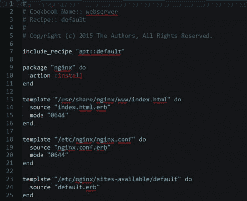

# Wistia 如何每小时处理数百万个请求并处理丰富的视频分析

> 原文： [http://highscalability.com/blog/2015/11/23/how-wistia-handles-millions-of-requests-per-hour-and-process.html](http://highscalability.com/blog/2015/11/23/how-wistia-handles-millions-of-requests-per-hour-and-process.html)

<iframe align="RIGHT" height="188" src="https://www.youtube.com/embed/bAEjtLy6G4I?rel=0" style="padding:2px" width="205"></iframe>*这是来自 [Christophe Limpalair](https://twitter.com/ScaleYourCode) 的来宾[转贴](https://scaleyourcode.com/interviews/interview/18)，他在接受 [Max Schnur](https://twitter.com/maxschnur) 采访时，在 [Wistia  。*

Wistia 是企业视频托管。 他们提供像热图一样的视频分析，并且使您能够添加号召性用语。 我真的很想了解所有不同组件的工作方式以及它们如何流式传输大量视频内容，因此这是本集重点介绍的内容。

## Wistia 的堆栈是什么样的？

正如您将看到的，Wistia 由不同的部分组成。 以下是支持这些不同部分的一些技术：

*   [HAProxy](http://www.haproxy.org/)
*   [Nginx](http://nginx.org/)
*   [MySQL](https://www.mysql.com/) （共享）
*   [Ruby on Rails](http://rubyonrails.org/)
*   [独角兽](http://unicorn.bogomips.org/)和某些服务在 [Puma](http://puma.io/) 上运行
*   [nsq](https://github.com/wistia/nsq-ruby) （他们编写了 Ruby 库）
*   [Redis](http://redis.io/) （正在缓存）
*   [Sidekiq](http://sidekiq.org/) 用于异步作业

## 您的规模是多少？

[Wistia](http://wistia.com/) 包含三个主要部分：

1.  Wistia 应用程序（用户登录并与该应用程序互动的“枢纽”）
2.  酒厂（统计处理）
3.  面包店（转码和投放）

以下是一些统计信息：

*   **每小时加载 150 万个播放器**（加载一个播放器的页面计为一个。两个播放器计为两个，依此类推……）
*   **每小时向其 Fastly CDN 发出 1880 万个高峰请求**
*   **每小时 740,000 个应用程序请求**
*   **每小时转码 12,500 个视频**
*   **每小时 150,000 播放**
*   **每小时统计 ping 达 800 万次**

它们在 [Rackspace](http://www.rackspace.com/) 上运行。

## 接收视频，对其进行处理然后为它们提供服务会带来什么挑战？

1.  **They want to balance quality and deliverability**, which has two sides to it:
    1.  原始视频的编码派生
    2.  知道何时玩哪个衍生品

    在这种情况下，衍生产品是视频的不同版本。 具有不同质量的版本很重要，因为它使您可以减小文件的大小。 这些较小的视频文件可以以较少的带宽提供给用户。 否则，他们将不得不不断缓冲。 有足够的带宽？ 大！ 您可以享受更高质量（更大）的文件。

    拥有这些不同的版本并知道何时播放哪个版本对于良好的用户体验至关重要。

2.  **很多 I / O。** 当用户同时上传视频时，最终将不得不在群集之间移动许多繁重的文件。 这里很多事情都会出错。
3.  **波动率。** 请求数量和要处理的视频数量均存在波动。 他们需要能够承受这些变化。
4.  **当然，提供视频也是一个主要挑战。** 幸运的是，CDN 具有不同类型的配置来帮助实现这一目标。
5.  **在客户端，有很多不同的浏览器，设备大小等...** 如果您曾经不得不处理使网站具有响应能力或在较旧的 IE 版本上工作，那么您确切地知道我们 在这里谈论。

## 您如何处理视频上传数量的重大变化？

他们有被称为 *Primes* 的盒子。 这些 Prime 盒子负责接收用户上传的文件。

如果上载开始占用所有可用磁盘空间，则它们可以使用 Chef 食谱启动新的 Prime。 目前，这是一项手动工作，但通常情况下，他们无法达到极限。 他们有很多空间。

## 您使用哪种转码系统？

转码部分是他们所谓的*面包店*。

面包房由我们刚刚看过的 Prime 组成，可以接收和提供文件。 他们也有一群工人。 工作者处理任务并从上传的视频创建派生文件。

这部分需要强壮的系统，因为它非常消耗资源。 多强壮

我们说的是数百名工人。 每个工人通常一次执行两项任务。 它们都具有 8 GB 的 RAM 和相当强大的 CPU。

工人要进行什么样的任务和处理？ 他们主要使用 x264 编码视频，这是一种快速编码方案。 通常可以将视频编码为视频长度的一半或三分之一。

视频还必须调整[的大小](http://www.movavi.com/support/how-to/resizing-video.html)，并且它们需要不同的[比特率](http://help.encoding.com/knowledge-base/article/understanding-bitrates-in-video-files/)版本。

此外，针对不同设备的编码配置文件也不同，例如 iPhone 的 [HLS](http://www.streamingmedia.com/Articles/Editorial/Featured-Articles/How-to-Encode-Video-for-HLS-Delivery-95251.aspx) 。 对于同样也是 x264 编码的 Flash 派生，这些编码需要加倍。

## 上传视频并对其进行转码的整个过程是什么样的？

用户上传视频后，该视频将排队并发送给工作人员进行转码，然后缓慢地转移到 S3。

无需立即将视频发送到 S3，而是将其推送到群集中的 Prime，以便客户可以立即提供视频。 然后，在几个小时内，文件被推到 S3 进行永久存储，并从 Prime 清除以腾出空间。

## 处理完视频后如何将其提供给客户？

当您播放 Wistia 上托管的视频时，您需要请求 embed.wistia.com/video-url，该请求实际上是在播放 CDN（他们使用了几种不同的 CDN。我只是尝试了一下，而我通过了 [Akamai](https://www.akamai.com/) ）。 CDN 可以追溯到 Origin，这就是我们刚刚谈到的 Prime。

Primes 通过称为“面包路线”的特殊平衡器运行 HAProxy。 面包路由是位于 Prime 前面并平衡流量的路由层。

Wistia 可能将文件本地存储在群集中（这将更快地提供服务），而 Breadroute 足够聪明，可以知道这一点。 如果真是这样，那么 Nginx 将直接从文件系统提供文件。 否则，它们代理 S3。

## 您如何分辨要加载的视频质量？

这主要是在客户端决定的。

Wistia 将在用户点击播放后立即接收有关用户带宽的数据。 在用户甚至没有点击播放之前，Wistia 都会接收有关设备，嵌入视频的大小以及其他启发式方法的数据，以确定该特定请求的最佳资产。

仅当用户进入全屏状态时才辩论是否要高清。 当用户第一次单击播放时，这使 Wistia 有机会不中断播放。

## 您怎么知道什么时候不加载视频？ 您如何监控呢？

他们拥有称为 *pipedream* 的服务，他们在应用程序和嵌入代码中使用该服务来不断地将数据发送回去。

如果用户单击播放，则会获得有关其窗口大小，窗口所在位置以及是否缓冲的信息（如果它处于播放状态，但几秒钟后时间没有改变）。

视频的一个已知问题是加载时间慢。 Wistia 想知道视频何时加载缓慢，因此他们尝试为此跟踪指标。 不幸的是，他们只知道如果用户实际上在等待负载完成才慢。 如果用户的连接速度确实很慢，他们可能会在此之前离开。

这个问题的答案？ 心跳。 如果他们收到心跳，却再也没有收到游戏，那么用户可能会保释。

## 您还收集其他哪些分析？

他们还为客户收集分析数据。

诸如播放，暂停，搜寻，转化（输入电子邮件或点击号召性用语）之类的分析。 其中一些显示在热图中。 他们还将这些热图汇总到显示参与度的图表中，例如人们观看和重看的区域。

## 您如何获得如此详细的数据？

播放视频时，他们使用视频跟踪器，该跟踪器是绑定到播放，暂停和搜索的对象。 该跟踪器将事件收集到数据结构中。 每 10 到 20 秒一次，它会回传至 Distillery，该酒厂又找出如何将数据转换为热图。

为什么每个人都不这样做？ 我问他，因为我什至没有从 YouTube 获得此类数据。 马克斯说，原因是因为它非常密集。 酿酒厂处理大量的东西，并拥有一个庞大的数据库。

（ *http://www.cotswoldsdistillery.com/First-Cotswolds-Distillery-Opens* ）

## 什么是扩展易用性？

Wistia 拥有约 60 名员工。 一旦开始扩大客户群，就很难确保继续保持良好的客户支持。

它们的最高接触点是播放和嵌入。 这些因素有很多无法控制的因素，因此必须做出选择：

1.  不要帮助客户
2.  帮助客户，但需要很多时间

这些选择还不够好。 取而代之的是，他们追究导致客户支持问题最多的来源-嵌入式。

嵌入经历了多次迭代。 为什么？ 因为他们经常破产。 不管是 WordPress 做一些奇怪的嵌入，还是 Markdown 破坏嵌入，随着时间的推移，Wistia 都遇到了很多问题。 为了解决这个问题，他们最终大大简化了嵌入代码。

这些更简单的嵌入代码在客户端遇到的问题更少。 尽管确实在后台增加了更多的复杂性，但是却导致了更少的支持请求。

这就是 Max 通过扩展易用性的含义。 使客户更轻松，这样他们就不必经常与客户支持联系。 即使这意味着更多的工程挑战，对他们来说也是值得的。

缩放易用性的另一个示例是回放。 Max 确实对实现一种客户端 CDN 负载均衡器感兴趣，该负载均衡器确定了从中提供内容的最低延迟服务器（类似于 Netflix 所做的事情）。

## 您现在正在从事哪些项目？

Max 计划很快启动的就是他们所说的上载服务器。 这个上载服务器将使他们能够对上载做很多很酷的事情。

正如我们所讨论的那样，对于大多数上载服务，您必须等待文件到达服务器，然后才能开始转码并对其进行处理。

上传服务器将使上传时可以进行转码。 这意味着客户可以在视频完全上传到系统之前就开始播放他们的视频。 他们还可以获取静止图像并几乎立即嵌入

## 结论

我必须尝试在此摘要中尽可能多地添加信息，而又不要太长。 这意味着我删去了一些可以真正帮助您的信息。 如果您发现这很有趣，我强烈建议您查看[完整访谈](https://scaleyourcode.com/interviews/interview/18)，因为还有更多隐藏的宝石。

您可以观看，阅读甚至收听。 还有一个下载 MP3 的选项，因此您可以聆听自己的工作方式。 当然，该节目也在 [iTunes](https://itunes.apple.com/tt/podcast/scale-your-code-podcast/id987253051?mt=2) 和 [Stitcher](http://www.stitcher.com/podcast/scaleyourcode?refid=stpr) 上进行。

Thanks for reading, and please let me know if you have any feedback!- Christophe Limpalair (@ScaleYourCode)

您好，HS 读者们，我希望您从本集中找到有趣且有用的信息。 在很多（当之无愧的）关注焦点集中在 Netflix 和 YouTube 上的时代，Wistia 感觉就像是一颗隐藏的宝石。

我一直在努力改善演出，因此，我敞开双臂欢迎任何反馈。 受访者的建议和一般问题也是如此。

谢谢，享受！

很棒的帖子...
这些天，每个人都在后端使用 s3，但是为什么他们不使用弹性代码转换器？

您好，感谢您的阅读/观看！

RE：为什么我们不使用弹性代码转换器。 好吧，如果我们今天要创办一家视频托管公司，我们可能最终会使用诸如弹性代码转换器或 zencoder 之类的服务。 这是因为要获得像大规模构建的那样健壮的系统非常困难，而且这些服务非常好。

但是面包店（我们的转码服务）是在弹性转码器或 zencoder 出现之前建立的。 而现在，由于这些年来我们投入了大量工作并实施了自动缩放功能，因此它为我们带来了竞争优势。 也就是说，我们能够快速轻松地实施新的编码方案，并将转码与我们的应用程序体验更加紧密地集成在一起。 例如，我不提一提的服务器允许在仍上传的同时进行转码和回放，这是面包店的特色。 使用任何现有服务都很难做到这一点，但是会极大地改善用户体验。

再说一次，我们总是在评估我们的选项，因此，如果有必要将部分或全部转码卸载到另一个服务，我们一定会考虑的。 目前，面包店是秘密武器。 :)

嗨，好帖子 看起来您正在 Rackspace 上运行，并且存储在 S3 上。 为什么不只在 AWS 和 S3 上运行？ 谢谢！