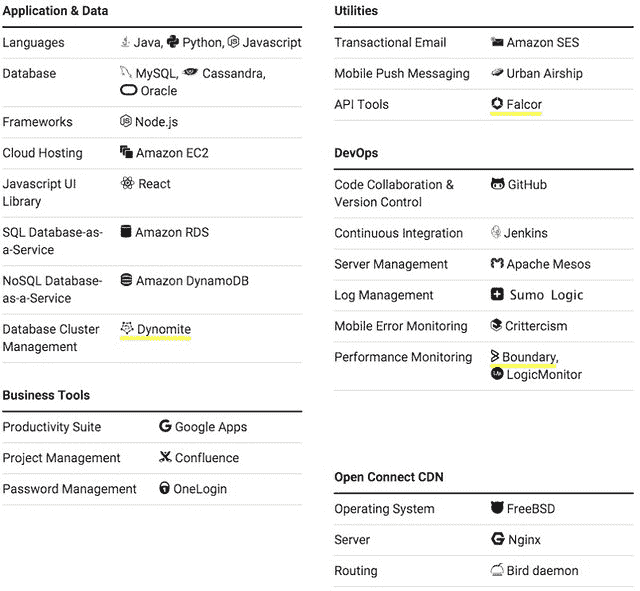
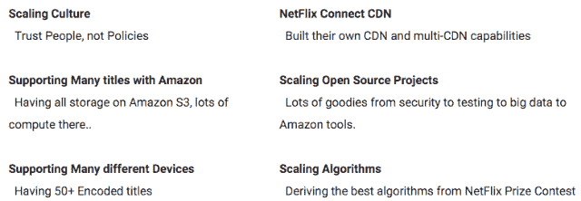
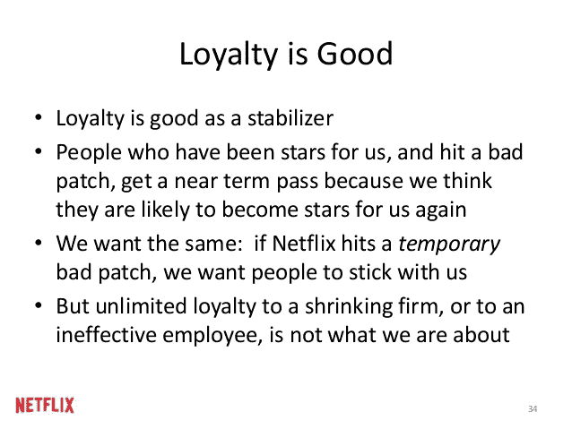
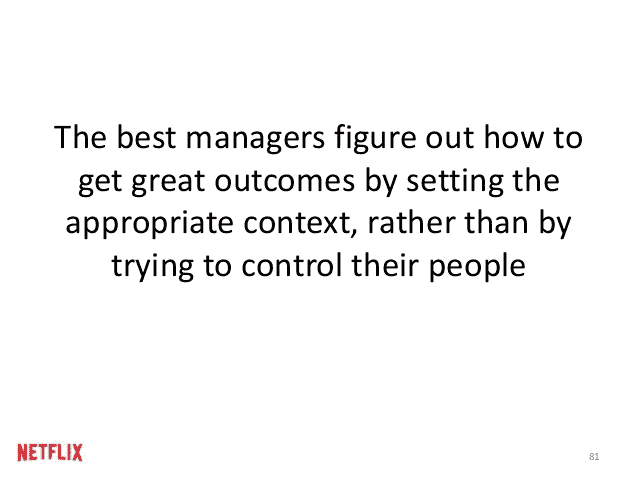
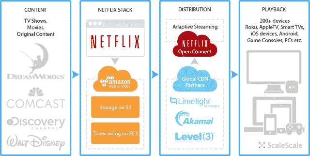

# 整个 Netflix 堆栈的 360 度视图

> 原文： [http://highscalability.com/blog/2015/11/9/a-360-degree-view-of-the-entire-netflix-stack.html](http://highscalability.com/blog/2015/11/9/a-360-degree-view-of-the-entire-netflix-stack.html)

*This is a guest [repost](http://www.scalescale.com/the-stack-behind-netflix-scaling/) by [Chris Ueland](http://twitter.com/ChrisUeland), creator of [Scale Scale](http://scalescale.com/), with a creative high level view of the Netflix stack.*

> 随着我们对扩展的研究和深入研究，我们将继续涉足 Netflix。 他们的故事很公开。 这篇文章是我们在 Bryan 的帮助下整理而成的。 我们从互联网上收集了信息。 如果您想了解更多信息，我们将在此附上。 否则请尽情享受！
> 
> –克里斯/ ScaleScale / MaxCDN

 

## 看看我们对 Netflix 如何扩展感兴趣的观点

Netflix 由马克·兰道夫（Marc Randolph）和里德·黑斯廷斯（Reed Hastings）于 1997 年在加利福尼亚州斯科茨谷市成立，最初拥有 30 名员工，其中 925 名从事按租金付费。如今，Netflix 已成为全球领先的互联网电视网络，在 50 个国家/地区拥有 6900 万订户 每月欣赏超过 100 亿小时的电视节目和电影。 它们非常透明，可以在线发布很多信息。 我们已收集并分享了我们认为最有趣的内容：

## 规模文化

NetFlix 有一个关于文化的著名演讲。 这些概念是关于重新思考人力资源的。 他们的许多人员都集中在此演示文稿的原理上。 这是一些示例幻灯片和演示。 这为文化提供了重要的背景，以了解他们如何扩展软件堆栈以及其工作原理。

完整演示文稿在这里[。](http://www.scalescale.com/the-stack-behind-netflix-scaling/#)

## 通过 Amazon 支持许多标题

Netflix 的基础设施位于 Amazon EC2 上，来自电影制片厂的数字电影原版存储在 Amazon S3 上。 使用云上的机器，根据视频分辨率和音频质量，每部电影被编码为 50 多种不同版本。 超过 1 PB 的数据存储在 Amazon 上。 这些数据被发送到内容传递网络，以将内容提供给本地 ISP。

Netflix 在后端使用了许多开源软件，包括 Java，MySQL，Gluster，Apache Tomcat，Hive，Chukwa，Cassandra 和 Hadoop。

## 支持多种设备

Netflix 上大量的编解码器和比特率组合意味着“在将相同的标题交付给所有流媒体平台之前，必须对其进行 120 次不同的编码”。

尽管 Netflix 使用自适应比特率流技术来调整视频和音频质量以匹配客户的下载速度，但它们还为用户提供了在其网站上选择视频质量的能力。

您可以从提供 Netflix 应用程序的任何与 Internet 相连的设备上立即观看，例如计算机，游戏机，DVD 或蓝光播放器，HDTV，机顶盒，家庭影院系统，电话或平板电脑。

它们以不同的比特率支持以下编解码器中的每个标题，以使其在设备和连接上工作。

*   视频– [VC-1](https://en.wikipedia.org/wiki/VC-1) ， [H.264（AVC）](https://en.wikipedia.org/wiki/H.264)，VC-1， [H.263](https://en.wikipedia.org/wiki/H.263) ， [H.265（HEVC）](https://en.wikipedia.org/wiki/High_Efficiency_Video_Coding)
*   音频– [WMA](https://en.wikipedia.org/wiki/Windows_Media_Audio) ，[杜比数字](https://en.wikipedia.org/wiki/Dolby_Digital)，[杜比数字 Plus](https://en.wikipedia.org/wiki/Dolby_Digital_Plus) ， [AAC](https://en.wikipedia.org/wiki/Advanced_Audio_Coding) 和 [Ogg Vorbis](https://en.wikipedia.org/wiki/Ogg_Vorbis)

### Netflix Open Connect CDN

Netflix Open Connect CDN 是为拥有超过 100,000 个订阅者的大型 ISP 提供的。 一种特殊构建的低功耗高存储密度设备可将 Netflix 内容缓存在 ISP 的数据中心内，以降低互联网传输成本。 该设备运行 FreeBSD 操作系统， nginx 和 Bird Internet 路由守护程序。

NetFlix 巴黎公开赛–图片来源：@dtemkintwitter

在处观看 Open Connect 视频[。](https://www.youtube.com/watch?v=mBCXdaukvcc)

## 缩放算法

在 2009 年，Netflix 举办了一项名为 [Netflix 奖](https://en.wikipedia.org/wiki/Netflix_Prize)的竞赛。 他们打开了一堆匿名数据，并允许团队尝试得出更好的算法。 获胜团队将现有算法提高了 10.06％。 Netflix 打算再获得一个 Netflix 奖，但最终没有这样做，因为 FTC 担心隐私。

Netflix 推荐系统包含许多算法。 生产系统中使用的两个核心算法是受限玻尔兹曼机（RBM）和一种称为 SVD ++的矩阵分解形式。 使用线性混合将这两种算法结合在一起以产生单个更高的准确性估计。

受限玻尔兹曼机是经过修改以在协同过滤中工作的神经网络。 每个用户都有一个 RBM，每个节点的输入节点代表该用户已评分的电影。

SVD ++是 SVD（奇异值分解）的不对称形式，它利用了 RBM 等隐式信息。 它是由 Netflix 竞赛的获胜团队开发的。

Netflix 团队在其工程博客上介绍了[学习个性化主页](http://techblog.netflix.com/2015/04/learning-personalized-homepage.html)

## 开源项目

[https://netflix.github.io/](https://netflix.github.io/) 。 Netflix 有一个很棒的工程博客，最近他们在 Netflix 上发表了一篇名为 [The Evolution of Open Source 的文章。](http://techblog.netflix.com/2015/10/evolution-of-open-source-at-netflix.html)

## 大数据

*   [Genie](https://github.com/Netflix/genie) -对我们各种数据处理框架（尤其是 Hadoop）的强大，基于 REST 的抽象。
*   [Inviso](https://github.com/Netflix/inviso) -提供有关我们 Hadoop 作业和集群性能的详细见解。
*   [口红](https://github.com/Netflix/lipstick)-以清晰，可视的方式显示 Pig 作业的工作流程。
*   [Aegisthus](https://github.com/Netflix/aegisthus) -启用从 Cassandra 中批量提取数据以进行下游分析处理。

## 构建和交付工具

*   [Nebula](https://nebula-plugins.github.io/) -Netflix 努力共享其内部构建基础结构。
*   [代理程序](https://github.com/Netflix/aminator)-用于创建 EBS AMI 的工具。
*   [Asgard](https://github.com/Netflix/asgard) -用于 Amazon Web Services（AWS）中的应用程序部署和云管理的 Web 界面。

## 通用运行时服务&库

*   [Eureka](https://github.com/Netflix/eureka) -Netflix 云平台的服务发现。
*   [Archaius](https://github.com/Netflix/archaius) -分布式配置。
*   [功能区](https://github.com/Netflix/ribbon)-弹性和智能的进程间和服务通信。
*   [Hystrix](https://github.com/Netflix/hystrix) -提供超越单次服务呼叫的可靠性。 在运行时隔离等待时间和容错能力。
*   **[Karyon](https://github.com/Netflix/karyon)** 和 **[控制器](https://github.com/Netflix/governator)-** JVM 容器服务。
*   [Prana](https://github.com/Netflix/prana) sidecar -
*   [Zuul](https://github.com/Netflix/zuul) -在云部署的边缘提供动态脚本化代理。
*   [Fenzo](https://github.com/Netflix/Fenzo) -为云本机框架提供高级调度和资源管理。

## 数据持久性

*   **[EVCache](https://github.com/Netflix/EVCache)** 和 **[炸药](https://github.com/Netflix/dynomite)** **-** 用于大规模使用 Memcached 和 Redis。
*   **[Astyanax](https://github.com/Netflix/astyanax)** 和 **[Dyno](https://github.com/Netflix/dyno)** **-** 客户端库可更好地使用云中的数据存储。

## 洞察力，可靠性和性能

*   [Atlas](https://github.com/Netflix/atlas) -时间序列遥测平台
*   [Edda](https://github.com/Netflix/edda) -跟踪云中更改的服务
*   [观众](https://github.com/Netflix/spectator)-Java 应用程序代码与 Atlas 的轻松集成
*   [向量](https://github.com/Netflix/vector)-以最小的开销公开高分辨率的主机级指标。
*   [Ice](https://github.com/Netflix/ice) -揭示了持续的成本和云利用率趋势。
*   [Simian Army](https://github.com/Netflix/SimianArmy) -测试 Netflix 实例是否出现随机故障。

## 安全性

*   [Security Monkey](https://github.com/Netflix/security_monkey) -帮助监视和保护基于 AWS 的大型环境。
*   [Scumblr](https://github.com/Netflix/scumblr) -利用整个 Internet 的针对性搜索来发现特定的安全问题以进行调查。
*   [MSL](https://github.com/Netflix/MSL) -一种可扩展且灵活的安全消息传递协议，可解决许多安全通信用例和要求。
*   [Falcor](https://netflix.github.io/falcor/) -通过虚拟 JSON 图将远程数据源表示为单个域模型。
*   [Restify](https://github.com/restify/node-restify) -专门用于 Web 服务 API 的 node.js REST 框架
*   [RxJS](https://github.com/ReactiveX/RxJS) -用于 JavaScript 的反应式编程库

## 参考资料

1.  [关于 HackerNews](https://news.ycombinator.com/item?id=10534219)
2.  [https://zh.wikipedia.org/wiki/Netflix](https://en.wikipedia.org/wiki/Netflix)
3.  [http://gizmodo.com/this-box-can-hold-an-entire-netflix-1592590450](http://gizmodo.com/this-box-can-hold-an-entire-netflix-1592590450)
4.  [http://edition.cnn.com/2014/07/21/showbiz/gallery/netflix-history/](http://edition.cnn.com/2014/07/21/showbiz/gallery/netflix-history/)
5.  [http://techblog.netflix.com/2015/01/netflixs-viewing-data-how-we-know-where.html](http://techblog.netflix.com/2015/01/netflixs-viewing-data-how-we-know-where.html)
6.  [https://gigaom.com/2013/03/28/3-shades-of-latency-how-netflix-built-a-data-architecture-around-timeliness/](https://gigaom.com/2013/03/28/3-shades-of-latency-how-netflix-built-a-data-architecture-around-timeliness/)
7.  [https://gigaom.com/2015/01/27/netflix-is-revamping-its-data-architecture-for-streaming-movies/](https://gigaom.com/2015/01/27/netflix-is-revamping-its-data-architecture-for-streaming-movies/)
8.  [http://stackshare.io/netflix/netflix](http://stackshare.io/netflix/netflix)
9.  [https://www.quora.com/How-does-the-Netflix-movie-recommendation-algorithm-work](https://www.quora.com/How-does-the-Netflix-movie-recommendation-algorithm-work)
10.  [https://netflix.github.io/](https://netflix.github.io/)

在哪里提到 Spring？ Netflix 的所有 Java 都在 Spring 框架的上下文中。

到目前为止，这还不是一个完整的列表。 不好的文章。

NetFlix 不使用 Spring，至少他们从未在任何演示文稿或白皮书中提及 Spring。

我在这里看不到他们使用 Node.JS 吗？ 我记得曾经从他们那里看到幻灯片，谈论他们如何处理 Node.JS 的服务以及如何优化这些服务。

有一些使用 Spring 的应用程序，但是 95％以上的 Java 应用程序直接使用 Guice 或通过 Governor 增强。

他们在那里的服务中使用 guice 代替。Governator 是一个很好的 guice 扩展库，尽管将它们标记为已弃用，您仍可以在该库中找到一些硬编码的依赖项。

好像他们没有在使用 docker ...

您在“受限玻尔兹曼机器”中写了“玻尔兹曼”错误。

@ cmp，restify 是使用 Node 并为其构建的 Web API 框架。

本文是有缺陷的，它没有说明软件公司最重要的事情，即：他们使用哪个需求管理系统，以及它们如何保持需求与代码之间的可处理性？

他们确实使用 Spring Cloud，这是参考 https://2015.event.springone2gx.com/schedule/sessions/spring_cloud_at_netflix.html

炸药列在错误的类别下。 当前，它是一个分布式的内存存储。

出色的工作！
从所有者到 Netflix 的内容交付（关系图上的左箭头）使用 SMPTE 的可互操作主格式（IMF）。 视频使用 JPEG-2000 编码，音频未编码（线性 PCM）。 内容使用 MXF 打包（例如，非常类似于 D-Cinema 的内容）。
SMPTE 当前正在努力扩展此标准，以支持 HDR +视频：高动态范围（HDR）可提供更多的对比度，宽色域（WCG）可提供更多的颜色，高帧速率（HFR）可以每秒 50 帧或更多。
来自 Netflix 的 Chris Fetner 提供详细信息的柏林论坛 2015 年会议上的详细信息：
http://www.mesclado.com/smpte-forum-2015-future-proofing-media-production-part-3/ ？lang = en

Netflix 还使用 Groovy 编程语言和 RxJava 进行功能性反应式编程（请参阅 http://de.slideshare.net/InfoQ/functional-reactive-programming-in-the-netflix-api）

Netflix 使用 ElasticBox 来管理后台。 他们还在许多地方使用 Docker。

Netflix 还运营着一个相当大的 Elasticsearch 集群。 参见 https://www.elastic.co/videos/netflix-using-elasticsearch/和 https://www.elastic.co/elasticon/2015/sf/arrestful-development-how-netflix-uses-elasticsearch-to- 更好地了解

Netflix 是 Apache Cassandra 的已知用户。 他们的技术博客对此进行了广泛报道，而 Netflix 对此已经非常公开。 （作为一个旁注，我在同一博客上找不到任何标记 DynamoDB 的帖子）。

Netflix 使用 Node.JS。 本文只有 50％正确。 这里的一些内容，我们已经从其他内容切换到了。 我在 Netflix 的工程团队工作。 我们确实使用 Cassandra。 我们还使用 Reactor.JS。 一直在进行变化以适应技术变化。 我们混合使用了 JS 库，并完成了许多自定义工作，例如滑块。

netflix 是否使用带有 typescript 的节点，它们如何使用动态类型的 JS 维护大型节点应用程序

只需在 github 上的 Netflix 上寻找 Java 技术，他们为 Spring-Cloud 做出了很大贡献。
另请参阅 OSS：https：//netflix.github.io/