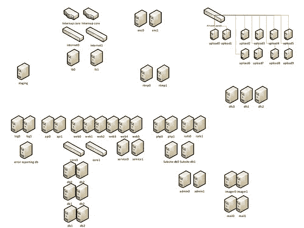

# Viddler Architecture-每天嵌入 700 万个和 1500 Req / Sec 高峰

> 原文： [http://highscalability.com/blog/2011/5/10/viddler-architecture-7-million-embeds-a-day-and-1500-reqsec.html](http://highscalability.com/blog/2011/5/10/viddler-architecture-7-million-embeds-a-day-and-1500-reqsec.html)

 Viddler 从事高质量视频即服务业务，该业务面向想要支付固定成本，使用它完成并付诸实施的客户。 与 Blip 和 Ooyala 相似，比 YouTube 更侧重于业务。 他们为成千上万的商业客户提供服务，包括 FailBlog，Engadget 和 Gawker 等高流量网站。

Viddler 是一个很好的案例，因为它们是一家小型公司，试图在拥挤的领域中提供具有挑战性的服务。 我们正抓住他们，就像他们从一家以 YouTube 竞争者起步的初创公司过渡到一家规模稍大的公司（专注于为企业客户付费）过渡一样。

过渡是 Viddler 的关键词：从免费的 YouTube 克隆过渡到高质量的付费服务。 从效果不佳的一些 Colo 站点过渡到新的更高质量的数据中心。 从典型的启动架构过渡到具有冗余，高可用性和自动化功能的架构。 从大量实验过渡到弄清楚他们想如何做并实现这一目标。 过渡到一种架构，在该架构中，功能使用不同的技术栈在地理上分散的团队中分散，以明确定义角色。

换句话说，Viddler 就像其他所有即将成熟的初创公司一样，值得一看。 Viddler 的系统架构师 Todd Troxell 非常友好地接受了我们的采访，并分享了有关 Viddler 架构的详细信息。 它是不同技术，组和流程的有趣组合，但似乎可以正常工作。 之所以行之有效，是因为所有活动部件的背后都是一个主意：让客户满意并给予他们想要的东西，无论如何。 这并不总是很漂亮，但是确实可以取得结果。

网站： [Viddler.com](http://viddler.com)

## 统计资料

1.  每天大约有 700 万个嵌入视图。
2.  每天大约上传 3000 个视频。
3.  最高 1500 req / sec。
4.  高峰期约有 130 人按下播放按钮。
5.  2 月份投放了 1PB 视频
6.  80T 仓储
7.  最近 30 天内花在视频编码上的 CPU 时间为 45,160 小时
8.  整天的使用量相对平稳，谷底和高峰之间只有〜33％的差异，这表明它们在全球范围内得到了大量使用。 [图形](http://farm3.static.flickr.com/2704/5705121724_845db30833_o.png)。

## 该平台

### 软件

1.  Debian Linux
2.  Rails 2.x-仪表板，根页面，竞赛管理器，各种子功能
3.  PHP-使用我们内部 API 的各种旧式子网站
4.  Python / ffmpeg / mencoder / x264lib-视频转码
5.  Java 1.6 / Spring / Hibernate / ehcache- API 和核心后端
6.  MySQL 5.0-主数据库
7.  Munin，Nagios，接站-监控
8.  Python，Perl 和 ruby-许多*许多*监视器，脚本
9.  Erlang - ftp.viddler.com
10.  Apache 2 / mod_jk-后端 Java 应用程序的核心头端
11.  Apache / mod_dav-视频存储
12.  Amazon S3-视频存储
13.  Amazon EC2-上传和编码
14.  KVM-临时环境的虚拟化
15.  Hadoop HDFS-分布式视频源存储
16.  Nginx / Keepalived-所有网络流量的负载均衡器
17.  Wowza-RTMP 视频录制服务器
18.  Mediainfo-报告视频元数据
19.  Yamdi-Flash 视频的元数据注入器
20.  人偶-配置管理
21.  Git / Github https://github.com/viddler/
22.  Logcheck-日志扫描
23.  重复性-备份
24.  Trac-错误跟踪
25.  Monit-进程状态监视/重启
26.  iptables-用于防火墙-无需硬件防火墙-还可处理内部网络的 NAT。
27.  maatkit，mtop，xtrabackup-数据库管理和备份
28.  [预引导执行环境](http://en.wikipedia.org/wiki/Preboot_Execution_Environment)-计算机的网络引导。
29.  考虑将 OpenStack 的 [Swift](http://swift.openstack.org/) 作为替代文件存储。
30.  [FFmpeg](http://www.ffmpeg.org/) -完整的跨平台解决方案，用于记录，转换和流传输音频和视频。
31.  阿帕奇雄猫
32.  [MEncoder](http://en.wikipedia.org/wiki/MEncoder) -一个免费的命令行视频解码，编码和过滤工具。
33.  [EdgeCast](http://www.edgecast.com/) -CDN

### 硬件

1.  他们的 colo 中总共有 20 多个节点：
    1.  2 个 Nginx 负载平衡器。
    2.  2 个 Apache 服务器。
    3.  8 个 Java 服务器运行该 API。
    4.  2 个 PHP / Rails 服务器运行在前端。
    5.  3 台 HDFS 服务器
    6.  1 监控服务器。
    7.  1 个本地编码服务器。
    8.  2 个存储服务器。
    9.  2 个 MySQL 数据库服务器以主从配置运行，计划迁移到 6 个服务器。
    10.  1 个登台服务器。
2.  Amazon 服务器用于视频编码。

## 产品

注册一个 Viddler 帐户，他们会将您的视频转换为所需的任何格式，并将其显示在任何设备上。 它们提供了嵌入代码，仪表板和分析。 他们的目标是在一个简单的界面后面解决视频问题，使人们可以购买该服务而忘了它，它可以正常工作并完成您需要做的一切。 作为内容提供商，您可以出售视图并将广告添加到内容中。 他们将所有广告网络作为一种元界面引入 Viddler，以执行不同的广告平台。

## 架构

1.  当前时代
    1.  他们目前的系统运行在美国西部某个地方的可乐中的裸机上。 他们正在搬到纽约的 Internap。
    2.  1 gbps 链接将它们连接到 Internet。 CDN 提供视频，并将视频直接加载到 Amazon 中进行处理，因此对于他们的主要站点，他们不需要的网络就更多。
    3.  该系统由 2 个 Nginix 负载平衡器所控制，一个是主动的，另一个是使用 keepalived 的被动的。 选择 Nginix 是因为它是基于 Linux 的开放源代码，并且可以正常工作。
    4.  EdgeCast 用作分发内容的 CDN。 客户将视频直接上传到 Amazon，然后将视频处理并上传到 CDN。
    5.  Nginx 可以故障转移到两个 Apache 服务器。 Apache 服务器可以故障转移到运行 Tomcat 的后端服务器之一。
    6.  他们的部分架构在 Amazon 中运行：存储以及它们的上载和编码服务。
    7.  在 Cassandra 中进行了实验，以存储仪表板位置。 非常可靠，但将来可能会迁移到 MySQL。
    8.  Linode 上的两个图像缩放节点，用于为视频创建任意缩略图。 将来将移至纽约。
2.  Internap 的很快时代
    1.  该网站最初的想法是免费的视频网站 YouTube，但更好。 然后，他们转向提供更高质量的服务，这表明需要更好，更可靠的基础架构。
    2.  他们正在迁移到 Internap，因此尚未解决所有问题。 他们先前的数据中心中的一些问题促使此举：
        1.  网络问题，某些 [BGP](http://en.wikipedia.org/wiki/Border_Gateway_Protocol) （边界网关协议）提供程序将停止工作，不会自动进行对等，并且最终将死站点一个小时，并且必须真正推动手动建立数据中心 删除对等体。
        2.  他们被转租给了一家提供商，后者将他们踢出局，这意味着他们不得不在很少的交货时间内移动两个机架的服务器。
        3.  Internap 以其良好的网络而闻名，它是一种更好的工具，并且更可靠。
    3.  一个主要目标是在其体系结构中具有**完全冗余**。 将 RTMP 服务器，专用错误记录系统的数量加倍，将监视服务器的数量加倍，将 PHP 和 Rails 服务器分开，添加专用图像缩放服务器，并将编码服务器的数量加倍。
    4.  另一个主要目标是**完全自动化**。 他们将通过网络对计算机进行启动，以获取操作系统，并从 CVS 配置软件包。 目前，他们的系统不可复制，他们想对此进行更改。
    5.  试用 HDFS 作为视频的文件存储。 他们将其视频的 10％（约 20TB）存储在 3 个 HDFS 节点上，而且从未停机。
    6.  当前的目标是使一切移交，整个系统要自动构建，并且在版本控制中，确保雇用了操作人员并制定了时间表。
    7.  观察到他们与亚马逊的业务相似，因为在视频世界中自己完成所有工作要便宜得多，但随后您必须自己完成所有事情。
    8.  没有计划使用服务体系结构。 它们具有内部 API 和外部 API。 两者都用于创建站点。 与转换为服务方法相比，要实现更高的奖励功能。
3.  自动化将改变一切。
    1.  便携式 VM 将允许他们重现构建环境和实时环境。 目前这些是不可复制的。 每个人都使用不同版本的软件包在自己的操作系统上进行开发。
    2.  将允许他们在体系结构上进行迭代。 只需下载要运行的新 VM，即可尝试新的存储等。
    3.  简化向 OpenStack 的过渡。 同时考虑 VMware。
4.  当您上载到 Viddler 时，端点位于运行 Tomcat 的节点上的 Amazon EC2 上。
    1.  该文件在本地缓存并发送到 S3。
    2.  该文件从 S3 下拉以进行编码。
    3.  编码过程在称为 Viddler Core 的模块中拥有自己的队列。
    4.  他们将在 colo 站点中运行的代码与在 Amazon 中运行的代码分开。 在 Amazon 中运行的代码不会保持状态。 生成的节点可能会死亡，因为所有状态都保留在 S3 或 Viddler Core 中。
    5.  Python 编码守护程序使工作脱离队列：
        1.  运行 FFmpeg，MEncoder 和其他编码器。
        2.  关于检查 iPhone 视频是否需要在编码和其他测试之前进行旋转，有很多时髦的东西。
        3.  每个编码节点都在 Amazon 8 核心实例上运行。 一次运行四种编码。 他们还没有尝试优化它。
        4.  作业按优先级顺序运行。 有人要立即查看的实时上传内容将在批量处理（例如说在其编码中添加 iPhone 支持）之前得到处理。
        5.  Python 守护程序是运行时间很长的守护程序，它们没有看到任何有关内存碎片的问题或其他问题。
5.  探索实时转码。
    1.  在实时编码中，节点实例像多部分表单一样被馈送，通过 FFmpeg 进行流传输，然后再次进行流传输。 这可能是其 CDN 的一部分。
    2.  这种体系结构的最大优点是无需等待。 客户上传视频后，该视频即会直播。
    3.  这意味着仅需要存储文件的一种视频格式。 它可以按需转码到 CDN。 这样可以为客户节省大量的存储成本。
6.  储存费用：
    1.  CDN 和存储是他们最大的成本。 存储大约占其成本的 30％。
    2.  希望他们的视频在所有内容上播放的人的平均情况是四种格式。 HTTP 流将是另一种格式。 因此，存储成本是客户的主要支出。
7.  团队设置：
    1.  本地程序员在 PHP / Rails 中进行前端操作。 他们正在尝试将所有前端移至该堆栈，尽管其中一些当前在 Java 中。
    2.  核心 Tomcat / Java / Spring / Hibernate 由波兰的一个团队编写。 Java 团队的目标是实现 API 和后端逻辑。
    3.  为 PHP / Rails 团队计划有一个单独的数据库，因为它们的移动速度比 Java 团队快得多，并且他们希望尽可能地使团队脱钩，以使其彼此不依赖。
8.  进行可靠性调查，发现大多数故障是由于：
    1.  网络连接问题。 他们正在迁移到新的数据中心来解决此问题。
    2.  数据库过载。 要解决此问题：
        1.  该数据库包含约 100 个表。 用户表大约有 100 个参数，其中包括诸如编码首选项之类的信息。 从在 Word Perfect 上托管站点以来，该架构仍然具有旧结构。
        2.  三倍的数据库容量。
        3.  使用速度更快且具有更多内存的服务器。
        4.  使用双主设备设置和 4 个读取从设备。
        5.  两个读取从站将具有较低的交互式通信查询超时。
        6.  两个从属将专用于报告，并且查询超时时间较长。 慢速报告查询不会使这种方法使网站瘫痪。 他们的热门查询正在处理具有 1000 万行的表，因此计算热门视频所需的时间比以前要长得多，因为它开始创建临时表。 可能导致系统停机 5 秒钟。
9.  他们正在研究在自己的 colos 中使用 Squid 运行自己的 CDN。
    1.  也许使用西海岸和东海岸的科鲁斯在地理上分布同伴。
    2.  对于他们的客户，他们预计他们在美国需要 4 个站点，在欧洲需要 1 个站点。
    3.  EdgeCast 为他们提供了很多优惠，并为他们提供了有用的功能，例如每个 CNAME 的统计数据，但以盈利为基础，构建自己的 CDN 值得开发。 CDN 成本是其成本结构的重要组成部分，随着时间的流逝，值得一试。
10.  **未来的**：长期目标是看退出 Amazon，在本地运行存储，运行 OpenStack 并运行自己的 CDN 可以节省多少钱。 这将节省 80％的与人无关的运营支出。 根据他们自己的计算，他们可以做到比亚马逊便宜。

## 得到教训

1.  **混搭**。 他们正在使用来自不同提供商的节点的组合。 CDN 处理内容。 Amazon 用于无状态操作，例如编码和存储。 colo 中的节点用于其他所有内容。 在几个不同的位置使用功能可能会有些混乱，但是除非有令人信服的业务原因或易用性更改的原因，否则它们会坚持可行的方法。 将所有东西转移到亚马逊也许是有道理的，但是这也会使他们脱离他们的优先事项，这会带来风险，并且会花费更多。
2.  **注意表增长**。 一旦站点变大，过去需要花费相当长的时间的查询便会突然使其崩溃。 使用报告实例可以从交互式流量中分担报告流量。 而且不要写令人讨厌的查询。
3.  **查看成本**。 平衡成本是他们决策过程的重要组成部分。 他们更喜欢通过新功能实现增长，而不是整合现有功能。 这是一项艰难的平衡行为，但是有意识地将其作为一项战略要务可以帮助每个人都知道自己的发展方向。 从长远来看，他们正在考虑如何在利用自己的 colo 较低成本结构的同时获得云运营模型的好处。
4.  **实验**。 Viddler 喜欢实验。 他们将尝试不同的技术以查看有效的方法，然后在生产中实际使用它们。 这使他们有机会了解新技术是否可以帮助他们降低成本并提供新的客户功能。
5.  **按技术堆栈细分团队，并发布灵活性**。 拥有分散的团队可能是一个问题。 在不同的技术堆栈和根本不同的发布周期上部署分布式团队是一个大问题。 拥有具有强大依赖性和跨职能职责的分布式团队是一个巨大的问题。 如果您必须处于这种情况下，那么迁移到组之间具有较少依赖关系的模型是一个很好的折衷方案。
6.  **从中断中学习**。 对您的网站为何崩溃进行调查，并查看可以解决的主要问题。 似乎很明显，但是还不够。
7.  **将免费用户用作豚鼠**。 免费用户对 SLA 的期望较低，因此他们是新基础设施实验的候选人。 拥有免费套餐对于此目的非常有用，可以在不造成重大损害的情况下试用新功能。
8.  **为顶级托管**支付更多费用。 他们遇到的最大问题是选择好的数据中心。 他们的第一个和第二个数据中心有问题。 作为一家蓬勃发展的创业公司，他们寻找可以找到的最便宜但质量最高的数据中心。 事实证明，数据中心质量很难判断。 他们选择了一家名牌设施，并获得了高昂的价格。 这工作了好几个月，然后开始出现问题。 停电，网络中断，他们最终被迫转移到另一家提供商，因为与他们在一起的一家提供商退出了该设施。 如今，任何时间都无法宕机是不可接受的，对于这样一个小组，冗余站点将是很多努力。 从长远来看，为更高质量的数据中心支付更多费用将降低成本。
9.  **最终重要的是用户看到的内容，而不是体系结构**。 迭代并着重于客户体验之上。 客户服务的价值甚至超过理智或可维护的体系结构。 只构建所需的内容。 如果不运行超级草率的业务，他们就无法启动这家维持 100％员工所有权的公司。 他们现在采用的是在草率阶段学到的知识，并在顶级设施中构建非常灵活的多站点架构。 他们的系统并不是最有效或最漂亮的系统，他们采取的方式是客户需要某种东西，因此他们构建了它。 他们追求客户的需求。 他们选择硬件和构建软件（重点是完成工作）的方式就是建立公司的基础。
10.  **自动化**。 尽管所有试验和解决客户问题的直接方法都很好，但是您仍然需要一个自动化的环境，以便可以复制构建，测试软件并提供一致且稳定的开发环境。 从一开始就自动化。

我真的很感谢 Todd Troxell 花时间参加这次采访。

记住孩子们，如果您正在寻找工作，Viddler 也在为您寻找[。](http://www.indeed.com/q-Viddler-jobs.html)

## 相关文章

1.  [我们可以处理您的交通！](http://blog.viddler.com/cdevroe/traffic/) ，作者 Colin Devroe

很高兴阅读...
我很想了解您不转用云服务的原因，因为从今天起您需要管理和开发许多不同的技术... 大量的金钱和精力？