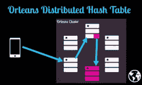

# 为在现代时代构建可扩展的有状态服务提供依据

> 原文： [http://highscalability.com/blog/2015/10/12/making-the-case-for-building-scalable-stateful-services-in-t.html](http://highscalability.com/blog/2015/10/12/making-the-case-for-building-scalable-stateful-services-in-t.html)

长期以来， [无状态服务](https://en.wikipedia.org/wiki/Service_statelessness_principle) 一直是可扩展性的皇家之路。 几乎所有关于可伸缩性的论文都将无状态声明为构建可伸缩系统的最佳实践认可方法。 无状态架构易于水平扩展，只需要简单的循环负载平衡即可。

什么是不爱的？ 从往返到数据库的延迟可能增加了。 或者，隐藏数据库延迟问题所需的缓存层的复杂性。 甚至是麻烦的一致性问题。

但是有状态服务呢？ 是不是通过将功能传递给数据而不是将数据传递给功能来保留身份，是不是更好的方法？ 通常是这样，但是我们对如何构建有状态服务知之甚少。 实际上，进行搜索后，构建状态服务的系统方法几乎没有。 维基百科甚至没有 *有状态服务* 的条目。

[Caitie McCaffrey](https://twitter.com/caitie?lang=en) （Twitter 上的可观察性技术负责人）正在通过 [奇怪循环](http://www.thestrangeloop.com/) 会议，关于 [构建可扩展的有状态服务](https://www.youtube.com/watch?v=H0i_bXKwujQ) （ [幻灯片](https://speakerdeck.com/caitiem20/building-scalable-stateful-services) ）。

令人耳目一新，因为我从未听说过以 Caitie 谈论构建有状态服务的方式来构建有状态服务。 您会认识到大多数想法-粘滞会话，数据传送范例，功能传送范例，数据局部性，CAP，集群成员资格，八卦协议，一致性哈希，DHT-但她将它们围绕构建有状态服务的主题进行了编织 以最引人注目的方式

对我来说，这次谈话的亮点是，当 Caitie 将整个谈话围绕在讨论她使用 Microsoft 的 [奥尔良](http://dotnet.github.io/orleans) 开发 Halo 4 的经历时 Azure 的。 奥尔良的覆盖面不足。 它基于固有的有状态分布式虚拟 Actor 模型； 集群成员资格使用高度可用的八卦协议； 并使用两层一致性哈希加上分布式哈希表的系统进行工作分配。 使用此方法，当节点发生故障，容量增加/收缩或节点变热时，奥尔良可以重新平衡群集。 结果是 Halo 能够在生产环境中运行有状态的奥尔良群集，整个群集的 CPU 利用率为 90-95％。

奥尔良并不是唯一涵盖的示例系统。 还使用 Caitie 的状态架构框架分析了 Facebook 的 Scuba 和 Uber 的 Ringpop。 还有一个非常有趣的部分，介绍 Facebook 如何通过将内存生存期与进程生存期脱钩，为大型内存数据库巧妙地实现快速数据库重启。

因此，让我们开始学习如何构建有状态服务...

## 无状态服务是浪费

*   无状态服务运行良好。 通过在需要时添加新的无状态服务实例，将规范的真理源存储在数据库中并进行水平扩展非常有效。

*   问题在于我们的应用程序确实具有状态，并且我们达到了一个数据库不再削减的极限。 作为回应，我们将分片关系数据库或使用 NoSQL 数据库。 这会放弃强大的一致性，从而导致部分数据库抽象泄漏到服务中。

*   **数据传送范例**

    *   客户端发出服务请求。 该服务与数据库对话，并且数据库以一些数据答复。 该服务进行一些计算。 答复将发送到客户端。 然后数据从服务中消失。

    *   下一个请求将负载平衡到另一台计算机，并且整个过程将再次发生。

*   **对于涉及在一段时间内在会话中运行的健谈客户端的应用程序，将资源反复提取到负载平衡服务**中非常浪费。 示例：游戏，订购产品，您要更新有关自己的信息的任何应用程序。

## 有状态服务更易于编程

*   注意：有状态服务不是魔术。 如果需要水平可伸缩性，那么无状态服务仍然非常有效。 但是有状态服务确实提供了很多好处。

*   **数据位置** 。 将请求发送到保存有操作所需数据的计算机的想法。 优点：

    *   **低延迟** 。 不必为每个单独的请求访问数据库。 仅当数据内存不足时才需要访问数据库。 网络访问的数量减少了。

    *   **数据密集型应用程序** 。 如果客户需要处理一堆数据，那么所有数据都将可以访问，因此可以快速返回响应。

*   **功能传送范例**

    *   客户端发出请求或启动会话，一次访问数据库将获取数据，然后数据移入服务。

    *   处理请求后，数据留在服务上。 客户端下一次发出请求时，请求将路由到同一台计算机，这样它就可以处理内存中已存在的数据。

    *   避免了额外的数据库访问，从而减少了延迟。 即使数据库关闭，也可以处理该请求。

*   有状态性导致**的使用率更高[​​HTG1] **，并且一致性更高** **模型**。**

    *   在我们有不同级别的一致性的 CAP 世界中，某些级别比其他级别更可用。 当存在分区时，CP 系统选择一致性而不是可用性，而 AP 系统选择可用性而不是一致性。

    *   如果我们要在 AP 下拥有更多高可用性的系统，我们将获得“读取读取”，“单调读取”，“单调写入”。 （ [用于定义](http://www.cs.rice.edu/~druschel/comp413/lectures/replication.html) ）

    *   如果我们有粘性连接，其中单个用户的数据在单台计算机上，那么您可以拥有更强的一致性保证，例如“读取写入”，“流水线随机存取存储器”。

    *   [Werner Vogel 2007](http://www.allthingsdistributed.com/2007/12/eventually_consistent.html) ：是否可以实现读，写，会话和单调一致性，通常取决于客户端对执行服务器的“粘性” 他们的分布式协议。 如果每次都使用同一台服务器，则保证读取和单调读取相对容易。 这使得管理负载平衡和容错的难度稍大一些，但这是一个简单的解决方案。 使用粘性的会话可以使这一点变得明确，并提供客户可以推理的暴露水平。

    *   **粘性连接使客户可以更轻松地推断** 的模型。 不必担心数据被拉到许多不同的计算机中，也不必担心并发性，您只需要让客户端与同一台服务器通信即可，这更容易考虑，并且在对分布式系统进行编程时会大有帮助。

## 建立粘性连接

*   客户端向服务器集群发出请求，并且该请求始终路由到同一台计算机。

*   最简单的方法是 **打开持久的 HTTP 连接** 或 TCP 连接。

    *   易于实现，因为连接意味着您始终在与同一台机器通信。

    *   问题：连接断开后，粘性消失了，下一个请求将被负载平衡到另一台服务器。

    *   问题：负载平衡。 有一个隐含的假设，即所有粘性会话都将持续大约相同的时间，并产生大约相同的负载。 通常情况并非如此。 如果连接过多的单个服务器，连接持续很长时间或者每个连接都要做很多工作，那么很容易使连接过多的单个服务器不堪重负。

    *   **必须实现背压** **，以便服务器在连接不堪重负时断开连接。 这导致客户端重新连接到希望减轻负担的服务器。 您还可以根据自由分配的资源量进行负载均衡，以更公平地分配工作。**

*   **在集群**中实现路由 **更聪明。 客户端可以与群集中的任何服务器通信，该服务器会将客户端路由到包含正确数据的服务器。 需要两个功能：**

    *   **群集成员资格** 。 谁在我的集群中？ 我们如何确定可以与哪些机器通信？

    *   **工作分配** 。 负载如何在整个群集中分配？

## 集群成员资格

*   群集成员资格系统共有三种常规类型：静态，八卦协议，共识系统。

### 静态集群成员资格-最简单的方法

*   可以从最笨的事情开始，看看它是否满足您的需求。

*   最简单的方法是一个配置文件，其中包含集群中节点的所有地址。 配置文件分发到每台计算机。

*   易于执行，但操作起来很痛苦。

*   对于必须高度可用的服务不是一个很好的选择。

*   它不是容错的。 如果机器出现故障，则必须更换它并更新配置。

*   很难扩展集群。 要添加计算机，必须重新启动整个集群，以便可以在整个集群之间正确地重新平衡工作。

### 动态集群成员资格

*   可以从群集中动态添加或删除节点。

*   要增加容量或补偿故障，可以将节点添加到群集并立即开始接受负载。 也可以通过删除节点来减少容量。

*   处理集群成员资格的两种主要方法：八卦协议和共识系统。

### 八卦协议-强调可用性

*   八卦协议通过发送消息在整个小组中传播知识。

*   消息中提到了他们可以与谁交谈，谁还活着，谁死了。 每台机器都将自己从数据中找出其收集集群中谁的世界视图。

*   在稳定状态下，集群中的所有机器将汇聚在一起，以对谁是活着还是死了的世界具有相同的世界观。

*   在网络故障，网络分区或添加或删除容量的情况下，群集中的不同计算机可以对群集的谁拥有不同的世界观。

*   需要权衡。 您具有高可用性，因为不需要任何协调，每台机器都可以根据自己的世界观进行决策，但是您的代码必须能够处理在故障期间路由到不同节点的不确定性。

### 共识系统-强调一致性

*   群集中的所有节点将具有完全相同的世界视图。

*   共识系统控制集群中每个人的所有权。 当配置更改时，所有节点都基于拥有真实集群成员资格的共识系统更新其世界观。

*   问题：如果无法使用共识系统，则节点将无法路由工作，因为它们不知道集群中的成员。

*   问题：由于向系统添加了协调，因此速度会变慢。

*   如果您需要高可用性，则除非确实有必要，否则应避免使用共识系统。

## 工作分配

*   工作分配是指如何在整个集群中移动工作。

*   有三种类型的工作分配系统：随机放置，一致哈希，分布式哈希表。

### 随机放置

*   听起来很傻，但是可以有效。 它适用于在集群中分布着大量数据和查询的情况下处理大量数据的情况。

*   写入到具有容量的任何计算机。

*   读取操作需要查询集群中的每台计算机，以取回数据。

*   这不是固定连接，而是有状态服务。 这是构建内存索引和缓存的好方法。

### 一致的哈希-确定性放置

*   基于哈希（可能是会话 ID 或用户 ID）的确定性的对节点的放置，具体取决于工作负载的划分方式。

*   当节点被映射到集群时，请求也被映射到环，然后您继续向前走以找到将要执行请求的节点。

*   由于确定性的位置，像 Cassandra 这样的数据库经常使用这种方法。

*   问题：热点。

    *   许多请求最终可能被散列到同一节点，并且该节点被流量所淹没。 或节点速度可能很慢，也许磁盘坏了，甚至正常数量的请求也淹没了它。

    *   哈希值不一致，因此无法移动工作以降温热点。

    *   因此，您必须在群集中分配足够的空间，才能以足够的净空运行，以容忍确定性的放置以及无法移动工作这一事实。

    *   这种额外的容量是额外的成本，即使在正常情况下也必须承担。

### 分布式哈希表（DHT）-非确定性放置

*   哈希用于在分布式哈希表中查找，以查找应将工作发送到的位置。 DHT 保留对群集中节点的引用。

*   这是不确定的，因为没有任何事情迫使工作去到特定的节点。 重新映射客户端很容易，以便在某个节点不可用或温度过高时将其转到其他节点。

## 现实世界中的三个示例状态服务

### Facebook 的潜水-写作时随机散布

*   Scuba 是一个快速可扩展的分布式内存数据库，用于代码回归和分析，错误报告，收入以及性能调试。 （ [更多信息](https://research.facebook.com/publications/456106467831449/scuba-diving-into-data-at-facebook/) ）

*   它必须非常快并且始终可用。

*   想法是它使用静态集群成员身份，尽管本文没有明确说明。

*   Scuba 在写入时使用随机扇出。 读取时查询每台机器。 所有结果均由运行查询的计算机返回并组成，并将结果返回给用户。

*   在现实世界中，机器不可用，因此运行查询时会尽力而为。 如果不是所有节点都可用，则查询将返回可用数据的结果以及有关它们处理的数据百分比的统计信息。 用户可以决定结果是否满足足够高的质量阈值。

*   没有使用粘性连接，但数据在内存中，因此查找速度非常快。

### Uber 的铃声-八卦协议+一致性哈希

*   Ringpop 是一个 node.js 库，用于实现应用程序层分片。 （ [更多信息](http://highscalability.com/blog/2015/9/14/how-uber-scales-their-real-time-market-platform.html) ）

*   Uber 有旅行的概念。 要开始旅行，用户订购一辆需要骑手信息和位置信息的汽车，在整个骑行过程中会更新数据，并且必须在旅行结束时处理付款。

*   对于这些更新中的每一个，每次都将负载平衡到不同的无状态服务器将是低效率的。 数据将不断保存到数据库中，然后再次拉回。 这会导致大量延迟和数据库上的额外负载。

*   该设计实现了路由逻辑，因此可以将对用户的所有请求定向到单个计算机。

*   游泳八卦协议用于维护群集成员身份。 这是 AP 群集成员身份协议，因此不能保证始终正确。 选择可用性而不是正确性是因为用户始终可以订购汽车，这一点更为重要。

*   一致性哈希用于在整个群集中路由工作。 这具有热节点问题，并且唯一的补救措施是增加更多的容量，即使没有充分利用其他节点。

### 微软的奥尔良-八卦协议+一致的哈希+分布式哈希表

*   Orleans 是用于基于 Actor 模型构建分布式系统的运行时和编程模型。 （ [更多信息](http://research.microsoft.com/en-us/projects/orleans/) ）

*   奥尔良来自 Extreme Computing Group 的 Microsoft Research。 演示者（Caitie McCaffrey）与该小组合作，在运送 Halo 4 的过程中使 Orleans 产品化。所有 Halo 4 服务主要在 Orleans 上重建。

*   Actor 是计算的核心单元。 Actor 使用整个集群中的异步消息相互通信。 当 Actor 收到消息时，它可以执行以下一项或多项操作：发送一条或多则消息，更新其内部状态，创建新的 Actor。

*   在基于 Actor 模型的集群中，您有一堆正在运行的状态机，因此，如果 Actor 模型在请求之间保持状态不变，则它们固有地是有状态的。

*   在 Halo 4 中，他们将部署一台机器集群，而奥尔良则负责其余的工作。

*   请求将发送到群集中的任何计算机。 群集将查找 Actor 在群集中的居住位置，并将消息路由到 Actor。

*   成千上万的 Actor 在集群中的单台计算机上运行。

*   闲话协议用于集群成员身份，以使其具有较高的可用性。 由于 Orleans 是开源的，因此创建了 Zookeeper 实现，这比较慢。

*   对于工作分配，奥尔良使用一致哈希+分布式哈希表的组合。

    *   将对 Actor 的请求发送到集群时，Orleans 运行时将在 Actor ID 上计算一致的哈希。 哈希映射到具有该 ID 的分布式哈希表的计算机。

    *   Actor 的分布式哈希表知道哪台计算机包含指定 ID 的 Actor。

    *   在咨询了 DHT 之后，请求被路由到适当的机器。

*   一致性哈希用于查找 Actor DHT，因此这是确定性操作。 DHT 在群集中的位置不会更改。 而且，由于 DHT 中的数据量很小并且 Actor DHT 分布均匀，因此热点并不是大问题。

*   演员正在做的事情不是均匀分布和平衡的。

*   奥尔良能够自动重新平衡群集。 在以下情况下，可以更新 DHT 中的条目以指向新机器：

    *   会话终止。

    *   机器发生故障，因此必须分配新的机器。

    *   由于没有人在与演员交谈，因此将其从记忆中逐出。

    *   机器温度过高，因此奥尔良将 Actor 移到容量更大的另一台机器上，这样热机器就不会发生故障。

*   Orleans 的重新平衡功能是 Orleans 群集可以在整个群集中以 90-95％的 CPU 利用率在生产中运行的核心原因。 能够以不确定的方式移动工作，这意味着您可以使用盒子的所有容量。

*   此方法可能不适用于数据库，但对于将状态引入服务非常有用。

## 可能出错的地方

### 无限数据结构

*   在有状态系统中，无限制的数据结构是消亡的好方法。 示例：无限制的队列，无限制的内存结构。

*   在无状态服务中，我们无需经常考虑这一点，因为它们可以从此类短暂故障中恢复。

*   在有状态服务中，服务可以获取很多请求，因此必须在数据结构上放置明确的界限，否则它们可能会不断增长。 然后，您可能会用完内存，或者您的垃圾收集器可能会使世界停止运转，并且该节点可能看起来已经死了（我还要补充一点，随着数据结构的增长，锁可以保留很长时间）。

*   客户不是您的朋友。 客户不会做您想要他们做的事。 机器可能会死于隐性假设，即我们不会用完内存，否则客户端只会发送合理数量的数据。 代码必须保护自己免受客户侵害。

### 内存管理

*   因为数据会在会话的整个生命周期内（可能是几分钟，几小时甚至几天）保持在内存中，所以内存将进入寿命最长的垃圾回收。 通常，收集该内存的成本更高，尤其是当存在跨代的引用时。

*   您必须更加了解内存在有状态服务中的工作方式，并且实际上需要了解垃圾收集器的运行方式。

*   或者，您也可以使用非托管代码（例如 C ++）编写所有内容，因此您不必处理垃圾收集器问题。

*   奥尔良运行 [.NET CLR](https://en.wikipedia.org/wiki/Common_Language_Runtime) ，这是一个垃圾收集环境，确实遇到了跨代垃圾收集问题。

    *   通过调整垃圾收集器来处理。

    *   这也通过实现许多不必要状态的持久化来处理。 您必须对所保留的内容保持谨慎，因为存在相关的成本。

### 重载状态

*   通常，在无状态服务中，必须为每个请求查询数据库，因此必须调整等待时间以解决与数据库的往返行程。 或者，您可以使用缓存来使其更快。

*   在有状态服务中，可以重新加载状态的时间有很多不同：第一次连接，从崩溃中恢复，部署新代码。

#### 首次连接

*   通常，这是最昂贵的连接，因为该节点上没有数据。 必须将所有数据拉入数据库，以便可以处理请求。

*   这可能需要很长时间，因此您要非常小心启动时加载的内容。 您不希望遇到恰好落在第一个连接上的请求带来高延迟。

*   在测试中使用 [百分位数](http://highscalability.com/blog/2015/10/5/your-load-generator-is-probably-lying-to-you-take-the-red-pi.html) 。 平均延迟看起来不错，因为您不必每次都往返于数据库。 第一次连接延迟可能会增加，您不想错过。

*   在第一个连接上，如果客户端由于对数据库的访问速度较慢而超时，则您将继续尝试从数据库加载，因为您知道客户端将重试。 客户端的下一次访问将很快，因为数据很可能在内存中。 在无状态服务中，您无法进行这种优化。

*   例如，在 Halo 中，当游戏开始时，第一个连接有时会超时。 也许用户有很多游戏状态或连接已加载。 因此，他们会继续输入数据，并且在游戏箱重试时请求会成功。 用户不会注意到延迟，特别是考虑到用户正在观看的漂亮动画。

#### 从崩溃中恢复

*   如果必须从崩溃中恢复后为整个盒子补水，如果您没有懒惰地加载所有 Actor，这可能会很昂贵。 有时您可以摆脱延迟加载，有时则无法。

#### 部署新代码

*   要部署新代码，您必须拆卸整个包装箱，然后将其重新备份到另一个包装箱中。 如果您没有不确定的展示位置或动态集群成员身份，可能会出现问题。

#### [快速数据库从 Facebook 重新启动](https://research.facebook.com/publications/553456231437505/fast-database-restarts-at-facebook/)

*   Facebook 的 Scuba 产品出现重新启动问题，因为它是一个内存数据库，其中存储了许多保留在硬盘上的数据。

*   在崩溃或部署中，他们将关闭当前正在运行的计算机，启动新计算机，然后从磁盘读取所有内容。 每台机器要花几个小时。 而且由于他们的 SLA，Facebook 必须对其集群进行缓慢的滚动更新，这最多需要 12 个小时。

*   崩溃不会经常发生，因此缓慢的重启并不是一个大问题。 我们希望代码部署经常发生，以便我们可以更快地迭代，尝试新想法，降低风险部署。

*   Facebook 做出了一个关键的观察，即您可以 **将内存寿命与进程寿命** 分开，尤其是在有状态服务中。

*   当 Facebook 想部署新代码，并且知道这是安全的关闭并且内存没有损坏时，他们将：停止接收请求，将数据从当前运行的进程复制到共享内存，关闭旧进程，引入 启动新进程，然后将共享内存中的数据复制回进程内存空间，然后重新启动请求。

*   此过程需要几分钟，因此群集重新启动的时间现在是 2 小时而不是 12 小时。 现在，可以比以前更频繁地部署新代码。

*   Twitter 正在考虑为有状态索引实施此策略，当整个计算机重新启动时，它必须与他们的 Manhattan 数据库通信，这与内存相比确实很慢。

## 总结

*   集群成员资格和工作分配中有很多工作和思想。

    *   没有正确的答案。

    *   她偏向可用一侧，因此更喜欢八卦协议。

    *   对于工作分配，取决于工作量。

*   在现实世界中运行着许多成功的有状态系统。 事实证明，您可以大规模地进行这项工作，因此尽管它是新领域，但并没有太吓人。

*   **请谨慎** ，因为如果您以前没有做过有状态服务，那么这就是新领域。 经历不同的地方，发生了什么变化，做出的假设，并确保您的假设明确。

*   **阅读论文**。 不要重新发明自己的协议。 这实际上不是新领域。 自 60 年代和 70 年代以来，人们一直在为此工作。 大部分讨论来自数据库文献。 这些问题已经解决。 您可以根据您的应用程序挑选您关心的内容。 您不必实施整个文件，只需实施所需的文件即可。

## 相关文章

*   [关于黑客新闻](https://news.ycombinator.com/item?id=10378219)

*   [CaitieM.com](http://caitiem.com/) 是 Caitie McCaffrey 的博客。

*   [应用英雄模式](https://www.youtube.com/watch?v=xDuwrtwYHu8)

*   [晕 4：高需求，低延迟和高可用性](https://www.youtube.com/watch?v=5P4qMBXT4P8)

*   [奥尔良：云计算框架](https://www.youtube.com/watch?v=pkdeXGg7D98)

*   [架构和启动 Halo 4 服务](https://www.youtube.com/watch?v=fJSnM6CWcAs)

*   [重新平衡群集](https://www.google.com/search?q=rebalancing+clusters&oq=rebalancing+clusters&aqs=chrome..69i57.4116j0j7&sourceid=chrome&es_sm=119&ie=UTF-8)

*   [为什么任何人都不能在没有中断的情况下启动在线服务？](http://www.gamesindustry.biz/articles/2013-11-20-why-cant-anyone-launch-an-online-service-without-outages)

*   [#WindowsAzure 经验教训：保持状态](https://alexandrebrisebois.wordpress.com/2014/02/23/windowsazure-lessons-learned-be-stateful/)

*   [使用开源奥尔良框架](http://www.gamasutra.com/blogs/AshkanSaeediMazdeh/20151008/255588/Creating_scalable_backends_for_games_using_open_source_Orleans_framework.php)创建游戏的可扩展后端

无状态服务也很容易，以易于理解和预测的方式交易一些额外的资源，以完全消除所有类的问题（例如，升级期间长期存在的会话会发生什么情况）。

对我来说，最重要的是，如果您不是*还是*构建下一个 Halo 或 Twitter，则最初说明的构建 12Factor 应用程序的大多数原因仍然适用。 而且我们大多数人不是。 那是一件好事。

与服务满足一个请求后，使用缓存保留数据有何不同？ 只是我没有将应用程序服务器保存数据，而是将其保存在部署在一组专用服务器上的分布式缓存中。 如果状态保持在分布式哈希图中，并保持从服务逻辑（服务）到分布式哈希图（缓存）的持久连接，那它将是有状态服务吗？

看看 Azure Service Fabric（https://azure.microsoft.com/zh-cn/campaigns/service-fabric/）。 它带来了奥尔良的一些概念，但是包装得更好，并增加了更多的价值（Actor 提供无状态和 Statefull 可靠服务）。

实际上，服务结构在哈希算法上有所不同（它们没有 DHT），并且在某些其他方面，请谨慎选择。

这种有状态的应用程序架构可以通过多个缓存层架构轻松实现-缓存数据库中的数据，缓存处理后的数据（信息，结果）以及缓存表示数据（json，xml）。

> “如果需要高可用性，除非确实需要，否则应避免使用共识系统。”

她没有那么说。

她说，如果您需要一个高可用性系统，那么共识系统是设计动态集群成员资格的最后手段，因为共识系统本身在故障情况下可能不可用。

但是她没有提到像 Hashicorp 的 Consul 这样的高可用性共识系统，在该系统中，您有服务器集群来管理该状态。 我希望她对使用此工具构建分布式系统有意见。

通过共识系统，我认为她指的是 Raft 或 Paxos 之类的东西，它们试图变得更加一致而不是可用（来自 CAP）。 Consul 使用 SWIM 协议进行动态成员资格，另一方面，该协议可用而不是一致的。 SWIM 允许部分可用性进行操作，而 Raft 或 Paxos 等系统则不允许。 我相信她只是重新开始了 Peter Bailis 所说的，除非您确实需要，否则不要使用 CP 系统。

非常感谢您对 Caitie McCaffrey 演示文稿的写作。 这是一个接近完美的成绩单，而且是一个很好的介绍。 没有它，我可能会错过她的演讲。

自 2000 年以来，我一直在从事 MMO 游戏服务器的开发。在大部分时间里，这一直是一个很小的利基市场。 像大多数分布式系统一样，MMO 必须扩展。 但是，与大多数其他分布式体系结构不同，MMO 是高度有状态的。

直到最近，我还没有从游戏界之外找到许多解决这些问题的例子。 同样，游戏工作室/发行商传统上也不愿意分享他们的“商业秘密”。 结果，当开发人员在工作室之间移动时，对这些概念的了解往往会缓慢扩散。

很高兴看到我们在 MMO 空间中使用的一些以这种方式验证的技术。 看到这些想法得到改进和增强也很酷。 持久连接，是的。 背压是必须的吗？ 嗯..很明显，但是我们没有这样做。 当然，可以通过一致的哈希值进行分片。 分布式哈希表？ 哦，希望我们也这样做。 我们会探索这样的想法，但是常常会发现，在没有证据证明别人已经证明自己的价值的情况下，很难为进行这些工作辩护。

我很高兴看到该主题在更广泛的背景下获得了一些“合法性”。 很高兴知道我们 MMO 开发人员并不孤单。 :)

干杯!

对不起，如果我错过了什么。 但是，这篇演讲并没有说明如果有状态节点死亡将导致的数据丢失。 FB 的共享内存方法是一种方法，但是在这种方法中，我们是在关闭节点之前显式复制数据/但是什么是节点/ VM / PhysicalMachine 突然崩溃。在这种情况下不会丢失数据 ？

> 但是，这篇演讲并没有说明如果有状态节点死亡将导致的数据丢失。

如果仅将状态保留在内存中，则只会丢失数据。 您真正要做的是主要使用内存，但也可以在外部存储状态，以便您可以恢复。 例如，Akka 具有持久性的“事件源”模型-参与者可以持久/发出代表其内部状态变化的事件； 如果由于故障或重新平衡而需要重新启动 actor，则将回放这些事件，以便 actor 可以恢复其状态。