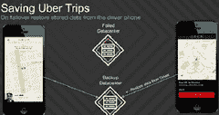

# 优步变得非常规：使用司机电话作为备份数据中心

> 原文： [http://highscalability.com/blog/2015/9/21/uber-goes-unconventional-using-driver-phones-as-a-backup-dat.html](http://highscalability.com/blog/2015/9/21/uber-goes-unconventional-using-driver-phones-as-a-backup-dat.html)

在[中，Uber 如何扩展其实时市场平台](http://highscalability.com/blog/2015/9/14/how-uber-scales-their-real-time-market-platform.html)，最吸引人的提示之一是 Uber 如何使用驱动程序电话作为外部分布式存储系统进行恢复来处理数据中心故障转移。

现在我们从 Uber 的 [Nikunj Aggarwal](https://www.linkedin.com/pub/nikunj-aggarwal/20/878/3b4) 和 [Joshua Corbin](https://www.linkedin.com/in/joshuatcorbin) 了解了更多有关该系统的工作原理，他们在 [@Scale](http://www.atscaleconference.com/) 会议上发表了非常有趣的演讲： [。Uber 如何将您的手机用作备份数据中心](https://www.youtube.com/watch?v=0EhTOKcwRok)。

Uber 并未使用传统的后端复制方案，在该方案中，数据库在数据中心之间同步状态以实现 [k-safety](https://my.vertica.com/docs/5.0/HTML/Master/10730.htm) 的度量，而 Uber 做了一些不同的事情，他们要做的是将足够的状态存储在驱动程序电话上，以便在数据中心进行故障转移时 发生故障信息不会在故障转移上丢失。

为什么选择这种方法？ 传统方法会简单得多。 我认为这是要确保客户始终拥有良好的**客户体验**，并且由于主动出行而丢失行程信息会带来可怕的客户体验。

通过围绕电话建立他们的同步策略，甚至认为它很复杂且需要大量工作，Uber 能够保留旅行数据并即使在数据中心发生故障时也能提供无缝的客户体验。 使客户满意是至关重要的，尤其是在**接近零转换成本**的市场中。

因此，目标是即使在数据中心故障转移时也不会丢失行程信息。 使用传统的数据库复制策略，由于与[网络管理系统](http://whatis.techtarget.com/definition/network-management-system)始终必须工作的方式类似的原因，不可能做出此保证。 让我解释。

在网络设备中，状态信息的权威来源是**，例如分组错误，警报，发送和接收的分组等等。 网络管理系统对诸如警报阈值和客户信息之类的配置数据具有权威性。 麻烦的是设备与网络管理系统并不总是保持联系，因此它们不同步，因为它们彼此独立地工作。 这意味着在启动，故障转移和通信重新连接时，所有这些信息都必须使用复杂的舞蹈在两个方向上合并，以确保正确性和一致性。**

Uber 有同样的问题，只有设备是智能手机，而手机所包含的权威状态是出行信息。 因此，在启动，故障转移和通信重新连接时，必须保留行程信息，因为电话**是行程信息**的权威来源。

即使失去连接，电话也能准确记录所有行程数据。 因此，您不希望将行程数据从数据中心向下同步到手机，因为这会清除手机上的正确数据。 正确的信息必须来自电话。

Uber 还从网络管理系统中吸取了另一招。 他们定期查询电话以测试数据中心中信息的完整性。

让我们看看他们是如何做到的...

## 将电话用作数据中心故障存储的动机

*   不久前，发生故障的数据中心将导致客户旅行丢失。 现在已解决。 在数据中心发生故障时，客户可以立即返回旅途，几乎没有明显的停机时间。

*   将旅行的请求，提供给驾驶员的旅行，接受的旅行，上车的乘客以及结束旅行的过程称为**状态更改转换**。 只要行程持续，行程交易就持续。

*   从行程开始起，便在后端数据中心中创建了行程数据。 似乎每个城市都有一个指定的数据中心。

*   **数据中心故障的典型解决方案**：将数据从活动数据中心复制到备份数据中心。 很好理解，并且可以很好地工作，具体取决于您的数据库。 缺点：

    *   超出了两个备份数据中心的复杂性。

    *   数据中心之间的复制滞后。

    *   它需要数据中心之间的恒定高带宽，特别是如果您的数据库对数据中心复制没有很好的支持，或者您尚未调整业务模型来优化增量。

    *   （一个尚未被谈论的好处，对于 Uber 而言可能并不重要，但对于较小的参与者而言可能是重要的，因为驾驶员电话计划通过不必为数据中心间的带宽支付那么多钱来补贴带宽成本。 ）

*   **具有创造力的应用程序意识的解决方案**：由于与驾驶员电话的持续通信只是将数据保存到驾驶员电话。 优点：

    *   可以故障转移到任何数据中心。

    *   避免了电话故障转移到错误的数据中心的问题，这将导致丢失所有行程。

*   使用驱动程序电话来保存数据中心备份需要复制协议。

    *   与数据中心通信时，会发生所有状态转换。 例如，有一个 Begin Trip 或 Begin Drive 请求，这是与手机交换状态数据并拥有手机存储数据的绝佳机会。

    *   在数据中心故障转移上，当电话 ping 新数据中心时，需要从电话中请求行程数据。 停机时间非常短。 （没有有关如何处理数据中心地图的信息）。

*   挑战：

    *   并非驾驶员可以访问所有保存的行程信息。 例如，一次旅行有很多关于所有骑手的信息，这些信息不应该被公开。

    *   必须假设驱动程序手机可能受到攻击，这意味着必须对数据进行防篡改。 因此，所有数据都在手机上进行了加密。

    *   希望保持复制协议尽可能简单，以便于推理和调试。

    *   最小化额外带宽。 使用基于电话的方法，可以调整要序列化的数据和保留的增量，以最大程度地减少移动网络上的流量。

*   复制协议

    *   一个简单的键值存储模型用于键操作的获取，设置，删除，列表。

    *   只能设置一次密钥，以防止意外覆盖和乱码消息问题。

    *   设置了一次之后，规则版本控制就必须移入密钥空间。 更新存储的行程的过程如下：set（“ trip1，version2”，“ yyu”）; delete（“ trip1，version1”）。 这样做的好处是，如果在设置和删除之间出现故障，将存储两个值，而不存储任何值。

    *   故障转移解决方案只需通过以下方法在电话和新数据中心之间合并密钥即可：将存储的密钥与驾驶员已知的任何正在进行的行程进行比较； 对于任何丢失的数据，可能会向手机发送一个或多个 *get* 操作。

## 他们如何获得系统大规模运行的可靠性

### 目标

*   **确保系统未阻塞，同时仍提供最终的一致性**。 即使系统关闭，系统中的任何后端应用程序也应能够取得进展。 应用程序应该做出的唯一权衡是，将数据存储在手机上可能要花费一些时间。

*   **能够在数据中心之间移动而不必担心已有的数据**。 需要一种在驱动程序和服务器之间协调数据的方法。

    *   当故障转移到该数据中心具有活动驱动程序和行程的视图的数据中心时，该数据中心中的任何服务都不知道发生了故障。

    *   在故障恢复到原始数据中心时，驱动程序和旅行数据过时，这会带来糟糕的客户体验。

*   **使其可测试**。 数据中心故障很少见，因此通常很难测试。 他们希望能够不断地衡量系统的成功，以便他们可以确信故障转移在发生时将成功。

### 流程

*   驾驶员进行更新/状态更改，例如，载客。 该更新是对调度服务的请求。

*   调度服务更新了行程的行程模型。 该更新将发送到复制服务。

*   复制服务将请求排队并返回成功。

*   调度服务更新其自己的数据存储并将成功返回给移动客户端。 也可能会返回其他数据，例如，如果是 Uber 泳池旅行，则可能需要接载其他乘客。

*   在后台，复制服务对数据进行加密并将其发送到消息服务。

*   消息服务维护所有驱动程序的双向通道。 此通道与驱动程序用来与服务进行通信的原始请求通道分开。 这确保了正常的业务运营不会受到备份过程的影响。

*   Messenger Service 将备份发送到电话。

*   这种设计的好处：

    *   **应用程序已与复制延迟和故障**隔离。 复制服务将立即返回。 应用程序只需要进行廉价调用（在同一数据中心内）即可复制数据。

    *   **消息服务支持电话的任意查询，而不会影响正常的业务运营**。 可以将电话视为基本键值存储。

### 在数据中心之间移动

*   第一种方法是**在故障转移**上手动运行脚本，以从数据库中清除旧状态。 由于有人必须这样做，因此该方法具有**手术疼痛**。 由于可以一次或多次在多个城市进行故障转移，因此脚本变得太复杂了。

*   回想一下，它们的键值数据库中的键包含行程 ID 和版本号。 版本号曾经是一个递增号。 更改为**修改矢量时钟**。 使用**手机上的矢量时钟数据可以与服务器**上的数据进行比较。 任何因果关系违规都可以被发现并解决。 这解决了进行中的行程的协调问题。

*   传统上，已完成的旅行将从手机中删除，因此复制数据不会无限制地增长。 问题在于，当故障恢复到原始数据中心时，该数据中心将具有陈旧的数据，这可能会导致调度异常。 该修复程序在旅途完成时使用了特殊的[墓碑](https://en.wikipedia.org/wiki/Tombstone_(data_store))键。 该版本带有一个标志，指示旅程已完成。 当复制服务看到该标志时，它可以告诉调度服务该行程已完成。

*   存储旅行数据非常昂贵，因为它是 JSON 数据的加密大块。 完成的行程需要更少的存储空间。 可以将一个星期的已完成旅行与一个活动旅行存储在同一空间中。

### 确保 99.99％的可靠性

*   故障转移系统不断进行测试，以建立其正常工作以及故障转移将成功的信心。

*   第一种方法是各个城市的**手动故障转移**。 然后通过查看日志来查看还原和调试问题的成功率。

    *   **高手术疼痛**。 每周手动执行此过程无效。

    *   **糟糕的客户体验**。 对于少数未能正确恢复的行程，必须调整票价。

    *   **低覆盖率**。 一次只能测试几个城市，并且由于某些问题仅针对特定城市，这可能是由于具有特定于城市的新功能所致，这些错误将被忽略。

    *   **不知道备份数据中心是否可以处理负载**。 有一个主数据中心和一个备用数据中心。 即使它们的配置相同，您如何知道备份数据中心可以解决雷电群问题，即故障转移时发生的大量请求。

*   为了解决这些问题，他们**研究了他们要测试的系统中的关键概念**。

    *   **确保调度服务中的所有突变实际上都存储在电话中**。 例如，司机接客后可能会失去连接，因此复制数据可能不会立即发送到电话。 需要确保最终将数据发送到手机。

    *   **确保可以将存储的数据用于复制**。 例如，是否存在任何加密/解密问题。 在合并备份数据时是否有任何问题？

    *   **确保备份数据中心可以处理负载**。

*   为了监视系统的运行状况，诞生了监视服务。

    *   服务每小时都会从调度服务中获取所有活动驾驶员和行程的列表。 对于所有驱动程序，消息服务用于获取复制数据。

    *   然后比较数据以查看数据是否符合预期。 这产生了许多良好的健康指标，例如失败的百分比。

    *   按地区和应用程序版本划分指标对于查明问题有很大帮助。

*   **影子恢复**用于测试备份数据中心。

    *   Monitoring Service 收集的数据被发送到备份数据中心以进行影子恢复。

    *   **成功率**是通过使用 Dispatch Service 查询和比较来自主数据中心的快照与活动的驱动程序和来自备份数据中心的行程的数量来计算的。

    *   还计算了有关备份数据中心如何处理负载的指标。

    *   这种方法可以解决备份数据中心中的任何配置问题。

## 相关文章

*   [关于 Hacker News 3](https://news.ycombinator.com/item?id=10446835) / [关于 HackerNews](https://news.ycombinator.com/item?id=10253158) / [关于 HackerNews 2](https://news.ycombinator.com/item?id=10271850) / [关于 reddit](https://www.reddit.com/r/programming/comments/3mp4al/uber_goes_unconventional_using_driver_phones_as_a/)
*   [数据服务与 Uber 搭便车](https://www.youtube.com/watch?v=Dg76cNaeB4s)

我在职业生涯中花费了大量时间来构建可在对等数据库上运行的应用程序，因此我看到了这种好处。 文章未涉及的一件事是，在多大程度上使用手机上的本地数据可以对开发人员提高生产力。

数据字段可以由应用添加，而无需在客户端/服务器/数据库堆栈之间协调架构。 对等同步在开发环境中也很方便，因此您的手机可以“修复”在开发笔记本电脑上运行的数据中心。 这样，您可以从云中的真实数据中心加载数据，重建应用程序，并将其同步到工作台。

一旦接受了点对点数据模型，许多拓扑选择就会成为后期绑定。 数据可以根据需要进行分配。 这带来了各种开发和部署灵活性，例如此处所述的故障转移弹性。

很好，因此它们不仅是螺丝刀，而且现在也减轻了他们的能源和存储负担。 要走的路，布伯。

这种方法不是新方法，也无法解决任何问题。
如果您的数据中心无法处理故障转移，则不妨锁上办公室的门并扔掉钥匙。

一旦计划好行程，很明显电话必须具有离线数据，以确保驾驶员到达目的地不会有问题。 这里的假设是数据中心可能会发生故障，但是设备呢？ 到处都是死区，当您输入死区时，您的设备将没有数据，因此如果没有离线数据，您将陷入死水。

与其花时间和精力来想出这种方案，不如研究如何构建坚如磐石的 DC 更好。

客户体验的这场革命不仅为客户带来了新的便利，而且被证明是一种成功的商业模式。 例如，Uber 已经从仅在旧金山运营，发展成为全球发展最快的企业之一。 您现在可以在 35 个国家/地区“购物”。 同样地，像 Lyft 这样的竞争对手似乎也通过这种新生的客户体验剧变而朝着世界统治方向发展。