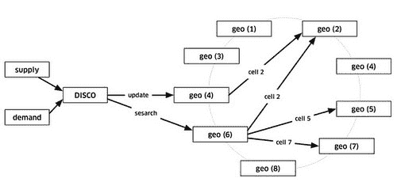

# Uber 如何扩展其实时市场平台

> 原文： [http://highscalability.com/blog/2015/9/14/how-uber-scales-their-real-time-market-platform.html](http://highscalability.com/blog/2015/9/14/how-uber-scales-their-real-time-market-platform.html)

据报道，[优步](https://www.uber.com/)在短短四年中增长了惊人的 [38 倍。 现在，我认为这是第一次，Uber 首席系统架构师](http://www.latimes.com/business/la-fi-0822-uber-revenue-20150822-story.html) [Matt Ranney](https://twitter.com/mranney) 在一个非常有趣且详细的演讲中-[扩展 Uber 的实时市场平台](http://www.infoq.com/presentations/uber-market-platform)- 告诉我们有关 Uber 软件如何工作的很多信息。

如果您对 Surge 定价感兴趣，则不在讨论之列。 我们确实了解了 Uber 的调度系统，如何实现地理空间索引，如何扩展系统，如何实现高可用性以及如何处理故障，包括使用驱动程序电话作为外部分布式存储系统来处理数据中心故障的惊人方式。 复苏。

演讲的整体印象是非常快速的增长之一。 他们做出的许多架构选择都是由于快速发展并试图授权最近组建的团队尽快行动而造成的。 后端已经使用了许多技术，因为他们的主要目标是使团队尽可能快地提高工程速度。

在一个可以理解的混乱（非常成功）的开始之后，Uber 似乎已经学到了很多关于他们的业务以及他们真正需要成功的知识。 他们的早期派遣系统是一个典型的使其工作正常的事情，在更深的层次上假设它仅在移动人员。 现在，Uber 的使命已经发展为可以处理箱子，杂货以及人员，他们的调度系统已经抽象出来，并奠定了非常坚实和智能的架构基础。

尽管马特（Matt）认为他们的体系结构可能有点疯狂，但是在他们的用例中似乎使用了带有八卦协议的一致哈希环的想法。

很难不为 Matt 对工作的真正热情着迷。 在谈到 DISCO，即他们的调度系统时，他激动地说道，这就像是学校里的旅行推销员问题。 这是很酷的计算机科学。 即使解决方案不是最佳解决方案，但它还是由在容错范围内的可扩展组件构建的，实时，真实的规模实用的旅行推销员。 多么酷啊？

因此，让我们看看 Uber 在内部的工作方式。 这是我对 Matt [演讲](http://www.infoq.com/presentations/uber-market-platform) 的演讲：

## 统计信息

*   Uber 地理空间指数的目标是每秒写入一百万次。 阅读的倍数。

*   调度系统具有数千个节点。

## 平台

*   Node.js

*   Python

*   Java

*   转到

*   iOS 和 Android 上的本机应用程序

*   微服务

*   Redis

*   Postgres

*   MySQL

*   [修复](http://basho.com/)

*   Twitter 的 Redis 的 [Twemproxy](https://github.com/twitter/twemproxy)

*   Google 的 [S2 几何库](https://code.google.com/p/s2-geometry-library/)

*   [铃声](https://github.com/uber/ringpop-node) -一致的哈希环

*   [TChannel](https://github.com/uber/tchannel) -RPC 的网络复用和成帧协议

*   节俭

## 常规

*   Uber 是一个运输平台，用于将骑手与驾驶员伙伴联系起来。

*   挑战：**将动态需求与动态供应实时匹配**。 在供应方，驾驶员可以自由地做他们想做的任何事情。 在需求方，骑手需要时随时需要运输。

*   Uber 的 Dispatch 系统是一个实时市场平台，可使用手机将驾驶员与骑手相匹配。

*   除夕是 Uber 一年中最繁忙的时间。

*   容易忘记该行业取得如此巨大进步的速度。 技术的发展是如此之快，以至于最近令人惊奇的事物很快就消失了。 二十三年前，手机，互联网和 GPS 只是科幻小说，而现在我们几乎没有注意到它。

## 体系结构概述

*   驱动这一切的是运行本机应用程序的手机上的骑手和驾驶员。

*   后端主要为手机流量提供服务。 客户通过移动数据和尽力而为的 Internet 与后端对话。 您能想象 10 年前基于移动数据开展业务吗？ 我们现在可以做这种事情真是太棒了。 没有使用专用网络，没有花哨的 QoS（服务质量），只有开放的 Internet。

*   客户连接到与驾驶员和骑手相匹配的调度系统，供需。

*   Dispatch 几乎完全用 node.js 编写。

    *   计划将其移至 [io.js](https://iojs.org/en/index.html) ，但是从那时起，io.js 和 node.js [已合并](http://www.infoworld.com/article/2923081/javascript/reunited-io-js-rejoins-with-node-js.html) 。

    *   您可以使用 javascript 做有趣的分布式系统。

    *   很难低估**的生产能力，而节点开发人员**非常热情。 他们可以很快完成很多工作。

*   整个 Uber 系统似乎非常简单。 为什么您需要所有这些子系统以及所有这些人？ 只要这样，那便是成功的标志。 有很多事情要做，只要看起来很简单，他们就完成了自己的工作。

*   **地图/ ETA** （预计到达时间）。 为了使 Dispatch 做出明智的选择，必须获取地图和路线信息。

    *   街道地图和历史旅行时间用于估计当前旅行时间。

    *   语言在很大程度上取决于要与哪个系统集成。 因此，有 Python，C ++和 Java

*   **服务**。 有大量的业务逻辑服务。

    *   使用微服务方法。

    *   主要用 Python 编写。

*   **数据库**。 使用了许多不同的数据库。

    *   最古老的系统是用 Postgres 编写的。

    *   Redis 经常使用。 有些落后于 Twemproxy。 有些是自定义群集系统的背后。

    *   MySQL

    *   Uber 正在建立自己的分布式列存储，该存储可编排一堆 MySQL 实例。

    *   某些分派服务在 Riak 中保持状态。

*   **行程后管道**。 旅行结束后必须进行很多处理。

    *   收集评分。

    *   发送电子邮件。

    *   更新数据库。

    *   安排付款。

    *   用 Python 编写。

*   **金钱**。 Uber 与许多支付系统集成。

## 旧派送系统

*   最初的 Dispatch 系统的局限性是**开始限制公司**的成长，因此必须进行更改。

*   尽管 [Joel Spolsky 说了](http://www.joelonsoftware.com/articles/fog0000000069.html) ，但大部分内容还是重写了整个内容。 其他所有系统都没有被触及，甚至 Dispatch 系统中的某些服务都得以幸存。

*   旧系统是为私人交通设计的，它有很多假设：

    *   每辆车一个车手，不适用于 [Uber Pool](https://get.uber.com/cl/uberpool/) 。

    *   迁移人员的想法已深入到数据模型和接口中。 这限制了向新市场和新产品的转移，例如转移食品和盒子。

    *   原始版本由城市分片。 这对可伸缩性很有好处，因为每个城市都可以独立运行。 但是，随着越来越多的城市被添加，它变得越来越难以管理。 有些城市很大，有些城市很小。 一些城市的负载高峰很大，而其他城市则没有。

*   由于构建速度如此之快，它们没有单点故障，所以它们有多点故障。

## 新派送系统

*   为了解决城市分片问题并支持更多产品的问题，必须将供求的概念推广起来，因此创建了**供应服务和需求服务**。

*   供应服务跟踪所有供应的功能和状态机。

    *   要跟踪车辆，有许多属性可以模型化：座椅数量，车辆类型，儿童汽车座椅的存在，轮椅是否可以安装等。

    *   需要跟踪分配。 例如，一辆汽车可能有三个座位，但其中两个就被占用了。

*   需求服务跟踪需求，订单以及需求的所有方面。

    *   如果骑乘者需要汽车安全座椅，则该要求必须与库存相匹配。

    *   如果车手不介意以便宜的价格共享汽车，则必须建模。

    *   如果需要移动箱子或运送食物怎么办？

*   满足所有供求关系的逻辑是称为 DISCO（调度优化）的服务。

    *   旧系统将仅在当前可用供应量上匹配，这意味着正在等待工作的道路上的汽车。

    *   DISCO 支持对未来进行规划，并在可用信息时加以利用。 例如，修改正在进行的行程中的路线。

    *   **按供应商**的地理位置。 DISCO 需要地理空间索引来根据所有供应的位置和预期的位置来做出决策。

    *   **按需求分配地理位置**。 需求还需要地理索引

    *   需要更好的路由引擎来利用所有这些信息。

### 调度

*   当车辆四处行驶时，位置更新将通过供应发送到地理位置。 为了使驾驶员与驾驶员匹配或仅在地图上显示汽车，DISCO 通过供应向地理区域发送请求。

*   按供应商的地理位置会制作一个粗糙的首过滤波器，以获取附近符合要求的候选对象。

*   然后，将清单和需求发送到路由/ ETA，以计算它们在地理上而不是在道路系统附近的距离的 ETA。

*   按 ETA 排序，然后将其发送回供应源，以提供给驾驶员。

*   在机场，他们必须模拟虚拟出租车队列。 必须将供应排队，以考虑到货的顺序。

### 地理空间索引

*   必须具有超级可扩展性。 设计目标是**每秒处理一百万次写入**。 写入速率来自于驱动程序，驱动程序在移动时每 4 秒发送一次更新。

*   读取目标是每秒读取的次数多于每秒写入的次数，因为每个打开应用程序的人都在进行读取。

*   通过简化假设，旧的地理空间指数非常有效，它仅跟踪可调度的供应。 供应的大部分都在忙于做某事，因此可用供应的子集易于支持。 在少数几个进程中，全局索引存储在内存中。 进行非常幼稚的匹配非常容易。

*   在新世界**中，必须跟踪每个状态下的所有供应**。 此外，还必须跟踪其预计路线。 这是更多的数据。

*   新服务**在数百个进程**上运行。

*   地球是一个球体。 单纯基于经度和纬度很难进行汇总和近似。 因此，Uber 使用 Google S2 库将地球分成了微小的单元。 每个单元都有唯一的单元 ID。

*   使用 int64 可以表示地球上每平方厘米。 Uber 会使用 12 级的单元，其大小从 3.31 km（2）到 6.38 km（2），具体取决于您在地球上的哪个位置。 盒子根据它们在球体上的位置而改变形状和大小。

*   S2 可以提供形状的覆盖范围。 如果要绘制一个以伦敦为中心，半径为 1 公里的圆，S2 可以告诉您需要哪些单元格才能完全覆盖该形状。

*   由于每个单元都有一个 ID，因此该 ID 被用作分片密钥。 当从供应中获得位置时，将确定该位置的小区 ID。 使用单元 ID 作为分片键，可以更新耗材的位置。 然后将其发送到几个副本。

*   当 DISCO 需要在某个地点附近寻找补给品时，将以骑手所在的位置为中心，计算一个圆的覆盖范围。 使用圆圈区域中的单元 ID，将所有相关的分片联系起来以返回供应数据。

*   全部可扩展。 即使效率不如您期望的那样，并且由于扇出相对便宜，所以可以始终通过添加更多节点来扩展写负载。 通过使用副本来缩放读取负载。 如果需要更多的读取容量，则可以增加复制因子。

*   一个限制是单元格大小固定为 12 级大小。 将来可能会支持动态单元大小。 需要进行权衡，因为像元大小越小，查询的扇出越大。

### 路由

*   从地理空间得到答案后，必须对选项进行排名。

*   有几个高级目标：

    *   **减少额外的驱动**。 驾驶是人们的工作，因此人们渴望提高生产力。 他们获得额外的出行报酬。 理想情况下，驾驶员应连续行驶。 一堆工作会排队等待，他们将为此获得报酬。

    *   **减少等待**。 骑手应等待的时间尽可能短。

    *   **总体 ETA 最低**。

*   旧的系统是让需求搜索当前可用的供应，匹配并完成。 它易于实施且易于理解。 对于私人交通来说，它工作得很好。

*   仅查看当前的可用性无法做出好的选择。

*   的想法是，与正在远处行驶的驾驶员相比，当前正在运送驾驶员的驾驶员可能更适合要求乘车的顾客。 挑选出行驾驶员可以最大程度地减少客户的等待时间，并可以减少远程驾驶员的额外驾驶时间。

*   这种尝试展望未来的模型可以更好地处理动态条件。

    *   例如，如果某个驾驶员在客户附近上线，但已经从较远的地方派遣了另一个驾驶员，则无法更改分配决策。

    *   另一个示例涉及愿意共享旅程的客户。 通过尝试在非常复杂的场景中预测未来，可以进行更多优化。

*   在考虑运送盒子或食物时，所有这些决定变得更加有趣。 在这些情况下，人们通常还有其他事情要做，因此涉及不同的权衡。

## 缩放调度

*   使用 node.js 构建调度程序。

*   他们正在建立有状态服务，因此无状态扩展方法将行不通。

*   Node 在单个进程中运行，因此必须设计某种方法以在同一台计算机上的多个 CPU 上以及多个计算机上运行 Node。

*   有一个关于在 Javascript 中重新实现所有 Erlang 的笑话。

*   用于扩展 Node 的解决方案是 *ringpop* ，这是一种具有八卦协议的一致哈希环，实现了可扩展的，容错的应用程序层分片。

*   在 CAP 术语中，ringpop 是 **AP 系统**，为了获得可用性而进行交易。 最好说明一些不一致之处，而不是提供停机服务。 最好起床并偶尔出错。

*   铃声是每个 Node 进程中都包含的可嵌入模块。

*   节点实例在成员资格集周围闲聊。 一旦所有节点都同意谁是谁，他们就可以独立有效地做出查找和转发决策。

*   这确实是可扩展的。 添加更多流程，完成更多工作。 它可用于分片数据，或用作分布式锁定系统，或协调 pub / sub 或长轮询套接字的集合点。

*   八卦协议基于 [SWIM](https://www.cs.cornell.edu/~asdas/research/dsn02-swim.pdf) 。 已经进行了一些改进以缩短收敛时间。

*   闲聊的成员列表随处可见。 随着添加更多节点，它是可伸缩的。 SWIM 中的“ S”是可扩展的，确实有效。 到目前为止，**已扩展到数千个节点。**

*   SWIM 将健康检查与成员身份更改结合在一起，作为同一协议的一部分。

*   在铃声系统中，所有这些 Node 进程都包含铃声模块。 他们八卦当前成员。

*   在外部，如果 DISCO 要消耗地理空间，则每个节点都是等效的。 选择一个随机的健康节点。 请求到达的任何地方都负责使用哈希环查找将请求转发到正确的节点。 看起来像：

*   使所有这些跃点和对等体互相交谈可能听起来很疯狂，但是它会产生一些非常好的属性，例如可以通过在任何计算机上添加实例来扩展服务。

*   ringpop 是基于 Uber 自己的称为 *TChannel* 的 RPC 机制构建的。

    *   这是一个双向请求/响应协议，其灵感来自 Twitter 的 [Finagle](https://twitter.github.io/finagle/) 。

    *   一个重要的目标是控制许多不同语言的性能。 特别是在 Node 和 Python 中，许多现有的 RPC 机制无法很好地发挥作用。 想要 redis 级性能。 **TChannel 已经比 HTTP** 快 20 倍。

    *   想要高性能的转发路径，以便中间人可以非常轻松地做出转发决策，而不必了解完整的有效负载。

    *   希望进行适当的流水线处理，以免出现线头阻塞，请求和响应可以随时沿任一方向发送，并且每个客户端也是一台服务器。

    *   希望引入有效负载校验和和跟踪以及一流的功能。 每个请求遍历系统时都应该是可跟踪的。

    *   想要从 HTTP 清除迁移路径。 HTTP 可以非常自然地封装在 TChannel 中。

    *   **Uber 退出了 HTTP 和 Json 业务**。 一切都在通过 TChannel 进行节俭。

*   铃声正在通过基于 TChannel 的持久连接进行所有八卦。 这些相同的持久连接用于扇出或转发应用程序流量。 TChannel 也用于服务之间的通话。

## 派送可用性

*   **可用性很重要**。 优步拥有竞争对手，转换成本非常低。 如果 Uber 暂时倒闭，那笔钱就会流向其他人。 其他产品的粘性更大，客户稍后会再试。 Uber 不一定是这样。

*   **使所有内容均可重试**。 如果某些操作无效，则必须重试。 这就是解决故障的方法。 这要求所有请求都是幂等的。 例如，重试发送不能将它们发送两次或对某人的信用卡收取两次费用。

*   **使所有东西都可以杀死**。 失败是常见的情况。 随机杀死进程不应造成损害。

*   **仅崩溃**。 没有正常关机。 正常关机不是必需的做法。 当意外情况发生时，需要练习。

*   **小块**。 为了最大程度地减少失败带来的损失，请将它们分成更小的部分。 可能可以在一个实例中处理全局流量，但是当该流量消失时会发生什么呢？ 如果有一对，但其中一个发生故障，则容量将减少一半。 因此，服务需要分解。 听起来像是技术问题，但更多是文化问题。 拥有一对数据库会更容易。 这是很自然的事情，但是配对不好。 如果您能够自动升级一个并重新启动新的辅助节点，则随机杀死它们是非常危险的。

*   **杀死所有东西**。 甚至杀死所有数据库，以确保有可能幸免于此类失败。 这就需要改变使用哪种数据库的决策，他们选择了 Riak 而不是 MySQL。 这也意味着使用铃声而不是 redis。 杀死 redis 实例是一项昂贵的操作，通常，删除它们的规模很大而且代价很高。

*   **将其分解为较小的块**。 谈论文化转变。 通常，服务 A 将通过负载平衡器与服务 B 对话。 如果负载均衡器死了怎么办？ 您将如何处理？ 如果您从不走那条路，那您将永远不会知道。 因此，您必须终止负载均衡器。 您如何绕过负载均衡器？ 负载平衡逻辑必须放在服务本身中。 客户需要具有一定的智能才能知道如何解决问题。 这在哲学上类似于 Finagle 的工作方式。

*   为了使整个系统扩展并处理背压，已经从一系列的 poppop 节点中创建了一个服务发现和路由系统。

## 总数据中心故障

*   这种情况很少发生，但是可能会发生意外的级联故障，或者上游网络提供商可能会发生故障。

*   Uber 维护着一个备份数据中心，并安装了交换机以将所有内容路由到备份数据中心。

*   问题是进程内旅行的数据可能不在备份数据中心中。 他们不是使用复制数据，而是使用驾驶员电话作为行程数据的来源。

*   发生的情况是调度系统**定期向驱动器电话**发送加密的状态摘要。 现在，假设有一个数据中心故障转移。 下次驾驶员电话向 Dispatch 系统发送位置更新时，Dispatch 系统将检测到该行程不知道，并向州政府索要状态摘要。 然后，派遣系统会根据状态摘要进行自我更新，并且旅行就像没有发生一样继续进行。

## 不利之处

*   Uber 解决可扩展性和可用性问题的方法的弊端是潜在的高延迟，因为 Node 进程之间相互转发请求并发送扇出的消息。

*   在扇出系统中，微小的斑点和毛刺会产生惊人的巨大影响。 系统中的扇出程度越高，发生高延迟请求的机会就越大。

*   一个好的解决方案是通过跨服务器取消来拥有**备份请求。 这是 TChannel 的一流功能。 将请求与信息一起发送到服务 B（2）的请求一起发送到服务 B（1）。 然后，稍后将请求发送到服务 B（2）。 B（1）完成请求后，将取消 B（2）上的请求。 有了延迟，这意味着在通常情况下 B（2）没有执行任何工作。 但是，如果 B（1）确实失败了，那么 B（2）将处理该请求并以比首先尝试 B（1），发生超时然后再尝试 B（2）更低的延迟返回响应。**

*   请参见 [Google 延迟容忍系统：将不可预测的部分](http://highscalability.com/blog/2012/6/18/google-on-latency-tolerant-systems-making-a-predictable-whol.html) 制成可预测的整体，以获取更多背景知识。

## 相关文章

*   [关于 HackerNews](https://news.ycombinator.com/item?id=10216019)

*   [S2map.com](http://s2map.com/) -请参见 S2 覆盖率和绘制形状

感谢您写这篇文章。 令人着迷的阅读！

很棒的文章，非常有趣，并深入研究@uber 工作中的思想过程。