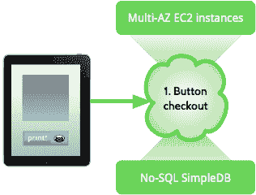
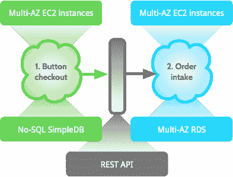
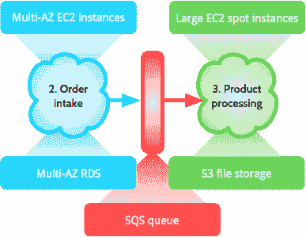
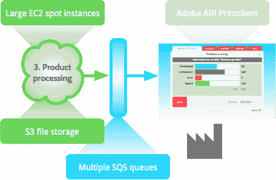

# Peecho Architecture-鞋带上的可扩展性

> 原文： [http://highscalability.com/blog/2011/8/1/peecho-architecture-scalability-on-a-shoestring.html](http://highscalability.com/blog/2011/8/1/peecho-architecture-scalability-on-a-shoestring.html)

*这是 [Marcel Panse](http://www.linkedin.com/in/marcelpanse "Marcel Panse") 和 [Sander Nagtegaal](http://www.linkedin.com/in/centrical "Sander Nagtegaal") 来自 [Peecho](http://www.peecho.com) 的来宾帖子。*

尽管对体系结构的描述很有趣，但是几乎没有解决过初创企业面临的问题。 我们想改变它，所以这是我们的建筑故事。

## 初创公司介绍

阿姆斯特丹的[公司 Peecho](http://www.peecho.com) 提供打印即服务。 我们可嵌入的*打印按钮*使您可以直接在自己的网站上以专业打印产品的形式出售数字内容，例如相簿，杂志或画布。 也有一个 API。

Printcloud 是为打印按钮供电的系统。 它仅存在于云中，在需要时会增长，并在可能时变得更小。 该系统可以接收打印订单，神奇地将棘手的数据转换为可打印的文件，并将订单发送到最接近预期收件人的生产设施。

为了保护环境，Peecho 的理念是促进全球订购，但仅针对本地生产。

## 昂贵的东西无法扩展

我们是一家初创企业，因此在开始之前我们考虑过的最重要的事情就是*资金*-或缺少资金。 尽管我们需要一些强大的火力，但完整的操作系统每月花费不超过几百美元。

资金问题一直贯穿到我们的技术堆栈中。 我们可以在此处插入一些有关面向对象，代码编译或 MVC 架构的好东西-但最后，我们只需要一个无需花钱的广泛的开发工具包。 因此，我们开发人员社区的计算机科学背景使我们注意到了 Java 平台。

使用云计算是无用的，因为按需扩展可以消除昂贵的产能过剩。 我们的候选清单包含 [Google App Engine](http://code.google.com/appengine/ "GAE") 和 [Amazon Web Services](http://aws.amazon.com "AWS") 。 这些大分子拥有比我们更多的资源和可扩展性经验。 这就是为什么我们发誓要尽可能多地使用他们的云服务，而不是自己构建东西。 但是，我们需要排队和关系数据存储-退出 Google。

因此，我们选择使用 SimpleDB，S3，SQS，EC2，RDS，IAM，Route 53 和 Cloudfront 在 Amazon Web Services 之上构建。 它便宜且通常可靠。 可以肯定的是，我们的整个系统在两个 AWS 可用区中同时运行，以确保最大的正常运行时间。 如果我们下去，一半的世界将与我们同在。

## 如果你慢一点，你就无法成长

但是，技术不是万能的。 小公司的可扩展性很大程度上是通过灵活性获得的。 快点 我们尝试使代码保持简单，因此重构很容易。 结果，我们只能负担所需的最低限度的费用，而无需考虑过多的未来需求。 我们可以稍后解决。

如果您真的想快一点，那么短迭代很重要。 平均而言，我们大约每周一次将新软件发布到生产环境中。 为了跟上这一步，我们每月组织一次晚餐。 届时将展示演示，每个人都为新内容欢呼和鼓掌。

有许多负担得起的帮助可帮助您快速入门。 例如，我们根据 [Scrum](http://en.wikipedia.org/wiki/Scrum_(development) "Scrum") 和[测试驱动开发](http://en.wikipedia.org/wiki/Test-driven_development "TDD")进行开发。 我们使用 [Jira](http://www.atlassian.com/software/jira/ "Jira") 和 [Greenhopper](http://www.atlassian.com/software/greenhopper/ "Greenhopper") 进行需求管理，使用 [Bamboo](http://www.atlassian.com/software/bamboo/ "Bamboo") 进行持续集成， [Sonar](http://www.sonarsource.org/ "Sonar") 进行代码质量监控，并使用 [Mercurial](http://mercurial.selenic.com/ "Mercurial") ]进行分布式版本控制。

顺便说一下，Atlassian 产品的数量众多，部分是由其*廉价的启动许可证*来解释的-但无论如何它都是好东西。

## 当然可以，但是架构是什么样的？

打印按钮及其签出作为单独的应用程序存在于我们平台的顶部。 关注点的分离是为了最大程度地减少交互点，从而实现高内聚和低耦合。 该应用程序在 EC2 自动扩展组上运行，顶部带有负载均衡器。 它将订单数据存储在 SimpleDB 中，SimpleDB 是一个可能遭受打击的 AWS No-SQL 数据存储。 静态所有内容都通过 Cloudfront CDN 运行，以避免服务器受到攻击。

确认付款后，打印按钮结帐会将每个订单提交给 REST API。 我们的高级用户可以从他们的应用访问相同的 API，因此我们只需要维护一个接口即可。 它负载均衡到可以自动扩展的多个节点。 使用关系数据库服务 RDS，订单数据保存在两个可用性区域中。

现在，这就是魔术发生的地方。 订单接收机将票证写入处理队列。 每当有足够的票证可用时，新的处理机就会唤醒，获取票证并开始处理糟糕的数据。 我们使用通过竞标未使用的 EC2 容量租用的大型[现货实例](http://aws.amazon.com/ec2/spot-instances/ "spot instances")。 完成这些大炮之后，他们将结果存储在 S3 中，然后自杀。

因此，使用队列指标，随着队列中项目数的变化，我们可以上下调整处理能力的数量。 这样可以节省资金，并为我们为意外中断做好准备。 在您自己执行此操作之前，请记住，每个组件或模块应仅负责特定的功能。 组件或对象不应了解其他组件或对象的内部详细信息。

随后，必须通过将生产票证添加到正确的打印设施队列来将订单路由到正确的生产设施。 通过使用我们的 Adobe AIR Printclient 桌面应用程序或直接集成，该工具可以从队列中检索其作业，并从 S3 文件存储中检索产品文件。 由于不涉及服务器，因此该系统实际上是防弹的。

作为回报，该设施可以通过将消息发布到中央订单状态队列中来更新 Printcloud 中的作业状态。 异步地，我们读取该队列以更新客户的订单。 如果一切顺利，产品将很快发货。

一段时间后，产品文件将从 S3 中删除，以节省存储成本-所有人从此过上幸福的生活。

## 做数学

让我们快速了解我们的每月 AWS 账单。 您应该了解几件事。

*   亚马逊为 SimpleDB 和其他服务提供免费套餐。
*   我们使用欧洲地区集群，该集群比美国集群贵。
*   EC2 实例被保留[一年](http://aws.amazon.com/ec2/reserved-instances/ "reserved EC2 instances")，因此更便宜。
*   竞价型实例通常是讨价还价的，我们假设连续的工作负载为 50％。
*   就像并发 EC2 节点的数量一样，所需的带宽在很大程度上取决于传入的订单数量。

| 任务 | 服务 | 成本估算 |
| --- | --- | --- |
| 打印按钮 | 多可用区 EC2 小实例 | $ 96 |
| 订单量 | Multi-AZ EC2 small instances | $ 96 |
| 处理中 | EC2 大现货实例 | $ 84 |
| 数据库 | 多可用区 RDS | $ 160 |
| 其余的部分 | Cloudfront，S3，SimpleDB，SQS 等 | $ 50 |

一个完全弹性的重型系统每月的总收入为 *486 美元*，该系统具有至少 5 台服务器，2 台数据库服务器，No-SQL 数据存储和外部平面文件存储的功能。

我们认为还不错。

## 我们希望您有便宜的应用

Peecho 证明可以在小范围内创建可扩展的体系结构。 我们希望这些信息对您有用，也将帮助您创建出色的应用程序。 当然，最好带有打印按钮。

感谢您分享信息。 很好地利用 AWS 平台。

一个问题-您如何解决在共享熨斗上获取信用卡号所涉及的 PCI 问题？ 还是该平台当前足够小以至于这还不是认证问题？ 注意：从服务提供商的角度，而不是从最终商家的角度，我对 PCI 更为熟悉，因此这很可能根本不适用于您的情况，这也很有趣：)

非常酷的写作。 谢谢。
您是否使用任何其他工具进行管理/缩放（例如，正确缩放或缩放或类似操作），或者一切都在亚马逊上运行了准系统？

@Richard：对于这种设置，我猜他们使用的是支付服务提供商，负责支付的整个过程。 例如。 您将一个 transactionid 推给支付提供商，一旦客户确认交易，支付提供商就会触发回调并将该交易标记为成功（例如 Paypal 交易：）

@Todd：您已经为 Auto-Scaling 组预先配置了现成的 AMI，还是使用诸如 Chef / Puppet / CFengine 之类的配置管理？

理查德，我不认识他们，但我从事电子商务，所以我可以回应。 如果您足够小，则可以使用隐藏的聚会进行货币交易，例如 Paypal，银行或类似的提供者。
在这种情况下，信用卡号仅由该公司查看和保存，并且您仅收到服务器对服务器的消息，通知付款结果。 他们在文章中说“确认付款后”，所以我想是这样。
我从未尝试过该网站。

我猜他们没有存储任何卡信息，它们可能只是重定向到支付网关 URL，就像贝宝那样。

这不是 BOA，而是 Peecho（如果他们只知道捷克语的意思，请使用不同的拼写）

来自：http://www.pcicomplianceguide.org
问：PCI 适用于谁？
答：PCI 适用于接受，传输或存储任何持卡人数据的所有组织或商家，无论交易规模或交易数量如何。 换句话说，如果该组织的任何客户曾经使用信用卡或借记卡直接向商家付款，则适用 PCI DSS 要求。

您是否发现小型实例的网络带宽足以满足 Web 需求？

“传输”是大问题。 但是我刚刚找到了一个相对较新的文档（去年年底），在该文档中，亚马逊的 AWS 环境获得了 PCI 一级服务提供商使用的认证。 那真的很酷。 嗯...现在，这篇文章甚至更发人深省。

@Todd: You you got preconfigured ready-to-go AMI's for your Auto-Scaling groups or do you use some kind of configuration management like Chef/Puppet/CFengine?