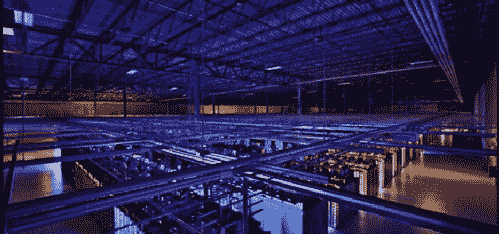
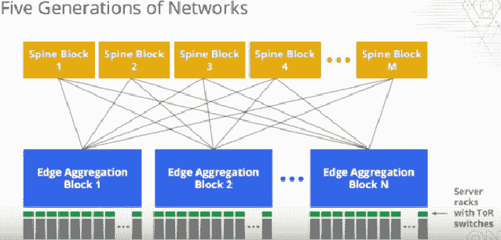

# Google 如何创造只有他们才能创造的惊人的数据中心网络

> 原文： [http://highscalability.com/blog/2015/8/10/how-google-invented-an-amazing-datacenter-network-only-they.html](http://highscalability.com/blog/2015/8/10/how-google-invented-an-amazing-datacenter-network-only-they.html)

最近以自己的骄傲而自豪的 Google [宣布了](http://googlecloudplatform.blogspot.com/2015/06/A-Look-Inside-Googles-Data-Center-Networks.html) ：

> 今天在 2015 年开放网络峰会上，我们将首次揭示五代内部网络技术的详细信息。 从十年前我们的第一个内部数据中心网络 Firehose 到最新一代的 Jupiter 网络，我们已经将单个数据中心网络的容量提高了 100 倍以上。 我们当前的产品-Jupiter 织物-可以提供超过 1 PB / sec 的总 对等带宽 。 从角度来看，这样的容量足以使 100,000 台服务器以 10Gb / s 的速度交换信息，足以在不到 1/10 秒的时间内读取国会图书馆的全部扫描内容。

Google 的数据中心网络是使 Google 真正发挥作用的背后的魔力。 但是什么是“双向带宽”，为什么重要呢？ 早在 [不断变化的架构中，我们讨论了双向带宽：新的数据中心网络将使您的代码和数据免费](http://highscalability.com/blog/2012/9/4/changing-architectures-new-datacenter-networks-will-set-your.html) 。 简而言之，双向带宽是指 Google 服务器用来相互通信的网络。

历史上，数据中心网络的定位是与用户交谈。 假设某网页请求来自浏览器。 该请求将发送到服务器，并通过仅与其他几台服务器（甚至根本没有服务器）进行通信来制作答复，然后将答复发送回客户端。 这种类型的网络称为面向北方/南方的网络。 实施请求几乎不需要内部沟通。

随着网站和 API 服务的日趋丰富，这一切都发生了变化。 现在，可以进行 [数以千计的](http://highscalability.com/blog/2012/6/18/google-on-latency-tolerant-systems-making-a-predictable-whol.html) 后端请求来创建单个网页。 令人振奋。 这意味着通信已从与用户交谈的主导转变为与数据中心内其他计算机的交谈。 因此，这些被称为东西方网络。

向东方/西方主导的通信方式的转变意味着数据中心网络需要不同的 [拓扑结构](https://en.wikipedia.org/wiki/Network_topology) 。 旧的传统 [胖树](https://storagemojo.com/2008/08/24/fat-trees-and-skinny-switches/) 网络设计已经淘汰，需要采取一些新的方法来代替它。

Google 一直处于开发新的丰富服务支持网络设计的最前沿，这主要是因为他们的指导思想是将 [数据中心视为计算机](http://research.google.com/pubs/pub35290.html) 。 一旦您的数据中心成为计算机，您的网络就相当于一台计算机上的 [背板](https://en.wikipedia.org/wiki/Backplane) ，因此它必须尽可能快且可靠，因此远程磁盘 并且可以像访问本地存储一样访问远程存储。

Google 的工作围绕着三个有计划的攻击计划：使用 [Clos 拓扑结构](https://en.wikipedia.org/wiki/Clos_network) ，使用 [SDN](https://www.youtube.com/watch?v=ED51Ts4o3os) （软件定义网络），并以自己的 Googlish 方式构建自己的自定义设备。

到目前为止，我们对 Google 的网络设计的了解有限。 Google 研究员和 Google 联网技术负责人 [Amin Vahdat](http://research.google.com/pubs/AminVahdat.html) 虽然没有完全访问权限，但在 精彩演讲： [ONS [开放网络峰会] 2015：星期三主题演讲](https://www.youtube.com/watch?v=FaAZAII2x0w) 。 还有一篇论文： [Jupiter Rising：Google 数据中心网络](http://conferences.sigcomm.org/sigcomm/2015/pdf/papers/p183.pdf) 的 Clos 拓扑和集中控制的十年。

为什么要比通常提前发布细节？ 谷歌与亚马逊之间存在真正的竞争，因此他们需要找到引人注目的差异化点。 谷歌希望他们的数据中心网络就是其中之一。

那么，是什么让 Google 与众不同？ 整体讯息：

*   摩尔定律的终结意味着程序的构建方式正在发生变化。

*   Google 知道了。 Google 知道如何建立良好的网络并实现适当的数据中心平衡。

*   您可以利用 Google 的云平台（与支持 Google 搜索的平台相同）的创新和功能来实现繁荣。

*   所以爬上去，网络很好！

够了吗？ 也许这不是一个具有广泛吸引力的信息，但它可能会找到有区别的买家的房屋。

我的演讲重点：

*   **我们不知道如何构建可提供大量带宽的大型网络**。 Google 说，他们的网络提供了 1 Pb / sec 的总二等分带宽，但事实证明这还远远不够。 为了支持数据中心的大型计算服务器，您需要 5 Pb / sec 的网络。 请记住，今天整个互联网可能接近 200Tb / s。

*   **在大型群集**上安排作业效率更高。 否则，您会将 CPU 留在一个地方，将内存留在另一个地方。 因此，如果您可以正确地构建系统，那么数据中心规模的计算机将为您带来确定的规模经济。

*   **Google 利用从服务器和存储世界中汲取的经验教训构建了数据中心网络系统**：横向扩展，逻辑上集中化，使用商品组件，从不管理任何单一组件。 统一管理所有服务器，存储和网络。

*   **I / O 差距很大**。 阿明说必须解决，如果没有解决，我们将停止创新。 通过分类可以增加存储容量。 机会是像访问本地数据中心一样访问全局数据中心存储。 使用 Flash 和 NVM 会越来越难。 闪存和 NWM 的新层将完全改变编程模型。 注意：很遗憾，他没有扩大这个概念，我非常希望他能这样做。 阿敏，我们可以谈谈吗？

在一个好故事中，您所寻找的是扮演核心身份角色的角色。 在这里，我们看到 Google 运作的独特愿景来自其在构建可扩展软件系统方面的丰富经验而有机发展。 也许只有 Google 才能勇于遵循自己的愿景，并建立与公认的智慧完全不同的数据中心网络。 这需要巨大的精力。 这造就了一个好故事。

这是我在演讲中毫无希望的不足：

*   十年来，数百人为这项工作做出了贡献。

*   自从大约 30 年前将套接字引入 BSD 以来，分布式编程就面临着同样的挑战。 这将改变。

*   随着摩尔定律的结束，我们对计算的思考方式必须改变，而分布式计算的方式将要改变。

*   计算的关键部分以及人们如何构建自己的系统都围绕存储。

*   我们已经看到，遵循摩尔定律，存储容量有了巨大的增长。

*   I / O 间隙仍然存在。 处理器与他们需要处理的基础数据之间的距离正在不断增加。

*   我们可以认为遍布整个建筑物的磁盘可用于任何服务器。 这是太棒了。 同时，鉴于我们拥有的处理能力，它们正在越来越远地寻找。

*   分布式计算环境中的大规模下一代闪存仍未开发。

*   在计算的未来意义上，网络将扮演至关重要的角色。

*   联网处于拐点。 计算手段将在很大程度上取决于您构建强大网络的能力。

*   因此，数据中心网络是关键的区别因素。

*   Google 建造了建筑规模的计算机。 计算一行一行，存储一行一行。

*   多年来，Google 建立了软件基础架构以利用其硬件基础架构：

    *   GFS（2002），MapReduce（2004），BigTable（2006），Borg（2006），Pregel（2008），Colossus（2010），FlumeJava（2012），Dremel，Spanner。

    *   这些努力中的许多已经定义了当今进行分布式计算的含义。

*   没有世界一流的网络基础架构，您将无法建立世界一流的分布式计算基础架构。 您如何构建像 GFS 这样的系统来利用 100,000 个磁盘，而没有世界一流的网络将它们整合在一起？

*   Google 在网络方面的创新：

    *   Google Global Cache（2006 年）：如何交付内容，包括来自世界各地的视频和静态内容）
    *   守望台（2008）
    *   Freedome：校园级互连
    *   Onix（2010 年
    *   BwE（2010）
    *   B4：Google 的软件定义 WAN，可将全球所有数据中心连接在一起。 它比面向公众的网络更大，并且增长速度更快。
    *   Jupiter（2012）：高带宽数据中心规模联网
    *   Andromeda（2014）：网络虚拟化。 我们如何利用我们的基础网络基础架构，并将其拆分成单个虚拟机，以至于它们拥有自己的高性能网络？ 我们如何打开 Goog​​le 一直用于其服务（例如负载平衡，DDoS 保护，访问控制列表，VPN，路由等）的相同类型的网络虚拟化，以及如何使这些隔离网络在原始硬件上运行（如果可用） ？
    *   QUIC
    *   gRPC：Google 内部使用的多平台 RPC，负载平衡，应用程序级流控制，取消调用，序列化，开源，HTTP / 2。 构建分布式服务的良好基础。

## 数据中心网络

*   数据中心网络与传统 Internet 网络不同。

    *   由单个组织运营，并且已预先计划。 必须发现互联网才能看到它的外观。 您实际上知道网络在数据中心中的外观。 您已经计划好了。 您建立了它。 因此，您可以集中管理它，而不用随便发现它。 由于它是在单一组织的控制下，因此您可以运行的软件可能会大不相同。 它无需与 20 年的历史遗存进行互操作，因此可以针对您的需要对其进行优化。

    *   吸引人们加入网络的通常是问题的美。 美丽可能意味着这是一个难题。 是否可以将问题定义为更简单，更可扩展且更容易？

*   Google 需要一个新的网络。 大约十年前，谷歌发现传统的网络架构，包括硬件和软件，**无法满足**的带宽需求以及数据中心中分布式计算基础架构的规模。

*   我们可以买吗？

    *   Google 无法以任何价格购买能够满足 Google 分布式系统要求的数据中心网络。

*   我们可以运行它吗？

    *   以箱为中心的部署产生了高**操作复杂性**的成本。 即使 Google 买了他们能买到的最大的数据中心网络，用于操作这些网络的模型还是围绕着具有单独命令行界面的单个盒子。

    *   Google 已经知道如何处理成千上万的服务器，就像它们是一台计算机一样，如何处理成千上万的磁盘，就像它们是一个存储系统一样。 必须像管理一千个交换机一样管理一千个交换机**的想法没有多大意义，而且似乎不必要地困难**。

*   我们将构建它。

    *   受服务器和存储领域的经验启发： **横向扩展** 。

    *   无需弄清楚如何购买下一个最大的网络或下一个最大的路由器，而是可以像使用服务器和存储一样，通过使用**个附加商品元素**来扩展交换和路由基础结构。

    *   当出现需要**插入另一个网络元素**以提供更多端口和更多带宽时，为什么不这样做呢？

*   允许 Google 建立横向扩展数据中心网络的三个关键原则：

    *   **Clos 拓扑结构** 。 这个想法是利用小型商品交换机来构建一个可以无限扩展的无阻塞超大型交换机。

    *   **商业硅** 。 由于 Google 并未建立广域网互联网基础架构，因此他们不需要庞大的路由表或深度缓冲。 这意味着商业硅芯片可以完成在数据中心中构建基于 Clos 的拓扑的工作。

    *   **集中控制** 。 软件代理知道网络的外观，设置路由，并对基础计划中的异常做出反应。 知道网络的形状后，管理网络要比不断尝试发现其外观要容易得多。 如果要更改网络，则可以告诉集中控制软件更改网络。

*   数据中心网络的方法也适用于园区网络，将建筑物连接在一起并连接到广域网。 B4 和 Andromeda 受到数据中心网络工作的启发和启发，他们多年来一直在练习构建自己的硬件和集中控制基础结构。

*   在过去 6 年中，数据中心带宽增长了 50 倍。

    *   需要交付给 Google 服务器的带宽超过了摩尔定律。

    *   这意味着要满足 Google 必须能够扩展的带宽需求，就不可能不断地淘汰旧设备并建立新的网络。

*   规模驱动架构。

    *   当今的典型网络（不一定是 Google）可能具有 10K +交换机，250K +链接，10M +路由规则。 **如此规模的网络处理方式与规模较小的网络**根本不同。

*   为什么要建立整个数据中心规模的网络？

    *   一些最大的数据中心拥有 10 兆瓦和 10 兆瓦的计算基础架构。

    *   如果您无法大规模调度，则有大量的 **资源搁浅** 。 想象一下需要在共享基础结构上运行的许多不同的作业。 如果必须在一个群集的边界内调度作业，并且您有 101,000 个服务器群集，而您有 110,000 个服务器群集，那么如果可以在 10,000 个服务器群集中任意调度，则效率会好得多。 如果您可以将作业放置在 10,000 台服务器中的任何位置，而不必放在 1,000 台服务器中，那么这个数字就显得非常少。 因此，如果可以构建一个网络以扩展到整个建筑物，那么从计算和磁盘上获得的效率将更高。 这些最终成为主要成本。 该网络可能非常便宜，并且可以成为计算和存储的促成因素。

    *   “资源搁浅”是指将一个 CPU 留在一个地方，而将内存留在另一个地方（ [源](http://jturgasen.github.io/2014/10/26/tech-takeaway-012-cluster-management-at-google/) ）。

*   平衡您的数据中心。

    *   一旦达到建筑物的规模，就必须确保提供足够的带宽。

    *   不平衡的数据中心缺少**某些资源，这限制了您的价值**。 如果一种资源稀缺，则意味着其他一些资源处于闲置状态，这会增加您的成本。

    *   通常，在数据中心规模上，最稀缺的资源是网络。 由于我们不知道如何构建可提供大量带宽的大型网络，因此网络配置不足。

*   带宽。 阿姆达尔还有另一部法律。

    *   对于并行计算，每 1 Mhz 计算需要 1 Mbit / sec 的 IO。

    *   举例来说，仅在您附近的未来数据中心中，计算服务器具有 64 * 2.5 Ghz 内核，然后为了平衡每个服务器大约需要 100 Gb / s 的带宽。 这不是本地 IO。 本地 IO 无关紧要。 您需要访问数据中心范围的 IO。 数据中心可能有 5 万台服务器； 100k + IOPS 的闪存存储，100 毫秒的访问时间，PB 级存储； 将来，其他一些非易失性存储器技术将具有 1M + IOPS，10 微秒的访问时间和 TB 的存储量。

    *   因此，您将需要 5 Pb / s 的网络和具有相应功能的交换机。 即使超额预订比率为 10：1，这也意味着您将需要 500Tb / s 的数据中心网络来接近平衡。 从角度来看，一个 500Tb / s 的网络比今天的整个 Internet 容量更大（可能接近 200Tb / s）。

*   延迟。 为了实现存储基础架构分解的目标，您需要可预测的低延迟。

    *   磁盘速度很慢，访问延迟为 10 毫秒，因此很容易使它们看起来很本地。 网络比这快。

    *   Flash 和 NVM 困难得多。

*   可用性。 您的计算价值很高，需要不断引入新服务器，需要将服务器升级到 1G-> 10G-> 40G-> 100G->？

    *   无法拆除建筑物以进行升级。 投资太大了。 刷新网络和服务器必须保持不变。 旧的必须与新的一起生活，而不能完全中断很大的容量。

    *   扩展网络无效。 无法在遍布整个数据中心的网络上进行焦土升级。

*   Google Cloud Platform 建立在支持 Google 规模，性能和可用性的数据中心网络基础架构上。 这是向公众开放的。 希望下一个出色的服务可以利用此基础结构而无需发明它。

*   关键的挑战是在提供隔离的同时打开硬件的原始容量。

## 软件定义的网络

*   网络是实现下一代计算机体系结构的关键因素。 SDN 将扮演关键角色。

*   SDN 是关于抽象并管理复杂性的软件 [控制平面](http://sdntutorials.com/difference-between-control-plane-and-data-plane/) 。 这是要超越框框。 这是关于将网络接口更改为标准协议而不是标准协议，而是关于管理复杂性，将其隐藏并可以使 10,000 台交换机看起来像一个的软件控制平面。

*   硬件将在那里。 您如何管理它，就像它是一个大实体一样？ 这就是服务器端，存储端和网络端的问题。

*   Google 开始了，每个人都开始使用四柱集群网络来构建数据中心网络。 网络的大小和带宽由他们可以购买的最大路由器决定。 当需要更多容量时，他们需要使用更大的路由器来构建另一个数据中心网络。

*   围绕 Clos 拓扑的方法是使用商用交换芯片，并构建超过 5 代的网络，如下所示：

## 

*   基于 Clos 的分层拓扑结构表示在 Clos 拓扑结构中利用了商户硅片，可在建筑物规模上提供高带宽。 为机架式交换机顶部供电的同一交换机芯片将服务器连接在一起，也为聚合模块供电，这些聚合模块可在一定数量的机架之间提供连接。 相同的硅为将边缘聚合层连接在一起的脊柱层提供动力。

*   十年前，总带宽为 2 兆比特/秒。 最新一代的 Jupiter 结构提供 1.3 Pb / s 的带宽。 他们的 Jupiter Superblock 交换机提供 80Tb / s 的带宽，它通过 OpenFlow 托管 SDN 软件堆栈，并受到远程控制。 交换机将利用 Google 已获得的余额为所有数据中心供电。

## 网络控制

*   早期，Google 面临着如何构建其控制平面的选择。 使用现有的服务提供商相关的 OSPF，ISIS，BGP 等堆栈。或者构建自己的堆栈。

*   他们出于多种原因选择构建自己的。

    *   Google 十年前考虑的拓扑需要多路径转发才能起作用。 为了获得所需的带宽，需要在源目标之间建立很多路径。 现有协议不支持多路径。 他们是关于连通性的。 查找从源到目的地的路径，而不是最佳路径，而不是多个路径。

    *   十年前，还没有高质量的开源堆栈。

    *   所有协议都是基于广播的，而 Google 希望以此规模运作，他们担心基于广播的协议的可扩展性。

    *   安装基于广播的协议后，您必须配置每个单独的框以使用它们，而 Google 对此并不满意。

*   将这一切与从 Google 学到的新常规知识结合在一起，以大规模构建大规模系统：

    *   **逻辑上将** （这并不意味着单个服务器）集中在具有点对点数据平面的分层控制平面的情况下。 看到它一遍又一遍地播放，并且也与数据中心网络一起播放。

    *   **向外扩展** 比向上扩展方便得多。 使用 GFS，MapReduce，BigTable 和 Andromeda 可以看到这种情况。

    *   **集中式配置和管理** 大大简化了系统的所有方面以及部署。

## 相关文章

*   [在 HackerNews](https://news.ycombinator.com/item?id=10037960) 上/ [木星在 HackerNews](https://news.ycombinator.com/item?id=9977414) 上崛起

*   [Google 在大规模定义软件定义的网络功能虚拟化方面的经验](https://www.youtube.com/watch?v=n4gOZrUwWmc) （Google 视频，2014 年）

*   [直观地了解 Google 在全球网络基础架构中的创新](http://googlecloudplatform.blogspot.com/2015/08/a-visual-look-at-googles-innovation-in.html)

*   [撤消 Google 网络基础架构上的帷幕](http://googleresearch.blogspot.com/2015/08/pulling-back-curtain-on-googles-network.html)

*   [Google 数据中心网络内部的外观](http://googlecloudplatform.blogspot.com/2015/06/A-Look-Inside-Googles-Data-Center-Networks.html) （Google 博客文章 [在 HackerNews](https://news.ycombinator.com/item?id=9734305) 和 [在 Reddit 上](https://www.reddit.com/r/sysadmin/comments/3a7kwc/a_look_inside_googles_data_center_networks/) ）

*   [木星崛起：Google 数据中心网络中 Clos 拓扑和集中控制的十年](http://conferences.sigcomm.org/sigcomm/2015/pdf/papers/p183.pdf) （Google 论文，2015 年）

*   [服务提供商网络的 SDN 堆栈](https://www.youtube.com/watch?v=ED51Ts4o3os) （Google 视频，2012 年）。

*   [Show 222-介绍 OpenClos 项目](http://packetpushers.net/show-222-introducing-openclos-project/) （来自 Packet Pushers 的网络实体）

*   [Google 向其最高机密的数据中心敞开大门](http://www.wired.com/2012/10/ff-inside-google-data-center/) （有线，2012 年）

*   [不断变化的体系结构：新的数据中心网络将使您的代码和数据自由自如](http://highscalability.com/blog/2012/9/4/changing-architectures-new-datacenter-networks-will-set-your.html) （来自 HighScalability）

*   [VL2：可扩展且灵活的数据中心网络](http://research.microsoft.com/apps/pubs/default.aspx?id=80693) （微软提供的文件）

*   [Google On Latency Tolerant Systems：由不可预测的部分组成可预测的整体](http://highscalability.com/blog/2012/6/18/google-on-latency-tolerant-systems-making-a-predictable-whol.html) （来自 HighScalability）

*   [介绍数据中心结构，下一代 Facebook 数据中心网络](https://code.facebook.com/posts/360346274145943/introducing-data-center-fabric-the-next-generation-facebook-data-center-network)

*   [云系统管理的实践：设计和操作大型分布式系统](http://the-cloud-book.com/) （看起来像一本好书）

*   [十年来 Google 自家的数据中心网络](http://www.theplatform.net/2015/06/19/inside-a-decade-of-google-homegrown-datacenter-networks/)

*   [技术要点 012：Google 的集群管理](http://jturgasen.github.io/2014/10/26/tech-takeaway-012-cluster-management-at-google/)

*   [评估仓库规模计算中的工作包装](http://www.e-wilkes.com/john/papers/2014-IEEECluster-job-packing.pdf)

*   [万亿级计算-事实还是虚构？](http://www.ipdps.org/ipdps2013/SBorkar_IPDPS_May_2013.pdf)

*   [使数据中心的高效率和低延迟实现协调](http://web.stanford.edu/~davidlo/resources/2015.thesis.pdf)

*   [ONS 2015：星期三主题演讲-Mark Russinovich](https://www.youtube.com/watch?v=RffHFIhg5Sc) -微软在网络领域的发展。

这是对现代 Web 规模数据中心网络的很好描述。 Clos 面料又是新的了。

除了谷歌，其他大公司也在做类似的事情。 例如，Microsoft 正在将 BGP 与 SDN 控制器一起使用。

至少可以说，这是进入数据中心工程的激动人心的时刻！

去年在英特尔开发人员论坛（IDF 2014）上宣布了“ Fabrics 上的 NVMe”协议。 它应该标准化对低延迟 NVM 设备的远程访问。

在您写“今天整个互联网可能接近 200Tb / s”的地方，您的意思可能是 200Pb / s，对吗？

一篇关于 CloS 面料的好文章。

Google 的体系结构可能适合搜索，但是 Google 的后端存在可靠性问题，只需浏览一下 Google Drive 论坛，所有用户报告丢失的数据即可。

非常有趣的细节！

亚历山德罗，我回去检查。 他肯定说大约在 19:26 时，Internet 的速度约为每秒 200 兆位，尽管他说很难知道确切的数字。

@Alessandro Alinone，那条大约 200Tb / s 的线路也把我甩了！

非常好的描述。