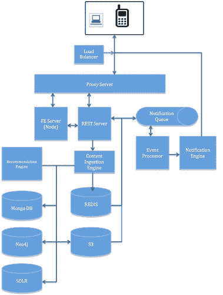

# 为社交产品设计后端

> 原文： [http://highscalability.com/blog/2015/7/22/architecting-backend-for-a-social-product.html](http://highscalability.com/blog/2015/7/22/architecting-backend-for-a-social-product.html)

旨在帮助您做出关键的体系结构决策，这将使社交应用程序成为真正的下一代社交产品。 提议的更改解决了以下属性： a）可用性 b）可靠性 c）可扩展性 d）扩展的性能和灵活性（非修改）

## 目标

a）确保用户的内容易于发现并且始终可用。

b）确保推送的内容不仅在语义上相关，而且从用户的设备角度来看也相关。

c）确保生成，推送和分析实时更新。

d）着眼于尽可能节省用户的资源。

e）无论服务器负载如何，用户的体验都应保持不变。

f）确保整体应用程序安全性

总而言之，我们要应对一个巨大的挑战，我们必须应对庞大的海量，不断扩大的用户生成内容，不断增加的用户数量以及源源不断的新商品，同时还要确保出色的性能。 考虑到上述挑战，我们必须研究某些会影响整个系统设计的关键体系结构元素。 以下是一些关键决策&分析。

### 数据存储

数据存储和数据建模是要做出的关键决定之一。 社交产品有望处理多种类型的数据，因此，在为每种类型选择模型和存储之前，我们必须全面分析和理解数据，这一点至关重要。

第一步是确定哪些是最频繁查询的数据，哪些不是那么频繁需要的数据（用于分析的存档数据）。 对于期望以较高频率查询的数据，需要将其放置在始终可用的位置，以便更快地读写和水平扩展。 现在，即使我们的用例并未强制使用基于 RDBMS 的系统，我们仍将 MySQL 用于所有用例。 随着数据的增长，我们的读写将成为应用程序性能的瓶颈。 我们应该准备好每秒处理数十亿次查询。

让我们对数据进行分类：

a）主数据或静态形式的数据，例如用户个人资料

b）语义数据

c）用户生成的内容

d）会话数据

对于我们来说，要找到对所有这些类型的数据都具有高性能的数据存储确实是很难的。 因此，我们将需要为每个数据库选择特定的数据存储。

**静态数据**：对于静态数据，最好选择基于文档的键和值都可查询的存储。 我们可以在这里选择建立良好的基于​​文档的存储，例如 MongoDB。 选择 MongoDB 的最大优点是它在文档级别提供 ACID 属性。

它可以轻松地在多个分布式数据中心内和跨多个数据中心进行扩展。 这将使我们能够使用副本集轻松维护冗余，从而解决我们的可用性问题。

分片是另一个要考虑的大因素，这对于确保规模&速度至关重要。 幸运的是，MongoDB 支持透明地分片。

**关联数据或关系数据（核心数据）**：我们的数据的大部分将在自然界中关联，例如，A 是 B 的朋友，C 是 A 和 B 的朋友。此类数据是高度语义化的数据 最适合建模为图形。 我们应该将这些数据存储在像 Neo4j 这样的图形数据库中。 优势显而易见； 它将使我们能够存储节点的所有连接以及节点本身，从而节省了计算连接数据之间关系的额外步骤。 图形数据模型还将在这里帮助我们捕获关系的属性。 当尝试探索连接的数据时，属性丰富的关系绝对至关重要。 GraphDB 支持 ACID 规则和自动索引。

同样，我们在可用性和可伸缩性方面的要求是相同的。 我们可以有成百上千的并发事务全部同时写入数据库以及成千上万的读取。 它应该扩展为每秒处理多个 PB 数据集中的十亿次读取。

我们需要一个允许动态缩放读写的系统。 要考虑的另一个因素是分片，这对于扩展我们的系统至关重要。

Neo4j 已经设计成可水平扩展，并具有复制功能以保证可用性。 但截至目前，它不支持分片。 选择一个时，我们可能需要更多分析。 其他选项是 FlockDB，AllegroGraph 和 InfiniteGraph。

**二进制数据（UGC）**：我们还必须处理与用户相关的大量二进制数据。 考虑到二进制数据的大小，要处理它并不容易。 像上面讨论的那样，我们的系统是一个需求可以在几秒钟之内运行的很高的系统（峰值），规模和可用性是决定存储位置时要考虑的最关键因素。 我们不能在这里依靠文件系统来存储我们的二进制数据。 我们必须考虑可用性和可伸缩性。 文件系统的缓存可能受 CPU 限制，因此使其冗余将需要大量的簿记工作。 相反，我们应该依靠已经可用的系统。 例如，Amazon S3，这是非常受欢迎的对象存储，具有保证的可用性，并且具有弹性。

我们也可以考虑使用 Google Cloud Storage 或 Rackspace Cloud Files 等。但是就报价而言，S3 显然是赢家。

S3 已经支持数据分区。 它根据高请求率和分区中的键数，通过将数据连续拆分为多个分区，从而水平扩展 S3。 但是重要的是要意识到仅存储内容是不够的，与这些内容相关联的元数据需要可搜索，并且搜索必须足够扩展和足够快。 我们还可以在这里尝试一些新事物，例如从图像自动识别尺寸，基于上下文自动标记等，然后使用它们来驱动图像的键*。 这是一个潜在的 IP 领域。 我们将在索引部分下研究索引需求。 但是现在，让我们仅注意，我们将使用标识符存储内容，该标识符可以在其他地方建立索引。 亚马逊的 S3 似乎最适合这种情况。

### 会话数据

重要的是认识并理解为什么我们需要考虑会话数据。 会话数据将帮助我们维护用户的状态。 而且这种状态应该以与服务器无关的方式持续，以使我们的部署规模扩大。 这将有助于我们使设计保持足够的灵活性，从而确保会话不会停留在特定的节点或服务器上。

我们必须以一种可以重新生成用户实际会话的方式来保存会话信息，如果用户会话终止，我们仍然可以帮助用户从他离开的地方开始。

在我们的市场中，连接不那么可靠，并且通常会丢包，这一点尤其重要。 这些数据需要在我们的所有节点上都可用，因此需要可用性和可伸缩性。 首先，我们可以很好地将其保存在我们的 MongoDB 中。 稍后我们可以考虑将其转移到像 REDIS 这样的纯键值存储中。

注意：所有推荐和脱机作业都应仅在非服务节点上运行。

### 索引编制

索引对于我们的系统至关重要。 用户可以搜索任何内容，这是我们的主要用例之一。 为了提高搜索性能，我们必须非常重视索引编制。 这里有两件事要考虑。 首先是创建索引本身，其次是创建索引系统。

为了使有意义的可搜索系统，我们必须设计一个实时索引，该索引被倒置并在生成的内容窗口上工作。 首先，我们可以编写一个非常简单的系统，在内容摄取期间，该系统可以负责根据内容生成反向索引。 后来，随着内容摄取负载的增加，我们可以简单地用实时数据处理引擎（例如 Apache Storm）来代替它，这是一个分布式，容错且高度可扩展的系统。 它可以接管索引逻辑的生成。

索引系统：Lucene 因其受欢迎程度和速度而成为显而易见的选择。 其性能无与伦比。 我们应该选择 SolrCloud。 它已经支持透明分片，复制，并且具有读写侧容错功能。

### 排队&推送通知

每次在我们的应用中触发事件时，我们都将被要求以通知的形式将该事件散发给他/她的关注者/朋友。 重要的是，我们的系统不要错过任何这些信号，万一发生故障，恢复这些事件至关重要。 为了做到这一点，我们必须寻找一个排队解决方案。 我们可以使用 ActiveMQ，这是最可靠的排队软件。 它允许群集以实现高可用性，并支持分布式排队。

推送通知是另一个要向我们的用户发送通知的区域。 在这里，我们需要寻找规模。 我们应该为数十亿个 nps 的规模做好准备。 这里有很多选项，但也许 pyapns，CommandIQ 和 App Booster 是最受欢迎的选项。

我们将需要专门管理一些事务，以确保即使用户的设备处于离线状态，也能确保通知的传递。 我建议我们实现一个基于双指针的系统，该系统维护通知的状态并在后台将其写入磁盘。 因此，每次通知失败时，都会维护其状态并使用状态标志将其添加到重试队列中。 最终，在传递通知时，将其出队。

### 缓存策略

像我们这样的系统，我们的目标是使其扩展到十亿 rps，因此智能缓存至关重要。 我们的设计将需要逻辑以多层缓存并智能地逐出它们。 让我们从顶级看什么要缓存和在哪里缓存。

*应用程序级缓存（内容缓存）* ：为了最大程度地减少缓存未命中并确保缓存始终保持最新的可用数据，我们必须寻找永不过时且始终可用的缓存 数据。 从本质上讲，这意味着在我们所有的一般用例中，我们将不必查询数据库，从而节省了大量资源。 我们还应确保缓存的数据始终采用不需要任何消息传递且可以随时呈现的格式。 实质上，这意味着我们会将在线负载转换为离线负载，从而节省了延迟。 为此，我们必须确保每次将内容提取到系统中时，我们都要做两件事

a）以一种在服务阶段不需要任何消息传递的方式对原始内容进行非规范化，然后将其保存到缓存中。 为了安全起见，我们将始终设置一个有效期限，该期限可以足够高。

b）原始内容也按原样写入我们的数据存储中。

我们非常可以依靠 REDIS 来获得此缓存，这是具有良好故障恢复能力的内存缓存。 它具有高度的可扩展性，较新的版本也允许透明分片。 并且它也支持主从节点配置。 最好的部分是它将使我们能够按原样保留本地数据结构，这使得增量写入非常容易，并且对我们支持内容提要（扇出）至关重要。

还要注意的是，我们将需要在大型内容对象上进行大量的读取-修改-写入操作和少量读取操作，以支持实时扇出，并且从速度的角度来看，REDIS 最适合这些操作。

*代理缓存 e* ：反向代理级别的缓存也很关键。 它有助于减少服务器的负载，从而保持延迟。 但是，要使代理服务器真正有效地进行缓存，正确设置 HTTP 响应标头至关重要。 有很多选择，但流行的是 nginx 和 ATS。

*二级缓存（代码级缓存）* ：这是实体数据的本地存储，以提高应用程序的性能。 通过减少昂贵的数据库调用，使实体数据保持在应用程序本地，它有助于提高性能。 EhCache 是​​该领域的热门选择。

*客户端缓存* ：这是实际的设备或浏览器缓存。 所有静态项目应尽可能多地被高速缓存。 如果 API 响应设置了正确的 HTTP 缓存头，则已经缓存了许多与资源相关的项目。 我们应该确保它按预期工作。 除此之外，我们应该使用设备自己的内存或使用 sqlite 来缓存尽可能多的其他内容。 所有昂贵的对象都应缓存。 例如 NSDateFormatter & NSCalendar，它的初始化速度很慢，应尽可能重复使用。 iOS Lot 可以在这里进行调整和使用，但这不在我们的研究范围之内。

### 内容压缩

考虑到以下事实：我们主要希望用户处理大量图像和视频，而这些图像和视频需要下载大量数据，因此优化下载大小至关重要。 它将为用户节省数据并提高应用程序性能。

要考虑的其他方面是我们的网络，我们的用户主要使用 2.5g 或 3g 的非 LTE 网络，其中带宽通常是一个问题，并且连接不可靠。 数据使用成本也很高。 在这种情况下，智能压缩是至关重要的。

但是压缩图像和视频并不是那么简单，通常需要更深入的分析。 我们处理的图像和视频可能是无损的，也有损的，这取决于用户的设备质量。 因此，我建议使用多种压缩技术来处理这种情况。 在这种情况下，我们可以尝试帧内压缩和帧间压缩技术。

但是总的来说，我们可以为所有压缩需求使用 zpaq 和 fp8。 我们也可以尝试 WebP，这可能对我们的市场有利。 通常，我们将在整个过程中始终使用 GZIP，所有 API 响应都将始终进行 GZIP 处理。

### 内容转码

考虑到我们将需要处理具有多个 OS 和屏幕分辨率的多个设备，因此我们的内容存储和处理应与设备无关。 但是服务层应根据具体情况而定，并应根据用户的设备功能理解并提供正确的内容。 这使得对我们的图像和视频进行转码至关重要。

我们的应用应收集有关内存，编码和屏幕分辨率的设备功能，并将其作为上下文传递给我们的 API。 我们的 API 应该使用此上下文来修改/选择内容版本。 根据收到的设备上下文，我们可以将内容预转码为几个最受请求的版本。

对于转码，我们可以使用 FFMPEG，这是最可靠，使用最广泛的框架。 我们可以根据需要修改 FFMPEG。 这也必须在摄取侧完成。

### 传输协议

考虑到我们的网络场景（非 LTE，不可靠的连接等），至关重要的是要尽可能智能地节省资源并尽可能减少通信量。 我建议对所有 HTTP 请求都使用 OkHttp 客户端，而反过来又使用 SPDY，SPDY 可以很好地抵抗连接失败并透明地恢复。

对于我们所有的消息传递需求，我们应该切换到 MQTT，这是一种轻量级的机器到机器连接协议。

### 安全

保护我们的应用程序确实很重要。 我们的整体体系结构应适应这一重要属性。 在这里，我仅讨论支持安全性所需的体系结构更改，而不会涉及实现性更改。

我们必须在架构中添加以下内容：

1.我们所有的用户数据都必须加密。 MongoDB 和 Neo4j 已经支持存储加密。 根据情况，我们可以决定对关键用户信息进行加密。 必须为所有与数据库相关的调用启用传输加密。

2.安全套接字层：到我们的代理服务器的所有呼叫均应进行 SSL 加密。 代理服务器可以充当 SSL 终止点。

3.我们所有的 api 端点都应在非默认端口上运行，并且应实现 Oauth 而不失败。

4.从 DB 进行的所有读取应始终通过其余端点进行。

5.保存密码的配置必须特别处理。 必须对密码进行哈希处理，并且文件应被限制为只有应用程序才能在启动时读取该密码。 这使我们可以通过文件系统权限来控制应用程序身份实例。 只有应用程序用户可以阅读，但不能写，其他任何人都不能阅读。 所有这些配置都可以打包在 keydb 下，并受 pwd 限制。

## 组件

这是我们架构的组成部分：

1.负载均衡器：这是一层，它根据确定的策略确定将请求转发到哪个代理服务器。 该层还将通过基于容量重定向流量来帮助我们保证可用性。

2.代理服务器：所有来电都必须在此处登陆。 这也是我们的 SSL 终止点。 它根据定义的策略缓存 HTTP 请求。 FE 层：此层运行节点服务器。

3.提取引擎：此组件处理所有传入的内容。 它包含与非规范化，代码转换，缓存等有关的策略。将来，如果需要，可以在此处完成所有内容的充实。

4\. REST Server：这是与所有 DB 进行对话并生成响应的层。 其访问受 Oauth 保护。 它可能是一个已实现边缘缓存的 tomcat 容器。

5.事件处理器：此层处理所有事件，并且主要负责扇出功能。 它读取 ActiveMQ 并使用通知引擎生成通知。

6.推荐引擎：此组件通过分析从用户活动中收集到的所有信号来推动推荐。 根据收集到的实际信号，我们可以部署各种基于亲和力的算法。 我们可以在 Apache Mahout 上进行回复，首先它已经提供了各种算法接口

系统的逻辑视图：

 

# 结论

这更多是对关键组件的高级分析。 如果需要实施该建议，则不必一 implemented 而就，可以分阶段进行，但是如果我们需要扩展和支持实际用例，则必须遵循我在此处提出的模式。 我没有涉及任何设计领域。 那是在设计阶段，将需要更深入的分析和了解系统的当前状态。

[On HackerNews](https://news.ycombinator.com/item?id=9930752)

谁写的？ 让他们停下来。 当他们说“很幸运，mongodb 音阶”时，我停止阅读（意译）

写得好。 非常喜欢阅读。 这可能不适用于所有但定义良好的设计替代方案和分析。 爱它。

我很喜欢它。 仅需注意一点，ActiveMQ 既好又稳定，但值得探索 Kafka。 我觉得在可伸缩性方面要好得多。 总体来说真的很喜欢你的逻辑。

本文概述了针对特定功能（缓存，反向代理，负载平衡，通知等）的推荐软件/应用程序，并在某种程度上说明了选择的原因。 但是我认为，如果将组件抽象出来并且将更多的注意力放在系统的实际体系结构上，将会更有帮助。 例如，我在架构图上看不到任何特定于领域的语言（我无法确定应用程序在做什么），而是一组完成功能的工具。

非常丰富。 您是否考虑使用关系数据库而不是使用 mongodb 进行分片？ 还是其他任何数据库才可以进入？