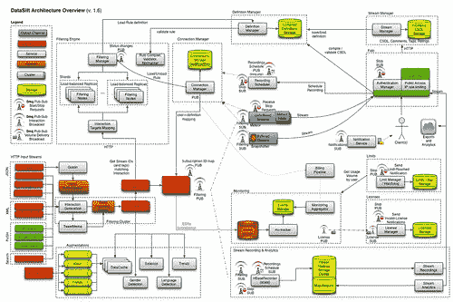

# DataSift 体系结构：每秒进行 120,000 条推文的实时数据挖掘

> 原文： [http://highscalability.com/blog/2011/11/29/datasift-architecture-realtime-datamining-at-120000-tweets-p.html](http://highscalability.com/blog/2011/11/29/datasift-architecture-realtime-datamining-at-120000-tweets-p.html)

我记得 Twitter 首次开放他们的消防水带时的兴奋。 作为 Twitter API 的早期采用者，我可以轻松想象可以对所有这些数据执行的一些很酷的事情。 我还记得在大数据领域，数据是有代价的，而对于像我这样的小鱼来说，代价太高了，我对此感到失望。 这就像第一次学习，不会有 BigData 圣诞老人。

尽管有一段时间，我很高兴思考如何处理所有数据。 这是一个令人着迷的问题。 您必须能够可靠地使用它，对其进行规范化，将其与其他数据合并，在其上应用功能，对其进行存储，进行查询，对其进行分发，然后再将其货币化。 大部分都是实时的。 而且，如果您试图创建一个平台，以允许整个 Internet 对防火墙执行相同的操作，则挑战将成倍增加。

DataSift 处于创建这样的烟火，数据斩波机器的令人兴奋的位置。 您会看到，DataSift 已从 Twitter 购买了多年的重新组织权，这使他们可以访问完整的 Twitter 消防水带，并能够将其子集转售给其他各方（可能是任何人），但主要目标当然是企业。 [Gnip](http://gnip.com/) 是唯一拥有这些权利的其他公司。

DataSift 是由 DataSift 的创始人兼首席技术官 Nick Halstead 在 [TweetMeme](http://tweetmeme.com/) 的经验基础上创建的，HTHT 是一种流行的实时 Twitter 新闻聚合器，一次可以处理每天 11 亿的页面浏览量。 TweetMeme 以发明社交信号机制而著称，该机制被称为“ retweet”，带有“ retweet”按钮，这个想法来自更早的名为 [fav.or.it](http://www.webonorme.net/blogging/launched-favorit-nick-halstead.htm) 的创业公司。 想象一下您是否会在*之前的某个时间像在整个虚拟地方贴上*按钮一样。

因此，大规模处理 TweetMeme 对 DataSift 的员工来说并不是什么新鲜事，而面临的挑战是将这种经验转变为 Internet 规模的平台，以便其他人也可以做同样的事情。 那是一个多年的冒险之旅。

DataSift 将自己定位为实时数据挖掘平台。 这里的平台角度确实是带回家的关键信息。 他们正在追求用于处理实时流的真正平台策略。 TweetMeme 虽然取得了成功，但它并不是一家[十亿美元的公司](http://www.youtube.com/watch?v=MowmiwavILM)，但是 BigData 平台可以发展到如此之大，这就是他们前进的方向。 尼克（Nick）的货币报价突出了霓虹灯的逻辑：“按钮上没有钱，数据上有钱。”

平台游戏背后的部分策略是，通过围绕您的核心价值主张构建巨大的技术护城河，从而成为老牌玩家。 当其他人来敲门时，由于您进入的技术壁垒过高，他们无法越过您的护城河。 这就是 DataSift 试图做的。 护城河上的吊桥更适合使用 Twitter 的 firehose，但真正的强大之处在于他们正在尝试创建的 Google 质量实时数据处理平台基础架构。

DataSift 的真正创新在于创建一个 Internet 规模的过滤系统，该系统可以快速评估非常大的过滤器（认为 Lady Gaga 的追随者规模），并结合虚拟化带来的经济效益，在这种情况下，拥有更多客户的客户可以分享资源，因此您赚得更多的钱。

他们如何使所有这些魔术发生？ 让我们来看看...

Site: [http://DataSift.com](http://DataSift.com)

## 信息来源

*   本文末尾列出的文章和视频。
*   主要来源是对以下人员的采访： [Nick Halstead](http://datasift.com/user/nickhalstead) ，DataSift 的创始人兼 CTO; [DataSift 的首席架构师 Lorenzo Alberton](http://www.alberton.info/) 。

## 统计资料

*   您无法获得整个 Twitter 的水火。 如果这样做，每千条推文将收取 10 美分的费用。 每天有 2.5 亿条推文。 每天需要 2 万 5 千美元的许可费用。
*   936 个 CPU 内核
*   每台服务器支持 16,000 个数据流
*   每天处理整个 Twitter Firehose 250+百万条推文。 相比之下，Visa 说，在 2007 年，他们处理了 276.12 亿笔交易，估计在一天中最繁忙的 8 小时内每秒处理 2100 笔交易。 这些都是完整的交易。
*   当前峰值每秒传递 120,000 条推文（260Mbit 带宽）
*   执行 250+百万次情感分析，延迟不到 100 毫秒
*   每天通过平台传输 1TB 的增强数据（包括性别，情感等）
*   数据过滤节点最多可以处理 10,000 个唯一流（每秒流过 8000+条推文的峰值）
*   可以实时对 10,000,000 个以上的用户名列表进行数据查找
*   链接增强每天执行 2700 万个链接解析+查找，以及 15+百万个完整的网页聚合。
*   30 名员工
*   4 年的发展

## 平台 [

### 使用的语言

*   C ++用于关键性能组件，例如核心过滤引擎（自定义虚拟机）
*   用于站点的 PHP，外部 API 服务器，大多数内部 Web 服务以及定制的高性能作业队列管理器。
*   Java / Scala，用于与 HBase 通信，Map / Reduce 作业以及处理来自 Kafka 的数据
*   Ruby 为我们的厨师食谱

### 资料储存库

*   SSD 驱动器上的 MySQL（Percona 服务器）
*   HBase 集群（当前，约 30 个 hadoop 节点，400TB 存储）
*   Memcached（缓存）
*   Redis（仍用于某些内部队列，但可能很快将被撤消）

### 消息队列

*   0mq（来自最新的 alpha 分支的自定义版本，已进行一些稳定性修复，以使用发布者端过滤），并用于不同的配置中：
    *   PUB-SUB 用于复制/消息广播；
    *   PUSH-PULL 用于循环工作负载分配；
    *   REQ-REP 用于不同组件的运行状况检查。
*   Kafka（LinkedIN 的持久性和分布式消息队列），用于高性能持久性队列。
*   在这两种情况下，他们都与开发人员合作，并提供错误报告/跟踪/修复/客户端库。

### CI / Deployments

*   每 5 分钟（如果有更改）从 Jenkins 的回购中提取所有代码（无论使用哪种语言），并使用几种 QA 工具自动进行测试和验证。
*   每个项目都以 RPM 的形式构建和打包，然后移至 dev 软件包仓库。
*   多个环境（开发，集成，QA，分段，生产）或不同的策略和测试级别。
*   Chef 自动执行部署和管理配置。

### 监控方式

*   所有服务都会发出 StatsD 事件，这些事件与其他系统级检查结合在一起，添加到 Zenoss 中并与 Graphite 一起显示。

## 图片中的建筑

DataSift 为其整体架构创建了一张很棒的图片。 这是一个小版本，要查看完整版本，请在处转到[。](http://farm8.staticflickr.com/7159/6408735793_0fa14eedf6_o.png)

 

*   该图分为两半：左边的所有内容都是数据处理，右边的所有内容都是数据传递。 系统中运行 40 多种服务，其中包括：许可证服务，监视服务，限制服务等。
*   整个系统有许多不同的扩展挑战，必须几乎同时解决：处理 firehose，低延迟的自然语言处理和推文上的实体提取，低延迟的推文内联增强，低延迟处理非常大的单个过滤器 ，对来自大量客户的大量复杂过滤器进行低延迟评估，链接解析和缓存，并通过保留每天发送的 1TB 数据来保留防火墙的历史记录，从而可以根据 firehose，实时计费，实时身份验证和授权，可让客户了解其流状态的仪表板，将过滤器结果流式传输到数千个客户端，监视每个机器，每个过滤器和每个子系统，负载和性能测试， 网络流量和服务之间的消息传递以低延迟的容错方式。
*   我们不会涵盖它们所做的每一行或每一行，但我们将重点介绍。

## 基本思路

*   **全部的要点**：
    *   **数据访问**的民主化。 消费者可以自己进行数据处理和分析。 如果他们愿意，一个人应该能够确定哪种早餐谷物得到的推文最多，处理数据，制作图表并将其出售给品牌。 有了一个可能的平台，而如果您必须建立自己的 tweet 处理基础架构，那几乎是不可能的。
    *   **作为数据**服务的软件。 将信用卡放入一个小时或几个月的数据中。 Amazon EC2 模型。 收取使用费用。 没有巨大的注册期或费用。 可以是小型或大型播放器。
    *   **您确实不需要大数据，需要洞察力**。 现在我们如何处理数据？ 自己创建见解的工具。 数据毫无价值。 数据必须在上下文中使用。
    *   这个想法是**创建一个全新的应用程序**，这是 Twitter API 所无法提供的。
*   [ETL](http://en.wikipedia.org/wiki/Extract,_transform,_load) （提取，转换，加载）。 可以将 DataSift 视为一种 [ETL](http://en.wikipedia.org/wiki/Extract,_transform,_load) 样式的系统，将实时数据流作为输入，将应用程序作为输出。
*   **提取**
    *   数据是从多个来源读取的，但是目前主要吸引 Twitter 的 firehose 许可访问。 Twitter 是 Twitter 的所有公开推文。 您还可以访问 Digg 和 MySpace 数据。
    *   身份不是在不同的数据源之间建立的，但是它们会规范化所有数据，因此您可以知道用户名的位置，从而可以匹配身份。
*   **转换**
    *   数据从防火墙中提取出来并进行标准化。 Twitter 数据具有高度维度，具有 [30 个属性和](http://www.readwriteweb.com/archives/this_is_what_a_tweet_looks_like.php)属性，您可以访问所有这些属性。 这些属性包括地理位置，名称，配置文件数据，推文本身，时间戳，关注者数量，转发数，已验证的用户状态，客户端类型等。
    *   实体提取和自然语言处理应用于推文。 例如，确定语言，并在元数据中提供该结果。
    *   当一条 tweet 进入时，他们必须查询 5 种不同的服务才能用更多数据扩展 tweet。 包括情绪分析，性别检测和 Klout 得分。
    *   解析每个链接并提取内容，以便可以将过滤器应用于内容和链接本身。
    *   他们计划随着时间的流逝增加更多的服务。
    *   在过滤过程发生之前，数据已被详细阐述。
*   **过滤**
    *   您无法支付全部费用，因此使用了一种相对简单的声明性语言，称为 [CSDL](http://dev.datasift.com/csdl) ，以过滤掉不需要的 Tweets 并保留您想要的 Tweets。
    *   过滤器如下所示： *interact.content 包含“ apple”，而 interaction.content 包含“ orange”*
    *   与过滤器匹配的所有推文形成一个流。 每个流都分配有一个标识符，该标识符看起来像“ 4e8e6772337d0b993391ee6417171b79”
    *   随处可见对话流。 流是应用于输入的 CSDL 过滤器的输出。 通过过滤器，您可以创建您感兴趣的事件流。
    *   流标识符包含在规则中，以进一步限定流中应包含哪些推文。 规则以过滤器和其他规则为基础：*规则“ 4e8e6772337d0b993391ee6417171b79”和 language.tag ==“ en”*
    *   可扩展筛选是 DataSift 的主要创新。 他们使用编译器在整个集群中高效地调度过滤器。 他们花了 3 年时间开发了可伸缩的规则评估解决方案。
    *   规则由过滤器的[组合组成，可以包含 1000 千个潜在的数百万项。 可以在数百台计算机上计划一次评估数百万条规则。 规则可以重复使用并按层次排序。](http://blog.datasift.com/wp-content/DataSift-Introduction-Webinar-small.pdf)
    *   过滤器包括正则表达式，例如，您可以基于配置文件中的文本过滤掉推文。 有许多不同的目标和运算符。
*   **加载**
    *   外部应用程序可以通过 REST API，HTTP 流或 Websocket 访问与过滤器匹配的推文。
    *   客户端库适用于：PHP，Ruby，C＃，Java，Node.js。 自己保存编写 HTTP 请求。
    *   您收到的是 JSON 对象，其中包含所有数据的规范化，完全增强格式。 您会在信息流中获取性别，地理位置，兴趣点，国家/地区，作者，推文，关注者数量，Klout 得分等。 每个消息最多有 80 个字段。
*   **应用程序**
    *   应用程序通过一种出口策略接收一个详细阐述的 JSON 对象。 DataSift 只是筛分，它不会烘烤。 因此，如果您希望使用默认转换之外的 tweet 来完成某些工作，则必须编写一个应用程序来完成。
    *   不能保证以任何顺序发送推文，也不能保证您看到有史以来发送的所有推文。 应用程序必须在聚合/采样的基础上工作。
*   **结算**
    *   计费以称为 **DPU** s 的神奇单位表示-数据处理单位。 每个过滤器都分配有一个 DPU。 每 DPU 每小时收费 20 美分。 您可以运行的最便宜的是 1 个 DPU，一整个月运行一个流将花费 150 美元。
    *   这个想法是，您使用的资源越多，您应该支付的费用就越多。
*   **开发**
    *   寄存器。 查看[示例流](http://datasift.com/solutions/prebuiltstreams/)。
    *   学习 [CSDL](http://dev.datasift.com/csdl) 。 写你的过滤器。
    *   [在线预览](http://console.datasift.com/)过滤器，以查看获得的结果的质量。 他们不仅返回原始数据。 他们有一个流浏览器，它具有地图视图，词云视图以及显示情感和性别的图表等。
    *   微调。 获得所需的结果，并查看 DPU，看您是否负担得起。
    *   使用您选择的 API 收集数据并对其进行处理。 您如何处理数据取决于您自己。 您可以实时内联处理。 也许显示一些图形。 将其存储在您自己的数据库中以进行后期处理。

## 关键思想

### 用例

考虑到大多数推文在每个人看来都是多么愚蠢，几乎很难想象它们具有共同的价值，因此看看人们可能希望将这些系统用于什么的目的是很清醒的：

*   广泛的趋势是将数据集合并在一起。 将筒仓数据集整合在一起，以获得更好的见解。 将社交媒体数据与客户数据进行大规模合并，您可以开始看到行为模式与两个数据集之间的见解之间的相关性。
*   策展，监视，警报。
*   跟踪：电视节目，政治，天气，感冒等
*   金融。 查看人们对公司的反应。
*   每个人买什么？ 在逐月范围内寻找广泛的趋势。
*   使用 Google 搜索来自世界各地所有星巴克附近拥有 500 多个关注者的文字推文。
*   减灾。 知道需求在哪里。
*   将所有百思买的位置放到规则中，这样您就可以在百思买中查看推文，而不必知道使用井号来自百思买的推文。 适用于任何事件或位置。
*   策划新闻。 查看具有一定数量转推的信息源。 看主题说是否技术。 全部实时，以毫秒为单位。

小牛肉通常的混合加上深奥的味道。 如何使用此电源取决于您。

### 实时只有远距离的后果

DataSift 作为实时过滤系统的性质具有深远的影响。 请记住，它没有内存。 它没有历史。 您没有看到可以在任何方向进行迭代的有序流。 您正在从防火墙上获取实时数据。 这些推文指向过滤器，通过过滤器，然后像夜晚一样消失了。

这是一个采样模型。 您无法认为您正在消耗整个流。 任何希望按顺序查看帐户中所有推文的应用程序都将无法正常工作。 面向的应用程序类型是可以准确采样高度针对性的数据的应用程序。

例如，如果您想使用 DataSift 将 Twitter 用作消息总线来构建实时控制系统，则它将无法正常工作。 您不能保证可以看到一个帐户中的每个命令，也不能保证这些命令的顺序正确。

您可以解决的问题类型是创建一个过滤器，该过滤器将在 10 秒内提及 100 次“地震”一词时触发。 然后，您可以使用地理位置信息来确定发生地震的位置。 不需要任何鸣叫顺序，也就可以看到每条鸣叫。 这是另一种心态。

### 仅过滤器具有远距离后果

让我感到惊讶的是，DataSift 仅是一个实时过滤引擎（因此名称中带有“ sift”一词）。 合作伙伴应提供更高级别的服务。

我期望 DataSift 成为一个有状态的细分平台，使人们能够回答“居住在美国的 18-24 岁男性有多少？”之类的问题。 DataSift 不计数，因此它不能具有细分平台的滑动窗口计数功能。

这是因为它是**无状态**的结果。 从技术上讲，DataSift 也无法识别年龄段，这主要是因为 Twitter 具有相当贫乏的个人资料功能。 DataSift 将 Firehose 存储在 HBase / Hadoop 中，以进行离线分析，但这不是实时的。

因此，您必须将头围绕过滤器模型。 在 DataSifts 的平台上无法执行任何应用程序逻辑。 没有存储过程。 可以通过诸如情感分析之类的增值服务在线增加推文，但这是一个高度结构化和受限的过程，而不是您的应用程序。 而且，如果您期望使用某种管道模型，那么也可以。 流无法通过一系列换能器通过管道进行编织。

之所以说 DataSift 是有原因的。 DataSift 是高度复杂且可扩展的过滤器系统。 它过滤掉了 firehose 中的 tweet，以创建针对性强的 tweet 流，供您在单独的应用程序中进行处理。 他们的工作是使数据深入到执行分析所需的 tweet 的横截面。 数据进入并根据规则进行匹配，如果不匹配，则将其丢弃，如果匹配，则将其放入您的存储桶中。 过滤器就像一个手套，只有最值得的通过。

仅过滤器模型的驱动程序是： **firehose scale 和低延迟**。 消防水带以很高的速率产生事件。 您将如何构建一个互联网扩展平台，该平台可将应用程序逻辑折叠成潜在的数百万客户？ 您如何做到这一点，并建立一个可以保持低延迟保证的端到端系统？ 你不能

你能做什么？ 评估大型过滤器。 快速。 下一节将对此进行更多介绍。

### **过滤引擎**

*   **当人们想到过滤器时，他们可能会想到 SQL select 语句，这些语句出于性能原因不建议使用大的“ where”子句。 DataSift 采用相反的方法，它们假定了非常多的过滤条件集，并且使评估具有可扩展性和效率。 他们的目标示例包括监视世界上每个星巴克的所有推文，或将 Lady Gaga 的关注者列表加载到过滤器中。 过滤器中可能有数百万个术语，它们是实时评估的。**
*   **如此规模的过滤需要使用其他方法。 他们** 从他们在 TweetMeme 所做的工作开始。 核心过滤器引擎使用 C ++，称为“ Pickle Matrix”。
*   三年多来，他们已经开发了编译器和自己的虚拟机。 我们不知道他们的技术到底是什么，但可能类似于带有查询重写的[分布式复杂事件处理。](http://www.doc.ic.ac.uk/~migliava/papers/09-debs-next.pdf)
*   编译器采用过滤器并以 Manager 和 Node 服务器为目标群集。 经理的工作是确定规则是否在其他任何地方加载，以及是否可以放置在高度优化的地方，例如靠近运行类似流的其他人。 Node 的工作是在规则上发布推文，获取匹配项列表，然后将匹配项推入管道。
*   他们具有巧妙的算法来消除工作负载的重复数据，因此可以尽可能多地共享规则。 每个过滤器都不是孤立运行的。 过滤器形成一个共享空间。 如果有一个仅针对 Lady Gaga 引用进行过滤的过滤器，则该过滤器将在每个推特上运行一次，并使用同一过滤器在所有规则之间共享结果。 要完成这项工作，需要非常聪明的编译器和调度算法。 回报是惊人的。 不再持续运行重复的过滤器，它们仅运行一次。
*   规则可以是分层的，编译器很聪明地尝试将它们放在一起，以便它们共享规则评估。 如果节点已经有一个规则，那么它将吸引使用该规则的过滤器。 该规则仅对节点上的所有筛选器运行一次。
*   这是一种虚拟化方式。 通过将多个客户的工作负载组合在一起，他们可以利用过滤器中的任何共性。 即使每个操作只运行一次，DataSift 也会为每个操作付费。 例如，如果共享一个正则表达式，则仅运行一次。 它无法始终以这种方式工作，也许节点已加载，因此无法使用其他客户端，因此它必须在另一台计算机上运行。
*   整个配置在运行时可以动态更改。 他们的调度算法一直在关注监视数据。 如果等待时间超过阈值，则将重新配置系统。
*   过滤器会立即在内存中处理。 例如，每台服务器可以运行 10,000 个流。
*   节点具有规则缓存，因此可以共享它们。
*   编译器支持短路以优化滤波器。
*   例如，如果一个正则表达式大于整个机器，则它们将自动在节点之间进行负载平衡。 请记住，大型过滤器是预期的标准。 如果要对 Lady Gaga 的所有关注者进行过滤，则过滤器的可伸缩性必须是核心功能。
    *   筛选引擎已分片。 每个分片都接收完整的流水线，并且所有分片都将处理每个``交互''（即``tweet''或``FB status''或``blog post''），整理其结果后再发送到下游。
    *   单个分片中的 N 个节点中的每个节点（都是彼此的副本）以循环方式接收到 1 / N 的软管。
    *   因此，假设有 2 个分片，每个分片 3 个节点，则每个分片上将找到 50％的过滤器。 分片中的每个节点都将接受软管的 1/3（并且上面将有 50％的过滤器）。 它将是该碎片中其他节点的副本。
    *   因此，如果加载了非常重的过滤器，则可以通过将更多的节点添加到重规则加载到的分片中来平衡，从而减少单个节点必须处理的消防水带数量。
    *   到目前为止，还没有单个过滤器对于单个节点来说太沉重，但是他们正在考虑拆分过滤器处理，因此先对子谓词进行大规模处理，然后再对所得的过滤器进行单独处理。 他们已经针对嵌入式规则进行了此操作（例如，给定一个过滤器，例如“让我获取所有包含'apple'AND 匹配规则 XYZ 的推文”，过滤器 XYZ 会分别处理）。
*   客户需要大力推动创建可重用的公共规则，以鼓励数据流的可重用性。 人们可以按照自己的规则使用任何公共流。 例如，某人可能制作了一个肮脏的单词过滤器来创建流。 您可以使用它来构建该流。 每个人都共享同一流，因此，如果有 1000 个用户使用脏字过滤器，则该过滤器不会得到 1000 次评估。 该过滤器将为每个人进行一次评估，非常高效。

### 每个推文的增强管道

推文增加了第三方数据集。 使这些扩充具有低延迟是一个主要的痛点。

*   当一条 tweet 进入时，他们必须查询 5 种不同的服务才能用更多数据扩展 tweet。 例如，Klout 有 1 亿个 Twitter 个人资料，因此它们在内部针对 Klout 数据库的本地副本执行数据库请求。 他们将数据集带入系统，而不是通过 Internet 进行 API 服务调用。
*   为了将数据集引入他们的系统，他们需要建立紧密的伙伴关系。 他们的情绪分析引擎已获得许可，快速，可集群化，并且适合于每天处理 5 亿次点击，且延迟低。
*   每个服务必须具有< 100 毫秒的响应时间。 500 毫秒后，它就会被丢弃。
*   每 10 条推文中就有 1 条是链接。 这样他们就可以获取内容，并根据您的内容进行过滤。 因此，如果提及某个品牌，则可以根据实际内容进行解析，以找出所有含义。

### 没有云为他们

*   AWS 曾用于生成测试流量，但对于分布式应用程序，他们认为 AWS 太有限了，尤其是在网络中。 当节点连接在一起并且需要彼此通信时，AWS 的表现不佳。 没有足够低的延迟网络。 他们的客户关心延迟。
*   他们必须注意一些细节，例如如何设置交换机以及如何通过主负载均衡器路由它们。
*   从 Twitter 了解有关使用自定义数据包大小的信息。 他们正在使用巨型帧。
*   由于规模的原因，Twitter 可能会在未来细分市场。
*   他们与 Twitter 的联系是通过 Internet 进行的，没有对等关系。

### 平台意味着开放

*   首先构建一个 API，然后在该 API 上构建网站。 您可以使用 GUI 制作自己的导入工具，这些工具很酷。
*   目的是通过让开发人员将 DataSift 嵌入其应用程序来使其不可见。 这是一个平台，该平台的工作是消除处理海量数据的难题。 其他人可以在其他系统中建立桥梁。 DataSift 希望专注于过滤和数据处理。 让其他人提供 GUI 等。

### 开票

*   负担得起的实时计费产品不存在，因此它们构建了自己的产品。 面临的挑战是使人们对实时计费解决方案感到满意。
*   客户是实时计费的。 您可以查看您的仪表板，以了解正在花费什么。 亚马逊和 Google App Engine 的经验表明，这是系统中非常重要且非常棘手的部分。 钱就在这里。
*   他们使用称为 DPU 的定义单位-数据处理单位进行收费。 您让他们使用的资源越多，过滤器的成本就越高。
*   每个过滤器都分配有一个 DPU。
*   每 DPU 每小时收费 20 美分。 10 DPU 过滤器的价格为 2 美元/小时。
*   您可以运行的最便宜的是 1 个 DPU，一整个月运行一个流将花费 150 美元。
*   在 1 万个地理位置上进行过滤将非常昂贵。 查找一个正则表达式会很便宜。
*   正则表达式很便宜，但是时间越长，处理时间就越长，这意味着它们更昂贵。 地理多边形的处理相当复杂。 一长串关键字非常便宜，因为它们使用散列。 词组匹配和近词匹配稍微贵一些。
*   这样做的想法是，与为不需要的数据支付许可费用相比，过滤尽可能小的数据集要便宜得多。
*   如果您运行 10,000 个数据流，但最终只占到了 Firehose 的 50％，但是他们不只是出售了 50％的 Firehose，而没有数据处理，因为这与他们的平台无关。
*   他们希望客户尽可能详细地描述他们想要从过滤器中获取的数据。
*   由于 Twitter 上有 50 至 50 位男性和女性之间的对等关系，因此，所有男性都将占流水线的 50％或 1.25 亿条推文。 为男性制作的所有推文创建过滤器并不是一件容易的事。 这将是非常昂贵的。 您要做的就是查看用例。 您是银行吗？您是药店吗？要弄清楚您对什么感兴趣。 要尽可能具体。 一些公司每天只会发送一条推文。 每天 2.5 亿条推文中，问题是如何创建过滤器以获取所需的两个或三个。
*   客户可以设置阈值，以便他们可以决定每天花费多少。 您不想运行会在几秒钟内耗尽预算的流。
*   为了准确计费，系统具有广泛的监视功能。 仪表板显示整个平台的运行状况。 可以看到系统中任何点之间的流程，每个点之间的延迟。 所有服务器的运行状况，吞吐量，流量变化都可能突出问题。

### 输出侧

*   真正的痛点是输出端。 您如何将推文从中心位置传递到用户所连接的正确服务器上？ 最终使用 0mq。 使用发布和订阅可以大大减少内部网络流量，延迟和软件复杂性。 他们现在几乎在任何地方都使用它。 非常灵活 为了获得高可用性，它们广播给几个听众。
*   尝试了几种技术来移动数据。 最初在所有地方都使用 HTTP，但这太慢了，并且具有很高的代码复杂性。 然后他们尝试使用 Redis 作为队列，虽然速度更快，但是无法处理规模。 他们每天通过 0mq 发送数十亿条消息。
*   Node.js 在其前端使用，用于 HTTP 流和 Web 套接字连接的端点。 Node.js 的强大功能令人惊讶，它可以进行网络数据传递。 该层很简单，它只是将数据直接传递，将套接字插入套接字。 他们为 Node 构建了自己的多线程模型。
*   事件系统的问题是知道您为什么收到事件，以便可以将其分派到正确的处理逻辑。 例如，同一条 Tweet 可以匹配性别规则和脏话规则，并且每种情况下，Tweet 的处理方式必须不同。 DataSift 有几种方法可以使这项工作完成，但是它们具有非常智能的标记功能。 一旦子过滤器匹配，就可以对该事实进行标记并在元数据中传递。 该引擎允许您创建规则的任何层次结构，以便可以将规则结合在一起，然后使用标记来创建类别。

### 测验

*   EC2 用于生成流量。 防火墙为 60 Mbps。
*   为了测试他们的系统，他们一次要运行相当于 11 台消防车的系统。 1000 个流，每个消防站的 1％将其传送到 1000 个连接。 他们遇到的瓶颈是托管提供商的网络带宽，而不是平台。

### 将溪流汇入湖中

DataSift 还支持非实时处理。 HBase 中存储了两个主要的推文集合：

*   过滤器可以具有侦听器，因此推文直接存储在 HBase 中，允许以后下载数据。 可以安排流的录制，然后稍后浏览/使用它。
*   录制整个消防水带是一项巨大的技术挑战。 在两个月内，他们将使人们可以在存储在 HBase / Hadoop 中的持久性版本的 firehose 上运行其筛选器。 这个想法是能够对您感兴趣的任何方面进行分析。 扩充所有数据后，每天通过该平台的数据总计将增加 1 TB，因此要存储大量数据。

### 你如何赚钱？

作为开发人员，我一直对如何使用平台和服务为开发人员（不仅是创造者）赚钱感兴趣。 我的角度是，如果您在通过收取足够的钱来赚钱的服务之上构建服务，是否可以构建有利可图的服务，或者成本太高，或者您是否真的必须将高价值目标定为高 保证金产品证明成本合理？ 换句话说，例如，TweetMeme 可以基于 DataSift 获利吗？ 建立或购买问题始终是一个棘手的问题。

*   **内部使用**。 如果您是使用 DataSift 来了解自己的产品的企业，那么您所获得的任何价值都可以证明其成本是合理的。 这很简单。
*   **服务**。 DataSift 认为自己可以提供商品化的数据交付，并且其成本只是从 Twitter 获取数据和开发人员所需时间来处理这些数据所需的基础结构成本的一小部分。 据他们估计，要建立一个像 Radian6 这样的社交监控服务，需要在系统上花 3 个月的时间。 您只需要专注于界面。 数据收集和处理部分得到处理。 如果您能找到合适的市场，那将具有很大的价值。
*   [App Store](http://blog.datasift.com/2010/11/02/datasift-app-store/) 。 DataSift 计划为第三个部分开发人员提供一个应用程序商店。
*   **增强服务**。 DataSift 将支付服务费用以作为其扩充渠道的一部分。 该模型是收益分成。 如果有人使用像 Klout 这样的平台，他们将收益分享给他们。 问题是找到可以扩展到 Twitter 级别的合作伙伴。

## 得到教训

*   **平台和生态系统的力量。** 如果平台策略执行得当，它将成为进入市场的巨大障碍。 它也是观察下一波趋势发展的最高观察站。 这是[创新/杠杆/商品化](http://www.youtube.com/watch?v=Y_F6nFIp_dA)模型。 DataSift 已经拥有 LinkSift 之类的域名，因此这是该大计划的一部分，该计划是使用他们的底层平台来提供更高价值的服务，以他们从平台市场中收集的情报为指导。
*   **按钮没有钱，数据没有钱。** 跟随钱**。** 您现在正在做的事情可能不在钱中，但是它可以指导您找到钱的地方。
*   **质量胜过废话。** 趋势是发布几乎不可行的软件，然后使用用户反馈迭代地对其进行改进。 DataSift 没有走这条路。 他们从一开始就发布了复杂的可扩展产品，其原因有两个：1）他们在 TweetMeme 的经验基础； 2）他们不觉得自己可以从小做起并立即重新构建。
*   **从结构上来说，无国籍状态是一个巨大的胜利。 DataSift 仅是实时的，因此不必在内存中保留很多状态，也不必担心按顺序传递事件而不会丢失甚至不会容忍任何错误。 计时是他们的痛点，可以降低端到端的延迟。 当然，这将状态负担推给了应用程序开发人员。**
*   **从别人的错误中学习。** 当 Twitter 从 TweetMeme 许可了转发技术时，他们实际上并没有重用 TweetMeme 的代码。 Twitter 从该代码中学到了知识，并将 TweetMeme 用作咨询服务，这有助于 Twitter 在发布时立即进行转发。 相反，当 DataSift 学习如何处理防火墙时，DataSift 可以从 Twitter 犯下的所有早期错误中吸取教训，因此 DataSift 可以在发布时正确解决。
*   **服务**。 从一开始就很难使用服务进行设计。 他们从一开始就拥有一个体系结构，但是如何连接这些服务，如何使这些服务冗余，如何使这些服务响应故障以及如何在某件事失败的情况下使一切都不会失败-所有这些类型的问题都有 一直是痛点。 将组件划分为服务是解决这些分布式编程问题的关键。 服务还使每个组件都可以独立扩展。
*   **消息系统**。 以 0mq 为核心的消息传递系统将服务联系在一起并实现可靠性。 它的工作非常出色。 比使用 HTTP 好 1000 倍。 他们喜欢不同通信模式（发布-订阅，请求-响应等）的灵活性。 HTTP 在性能和使用它所需的代码量方面都有太多开销。 只需将消息传递到需要处理的代码即可。 它使接口保持异步，解耦和基于队列而不是阻塞。
*   **连接管理**。 实时流的最大瓶颈之一是如何处理连接和断开连接。 他们从 Twitter 中学到了很多东西。 建立连接时，它会触发大量下游活动来激活连接，例如身份验证，验证流请求，确定负载，计费服务，审计跟踪等。每秒能够运行数千个连接/断开连接是一个挑战。 从 PHP 重写为 C ++，并使其成为多线程。
*   **将常用案例折叠到平台**中。 在他们的人员期间，他们喜欢在列表中加载数百万的人员。 就像 Lady Gaga 的所有追随者一样。 指向列表并将其自动下载到规则中。
*   **指标比记录**更重要。 记录中总是会填满您不使用的内容。 能够为超出范围的指标创建警报更加有效。 当指标触发对问题的意识时，您可以查看日志。
*   **遵循 Salesforce 和 Amazon 模型**。 他们是一个按需云平台，它们将在开始的基础上构建层。 因此，DataSift 是引擎，他们将制造其他产品，如 UserSift 和 LinkSift。
*   **易货**。 不必花钱。 通过物物交换引导。 他们获得了赞助。 他们出售了旧域名，以资助购买新域名。
*   **将一种产品的经验转化为另一种**。 TweetMeme 使用基于 RSS 提要的 fav.or.it 基础结构。 这使 TweetMeme 得以快速开发。 同样，构建 TweetMeme 的经验使跳转到 DataSift 变得容易得多。 他们从 TweetMeme 学习了可伸缩性，并建立了一流的工程团队。
*   **一切都至关重要**。 例如，他们在整个网络设备中都遇到帧缓冲区大小的问题。 他们发现，开放 HTTP 流连接比简单的 REST 调用更难扩展，因为它带来了网络中的许多潜在问题。 当他们使用 REST API 时，他们没有看到这些问题。

从我的采访，阅读和查看十几个其他采访中，我对 DataSift 的思维和努力质量印象深刻。 我不知道它是否当然会成功，或者是否会成功，但是如果我失败了，那是因为缺乏专业精神。 企业家转变为 VC 的 Mark Suster 解释说，他对 DataSift 的投资是[在 Twitter 生态系统](http://www.bothsidesofthetable.com/2011/07/10/why-im-doubling-down-on-the-twitter-ecosystem/)上的投入增加了一倍。 我认为这是错误的观察方式。 DataSift 可以快速轻松地与任何流一起使用。 也许更好的方法是将 DataSift 加倍。

## 相关文章

*   [这篇关于黑客新闻](http://news.ycombinator.com/item?id=3292604)的文章
*   [具有查询重写功能的分布式复杂事件处理](http://www.doc.ic.ac.uk/~migliava/papers/09-debs-next.pdf)，作者：Nicholas PoulSchultz-Møller，Matteo Migliavacca，Peter Pietzuch
*   [推文可以告诉您什么](http://www.readwriteweb.com/archives/what_a_tweet_can_tell_you.php)，作者：Marshall Kirkpatrick
*   [Gnip 和 DataSift 有什么区别？](http://www.quora.com/What-is-the-difference-between-Gnip-and-DataSift)
*   [DataSift 链接分辨率]( http://www.youtube.com/watch?v=JAN47Hw6o8w)
*   [可扩展性的艺术-管理增长](http://www.alberton.info/talks/show/id/3)，作者：Lorenzo Alberton
*   [有关“类固醇轨道：” DataSift]( http://www.youtube.com/watch?v=X7aiKaCi8O8) 的更多详细信息-采访 Robert Scoble
*   [DataSift 的定价是否会对初创企业起到威慑作用？](http://www.quora.com/Is-DataSifts-pricing-a-deterrent-for-startups)
*   [在 Twitter 提要之上的应用程序的基础架构（带宽）有多昂贵？](http://www.quora.com/How-expensive-is-the-infrastructure-bandwidth-of-an-app-on-top-of-Twitter-feeds)
*   [问&答：尼克·霍尔斯特德（Nick Halstead）使用 Datasift](http://www.wired.co.uk/news/archive/2011-10/12/nick-halstead-mining-twitter ) 挖掘 Twitter 的火喉。
*   要点：[将 Paul S. Watson 的 DataSift Twitter 交互流记录到 Google Fusion Table](https://gist.github.com/1389349) 中
*   [新的 DataSift 首席执行官表示，Twitter 的未来在于数据，而非广告](http://www.themediabriefing.com/article/2011-11-17/the-future-of-twitter-is-in-data-not-advertising-says-new-datasift-ceo)
*   [Twitter 是一个信息流，但它也是一个蓄水池](http://gigaom.com/2011/11/17/twitter-is-a-stream-but-its-also-a-reservoir-of-data)，作者：Mathew Ingram
*   [DataSift API 演示](http://www.slideshare.net/nickhalstead/datasift-api)
*   [Cassandra vs HBase](http://skillsmatter.com/podcast/home/cassandra-hbase) ，作者：尼克·特尔福德（Nick Telford）（DataSift 平台架构师）
*   [Twitter 上的 DataSift 开发](https://twitter.com/#!/datasiftdev)
*   [第四次 DataSift 网络研讨会视频，“目标”](http://blog.datasift.com/2011/07/28/fourth-datasift-webinar-video-%E2%80%9Ctargets%E2%80%9D/)
*   [MediaSift / DataSift（Genesys Guru 的作者）](http://genesysguru.com/blog/blog/2011/05/27/mediasift-datasift/)
*   [为什么我在 Twitter 生态系统上加倍关注](http://www.bothsidesofthetable.com/2011/07/10/why-im-doubling-down-on-the-twitter-ecosystem/)，作者：Mark Suster
*   [在 Mozilla 音乐节](http://blog.pusher.com/2011/11/3/ways-to-use-pusher-at-the-mozilla-festival)上使用 Pusher 的方法，Phil Leggetter
*   [10 个高流量流的 IPTraf 统计信息的视频](http://www.twitvid.com/QQK7M)-这是使用 10 个流进行的测试-一台服务器的吞吐量约为 3Mb / s。

感谢您发布此信息。 他们庞大的过滤框架听起来非常令人印象深刻。

谢谢，这是一篇有趣的文章。 我有一些关于数字的查询：

-您说他们每天处理 250+百万条推文，每秒不到 3k。 当有关碧昂斯的婴儿的消息传出时，Twitter 的峰值每秒不到 9000 条。 那么每秒 12 万条推文的峰值来自何处？

-每 1000 条推文 10c 似乎太糟糕了，这笔费用还包括结果权吗？ 如果是这样，您对完全访问没有转售权的费用有任何想法。

谢谢！

感谢您使用 0mq 并作出贡献。 有了这些类型的数据流和量度指标，它肯定会得到“真正的”锻炼！ 我想这种压力也会很快消除错误！

非常好写托德。 我一直在与 DataSift 一起工作，因为他们在 Alpha 阶段完成了一个我正在为客户准备的项目，该项目很快就要出炉了（几周）。 他们做得很好，这是一个令人印象深刻的平台，可以肯定它具有巨大的潜力。 有一些优点和缺点，但您要指出其中的一些优点（有些却不知道），但总体而言，我很喜欢使用该服务，并且愿意承担这种情况下的早期采用者的风险。

干杯，

肯特郡

Thanks it is an interesting article. I have a couple of queries about numbers though:

- You said that they process 250+ million tweets per day, which works out to be just under 3k per second. Twitter had a peak of just under 9k tweets per second when the news about Beyonce's baby broke. So where does the peak of 120k tweets per second come from?

- 10c per 1000 tweets seems like an awful lot, does this fee include result rights as well though? If so do you have any ideas about the fees for full access without resale rights.

Thanks!

非常感谢您发表这篇深入的文章，非常感谢您描述整个公司的方式，从技术细节到业务建议。
您是否想在 4 年后写一份跟进报告？ 考虑到他们所面临的所有挑战，看看他们如何扩展其体系结构和/或流目录非常有趣。

+