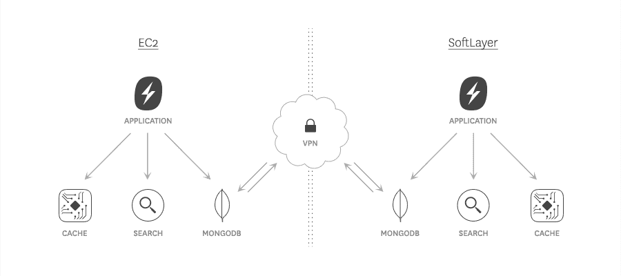
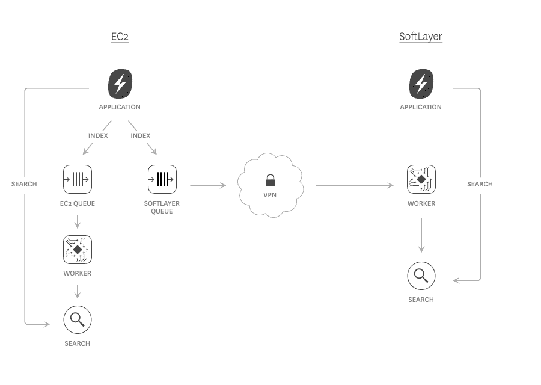

# Swiftype 如何以及为何从 EC2 迁移到真实硬件

> 原文： [http://highscalability.com/blog/2015/3/16/how-and-why-swiftype-moved-from-ec2-to-real-hardware.html](http://highscalability.com/blog/2015/3/16/how-and-why-swiftype-moved-from-ec2-to-real-hardware.html)

*这是 [Oleksiy Kovyrin](https://twitter.com/kovyrin) 的来宾帖子， [Swiftype](https://swiftype.com/) 。 Swiftype 目前为超过 100,000 个网站提供搜索功能，每月提供超过 10 亿个查询。*

当 Matt 和 Quin 在 2012 年创立 Swiftype 时，他们选择使用 Amazon Web Services 建立公司的基础架构。 云似乎是最合适的选择，因为它很容易在不管理硬件的情况下添加新服务器，并且没有前期成本。

不幸的是，尽管某些服务（如 Route53 和 S3）最终对我们来说确实非常有用且非常稳定，但使用 EC2 的决定却在我们成立的第一年困扰了团队一些主要问题。

Swiftype 的客户需要卓越的性能和始终可用的可用性，而我们能否提供这些功能在很大程度上取决于我们基础架构的稳定性和可靠性。 在 Amazon 中，我们**遇到了网络问题，VM 实例挂起，不可预测的性能下降（可能是由于嘈杂的邻居共享我们的硬件**，但没有办法知道）以及许多其他问题。 无论我们遇到什么问题，亚马逊始终有相同的解决方案：通过购买冗余或高端服务向亚马逊支付更多钱。

我们花在解决 EC2 问题上的**时间越多，我们为客户开发新功能**的时间就越少。 我们知道可以使我们的基础架构在云中工作，但是要做的工作，时间和资源远比迁移要大得多。

经过一年的云斗争，**我们决定将 EC2 保留为真正的硬件**。 幸运的是，这不再意味着要购买您自己的服务器并将它们放在机架中。 托管主机提供商有助于物理硬件，虚拟实例和快速配置之间的良好平衡。 鉴于我们以前在托管服务提供商方面的经验，我们决定选择 SoftLayer。 他们出色的服务和基础架构质量，供应速度以及客户支持使其成为我们的最佳选择。

经过一个多月的辛苦工作，准备进行数据中心间迁移，我们能够以零停机时间执行迁移，并且对客户没有负面影响。 **从第一天开始，向真实硬件的迁移就极大地改善了服务的稳定性，为所有关键基础架构组件带来了巨大的（〜2 倍）性能提升，并将每月托管费用降低了约 50％**。

本文将解释我们如何计划和实施迁移过程，详细介绍在过渡后我们看到的性能改进，并为年轻的公司提供有关何时执行此操作的见解。

## 准备交换机

迁移之前，我们在 Amazon EC2 上有大约 40 个实例。 我们每周至少 2-3 次（有时每天）会遇到严重的生产问题（实例中断，网络问题等）。 一旦决定迁移到真正的硬件，我们就知道我们的工作已经完成，因为我们需要在不中断服务的情况下切换数据中心。 准备过程涉及两个主要步骤，每个步骤在下面的单独部分中都有专门的解释：

1.  **连接 EC2 和 SoftLayer** 。 首先，我们在 SoftLayer 的数据中心中构建了新基础架构的骨架（最小的服务器子集，能够以开发级的负载运行所有关键的生产服务）。 一旦建立了新的数据中心，我们就会在新旧数据中心之间建立一个 VPN 隧道系统，以确保两个数据中心中组件之间的透明网络连接。

2.  **对我们的应用程序**的架构更改。 接下来，我们需要对应用程序进行更改，以使它们既可以在云中也可以在我们的新基础架构上运行。 一旦应用程序可以同时存在于两个数据中心中，我们便建立了一条数据复制管道，以确保云基础架构和 SoftLayer 部署（数据库，搜索索引等）始终保持同步。

### 步骤 1：将 EC2 和 Softlayer 连接

为迁移做准备的第一件事之一就是弄清楚如何将 EC2 和 SoftLayer 网络连接在一起。 不幸的是，使用 EC2 的虚拟私有云（VPC）功能将一套 EC2 服务器连接到另一个专用网络的“正确”方法对我们来说不是一种选择，因为如果没有以下方法，我们无法将现有实例集转换为 VPC 停机时间。 经过一番考虑和周密的计划，我们意识到，真正需要能够跨越数据中心边界相互连接的唯一服务器是我们的 MongoDB 节点。 我们可以做的其他所有事情都可以使数据中心本地化（Redis 群集，搜索服务器，应用程序群集等）。

由于我们需要互连的实例数量相对较少，因此我们实施了一个非常简单的解决方案，事实证明，该解决方案对于我们的需求是稳定且有效的：

*   每个数据中心中都部署了专用的 OpenVPN 服务器，该服务器将所有客户端流量 NAT NAT 到其专用网络地址。

*   每个需要能够连接到另一个数据中心的节点都将在此处建立 VPN 通道并设置本地路由，以将指向另一个 DC 的所有连接正确转发到该隧道。

以下功能使我们的配置非常方便：

*   由于我们没有控制任何一方的网络基础架构，因此我们无法真正迫使任一端的所有服务器通过连接到另一个 DC 的中央路由器来集中其流量。 在我们的解决方案中，每个 VPN 服务器（在某种自动化的帮助下）决定通过隧道路由哪些流量，以确保所有客户端的完整 DC 间连接。

*   即使 VPN 隧道崩溃了（令人惊讶的是，这仅在项目的几周内发生了几次），这仅意味着一台服务器失去了与另一 DC 的传出连接（一个节点从 MongoDB 集群中退出，有些 工作服务器将失去与中央 Resque 框的连接，等等）。 那些一次性的连接丢失不会影响我们的基础架构，因为所有重要的基础架构组件的两端都具有冗余服务器。

### 步骤 2：对我们的应用程序进行架构更改

在准备迁移的几周内，我们必须对基础架构进行许多小的更改，但是对它的每个组成部分都有深刻的了解有助于我们做出适当的决策，从而减少了过渡期间发生灾难的可能性 。 我认为，几乎所有复杂性的基础架构都可以通过足够的时间和工程资源进行迁移，以仔细考虑在应用程序和后端服务之间建立的每个网络连接。

以下是我们为确保平稳透明迁移所必须采取的主要步骤：

*   所有无状态服务（缓存，应用程序集群，Web 层）均独立部署在每一侧。

*   对于每个有状态后端服务（数据库，搜索集群，异步队列等），我们都必须考虑是否要（或可以负担得起）将数据复制到另一端，或者是否必须引起数据中心间的延迟 对于所有连接。 一直以来，依靠 VPN 一直是最后的选择，最终我们能够将数据中心之间的流量减少到一些小的复制流（主要是 MongoDB）以及与无法复制的服务的主/主副本的连接 。

*   如果可以复制服务，则可以这样做，然后使应用程序服务器始终使用或偏爱该服务的本地副本，而不是转到另一端。

*   对于我们无法使用其内部复制功能进行复制的服务（例如我们的搜索后端），我们对应用程序进行了更改，以实现数据中心之间的复制，在此数据中心的每一侧的异步工作人员都将从各自的队列中提取数据， 总是将所有异步作业都写入两个数据中心的队列中。

### 步骤 3：翻转开关

当双方都准备好为 100％的流量提供服务时，我们通过将 DNS TTL 降低到几秒钟来确保快速的流量变化，为最终的切换做好了准备。

最后，我们将流量切换到新的数据中心。 将请求切换到新基础架构，对客户的影响为零。 一旦流向 EC2 的流量耗尽，我们便禁用了旧数据中心，并将所有剩余的连接从旧基础结构转发到了新基础结构。 DNS 更新需要时间，因此在截止时间之后至少一周的时间内，我们的旧服务器上会看到一些剩余流量。

### 明显的改进：从 EC2 迁移到实际硬件后的结果

**稳定性提高了**。 每周我们要避免 2-3 次严重的故障（大多数故障对于客户而言是不可见的，因为我们尽了最大的努力使系统能够应对故障，但是许多故障会唤醒某人或迫使某人放弃家庭时间） 每月 1-2 次中断，我们可以通过花费工程资源来提高系统对故障的适应性，并减少故障对我们客户可见的可用性产生影响的机会，从而更彻底地处理故障。

**性能提高了**。 多亏了 SoftLayer 提供的现代硬件，我们看到了所有后端服务（尤其是 IO 绑定的服务，例如数据库和搜索集群，但也有 CPU 绑定的应用程序服务器）的性能持续提高，更重要的是， 性能更可预测：没有与我们的软件活动无关的突然下降或上升。 这使我们可以开始进行实际容量规划，而不必在所有性能问题上抛出更慢的实例。

**成本降低**。 最后，但同样重要的是，对于一家年轻的初创公司而言，我们的基础架构每月成本下降了至少 50％，这使我们能够过度配置某些服务，从而进一步提高性能和稳定性，从而使客户受益匪浅。

**供应灵活性提高了，但是供应时间却增加了**。 现在，我们可以精确地指定服务器以满足其工作量（大量磁盘并不意味着我们需要功能强大的 CPU）。 但是，我们无法再通过 API 调用在几分钟内启动新服务器。 SoftLayer 通常可以在 1-2 个小时内将新服务器添加到我们的机队中。 对于某些公司来说，这是一个很大的折衷，但是对于 Swiftype 来说，这是一个很好的选择。

## 结论 [

自从改用真正的硬件以来，我们有了长足的发展-我们的数据和查询量增长了 20 倍-但我们的 API 性能比以往任何时候都要好。 确切了解服务器的性能将使我们以前所未有的方式规划增长。

根据我们的经验，当您需要快速启动新硬件时，云可能是个好主意，但只有在您做出巨大努力（Netflix 级）以在其中生存时，它才能很好地工作。 如果您的目标是从一开始就建立企业，而您又没有多余的工程资源可用于支付“云税”，那么使用真实的硬件可能是一个更好的主意。

*如果您对软件和基础架构交叉领域的工程技术充满热情，Swiftype 将聘请高级技术运营工程师。*

[关于黑客新闻](https://news.ycombinator.com/item?id=9212467)

[上 reddit](http://www.reddit.com/r/programming/comments/2z9xwp/how_and_why_swiftype_moved_from_ec2_to_real/)

很棒的文章。 我只需要添加 Google 工程师的一些明智的话即可（我忘了看到它的地方，但一定是演示文稿）：不要期望在距离上同步复制数据。 编码应用程序以解决此问题是更好的方法。 您可能会失去性能，但最终不会出现数据不一致的情况

嗨，有趣的文章，您使用的实例类型和操作系统是什么？ 您使用的是原始 AMI 还是其他东西？

每当我看到公司何时离开亚马逊并经历成本下降时，我都会大笑和哭泣：)我来自波兰，但是许多国家/地区都有自己的云服务提供商，因此每个人都应该检查他们，然后再寻求更大的参与者。 我为数百个客户和平均值进行了许多计算。 波兰云与亚马逊的成本比较表明，亚马逊的价格比我选择的提供商高 7 到 20 倍。 我知道这些提供商无法扩展到 1000Gbps 或 PB 数据，但是如果人们遇到网络问题和性能下降，他们仍然使用如此糟糕的提供商真是可笑。

我为几天的活动做了很多设置，并且它总是像魅力一样发挥作用。 两种设置工作了几个月（一切都按计划进行），我没有遇到任何问题。

你们有什么特殊的原因要选择 DigitalLacean 而不是 SoftLayer。 根据 DigitalOcean 网站的性能基准，它们便宜 90％，但性能更好。

只是好奇。

有趣的帖子，Oleksiy。 我自己广泛使用 EC2 和 Softlayer，得出了不同的结论。

Softlayer 的后端网络并不如我所愿稳定。 我曾尝试在其中运行分布式文件系统（例如 glusterfs），但不得不放弃-网络太不可靠了。 尽管值得，但 Ceph 能够更好地应对夜晚的颠簸，但它们仍然存在。

上次我检查（最近几个月内）无法从 SL 获得 10G 网络。 它来自 EC2。 此外，如果您自己想要一台服务器，这是相当普遍的常识，您可以在 EC2 上配置哪些实例大小。

很高兴到目前为止您的客户服务经验非常好。 物理服务器的问题之一是发生故障，并且在租用服务器时，您会被这些位卡住。 打开故障单，尝试更换驱动器/任何部件，希望支持技术人员能够充分了解并进行处理，而不是尝试进行故障排除并告诉您系统是否正常。 我建议您记住短语“请升级”，并毫不犹豫地使用它。 在云环境中，您将启动一个新实例并恢复工作，让其他人处理硬件问题。

也就是说，与 EC2 相比，通过电话从 SL 中找到某人要容易得多。 :)

您没有提到的一件事是，如果您想在 SL 获得合理的价格，则需要从销售代表处获取报价。 根据我的经验，这通常会大大降低系统的价格。

我认为最重要的是，如果您要为云构建应用程序，则需要设计一个解决方案，该解决方案在 Amazon 重新启动您所使用的系统时不会崩溃。 但是，这不是唯一的情况-实例崩溃比服务器崩溃要痛苦得多。

很高兴为您解决！

众所周知，Netflix 拥有 EC2 上所有最好的服务器。 他们引导 30,000 台计算机并运行性能测试，然后仅保留前 5％的数据并关闭所有其他实例。 但是，请注意，您的开发团队可能经验不足，无法充分利用 EC2。 Netflix 和 Reddit 在 EC2 上运行没有问题。

当您谈到降低成本时，你们与 SoftLayer 达成任何特别交易，合同等吗？ 还是仅通过支付公共价格表就可以从 AWS 跳到 SoftLayer？

由于 Softlayer 确实是 IBM 的事实，他们可能确实获得了更好的交易。

我认为对于 Netflix 和 reddit，他们肯定可以通过联系人访问特殊服务器。

我不确定为什么甚至可以与数字海洋进行比较，我们不要忘记 softlayer 托管了 whatsapp。

对于如此大的环境，停机率令我感到惊讶。 该基础结构是作为现代临时和自动伸缩堆栈实现的，还是传统堆栈设计？ 我已经管理了 AWS 中成千上万个节点的平台，故障率低得多。

没有任何基础设施是完美的。 我想知道该平台在传统环境中的长期故障率，尤其是 MTTR。 此外，在较慢的物理环境中进行创新的机会成本是多少？

我们在 EC2 上运行了 14K 实例。 如果仅在 40 个实例上看到 VM 挂起等问题，则不确定部署是否正确。 这种迁移对于小型环境是可行的。 除了 AWS 或自己推出自己的服务以外，没有太多其他用于大规模操作的选项

我希望您也杀了您的主要帐户。 :)