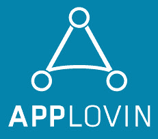

# AppLovin：通过每天处理 300 亿个请求向全球移动消费者进行营销

> 原文： [http://highscalability.com/blog/2015/3/9/applovin-marketing-to-mobile-consumers-worldwide-by-processi.html](http://highscalability.com/blog/2015/3/9/applovin-marketing-to-mobile-consumers-worldwide-by-processi.html)

*这是来自 [AppLovin](http://www.applovin.com/) 的工程副总裁 [Basil Shikin](https://www.linkedin.com/in/basilshikin) 的来宾帖子，内容涉及其移动营销平台的基础架构。 Uber，迪士尼，Yelp 和 Hotels.com 等主要品牌都使用 AppLovin 的移动营销平台。 每天处理 300 亿个请求，每天处理 60 TB 的数据。*

AppLovin 的营销平台为想要通过移动设备吸引消费者的品牌提供营销自动化和分析。 该平台使品牌商可以使用实时数据信号在全球十亿移动消费者中做出有效的营销决策。

# 核心统计信息

*   每天 300 亿个广告请求

*   每秒 300,000 个广告请求，最高为每秒 500,000 个广告请求

*   5 毫秒平均响应延迟

*   每秒 3 百万个事件

*   每天处理 60TB 数据

*   〜1000 台服务器

*   9 个数据中心

*   〜40 个报告维度

*   每分钟 500,000 个指标数据点

*   1 Pb 火花簇

*   所有服务器上的峰值磁盘写入速度为 15GB / s

*   所有服务器上的峰值磁盘读取速度为 9GB / s

*   AppLovin 成立于 2012 年，总部位于帕洛阿尔托，并在旧金山，纽约，伦敦和柏林设有办事处。

# 技术堆栈

## 第三方服务

*   [Github](https://github.com/) 用于代码

*   [Asana](https://asana.com/) 用于项目管理

*   [HipChat](https://www.hipchat.com/) 用于通信

## 数据存储

*   [Aerospike](http://www.aerospike.com/) 用于用户个人资料存储

*   [Vertica](http://www.vertica.com/) ，用于汇总统计信息和实时报告

*   每秒聚合 350,000 行，并以每秒 34,000 行的速度写入 Vertica

*   每秒写入 Aerospike 的峰值为 12,000 个用户个人资料

*   适用于广告数据的 MySQL

*   [Spark](https://spark.apache.org/) 用于离线处理和深度数据分析

*   [Redis](http://redis.io/) 用于基本缓存

*   [节俭](https://thrift.apache.org/) 用于所有数据存储和传输

*   每个数据点在 4 个数据中心中复制

*   每个服务至少在 2 个数据中心中复制（最多 8 个）

*   用于长期数据存储和备份的 Amazon Web Services

## 核心应用和服务

*   自定义 C / C ++ Nginx 模块，用于高性能广告投放

*   用于数据处理和辅助服务的 Java

*   用于 UI 的 PHP / Javascript

*   [Jenkins](http://jenkins-ci.org/) 用于持续集成和部署

*   Zookeeper，用于分布式锁定

*   具有高可用性的 HAProxy 和 IPVS

*   Java / C ++静态代码分析的覆盖范围

*   Checkstyle 和 PMD 用于 PHP 静态代码分析

*   DC 集中式日志服务器的系统日志

*   休眠，用于基于事务的服务

## 服务器和资源调配

*   Ubuntu

*   用于裸机置备的补鞋匠

*   用于配置服务器的厨师

*   Berkshelf 适用于 Chef 依赖项

*   带有 Test Kitchen 的 Docker，用于运行基础结构测试

*   软件（ipvs，haproxy）和硬件负载平衡器的组合。 计划逐步摆脱传统的硬件负载平衡器。

# 监视堆栈

## 服务器监视

*   所有服务器的 [Icinga](https://www.icinga.org/)

*   约 100 个自定义 Nagios 插件，用于深度服务器监视

*   每个服务器 550 个各种探针

*   [石墨](http://graphite.wikidot.com/) 作为数据格式

*   [Grafana](http://grafana.org/) 用于显示所有图形

*   [PagerDuty](http://www.pagerduty.com/) 用于问题升级

*   [冒烟](http://oss.oetiker.ch/smokeping/) 用于网络网格监视

## 应用程序监视

*   [VividCortex](https://vividcortex.com/) 用于 MySQL 监控

*   每个服务上的 JSON / health 端点

*   跨 DC 数据库一致性监视

*   9 个 4K 65 英寸电视，用于显示办公室中的所有图表

*   统计偏差监视

*   欺诈性用户监视

*   第三方系统监视

*   部署记录在所有图表中

## 智能监控

*   具有反馈回路的智能警报系统：可以自省一切的系统可以学到任何东西

*   还会监控有关 AppLovin 的第三方统计信息

*   警报是跨团队的活动：开发人员，操作人员，业务，数据科学家都参与其中

# 体系结构概述

## 一般注意事项

*   将所有内容存储在 RAM 中

*   如果不合适，请将其保存到 SSD

*   L2 缓存级别优化很重要

*   使用正确的工具完成正确的工作

*   体系结构允许交换任何组件

*   仅当替代方案好 10 倍时才升级

*   如果没有合适的组件，请编写自己的组件

*   复制重要数据至少 3 倍

*   确保可以在不破坏数据的情况下重播每条消息

*   自动化所有内容

*   零拷贝消息传递

## 消息处理

*   保证消息传递的自定义消息处理系统

*   每封邮件进行 3 倍复制

*   发送消息=写入磁盘

*   任何服务都可能失败，但是没有数据丢失

*   消息调度系统将所有组件连接在一起，提供了系统的隔离和可扩展性

*   跨 DC 故障容忍度

## 广告投放

*   Nginx 的速度非常快：可以在不到一毫秒的时间内投放广告

*   将所有广告投放数据保留在内存中：只读

*   jemalloc 将速度提高了 30％

*   将 Aerospike 用于用户个人资料：不到 1 毫秒即可获取个人资料

*   将所有广告投放数据预先计算在一个盒子上，并在所有服务器上分发

*   洪流用于在所有服务器之间传播服务数据。 与基于 HTTP 的分发相比，使用 Torrent 导致原始服务器上的网络负载下降 83％。

*   mmap 用于在 Nginx 进程之间共享广告投放数据

*   XXHash 是具有低冲突率的最快的哈希函数。 计算校验和的速度比 SHA-1 快 75 倍

*   实际流量的 5％进入登台环境

*   能够一次运行 3 个 A / B 测试（三个独立测试的流量为 20％/ 20％/ 10％，对照为 50％）

*   A / B 测试结果可在常规报告中查看

# 数据仓库

*   所有数据都已复制

*   运行大多数报告所需的时间不到 2 秒

*   聚合是允许快速报告大量数据的关键

*   最近 48 小时的非汇总数据通常可以解决大多数问题

*   7 天的原始日志通常足以调试

*   一些报告必须预先计算

*   始终考虑多个数据中心：每个数据点都到达多个位置

*   S3 中的备份用于灾难性故障

*   所有原始数据都存储在 Spark 集群中

# 小组

## 结构

*   70 名全职员工

*   15 个开发人员（平台，广告投放，前端，移动）

*   4 位数据科学家

*   5 开发。 行动。

*   加利福尼亚帕洛阿尔托的工程师

*   加利福尼亚州旧金山市的业务

*   在纽约，伦敦和柏林的办事处

## 互动

*   讨论最多问题的 HipChat

*   Asana，用于基于项目的通信

*   所有代码均已审核

*   常见的组代码审核

*   公司季度郊游

*   与首席执行官定期举行市政厅会议

*   所有工程师（CTO 初级）都写代码

*   面试很难：要价实在难得

## 开发周期

*   开发人员，业务部门或数据科学团队提出了一个想法

*   提案已审核并计划在星期一的会议上执行。

*   功能是在分支中实现的； 开发环境用于基本测试

*   创建拉取请求

*   代码经过审核，并在上进行迭代

*   对于大型功能，组代码审核很常见

*   该功能已合并到母版

*   该功能已部署到下一个版本

*   该功能已在 5％的实际流量上进行了测试

*   已检查统计信息

*   如果功能成功，则将逐步量产

*   连续几天监控功能

## 避免出现问题

*   该系统旨在处理任何组件的故障

*   单个组件的故障都不会损害广告投放或数据一致性

*   全能监控

*   工程师观看并分析关键业务报告

*   高质量的代码至关重要

*   某些功能在毕业之前需要经过多次代码审查和迭代。

*   在以下情况下触发警报：

    *   分期统计数据与生产数据不同

    *   关键服务出现致命错误

    *   错误率超过阈值

    *   检测到任何不规则活动

*   数据永不丢失

*   大多数日志行都可以轻松解析

*   通过设计，回滚任何更改都很容易

*   每次失败后：修复，确保将来不会发生相同的事情，并添加监视

# 获得的经验教训

## 产品开发

*   轻松交换任何组件是增长的关键

*   故障推动了创新解决方案

*   过渡环境必不可少：始终准备放松 5％

*   A / B 测试必不可少

*   监视所有内容

*   建立智能警报系统

*   工程师应了解业务目标

*   商界人士应意识到工程学的局限性

*   使构建和持续集成快速。 Jenkins 在 2 台裸机服务器上运行，这些服务器具有 32 个 CPU，128G RAM 和 SSD 驱动器

## 基础结构

*   监视所有数据点至关重要

*   自动化很重要

*   每个组件在设计上均应支持 HA

*   内核优化可将性能提高多达 25％

*   流程和 IRQ 平衡又使性能提高了 20％

*   省电功能会影响性能

*   尽可能使用 SSD

*   优化时，分析所有内容。 火焰图很棒！

[关于黑客新闻](https://news.ycombinator.com/item?id=9171871)

它们如何在服务器之间平衡请求的负载？

@une：我们结合使用了软件（ipvs，haproxy）和硬件负载平衡器。 我们计划逐步摆脱传统的硬件负载平衡器。

您多久发布一次新功能到生产环境？
您能否详细描述代码审查的执行方式，是正式的还是非正式的，重点是什么。

嗨，罗勒，非常感谢。

我现在对您的“暂存”环境特别感兴趣，因为我们正在以类似的规模开展工作，并想出如何管理这种环境。

您能否进一步评论它的“深度”？ 即是否仅复制了您的前端/应用服务器并且“登台”仍共享生产数据库？ 还是您以某种方式拥有一个完全独立的环境，直到数据库和其他后端服务？

如果您在暂存中有任何有状态服务，那么如何管理诸如一致性/模式更改/仅部分可用数据之类的问题？ 如果不这样做，您将如何为这些服务进行集成测试/部署-尤其是日志摄取管道之类的事情，这似乎对您的工作至关重要？

谢谢！

@Wes
我们的发布时间表很忙。 通常每周 2-3 次。
我们使用 [GitHub Flow](https://guides.github.com/introduction/flow/) 进行代码审查和讨论。 我们致力于以最简单的方式实现该功能。

@Paul Banks
我们的暂存环境很深。 我们试图确保每个生产服务都有一个临时的对等设备，可以获取 5-10％的真实数据。

我们确实需要共享一些状态以使登台环境变得全面。 某些棘手的问题只能用真实数据才能解决。
由于登台环境可以运行实验代码，因此我们确保采取适当的措施，以方便分离生产和登台数据。

此设置还有助于我们进行监视：在大多数情况下，预期生产和登台环境的行为类似。 偏差可能表明存在潜在问题。

您好，能否请您简单说明一下如何处理 40 个基于维度的指标。 我们有一个类似的维度大小系统，我正在尝试使用 hbase 和 redis 在每分钟只有 200 万个指标点的情况下使用很少的服务器。