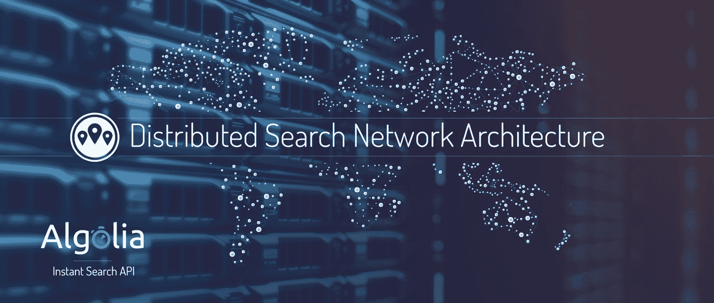

# 阿尔及利亚分布式搜索网络的体系结构

> 原文： [http://highscalability.com/blog/2015/3/9/the-architecture-of-algolias-distributed-search-network.html](http://highscalability.com/blog/2015/3/9/the-architecture-of-algolias-distributed-search-network.html)

*[Julien Lemoine](https://www.linkedin.com/in/julienlemoine) 的共同发布者的 CTO [阿尔及利亚 ]](http://www.algolia.com/) ，开发人员友好的搜索即服务 API。*

Algolia 于 2012 年作为移动设备的离线搜索引擎 SDK 开始。 目前，我们还不知道在两年内我们将建立一个全球分布式搜索网络。

如今，阿尔戈利亚每月在全球 12 个地区提供超过 20 亿个用户生成的查询，我们的平均服务器响应时间为 6.7 毫秒，其中 90％的查询在不到 15 毫秒内得到答复。 我们的搜索不可用率低于 10 -6 ，这表示每月少于 3 秒。

离线移动 SDK 面临的挑战是移动性质带来的技术限制。 这些挑战迫使我们在开发算法时会采取不同的思路，因为经典的服务器端方法无法正常工作。

从那时起，我们的产品有了很大的发展。 我们想分享我们在这些算法之上构建和扩展 REST API 的经验。

**我们将说明我们如何使用分布式共识来实现全球不同地区的数据的高可用性和同步，以及如何通过任意播 DNS** 将查询路由到最近的位置 。

# 数据大小误解

在设计架构之前，我们首先必须确定我们需要支持的主要用例。 在考虑我们的扩展需求时尤其如此。 我们必须知道我们的客户是否需要索引千兆字节，太字节或 PB 的数据。 架构会有所不同，具体取决于我们需要处理多少个用例。

当人们想到搜索时，大多数人会想到非常大的用例，例如 Google 的网页索引或 Facebook 的数万亿帖子索引。 如果停下来想一想每天看到的搜索框，则大多数搜索框都不会搜索大型数据集。 **Netflix 搜索约 10,000 种图书，亚马逊在美国的数据库包含约 200,000,000 种产品。 这两种情况下的数据都可以存储在单台机器** **中！** 我们并不是说拥有一台计算机是一个很好的设置，但是要记住所有数据都可以在一台计算机上存储是非常重要的，因为跨计算机同步是复杂性和性能损失的主要来源。

# 高可用性之路

构建 SaaS API 时，高可用性是一个大问题，因为消除所有单点故障（SPOF）极具挑战性。 我们花了数周的时间为我们的服务集体讨论理想的搜索架构，同时牢记我们的产品将面向面向用户的搜索。

## 主从与主从

通过将问题暂时限制为存储在单个计算机上的每个索引，我们将高可用性设置简化为托管在不同数据中心的多台计算机。 通过这种设置，我们想到的第一个解决方案是进行主从设置，其中一台主机接收所有索引操作，然后将它们复制到一个或多个从机。 使用这种方法，我们可以轻松地在所有计算机之间负载均衡搜索查询。

这种主从方法的问题在于我们的高可用性仅适用于搜索查询。 所有索引操作都需要转到主服务器。 对于服务公司来说，这种架构风险太大。 要做的只是使主服务器停机，这将发生，并且客户端将开始出现索引错误。

**我们必须实现主-主架构** **！** 启用主-主设置的关键要素是要在一组机器之间就单个结果达成一致。 我们需要在所有机器之间共享**知识，这些知识在所有情况下**都保持一致，即使机器之间存在网络分离。

## 引入分布式一致性

对于搜索引擎，引入此共享知识的最佳方法之一是**将写入操作视为必须按特定顺序应用的唯一操作流**。 当我们有多个操作恰好同时出现时，我们需要为其分配一个序列 ID。 然后，可以使用该 ID 来确保将序列完全相同地应用于所有副本。

为了分配序列 ID（每个作业后一个数字递增 1），我们需要在机器之间的下一个序列 ID 上具有共享的全局状态。 [ZooKeeper](http://zookeeper.apache.org/) 开源软件是针对集群中分布式知识的实际解决方案，我们最初开始按以下顺序使用 ZooKeeper：

1.  当机器收到作业时，它将使用临时名称将作业复制到所有副本。

2.  然后，该机器将获得分布式锁。

3.  读取 ZooKeeper 中的最后一个序列 ID，并发送命令以在所有机器上将临时文件复制为序列 ID + 1。 这等效于两阶段提交。

4.  如果我们从计算机（定额）中获得大多数肯定答案，则将序列 ID +1 保存在 Zookeeper 中。

5.  然后释放分布式锁。

6.  最后，将结果通知发送作业的客户端。 如果有大多数提交，这将是成功的。

不幸的是，此顺序不正确，因为如果获取锁的机器在步骤 3 和 4 之间崩溃或重新启动，我们可能会以作业在某些机器上提交的状态结束，这需要更复杂的顺序。

ZooKeeper 通过 TCP 连接作为外部服务打包非常困难，并且需要使用较大的超时（默认超时设置为 4 秒，表示两个滴答声，每个滴答声为 2 秒）。

因此，无论是硬件还是软件，每个失败事件都将在此超时时间内冻结整个系统。 这似乎是可以接受的，但在我们的案例中，我们想经常在生产中测试故障（例如 Netflix 的 Monkey 测试方法）。

## 木筏共识算法

大约在我们遇到这些问题的时候， [RAFT 共识算法](https://raftconsensus.github.io/) 已发布。 显然，该算法非常适合我们的用例。 RAFT 的状态机是我们的索引，日志是要执行的索引作业的列表。 我已经知道 PAXOS 协议，但是对它以及所有变体的理解不够深刻，不足以使我自己有信心实施它。 另一方面，RAFT 更清晰。 如果可以完美地满足我们的需求，即使当时没有稳定的开源实现，我也有足够的信心将其实现为我们架构的基础。

实现共识算法最困难的部分是确保系统中没有错误。 为了解决这个问题，我选择了一种猴子测试方法，即在重新启动之前使用睡眠方式随机杀死进程。 为了进一步测试，我模拟了通过防火墙的网络掉线和性能下降。 这种测试有助于我们发现许多错误。 一旦我们运行了几天，没有任何问题，我非常有信心实施正确。

## 在应用程序或文件系统级别复制吗？

我们选择将写操作分配给所有计算机并在本地执行，而不是在文件系统上复制最终结果。 我们做出此选择的原因有两个：

*   更快。 索引在所有计算机上并行完成，比复制可能很大的二进制文件要快

*   它与多个区域兼容。 如果我们在建立索引后复制文件，则需要一个将重写整个索引的过程。 这意味着我们可能要传输大量数据。 如果您需要将数据传输到世界各地（例如纽约到新加坡），则传输的数据量非常低。

每台机器将以正确的顺序接收所有写操作作业，并独立于其他机器尽快处理它们。 **这意味着确保所有机器处于相同状态，但不必同时处于同一状态** 。 这是因为更改可能不会在同一时间在所有计算机上提交。

## 一致性的妥协

在分布式计算中， [CAP 定理](http://en.wikipedia.org/wiki/CAP_theorem) 指出，分布式计算系统不可能同时提供以下三个功能：

*   一致性：所有节点同时看到相同的数据。

*   可用性：确保每个请求都收到有关成功还是失败的响应。

*   分区容限：尽管任意消息丢失或系统部分出现故障，系统仍可继续运行。

根据该定理，我们在一致性 上折衷了 **。 我们不保证所有节点都能在同一时间看到完全相同的数据，但是它们都将收到更新。 换句话说，在少数情况下，机器不同步。 实际上，这不是问题，因为当客户执行写操作时，我们将该作业应用于所有主机。** **在第一台机器和最后一台机器上的应用时间之间相距不到一秒钟，因此最终用户通常看不到它。 唯一可能的矛盾是上一次收到的更新是否已经应用，这与我们客户的用例兼容。**

# 通用体系结构

## 集群的定义

为了拥有高可用性基础结构，必须在机器之间拥有分布式共识，但是遗憾的是存在很大的缺陷。 **此共识需要机器** **之间进行多次往返，因此每秒可能达成共识的数量与不同机器**之间的延迟直接相关。 他们需要接近才能每秒获得大量共识。 为了能够支持多个区域而不牺牲可能的写入操作的数量，这意味着我们需要有多个集群，每个集群将包含三台充当完美副本的机器。

每个区域只有一个集群是达成共识所需的最低要求，但仍远非完美：

*   我们无法使所有客户都适合一台机器。

*   我们拥有的客户越多，每个唯一客户每秒可以执行的写操作数量就越少。 这是因为每秒的最大共识数是固定的。

为了解决此问题，我们决定在区域级别应用相同的概念： **每个区域将具有由三个计算机组成的几个群集** 。 一个集群可以容纳一个到几个客户，具体取决于他们拥有的数据大小。 这个概念与虚拟化在物理机上所做的事情很接近。 我们能够将几个客户放在一个集群上，但一个客户可以动态增长并更改其使用情况。 为此，我们需要开发和自动化以下过程：

*   如果群集中的数据太多或写入操作数量过多，则将其迁移到另一群集。

*   如果查询量太大，则将新计算机添加到群集。

*   如果数据量太大，则更改分片的数量或将一个客户分散在多个群集中。

如果我们拥有这些流程，则不会将客户永久分配给集群。 分配将根据其自身的使用以及集群的使用而变化。 这意味着我们需要一种将客户分配给集群的方法。

## 将客户分配给集群

管理此分配的标准方法是每个客户拥有一个唯一的 DNS 条目。 这类似于 Amazon Cloudfront 的工作方式。 每个客户都被分配一个格式为 customerID.cloudfront.net 的唯一 DNS 条目，然后可以根据该客户针对不同的计算机集。

我们选择了相同的方法。 **为每个客户分配一个唯一的应用程序 ID，该 ID 链接到格式为 APPID.algolia.io 的 DNS 记录**。 该 DNS 记录以特定群集为目标，该群集中的所有计算机都是 DNS 记录的一部分，因此可以通过 DNS 进行负载平衡。 我们还使用运行状况检查机制来检测计算机故障，并将其从 DNS 解析中删除。

即使 DNS 记录上的 TTL 值非常低（TTL 是允许客户端保留 DNS 答复的时间），运行状况检查机制仍不足以提供良好的 SLA。 问题在于主机可能会关闭，但用户仍将主机保留在缓存中。 用户将继续向其发送查询，直到缓存过期。 更糟糕的是，因为 TTL 并不是一门精确的科学。 在某些情况下，系统不遵守 TTL。 我们已经看到一些 DNS 服务器将一分钟 TTL 转换为 30 分钟 TTL 的 DNS 记录。

为了进一步提高高可用性并避免机器故障影响用户，我们为每个客户生成了另一组 DNS 记录，格式为 APPID-1.algolia.io，APPID-2.algolia.io 和 APPID- 3.algolia.io。 这些 DNS 记录的思想是允许我们的 API 客户端在达到 TCP 连接超时（通常设置为一秒）时重试其他记录。 我们的标准实现是对 DNS 记录列表进行混洗，并按顺序尝试它们。

与我们的 API 客户端中精心控制的重试和超时逻辑相结合，这被证明是比使用专门的负载平衡器更好，更便宜的解决方案。

后来，我们发现时髦的.IO TLD 并不是性能的理想选择。 与.NET 相比，.IO 的任意播网络中的 DNS 服务器更少，并且那里的服务器已经饱和。 这导致大量超时，从而减慢了名称解析的速度。 此后，我们通过切换到 algolia.net 域解决了这些性能问题，同时通过继续支持 algolia.io 来保持向后兼容性。

# 集群的可伸缩性如何？

我们选择使用多个集群使我们能够添加更多客户，而不会因为集群之间的隔离而对现有客户造成太大的风险。 但是我们仍然担心需要解决的一个集群的可伸缩性。

群集可伸缩性中的第一个限制因素是由于共识而导致的每秒写入操作数。 为了缓解这一因素，我们从共识的角度出发，在 API 中引入了批处理方法，该方法将一组写操作封装在一个操作中。 问题在于，某些客户仍然不分批地执行写操作，这可能会对群集的其他客户的索引速度产生负面影响。

为了减少对性能的影响，我们对体系结构进行了两项更改：

*   我们从共识的角度出发，通过在一个唯一的操作中自动聚合每个客户的所有写操作，从而在共识存在争议时添加了批处理策略。 在实践中，这意味着我们正在重新排列作业的顺序，但不影响操作的语义。 例如，如果有 1,000 个待达成共识的作业，而 990 个来自一个客户，则即使有其他客户的作业交错在一起，我们也会将 990 个写入操作合并为一个。

*   我们添加了一个共识调度程序，该调度程序控制每秒为每个应用程序 ID 输入共识的写入操作数。 这避免了一个客户能够使用共识的所有带宽。

在实施这些改进之前，**我们通过返回 429 HTTP 状态代码**尝试了限速策略。 很快就很明显，这对于我们的客户来说太痛苦了，以至于不得不等待这种响应并实施重试策略。 如今，我们最大的客户每天在三台计算机的单个群集上执行超过 10 亿次写操作，平均每秒执行 11,500 次操作，突发次数超过 15 万次。

第二个问题是找到最佳的硬件设置，并避免可能影响群集可伸缩性的任何潜在瓶颈（例如 CPU 或 I / O）。 从一开始，我们就选择使用自己的裸机服务器，以完全控制我们的服务性能并避免浪费任何资源。 选择正确的硬件被证明是一项艰巨的任务。

在 2012 年底，我们从一个小型设置开始，包括：Intel Xeon E3 1245v2、2 个 Intel RAID 320 系列，RAID 0 中的 120GB 和 32GB RAM。 该硬件价格合理，比云平台更强大，使我们能够在欧洲和美国东部启动该服务。

此设置使我们能够调整内核的 I / O 调度和虚拟内存，这对于我们利用所有可用的物理资源至关重要。 即使这样，我们很快发现我们的限制是 RAM 和 I / O 的数量。 我们使用了大约 10GB 的 RAM 来建立索引，而仅剩下 20GB 的 RAM 用于缓存用于执行搜索查询的文件。 我们的目标一直是在内存中存储客户索引，以便针对毫秒级的响应时间优化服务。 当前的硬件设置是为 20GB 的索引数据而设计的，该数据太小了。

首次设置后，我们尝试了具有单插槽和双插槽 CPU，128GB 和 256GB RAM 以及不同型号/大小的 SSD 的不同硬件机器。

我们终于找到了一台包含 Intel Xeon E5 1650v2、128GB RAM 和 2x400GB Intel S3700 SSD 的机器的最佳设置。 SSD 的型号对于耐用性非常重要。 在找到可以在生产中使用多年的正确型号之前，我们烧掉了许多 SSD。

最后，我们构建的最终体系结构使我们仅需一个条件即可在所有领域进行良好的扩展：我们需要随时拥有免费资源。 在 2015 年，要处理必须管理裸机服务器的痛苦似乎有些疯狂，但是我们在为客户提供的服务质量和价格方面所获得的收益是值得的。 我们能够提供一个完全打包的搜索引擎，该引擎可以复制到三个不同的位置（在内存索引中），并且在比 AWS 更高的位置上具有出色的性能！

# 操作复杂吗？

## 限制进程数

**每台机器仅包含三个进程** 。 第一个是 Nginx 服务器，其中所有查询解释代码均作为模块嵌入其中。 为了回答查询，我们在内存中映射了索引文件并直接在 nginx worker 中执行查询，而无需与其他进程或机器进行通信。 唯一的例外是，当客户数据不适合一台机器时，这种情况很少发生。

第二个过程是 Redis 键/值存储，我们使用它来检查速率和限制以及存储每个应用程序 ID 的实时日志和计数器。 这些计数器用于构建我们的实时信息中心，当您连接到帐户时可以查看。 这对于可视化您的最后一个 API 调用和调试很有用。

最后一个过程是构建器。 这是负责处理所有写入操作的过程。 当 nginx 进程接收到写操作时，它将操作转发给构建器以执行共识。 它还负责构建索引，并包含许多监视代码，用于检查我们的服务中的错误，例如崩溃，索引编制缓慢，索引编制错误等。根据问题的严重性，SMS 通过 Twilio 的 API 报告某些错误 而其他则直接报告给 PagerDuty。 每次在生产中检测到新问题且未报告时，我们确保将来添加一个新探针以监视此类错误。

## 易于部署

**此堆栈的简单性使部署变得容易** 。 在部署任何代码之前，我们应用一堆单元测试和非回归测试。 一旦所有这些测试通过，我们便逐渐部署到集群。

我们的部署永远不会影响生产，也不会对最终用户可见。 同时，我们还希望以协商一致的方式产生主机故障，以便检查一切是否按预期进行。 为了实现这两个目标，我们独立部署群集的每台计算机，并应用以下过程：

1.  获取新的 Nginx 和生成器二进制文件。

2.  [正常重启 nginx](http://nginx.org/en/docs/control.html#upgrade) Web 服务器，并使用新的二进制文件重新启动 nginx，而不会丢失任何用户查询。

3.  杀死构建器并使用新的二进制文件将其启动。 这会触发每台计算机部署 RAFT 失败，从而使我们能够确保故障转移按预期进行。

操作系统的简单性是我们体系结构的重要目标。 我们既不希望也不相信部署应该受到体系结构的限制。

## 实现良好的全球覆盖范围

服务正在变得越来越全球化。 仅在全球一个地区提供搜索查询远非最佳。 例如，在美国东部地区托管搜索将在可用性方面有很大不同，具体取决于用户从何处进行搜索。 对于美国东部用户来说，延迟时间将从几毫秒到亚洲用户的数百毫秒，这还不包括饱和的海外光纤的带宽限制。

我们已经看到一些公司在搜索引擎之上使用 CDN 来解决这些问题。 最终，这给我们带来了比价值更大的问题，因为使缓存无效是一场噩梦，并且仅提高了很少一部分频繁执行的查询的速度。 我们很清楚，为了解决这个问题，我们需要将索引复制到不同的区域，并将它们加载到内存中，以便有效地回答用户查询。

我们需要的是在现有群集复制之上的 **区域间复制** 。 副本可以存储在一台机器上，因为该副本仅用于搜索查询。 所有写操作仍将转到客户的原始群集。

**每个客户都可以选择他们希望拥有的一组数据中心** 作为复制对象，因此特定区域中的复制计算机可以从多个群集中接收数据，并且一个群集可以 将数据发送到多个副本。

此架构的实现是基于我们基于共识的操作流建模的。 在达成共识之后，每个集群都将其自己的写操作流转换为每个副本的版本，以确保用无操作作业替换与此副本无关的作业。 然后，此操作流作为一批操作发送到所有副本，以避免尽可能多的延迟。 一次发送作业将导致重复的往返次数过多。

在群集上，写操作将保留在计算机上，直到所有复制对其进行确认为止。

DSN 的最后一部分是将最终用户直接重定向到最近的位置。 为此，我们以 APPID-dsn.algolia.net 的形式添加了另一个 DNS 记录，该记录负责解决最接近的数据中心的问题。 我们首先使用了 Amazon 的 Route53 DNS 服务，但很快达到了极限。

*   基于延迟的路由仅限于 AWS 区域，并且我们有印度，香港，加拿大和俄罗斯等 AWS 未覆盖的位置。

*   基于地理位置的路由非常糟糕。 您需要为每个国家/地区指定 DNS 解析度。 这是许多托管 DNS 提供商所采用的经典方法，但是对于我们而言，这将是一个噩梦，无法提供足够的相关性。 例如，我们在美国有几个数据中心。

经过大量基准测试和讨论，出于以下几个原因，我们决定使用 [NSOne](http://www.nsone.net) 。

*   对我们来说，他们的 Anycast 网络非常出色，并且比 AWS 更好的平衡。 例如，他们在印度和非洲拥有 POP。

*   他们的滤波器逻辑非常好。 对于每个客户，我们可以指定与其关联的机器（包括复制机器）列表，并使用地理位置过滤器按距离对它们进行排序。 这样我们就可以保持最好的状态。

*   它们支持 EDNS 客户端子网。 这对我们来说很重要，以便更具针对性。 我们使用最终用户的 IP 而不是其 DNS 服务器的 IP 进行解析。

在性能方面，我们已经能够在第二级达到全球范围内的全球同步。 您可以在 [Product Hunt 的搜索](http://www.producthunt.com/) （托管在美国东部，美国西部，印度，澳大利亚和欧洲）或 [Hacker News 上进行尝试。 搜索](https://hn.algolia.com/) （托管在美国东部，美国西部，印度和欧洲）。

## 结论

我们花费了大量时间来构建我们的分布式和可伸缩体系结构，并且遇到了许多不同的问题。 我希望本文能使您更​​好地了解我们如何解决这些问题，并提供有关如何设计自己的服务的有用指南。

我看到越来越多的服务目前正面临着与我们类似的问题，全世界的受众都拥有多区域的基础架构，但是却拥有一些全球一致的信息，例如登录名或内容。 为了获得出色的用户体验，如今必须拥有多区域基础架构。 例如，可以使用这种方法来分发在全球范围内一致的只读数据库副本！

如果您有任何问题或意见，我将很乐意回答。

[在 HackerNews 上](https://news.ycombinator.com/item?id=11185713)

FWIW，Raft 和 Paxos 之间的主要区别在于，如果在故障转移期间发生写操作，则 Raft 保证数据丢失。 Paxos 直接将写入与主选举过程联系在一起，以使写入不会丢失。 两者还可以在部分网络故障的情况下锁定到位； 根据具体实施情况，Raft 倾向于留在那里并接受数据一段时间。 因此，尽管 Raft 更简单/更轻松，但这是因为它使您能够以非常糟糕的方式破坏 Paxos 明智地处理的事情。

这篇文章将来会发表。 可能弄乱了一些提要阅读器。

您是否考虑过使用 Kafka 在集群中实现“状态机”复制？

我是作者，并回复评论：

以色列：RAFT 和 Paxos 的保证是相同的：当共识成功时，就可以保证没有数据丢失。 您能否详细说明为什么您认为并非如此？

凯恩：由于多个地区的部署，卡夫卡不是一个选择。 我们需要对复制的序列 ID 分配进行更底层的控制

您在搜索引擎中使用什么技术？

@Jeyendran 如简介中所述，这是我们自己的引擎，以低级 C ++开发，并作为模块嵌入在 nginx 中。 由于以下几个原因，我们不是基于像 lucene / sphinx 这样的开源引擎：
-我们处理关联性的方式非常不同，这意味着对现有引擎
进行了巨大的重构-在即时搜索中具有非常好的性能 用例（键入时进行搜索），我们具有不同的数据结构。 我将尝试写一篇博客文章来解释我们所有的算法/数据结构差异

可能是我读过的最好的文章！

我很高兴看到其他人考虑了“三个进程”机制，并在 nginx 和其他进程之间使用了 mmap 文件。 和强大的）集群技术。

谢谢您的出色工作。

您提到过，在使用 RAFT 协议的一致性上存在折衷。 根据我的理解，RAFT 并没有给出分区容限，因为每个状态机都需要互相交谈以复制状态。 因此，这是 CAP 定理的 CA 系统，在这里我们可以最终保持一致。

我喜欢你的文章。 感谢分享 ：））

嗯，是的，Raft 和 Paxos 都提供了类似的一致性保证。 甚至还有自动的正确性证明：https://github.com/uwplse/verdi/pull/16

该帖子说他们使用 Raft 来协调故障转移，并且分别决定损害一致性，而不是他们使用 Raft 损害了的一致性*。 您可以维护有关某些事物（例如，当前哪个节点是主节点）的始终一致的信息，而不能维护其他事物（例如，您正在服务的索引的实际内容）。*

也许 Raft 不一致的想法来自对 https://aphyr.com/posts/316-jepsen-etcd-and-consul 的误解，（正确地）它说 Raft 的两个广泛使用的实现缺少了使 读取速度较慢，但​​有必要避免以下情况：1）您在分区的少数一方 2）先前的主机太 3）选出新的主机，并且有人在第一秒内向其中写入新数据，或者 因此，4）您在写完之后阅读。

两种系统最终都提供了没有异常的模式，这是由于 Raft 的实现不完整所致，而不是 Raft 本身的缺陷。

非常感谢您的帖子。 我学到了很多。