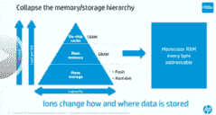
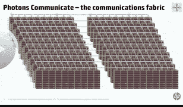

# 机器：惠普基于忆阻器的新型数据中心规模计算机-一切仍在变化

> 原文： [http://highscalability.com/blog/2014/12/15/the-machine-hps-new-memristor-based-datacenter-scale-compute.html](http://highscalability.com/blog/2014/12/15/the-machine-hps-new-memristor-based-datacenter-scale-compute.html)

> 摩尔定律的终结是过去 50 年来计算机发生的最好的事情。 摩尔定律一直是安慰的专制。 您可以放心，您的筹码会不断进步。 每个人都知道即将发生什么以及何时发生。 整个半导体行业都被迫遵守摩尔定律。 在整个过程中没有新的发明。 只需在跑步机上踩一下，然后执行预期的操作即可。 我们终于摆脱了束缚，进入了自 1940 年代后期以来我们看到的最激动人心的计算时代。 最终，我们处于人们可以发明的阶段，将尝试并尝试这些新事物并找到进入市场的方式。 我们最终将以不同的方式和更聪明的方式做事。
> 
> - [Stanley Williams](http://en.wikipedia.org/wiki/R._Stanley_Williams) （措辞）

惠普一直在开发一种全新的计算机，其名称为*机器*（不是 [这台机器](http://personofinterest.wikia.com/wiki/The_Machine) ）。 该机器可能是惠普历史上最大的 R & D 项目。 这是对硬件和软件的彻底重建。 巨大的努力。 惠普希望在两年内启动并运行其数据中心规模产品的小版本。

故事始于大约四年前我们在 [中首次遇到惠普的](http://highscalability.com/blog/2010/5/5/how-will-memristors-change-everything.html) [Stanley Williams](http://en.wikipedia.org/wiki/R._Stanley_Williams) ？ 在忆阻器故事的最新一章中，威廉姆斯先生发表了另一篇令人难以置信的演讲： [机器：用于计算大数据的 HP 忆阻器解决方案  ，进一步揭示了机器的工作方式。

机器的目标是**折叠内存/存储层次结构**。 今天的计算是低能效的。 **消耗了 80％的能量**和大量时间**在硬盘，内存，处理器和多层高速缓存之间移动位**。 客户最终花在电费上的钱比买机器本身要多。 因此，该计算机没有硬盘，DRAM 或闪存。 数据保存在高能效忆阻器，基于离子的非易失性存储器中，数据通过光子网络移动，这是另一种非常省电的技术。 当一小部分信息离开核心时，它就以光脉冲的形式离开。

在图形处理基准上，据报道，“机器”基于能效的性能要好 2-3 个数量级，而基于时间的性能要好一个数量级。 这些基准没有详细信息，但这就是要点。

**机器首先放置数据** 。 其概念是围绕非易失性存储器构建一个系统，在整个存储器中自由分配处理器。 当您要运行程序时，请 **将程序发送到内存** 附近的处理器，在本地进行计算，然后将结果发送回去。 计算使用了各种各样的异构多核处理器。 与仅移动 TB 或 PB 的数据相比，仅传输程序所需的位和结果可节省大量资金。

机器不针对标准 HPC 工作负载。 这不是 LINPACK 破坏者。 HP 试图为客户解决的问题是客户要执行查询并通过搜索大量数据来找出答案。 随着新数据的出现，需要存储大量数据并进行实时分析的问题

**为什么构建计算机需要非常不同的体系结构？** 计算机系统无法跟上不断涌入的大量数据。惠普从其客户那里得知，他们需要能够处理越来越多的数据的能力。 **与晶体管的制造速度**相比，收集的位数呈指数增长。 另外，信息收集的增长速度快于硬盘的制造速度。 惠普估计，人们真正想做的事有 250 万亿张 DVD 数据。 全世界从未收集过大量数据，甚至从未查看过。

因此，需要一些新的东西。 至少这是惠普的赌注。 尽管很容易对 HP 正在开发的技术感到兴奋，但至少在本世纪末之前，这对您和我来说都不是。 这些将在相当长一段时间内都不是商业产品。 惠普打算将它们用于自己的企业产品，在内部消耗所制造的一切。 我们的想法是，我们还处于技术周期的初期，因此首先要构建高成本的系统，然后随着数量的增长和流程的改进，该技术将可以进行商业部署。 最终，成本将下降到足以出售更小尺寸的产品。

有趣的是，HP 本质上是在构建自己的云基础架构，但是他们没有利用商品硬件和软件，而是在构建自己最好的定制硬件和软件。 云通常提供大量的内存，磁盘和 CPU 池，这些池围绕通过快速网络连接的实例类型进行组织。 最近，有一种将这些资源池视为独立于基础实例的方法。 因此，我们看到诸如 [Kubernetes 和 Mesos](https://mesosphere.com/2014/07/10/mesosphere-announces-kubernetes-on-mesos/) 之类的高级调度软件正在成为行业中的更大力量。 惠普必须自己构建所有这些软件，以解决许多相同的问题，以及专用芯片提供的机会。 您可以想象程序员对非常专业的应用程序进行编程以从 The Machine 获得每盎司的性能，但是 HP 更有可能必须创建一个非常复杂的调度系统来优化程序在 The Machine 上的运行方式。 **软件的下一步是一种全息应用程序体系结构的演进，其中功能在时间和空间上都是流动的，并且身份在运行时由二维结构产生。** 日程安排优化是云上正在探索的下一个领域。

演讲分为两个主要部分：硬件和软件。 该项目的三分之二是软件，但威廉姆斯先生是硬件专家，所以硬件占了大部分。 硬件部分基于**优化围绕**可用的物理原理的各种功能的思想：**电子计算； 离子存储 光子通信**。

这是我对威廉姆斯先生的发言 [讲话](https://mediacosmos.rice.edu/app/plugin/embed.aspx?ID=vVUTzFCE006yZu3TF1sXKg&displayTitle=false&startTime=0&autoPlay=false&hideControls=false&showCaptions=false&width=420&height=236&destinationID=URka-_E5-0-e4girH4pDPQ&contentID=vq2oQtAqPkeAqm5F6uSnqA&pageIndex=1&pageSize=10) 。 像往常一样，面对如此复杂的主题，可能会错过很多东西。 另外，威廉姆斯先生在煎饼周围扔出了很多有趣的主意，因此强烈建议您观看演讲。 但是在那之前，让我们来看看 HP 认为机器将是计算的未来……。

## 为什么构建计算机需要不同的体系结构？

计算架构在 60 年来从未改变。 [Von Neumann 架构](http://en.wikipedia.org/wiki/Von_Neumann_architecture) 仅打算使用几年，但我们仍在使用它。 数据必须在内存，处理器和硬盘之间来回移动。 **如今，移动数据的过程已完全主导了计算**。 这就是在数据中心中花费大量时间并消耗大量电力的原因。

摩尔定律即将终结。 我们已经达到了 14 nm（约 50 个原子）的晶体管。 7 nm 被认为是物理极限。 10 纳米将在两年内准备就绪，而 7 纳米将在 2020 年之前准备就绪。 这将使计算效率提高 10 个数量级，这是人类技术有史以来最大的改进。

我们如何看待突破摩尔定律范式？ **围绕可用的**优化物理的各种功能。 50 年来，我们附属于计算机的东西是电子。 那不会改变。 电子是执行计算过程的理想选择。 它们很小，很轻，您施加了电压，移动很快，但是它们的质量足以使它们位于一个很小的空间中，并且相互作用非常强，因此您可以对电子进行逻辑运算。 电子将继续成为引擎的计算部分。

**我们将使用离子** 而不是使用电子进行存储。 原因是离子是经典的机械粒子，它们很重，将它们放在某个地方并留在那儿，您可以回到一个世纪后，将离子放在那儿的位置仍然存在。 离子确实是非易失性存储信息的一种方法。 可以将离子放在小盒子中，然后可以将盒子堆叠起来，与电子相比，可以实现高密度，低成本的存储。

**数据将使用光子** 移动。 其原因是光子没有质量，因此它们以光速运动。 可以在同一波导中放置许多不同颜色的光，因此可以节省大量空间和能源。 更高的通信带宽和更低的功耗。

正在围绕这些功能中的每一个对机器周围的硬件进行优化，以便进行计算，存储和通信。 通过适当地构建它们，存在有利的非线性相互作用。

**通过异构多核芯片的扩散，电子将继续成为未来** 的计算引擎。 由于摩尔定律的失败，如今存在多核芯片。 我们之所以拥有多核芯片，是因为一个大而快的芯片的功耗会使其蒸发。 为了解决该问题，将芯片切成小块。 问题是多核更难编程，但是我们开始弄清楚，人们现在认为多核是一件好事。

并非所有核心都相同，而是核心将有所不同。 代替在芯片上具有相同的 256 个内核，将针对不同类型的功能优化不同的内核。

**挑战是 Dark Silicon** 。 如果同时点亮一个芯片上的所有内核，则**芯片将被蒸发**。 您实际上从未真正使用过芯片上的所有内核。 与 14nm 相比，在 10nm 下，您必须一次使用一半的内核。 如果内核是特定于功能的，则在不使用内核时将它们变暗是有意义的。 专用加速器是可以超级高效地运行一种类型的计算的核心，但是它只能完成一件事。 对于求解晶体结构，如果您有一个可以在一个时钟周期内完成傅立叶变换的专用内核，那将非常有帮助。

您不需要庞大的团队来设计处理器。 有些公司出售处理器设计。 您可以只设计几个专门的加速器。 这些设计可以招标。 力量的平衡将转移给设计师，而不是制造商，他们将成为低成本的竞标者。

## **忆阻器是离子盒**

**DRAM 本质上吸收电子并将其放入盒子中** 。 随着盒子的尺寸越来越小，将电子保持在内部的难度越来越大，这意味着 DRAM 必须更频繁地刷新。 可靠地将电子存储在 DRAM 或闪存中变得越来越困难。

**解决方案是在存储介质中使用作为带电原子的离子代替电子** 。 原子比电子的行为更好，因为它们的质量大得多。 原子是经典的机械粒子，因此即使在 10nm 的盒子中，原子也很高兴成为粒子。 将离子放入盒子中，在盒子上施加电压，离子将在盒子内移动。 关闭电压，即使在很小的盒子中，离子也将保持原状，甚至持续数百万年。 这是非常稳定的非易失性类型的内存。

**可以通过在盒子上施加小电压并测量电阻**来读取离子状态 **。 由于电压不够高，离子不会移动。 盒子的电阻取决于离子在里面的位置。 当离子在盒子中均匀分布时，您会得到一个低电阻，您可以将其称为 1。如果将所有离子推到盒子的一侧，则电阻将非常高，您可以将其称为 0。**

**离子盒是忆阻器**。 与 DRAM 忆阻器相比，**因子**慢 4 倍，可以通过并行访问来缓和。 忆阻器的功率要求要低得多，因为离子不会泄漏，因此无需刷新。 **的位密度要比**高得多，因为可以将盒子堆叠在一起。 芯片**每位**便宜得多。 基于这些想法，他们多年来一直在制造芯片。 在演讲中，显示的芯片使用了 2.5 年，并使用了 50nm 技术，这意味着当前的迭代要好得多，但是他们无法发表评论。

想法是折叠内存/存储层次结构，并消除在系统中所有层之间移动数据的所有开销和时间。 今天的计算问题是能源效率低下。 花费了 80％的能量，并花费了大量时间来获取位，然后将它们从硬盘，内存，处理器，多层高速缓存中移出，然后再向下移出。 大多数操作系统都关心所有这些数据处理的机制。

## 使用光子进行通信

光子破坏距离。 没有什么比光速快。

那么为什么我们不像在电信网络中那样已经在芯片上使用光子学呢？ 互连的成本将是计算机本身成本的一千倍。 **通过机架移动的数据量大于通过北美电信网络**的数据量。

**惠普一直在努力降低成本**。 光线是移动数据的一种上乘方式。 它具有高带宽（单根导线中有多个波长），高能效（无能量损失），低延迟（无中继器）和空间高效（节省了引脚数）。

他们现在正在使用标准硅工艺在硅晶片上集成光子学。

此技术用于在计算机中创建通信结构。 电脑是一个装有刀片的盒子。 刀片服务器具有忆阻器存储芯片和多核处理器。 插入刀片时，刀片会自动重新配置光子网络，以便一切都能相互通信。 接下来要做的是把盒子拿起来并堆放在一起，形成一个架子。 同样，网络会自动进行自我配置。 接下来是能够组装一个数据中心的机架，然后将它们全部抬起并正确配置。

 

## 软件-三分之二

到目前为止，所有硬件仅占项目的 1/3。 The Machine 之上必须装有操作系统。 一个操作系统可能需要数十年的开发时间。 **惠普正在开发精简版的 Linux** ，该版本非常快，因为处理掉了数据内部移动的所有逻辑都已被剔除。 他们还创建了**开源社区，以构建操作系统**的本机版本，以及所有最重要的应用程序，例如分析，可视化，艾字节级算法和百万节点管理。

试图缩短从研究，开发到产品生产的时间范围。 大量的工作。 这是一个非常冒险的项目。 规模庞大。 雄心勃勃。 巨大的风险。

## 对任何尝试进行全新工作的人来说，都是一个重大警告。

**经验教训**：他们遇到了无法预料的问题。 然后要做很多工作，以确保可以使用标准制造流程来构建其流程。

如果您尝试引入真正不同的东西，例如碳纳米管或石墨烯，会发生什么？ 他们使用所有标准材料所面临的挑战是巨大的。 引入异国情调的东西将需要数十年的时间才能真正通过实际的制造过程进行构建。 如果您打算深入研究并大胆地做，则必须**做一些与现有**尽可能接近的事情。 你离那不可能走得太远。

## 相关文章

*   [忆阻器将如何改变一切？](http://highscalability.com/blog/2010/5/5/how-will-memristors-change-everything.html)

*   [我们比光而不是电的超高速计算机更近一步](http://www.fastcolabs.com/3039445/were-one-step-closer-to-superfast-computers-that-run-on-light-instead-of-electricity)

*   Google 押注 [Quantum Computers](https://plus.google.com/+QuantumAILab/posts)

*   [图灵大教堂](http://www.amazon.com/dp/0375422773) -乔治·戴森

*   [IT 的新风格](http://www.hipeac.net/system/files/HiPEAC14-faraboschi-pub.pdf)