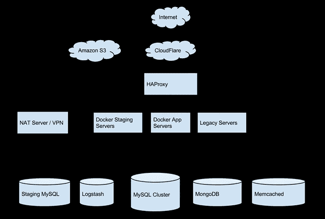
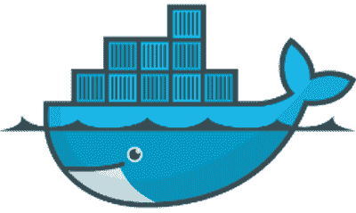
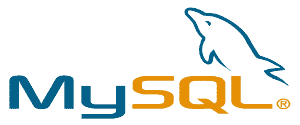
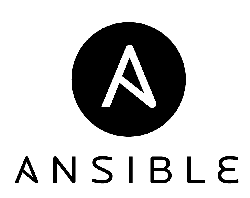

# Clay.io 如何使用 AWS，Docker，HAProxy 和 Lots 建立其 10 倍架构

> 原文： [http://highscalability.com/blog/2014/10/6/how-clayio-built-their-10x-architecture-using-aws-docker-hap.html](http://highscalability.com/blog/2014/10/6/how-clayio-built-their-10x-architecture-using-aws-docker-hap.html)

*这是 [Zoli Kahan](http://insignia.zolmeister.com/#/) 来自 [Clay.io](http://clay.io/) 的[客人转发。](http://zolmeister.com/)*

这是我的新系列`10x`中的第一篇文章，我在 [Clay.io](http://clay.io/) 中分享我的经验以及如何做事，以与一个小组一起大规模发展。 如果您觉得这些事情有趣，我们正在招聘- [[受电子邮件保护]](/cdn-cgi/l/email-protection)

## 云端

### 云耀斑

[CloudFlare](https://www.cloudflare.com/) 处理我们所有的 DNS，并充当具有某些其他 DDOS 保护功能的分布式缓存代理。 它还处理 SSL。

### Amazon EC2 + VPC + NAT 服务器

我们几乎所有服务器都生活在 Amazon EC2 上，其中大多数是中型或大型实例。 我们还使用 Amazon VPC 将我们的某些服务器托管在外部无法访问的专用网络中。 为了进入这个专用网络，我们有一个 NAT 服务器，它也用作我们的 VPN 端点，在与内部网络配合使用时使用。 （[指南](http://docs.aws.amazon.com/AmazonVPC/latest/UserGuide/VPC_Scenario2.html)， [OpenVPN](https://openvpn.net/index.php/open-source/documentation/howto.html) ）

### 亚马逊 S3

我们将 Amazon S3 用作 CDN 后端，该后端托管了我们的所有静态内容。 为此，我们使用一个单独的域：`cdn.wtf`（出于安全和性能方面的考虑）（无 cookie 的域）。

### HAProxy

[HAProxy](http://www.haproxy.org/) 是一种性能卓越的反向代理，可用于将流量路由到我们的不同服务。 由于 Clay.io 的性质及其对平台支持的关注（以及对遗留代码的支持），这项工作并不轻松，我将在以后的文章中详细介绍。

当前，我们在 m3.medium 实例上只有一个 HAProxy 服务器，但是会随着流量的增加而升级。 此外，如有必要，我们可以在前面添加 Amazon ELB 以水平缩放。

### 应用服务器-Docker

[Docker](https://www.docker.com/) 是用于管理 Linux 容器的工具，该工具类似于虚拟机，但开销较小（并且没有隔离和安全保证）。 Docker 的关键在于，无论主机看起来如何，容器内部交付的代码都应运行相同的代码。

当前，我们通过 Docker 在`app server`上运行大多数计算服务。 可以轻松地复制该服务器以满足弹性需求，并且可以轻松地上下移动服务。 最终，我们希望使用 Kubernetes 之类的工具来管理这些应用服务器。 （请参阅文章底部）

### 登台 App Server-Docker

我们的登台环境服务器与我们的应用程序服务器相同，并且运行与生产环境中完全相同的 docker 二进制文件。 这种环境对于防止生产系统不必要的损坏和停机至关重要。

## 数据

### 的 MySQL

[MySQL](http://www.mysql.com/) 是生产强化的关系 SQL 数据库。 目前，我们的绝大多数数据都位于主从 MySQL 群集中。 我们有一个主服务器和两个从属服务器，它们为我们的用户提供大部分查询。 最终，我们可能不得不移动表或将单个主服务器分片，但希望一段时间不会。

### Logstash

[Logstash](http://logstash.net/) 是一种日志聚合工具，具有 Kibana 集成用于分析。 它基本上处理了我们所有的应用程序日志，并为我们提供了在出现问题时检查错误的地方。 它使我们不必通过 SSH 进入计算机来检查日志。

### MongoDB

[MongoDB](http://www.mongodb.org/) 是 NoSQL 文档存储数据库。 当前，我们将 mongodb 用于某些开发人员端点以及 A / B 测试框架 [Flak Cannon](https://github.com/claydotio/flak-cannon) 。

### 记忆快取

[Memcached](http://memcached.org/) 是一个键值存储，主要用于缓存。 在许多方面，它与 Redis 类似。 当前，我们在旧版 Web 应用程序中使用 Memcached 来缓存 MySQL 查询结果。 最终，我们希望将其替换为 Redis。

## 开发运维

### Ansible

[Ansible](http://www.ansible.com/home) 已成为我们管理服务器的首选工具。 对于大多数开发人员而言，它非常简单，可以快速学习并乐于使用，并且对于自动化通常由运营团队管理的许多流程至关重要。

## 其他服务

### 的 GitHub

[GitHub](https://github.com/) -很棒的源代码管理，已经足够了。

### 正常运行时间机器人

[正常运行时间机器人](https://uptimerobot.com/)是免费的监控服务，我们用于监控我们的健康检查和端点。 如果有任何问题，它将在 5 分钟内通过电子邮件和短信发送给我们。

### Drone.io

[Drone.io](https://drone.io/) 是一项持续集成服务，我们使用该服务为各种项目持续运行我们的测试套件。 它类似于 TravisCI，并且最近发布了一个开源的可自我托管版本。

### Docker 注册表

我们目前使用官方 [Docker 注册表](https://registry.hub.docker.com/)管理我们的 Docker 容器。 除了 Docker 容器外，它与 GitHub 类似。

### 新遗物

[New Relic](http://newrelic.com/) 是服务器和应用程序监视服务，我们主要用于监视服务器，以便在计算机磁盘或内存不足时通知我们

### 谷歌分析

[Google Analytics](http://www.google.com/analytics/) 是我们的主要网站分析跟踪工具。 为了跟踪我们特定于站点的功能，我们使用自定义事件功能。

### Google Apps

[Google Apps](http://www.google.com/enterprise/apps/business/) 为我们的域 clay.io 提供电子邮件，并为我们的组织提供了共享的 Google 云端硬盘设置。

### 最后通行证

[Last Pass](https://lastpass.com/) 是一种密码管理服务，使我们可以在团队中轻松共享上述所有其他服务的公司凭据。

## 未来

虽然我们目前对今天的设置感到满意，但我们希望在接下来的几个月中对其进行改进。 最初的基础架构版本缺少一些功能，这些功能并不需要花足够的时间来证明，但是随着我们的扩展，我们最终将需要重新使用它们。

[Kubernetes](https://github.com/GoogleCloudPlatform/kubernetes) 希望成为一个令人惊叹的大规模管理 Docker 容器的项目和工具。 我们将密切关注其发展，并希望随着项目的成熟将其投入生产。

[Amazon Glacier](http://aws.amazon.com/glacier/) 是我们一直在寻找的用于进行数据库备份的另一项技术，并希望在不久的将来实现。

[RethinkDB](http://rethinkdb.com/) 虽然还很不成熟，但却是一个非常有趣的项目。 我们肯定会关注它的进展，并且随着我们离开 MySQL，最终可能会将一些数据移入其中。

好奇如果 NewRelic 也可以进行可用性监视，为什么他们使用 Uptime Robot？
单个 HAProxy 服务器听起来像是发生故障，等待中..：/

考虑到 clay.io 的 Alexa 排名超过 100,000，这似乎有点过分设计。 请问您每月在托管上花费多少？