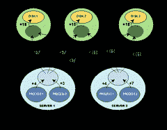

# 搜索技术剖析：使用组合器爬行

> 原文： [http://highscalability.com/blog/2012/5/28/the-anatomy-of-search-technology-crawling-using-combinators.html](http://highscalability.com/blog/2012/5/28/the-anatomy-of-search-technology-crawling-using-combinators.html)

*这是垃圾邮件免费搜索引擎 blekko 的首席技术官 Greg Lindahl 撰​​写的系列文章中的第二个来宾帖子（[第 1 部分](http://highscalability.com/blog/2012/4/25/the-anatomy-of-search-technology-blekkos-nosql-database.html  )，[第 3 部分](http://highscalability.com/blog/2012/7/9/data-replication-in-nosql-databases.html)）。 之前，Greg 是 PathScale 的创始人兼杰出工程师，当时他是 InfiniPath 低延迟 InfiniBand HCA 的架构师，该架构用于构建紧密耦合的超级计算集群。*

## 搜寻网路有什么困难？

Web 搜寻器的存在时间与 Web 差不多，在网络出现之前，就存在用于 gopher 和 ftp 的搜寻器。 您可能会认为 25 年的经验将使您能够解决已解决的问题，但是网络的迅猛发展以及垃圾邮件技术和其他不良内容的新发明不断带来新的挑战。 紧密耦合的并行编程的普遍困难也抬起了头，因为网络已从数百万个页面扩展到数千亿个页面。

## 现有的开源爬网程序和爬网

本文主要讨论 blekko 的搜寻器及其组合器的用法，但是，如果您想对搜寻的困难部分进行更一般的介绍，建议您查看以下内容：

*   <cite>[信息检索简介](http://nlp.stanford.edu/IR-book/)</cite>
*   [Apache Nutch](http://nutch.apache.org/) 开源搜寻器
*   来自  的开源抓取工具 [Heritrix](http://crawler.archive.org/)
*   [50 亿页](http://archive.org/) [常见爬网](http://commoncrawl.org/)

## 定向爬行

打算不对整个 Web 进行爬网的爬网程序的最重要功能是仅对最重要的页面进行爬网的能力。 有传言称，谷歌的网络爬虫和索引超过了 1000 亿个网页，而谷歌在 2008 年宣布其“爬虫前沿”（他们在其他网页上看到的所有网址的列表）已经结束。

blekko 知道我们只想为仅数十亿个网页的索引编制索引并提供结果。 那只是 Google 抓取边界中网页的一小部分，因此我们需要非常擅长抓取最好的页面，并且只抓取最好的页面。 一种方法是在爬网时计算网页的排名，包括尚未爬网的页面的排名。

页面的等级取决于传入链接的数量和质量，以及许多其他页面上的度量，例如页面上的文字，与文字数量相比的广告数量等等。 在首次抓取页面之前无法知道页面上的度量值，但是从抓取其他页面开始就可以知道传入的链接。

当然，使用入站链接对网页进行排名是很多互联网垃圾邮件发送者已经精心设计的方法。 这些虚假链接中的一些来自其他垃圾邮件发送者网站，而某些来自具有合理内容的合法网站。 我有一堆关于各种主题的旧的，排名靠前的网页，而且我收到了无穷无尽的“链接交易”电子邮件，这些电子邮件大多是由自动执行链接交易游戏的软件包发送的。 查找和忽略来自合法网站的错误链接要困难得多，而且通常要等到许多链接页面被完全爬网后才能完成。

## 组合器

现在，让我们看看**组合器**（我们在[先前的博客文章](http://highscalability.com/blog/2012/4/25/the-anatomy-of-search-technology-blekkos-nosql-database.html)中进行了讨论）如何使这些计算变得更加容易。

首先，我们想对许多事物进行独特计数：传入链接的地理多样性，传入链接的网络多样性等等。 如果所有传入链接都来自同一个 C 类 IP 网络，那么包含大量传入链接的页面就不会那么有趣。 我们使用**对数计数**组合器来有效地计数这些数量（在时间和空间上-每个计数 16 个字节），而不会在我们爬行和重新爬行 Web 时重复计数任何东西。 使用 logcount 的缺点是计数是近似值。 对于一些重要的数量，我们选择 logcount 的变体，它们需要多达 256 个字节的状态，以便更好地近似精确的答案。

接下来，我们经常需要操纵到网页的传出和传入链接列表。 在大多数关系数据库中，此数据通常由表中的一系列行表示，并且我们将通过查询链接的目的地等于特定 URL 的所有记录来获取此数据。 这是一项昂贵的操作，并且由于入站链接的数量可能很大（在许多情况下为数百万个），因此我们需要某种方式摆脱该表中次重要（排名较低）的行，以便 保持表格大小合理。

**TopN** 组合器解决了这两个问题。 作为一个有限大小的列表，可以通过一次操作读取它，并且它的大小是自动修整的。 作为我们为什么要在抓取时操作此传入网页列表的示例，请考虑以下事实：交易或购买的链接通常具有相同的[锚文本](http://en.wikipedia.org/wiki/Anchor_text)。 通过在爬网页面之前检查传入的锚文本，我们可以完全避免爬网。 索引时间检查可以发现锚文本的相似性，但是为时已晚，要避免浪费资源对其进行爬网。

除了 url 级别的信息外，我们还保留爬网程序所学内容的主机级别摘要。 例如，我们有一个 TopN 摘要以及主机到主机链接的数量。 该摘要对于发现具有大量组内链接的主机组很有用。 我们使用此数据来打折这些链接的价值。

## 所有其他的东西

除了我们已经讨论的内容（查找传出链接并计算未爬网页面的等级）外，blekko 的搜寻器还完成了许多其他工作。 如果在网页上找到日期，则搜寻器会立即将要创建索引的页面发送给其他支持 blekko 的/ date 和/ daterange 功能的索引（有关 blekko 的高级功能，请参阅此

## 爬行经验

我们在此过程中吸取了一些教训。 一个重要的教训是，至关重要的是，拥有一个电子邮件地址，网站管理员可以在存在抓取工具问题时可以私下与我们联系。 由于此，我们修复了一些错误。 最令人惊讶的是，网站管理员（和主要的抓取工具）未严格遵守 robots.txt 规范，并期望其 robots.txt 中的空白行无效。 我们还发现，很大一部分网站（包括许多美国政府网站）仅允许一小部分爬虫白名单来爬网其页面。 这些网站很多都是很小的，并且没有明显的联系方式联系他们的网站管理员以要求将其添加到白名单中。

## 未来发展方向

将来，我们想在爬网系统中添加一件主要的事情：执行 JavaScript 的能力。 越来越多的网络隐藏在 javascript 之后，尽管网站管理员谨慎地将其内容隐藏在大多数搜索引擎无法看到的地方，但许多网站管理员确实有动机隐藏其分析和广告 ID，以便他们 不那么明显。

## 相关文章

*   [关于黑客新闻](http://news.ycombinator.com/item?id=4033983)
*   [搜索技术剖析：Blekko 的 NoSQL 数据库](http://highscalability.com/blog/2012/4/25/the-anatomy-of-search-technology-blekkos-nosql-database.html)

Heritrix 和 Common Crawl 项目的链接周围有些破损。

爬网一章的链接已断开。 这是正确的链接：http://nlp.stanford.edu/IR-book/html/htmledition/web-crawling-and-indexes-1.html（看起来连字符可能在错误的位置）。