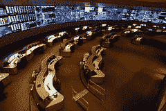

# 正确处理事情：通过即时重放查看集中式系统与分散式系统

> 原文： [http://highscalability.com/blog/2014/9/15/getting-things-right-a-look-at-centralized-vs-decentralized.html](http://highscalability.com/blog/2014/9/15/getting-things-right-a-look-at-centralized-vs-decentralized.html)

*三个棒球裁判坐在酒吧周围，谈论他们如何在每个球场上打电话：第一裁判：有些是球，有些是打击，我将它们原样称呼。 第二位裁判：有些是球，有些是罢工，我称它们为“ em”。 第三次裁判：有些是球，有些是罢工，但直到我叫“ em”，它们才算是什么。*

| 
AT&T's Global [Network Operations Center](http://www.nj.com/business/index.ssf/2011/08/att_gnoc_earthquake.html) | 
MLB 的[即时重播掩体](http://sports.yahoo.com/news/inside-look-at-mlb-s-new-instant-replay-bunker-032951044.html) | 
NHL 的[情况室](http://blogs.canoe.ca/krykslants/nfl/special-report-inside-the-nhls-central-video-review-operation-can-it-work-in-the-nfl-with-tweaks-it-sure-can/) |

**更新**：[在 NFL 重放命令中心内](http://mmqb.si.com/2014/11/11/inside-the-nfls-replay-command-center/)

看一下我们认为主要属于计算机科学领域的概念在其他领域如何发挥作用很有趣。 一个有趣的例子是 [Instant Repla](http://en.wikipedia.org/wiki/Instant_replay) y 如何通过实现重播来反映甚至帮助[塑造](http://www.nfl.com/videos/nfl-network-top-ten/09000d5d811133e8/Top-Ten-Things-that-Changed-the-Game-Instant-replay)体育文化：[去中心化](http://en.wikipedia.org/wiki/Distributed_computing)或[集中化](http://en.wikipedia.org/wiki/Centralized_computing)。

有利可图的电视交易为专业体育运动注入了大量资金。 有了这么多钱，体育运动已经从纯粹的娱乐变成了**使事情变得正确**。 打个坏电话的代价太高了，无法让人为因素决定泰坦的命运。

正确处理事情也是计算机科学领域的热门话题。 在 CS 中，正确处理语言使用诸如事务，回滚，仲裁，乐观复制，线性化，同步，锁定，最终一致，补偿事务等术语。

在体育界为了使事情变得正确，裁判员使用诸如举旗，罚则，规则，裁决立场，重设时钟，向下和距离，取得线，吹哨，确认裁决以及推翻裁决等术语。

尽管词汇不同，但意图却是相同的。 正确性。

目的并非所有技术和体育都有共同点。 随着技术的发展，我们看到体育运动正在发生变化，以利用技术所提供的新功能。 这些变化应该是软件中任何人都熟悉的。 体育已经从完全分散的司法体制转变为现在我们看到的 [NBA](http://www.si.com/nba/point-forward/2014/05/18/nba-instant-replay-off-site-review-adam-silver) ， [NFL](http://espn.go.com/nfl/story/_/id/10670707/nfl-owners-allow-centralized-system-aid-instant-replay) ， [MLB](http://sports.yahoo.com/news/inside-look-at-mlb-s-new-instant-replay-bunker-032951044.html) 和 [NHL](http://blogs.canoe.ca/krykslants/nfl/special-report-inside-the-nhls-central-video-review-operation-can-it-work-in-the-nfl-with-tweaks-it-sure-can/) ， 融合到某种形式的集中式系统上。

NHL 是创新者，于 2011 年启动了他们的集中式即时重放系统。它的工作原理类似于...官员坐在位于多伦多的作战室中，该作战室看起来非常类似于曾经建立的每个[网络运营中心](http://en.wikipedia.org/wiki/Network_operations_center)。 所有游戏的视频源都流进了房间。 如果存在争议或明显值得回顾的游戏，则会与多伦多联系，以对正确的电话进行快速回顾和判断。 每个运动都会以自己的方式实现自己的集中式重播系统，但这就是要旨。

我们已经看到了完全相同的转变，例如电子邮件之类的联合服务已被 Twitter 和 Facebook 等集中式服务所取代。 事实证明，体育和计算机科学具有更深的相似之处。 那可能是什么？

## 发明了即时重播功能，以正确处理事情

多年来，正确处理事情一直在发展。 首先，您需要一套规则。 没有规则，就不可能把事情做好。 使用一套适当的规则，游戏可以属于以下几类之一：自引游戏，无引荐游戏或引荐游戏。

**无裁判游戏**的示例在 [Outlander 电视节目](http://www.imdb.com/title/tt3006802/)的一集中进行了描绘，该剧集主要设置于 18 世纪。 它有一个很棒的场景，显示正在玩的游戏看起来像是苏格兰风格的曲棍球。 两支球队用大棒子打了一个球。 到目前为止还很熟悉。 然而不久之后，这些棍子就被用作武器，并且球员们到处互相棍打。 它造就了一场血腥的好游戏，但并没有过多地强调正确的事情。 变得...是的。

**休闲游戏**是一种玩足球，篮球或其他类型的接力游戏的聚会，它遵循一组规则，但通常都是自参考的。 没有裁判可以打电话。 游戏不是那么重要。 玩家会自称犯规，或者对方会称对方为犯规，但这都是非常非正式的，可能导致激烈的分歧。

## 游戏是去中心化且无锁的

在游戏发展的这一点上，游戏完全**去中心化**。 游戏彼此完全独立。 可以同时玩任何数量的游戏。 您需要的是足够的玩家和一个玩耍的地方。

还要注意，游戏是**无锁**，完全没有任何形式的货币控制。 场上的所有活动并行进行，场上的游戏状态是场上发生的一切。

对于无裁判员比赛，事后无法修复违反规则的情况。 对于自引游戏，修复违反规则的能力很有限。 部分原因是休闲游戏的规则不够详尽，部分原因是没有人玩游戏会接受其他玩家的这种判断。

## 最终推荐的游戏是一致的

这在游戏中发挥了客观的第三方裁判的作用。 或称他们为[裁判](http://en.wikipedia.org/wiki/Referee)。 裁判员可以制定更加详尽的规则集，因为只有专业人士才能了解所有规则并具有运用规则的技能。

在游戏中增加独立裁判员也可以使事情变得更加微妙，从某种意义上说，所有值最终都收敛于正确的值，这使得游戏成为[最终保持一致](http://en.wikipedia.org/wiki/Eventual_consistency)。 这是考虑引荐游戏的有趣方式。

游戏状态是上述值，可以通过在场上的游戏进行修改，但是可以说，这些更改不是已提交的事务。 裁判员可以使用相当于[补偿交易](http://en.wikipedia.org/wiki/Compensating_transaction)的补偿来弥补可能的违规行为，从而可能改变比赛状态。

例如，在 NFL 中，裁判决定球的放置位置，时间，得分，顺序以及通常在球场上发生的所有其他事情。 裁判需要告诉您比赛中实际发生的事情，他们需要确定认可系统中的可见性的东西。

思考裁判的另一种方法是，它们充当[寻求原谅编程](http://highscalability.com/blog/2012/3/6/ask-for-forgiveness-programming-or-how-well-program-1000-cor.html)中描述的**读取和修复**机制。 这篇文章展示了我们如何有效地对具有 1000 多个内核的处理器进行编程。 这个想法是让所有这些内核同时，并行运行，然后通过后台任务不断使答案更接近正确性，这些任务负责找出问题所在并进行调整。

这听起来不像游戏在肉类世界中的运作方式明显吗？ 在游戏中，每个实体（球员，教练，裁判员，摄像机等）都是网络中连接的核心。 消息是通过手势或无线电信号进行的口头表达。 播放映射到协议。

在游戏中，由于实体的动作，状态在核心之间流动。 一些活动直接关联。 有些是间接链接的。 有些是独立的。

参加复杂的 NFL 比赛。 放一个球（或者是什么？），有一个拦截（在那里？），然后将球弄乱了（或者是吗？），又有一个忽悠了（或者在那里？），有人捡起球并跑了 在 TD。 最重要的是，该剧在该领域的完全不同的部分上有两个标志。

剧中到底发生了什么？

为了决定裁判们是否达到法定人数。 在解决冲突会议之后，这可能根本不会花费时间，也可能永远不会消失，裁判将得出结论。 裁判本质上是在阅读他们头脑中的“日志”中的事件，确定顺序，将事件与规则进行比较，确定哪些规则适用，哪些规则优先，然后确定正式发生了什么。

一旦确定，新游戏状态即已提交。 将通过补偿交易进行必要的维修。 可能会标出 15 码的罚款。 也许已经宣布了一个转身，球现在属于另一支球队。 裁判可以断定数百种潜在结果。 裁判说的是法律。

注意，像软件一样，正确性的代价是增加了延迟。 无裁判系统的延迟时间最短，因为比赛结束后，比赛不会停止，无法解决问题。 有了裁判，潜伏期有了巨大的飞跃。 决定处罚并实施任何更正需要大量时间。

裁判说的是真的吗？ 这是一个关于“真相”的深刻问题，我们将完全忽略。 任何球迷当然不会告诉你的。 裁判一直吹牛。 但这没关系。 在游戏中（例如在数据库中），在解决冲突后，合并结果变为新状态。 没有更高的权威。

## 视频创建了可以挑战的共享内存日志

可是等等。 NFL 已经开发了一种**质询机制**，因此可以在事后查看通话。 教练发出红旗，并且将再次检查最后一次提交的事务，以查看是否犯了错误。 其他运动也有类似的机制。

挑战系统是**技术创新**的结果。 录制了游戏之后，就可以记录下来并在以后重播。 视频在时空上扩展并解耦了事件的“日志”。 在太空中，因为可以观看比赛的角度数量仅受摄像机数量的限制。 及时播放，因为可以在慢动作中实时或实时查看播放。

有了这个新工具，裁判员可以在几十年前完成几乎无法想象的事情，他们可以在一场比赛结束后再看一眼。 即时重播诞生了！

如果裁判在看比赛时发现打错了电话，他们将发出更多命令以纠正引起的任何问题，从而使比赛进入更加正确和一致的状态。 使用**读取修复**并补偿事务以解决问题的一个好例子。

重播后更改游戏状态就像 Amazon 出售系统认为可用但实际上缺货的商品一样。 如果您购买了缺货商品，世界会终结吗？ 一点也不。 亚马逊会礼貌地通知您，该产品不再可用，您的订单已撤消。 对于亚马逊而言，获得销售要比每次犯错和改正错误更有利可图。 在比赛结束后，让比赛实时展开在场上也是值得的。

通常情况下，裁判员发出的用于解决先前问题的命令本身不可审查。 尽管许多体育运动都有一个上诉程序，联盟办公室可以先看电话然后说是，但裁判员犯了错，但是我们对此无能为力。 有时，极少数情况下，挑战会导致游戏从错误通话的角度重新开始。

在抗议之后，旧金山巨人队和芝加哥小熊队之间的最近一场比赛重新开始[。 这场比赛是在小熊队主场进行的，由于场地上的一些设备问题而被称为。 巨人当时正在输球，所以对他们来说这将是巨大的损失。 巨人上诉。 并荣获。 装备问题会给主队带来不当的胜利，这种力量被认为是不公平的。](http://espn.go.com/chicago/mlb/story/_/id/11384538/san-francisco-giants-win-appeal-finish-game-vs-chicago-cubs)

**正义不是上诉系统**的目标。 玩完游戏后很少能解决问题。 可能会发送道歉信。 也许规则委员会将在明年研究改变规则。 也许可以减少罚款或取消暂停。 亚马逊可能会在您下次购买时给您折扣。 但是通常，一旦响起最后的哨声，便确定了游戏状态，并且游戏交易以成功返回码返回。

到目前为止，在运动场上发生的事情与计算机科学中发生的事情之间存在着一些有趣的相似之处。 这是因为在所有引用的系统下都是**通用结构。** 有规则，状态，活动和裁判员，他们解释如何将规则应用于状态活动的结果。

数据库只是一大类引用系统的示例。 房屋检查，审判，经过同行审查的学术论文，保险索赔调整，参加比赛的电影-只有在法官说出自己的真实情况时才有意义。

请注意，即时重播延迟又增加了。 观看视频要花费很多时间，比没有裁判员系统甚至只有裁判员系统的时间要多得多。

## 更多技术意味着更多正确处理事情-集中式系统

技术在未来飞跃发展，并拖累了社会。

摄像头和视频回放是实现现场即时回放的技术。 形成我认为的联合架构。 每个游戏都是自治的和分散的组织，但是规则和信息在游戏之间共享。

自从开始重放以来，我们已经看到了**快速互联网**的发明，功能强大的计算机，甚至还有更多的野外摄像头，以及创建复杂软件的能力。 因此，可以立即发明一种新的即时重放方式。 是的。 这次它使用集中式体系结构。 实际上，NBA，NHL，MLB 和 NFL 都已经转移到集中式即时重播方法，或者正在转移到一种。

这个想法很简单。 现在，可以将**的每个游戏**传输到中央运营中心，该中心可以让专门的专家团队观看视频并查看通话。

再次注意，集中式即时重放延迟又增加了。 现在，我们必须去中央重放中心进行判断。 我们真的必须认为正确性很重要吗？

## 游戏外的读取和修复机制

即时重放并不是唯一可用的读取和修复机制。

例如，在棒球和橄榄球中，比赛统计之后经常对比赛统计数据进行校正。 并非所有内容都可以在游戏环境中正确列出。 例如，稍微反射一下，一个麻袋可能会变成一个完整的麻袋。

场地上发生了很多事情，所以即使裁判员也看不到所有令人讨厌的事情。 这就是为什么存在**精细机制**的原因。 即使未在游戏中要求罚款，也可以在比赛结束后对背景一致性进行罚款。

## 深度学习，无人机，传感器和更多摄像头-混合还是闭环？

技术的下一次发展可能涉及**先进的机器人**，**深度学习系统**，甚至还有**更多的摄像机**，因为传感器和无人机将覆盖整个领域。 您可以想象有 1000 个摄像机覆盖每个游戏，而 AI 则在每个流中检查是否存在违规行为。 游戏的 AI 可以对违规行为进行投票，并以最高的信心将这些呼叫冒出来，直至引起人们的注意。 人类可能会做出最后决定，也可能不会做出决定。

网球中目前使用机器人作为[电子线路裁判](http://en.wikipedia.org/wiki/Electronic_line_judge)。

有些机器人可以在棒球中叫[球，对](http://bleacherreport.com/articles/1942413-should-major-league-baseball-ever-bother-with-a-robotic-strike-zone)进行击打，但是由于棒球具有使用裁判员的悠久传统，因此没有被使用。

**人类自负**将决定如何使用下一代技术。 如果体育中的人为因素被重视超过正确性，那么可能会发展出一种混合系统，该系统在概念上与现代软件系统有很多共同点。 我们仍然会有人工裁判，机器人会选择他们的位置。 集中的 AI 中介组件将承担大部分繁重的工作，而人工将在适当时提供监督。 毕竟，人类仍然必须感到重要。

技术趋于发展。 因此，如果有一点技术增加了系统延迟，并且将精力从分散的架构转移到了集中式架构，那么更多的技术可能会逆转这些发展。

一个闭环系统，每个运动场都有自己的摄像头和自己的 AI，其中 AI 可以直接拨打电话，这将创建一个低延迟系统，与无裁判系统相当，并且完全删除了集中式组件。 **每个游戏都会再次变得快速且分散**。

无论系统多么复杂，在我们眼中，我们始终会知道真正发生了什么。

## 相关文章

*   [经进一步审核：即时重播的简要历史记录](http://mentalfloss.com/article/26075/upon-further-review-brief-history-instant-replay)

*   [为什么所有体育活动都不使用 NHL 的“控制室”重播审核系统？](http://www.thesportsfanjournal.com/columns/the-rev/all-sports-should-use-the-nhl-control-room-replay-review-system)

*   [对 NFL 重播系统](http://espn.go.com/nfl/story/_/id/10670707/nfl-owners-allow-centralized-system-aid-instant-replay)所做的更改

*   [特殊报告：在 NHL 的中央视频审核操作中。 它可以在 NFL 中使用吗？ 通过调整，可以确定](http://blogs.canoe.ca/krykslants/nfl/special-report-inside-the-nhls-central-video-review-operation-can-it-work-in-the-nfl-with-tweaks-it-sure-can/)

*   [美国职业棒球大联盟必须求助于 NHL 风格的即时重播系统，以解决问题](http://bleacherreport.com/articles/1634267-mlb-must-turn-to-nhl-style-instant-replay-system-to-fix-umpiring)

*   [球员，裁判员现在比以往更需要重播](http://sports.yahoo.com/news/players--umpires-need-replay-now-more-than-ever.html)

*   [如何结束棒球史诗般的主持人改组：使用即时重播裁判员](http://www.theatlantic.com/entertainment/archive/2013/05/how-to-end-baseballs-epic-officiating-screwups-use-instant-replay-umpires/275726/)-反映组织的结构和文化。

*   [彼得·加蒙斯（Peter Gammons）：忽略重播的天使埃尔南德斯（Angel Hernandez Blew）打电话了](http://deadspin.com/peter-gammons-angel-hernandez-blew-that-call-after-ign-499913975)

*   [美国职业棒球大联盟（MLB）的胡扯重播技术：曾经获得通话权的奇迹之王](http://deadspin.com/mlbs-crappy-replay-tech-its-a-miracle-umps-ever-get-499041275)

*   [小心您想要的东西](http://www.sportsonearth.com/article/70183162/major-league-baseball-instant-replay-may-be-overwhelming)-想您知道如何观看棒球比赛吗？ 只需等到从每个可能的角度进行其他重放即可。 （美联社）

*   [MLB 2014：棒球的即时重播如何工作？](http://online.wsj.com/news/articles/SB10001424052702304688104579465230759769104)

*   [“在我叫它之前什么都没有！”](http://bill37mccurdy.wordpress.com/2010/08/23/it-aint-nothing-until-i-call-it/) -有关如何通过在球场上让裁判神神拯救棒球的故事。

*   [要求宽恕编程-或我们将如何编程 1000 个内核](http://highscalability.com/blog/2012/3/6/ask-for-forgiveness-programming-or-how-well-program-1000-cor.html)

*   [您实际上使用 NoSQL 的目的是什么？](http://highscalability.com/blog/2010/12/6/what-the-heck-are-you-actually-using-nosql-for.html)

多么手淫