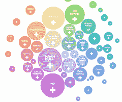

# 棱柱架构-使用社交网络上的机器学习来弄清您应该在网络上阅读的内容

> 原文： [http://highscalability.com/blog/2012/7/30/prismatic-architecture-using-machine-learning-on-social-netw.html](http://highscalability.com/blog/2012/7/30/prismatic-architecture-using-machine-learning-on-social-netw.html)

*关于 [Prismatic](http://getprismatic.com/) 的体系结构的帖子改编自与 Prismatic 程序员 [Jason Wolfe](http://w01fe.com/berkeley/)* 的电子邮件对话。

您今天应该在网上阅读什么？ 任何一个完全现代的人都必须每天解决这个难题，通常使用一些神秘的方法来判断他们的许多供稿中的重要内容：Twitter，RSS，Facebook，Pinterest，G +，电子邮件，Techmeme，以及无数其他信息来源。

Prismatic 的 Jason Wolfe 慷慨地同意使用机器学习，社交图谱，BigData，函数式编程和内存实数等性感词来描述其彻底的现代解决方案，以回答“读什么” 及时饲料加工。 结果可能更加隐秘，但是这或类似的事情将是我们如何面对寻找隐藏在无限深的信息池中的有趣主题和故事的挑战。

关于 Prismatic，有两点很突出。 他们想让您知道 Prismatic 是由一个由四名计算机科学家组成的小组组成的，其中三名来自斯坦福大学和伯克利分校的非常强大的年轻 PHD。 半危险的方法不会起作用。 他们正在为解决信息过载问题带来大脑力量。 但是这些 PHD 还是程序员，他们从事网站，iOS 编程以及性感的 BigData / ML 后端编程等所有工作。

使 Prismatic 作为一种体系结构令我兴奋的一件事是，将来需要一遍又一遍解决的问题是将机器学习实时应用于大量的社会中介信息流 。 保密性使他们无法对自己的机器学习技术说太多话，但是我们的确在幕后高峰。

正如您所期望的，他们在做事上有些不同。 他们选择了 Clojure（一种可编译为 Java 字节码的现代 Lisp）作为他们的编程语言。 这个想法是使用函数式编程来构建细粒度，灵活的抽象，这些抽象被组成来表达特定于问题的逻辑。

一个功能强大的例子是它们的图形库，他们在各处使用它们。 例如，可以描述计算图以为每个用户创建等效于低延迟，流水线化的 map-reduce 作业集。 另一个示例是使用子图以模块化方式紧凑地描述服务配置。

鉴于对功能阐述的关注，他们避免使用诸如 Hadoop 之类的大型框架，而是选择了一个更小，更可靠，更易于调试，更易于扩展且更易于理解的代码库。

对 Prismatic 方法的批评是要取得成果需要很长时间的培训。 首先，他们说开始获取优质的内容根本不需要花费很长时间。 其次，我要补充一点，开始使用 Long Sight 考虑这些类型的系统。 基于 ML 的推荐器将从儿童期开始接受培训，并将与您一生保持在一起。 您头脑中的可扩展数字模拟物将同时充当信息守卫和边锋。

在 [Tech Crunch 文章](http://techcrunch.com/2012/06/07/in-the-studio-prismatics-bradford-cross-wants-to-reinvent-social-news/)中，Prismatic 创始人 Bradford Cross pithily 将 Prismatic 描述为“围绕复杂的系统构建，该系统可提供大规模，实时，动态的个性化信息重新排名， 很好地将主题分类和归类为本体。” 现在，让我们看看该系统是什么样的...

## 统计资料

*   每天都会从 Twitter，Facebook，Google Reader 和网络上获取并分析成千上万种社交信号，并分析成千上万的新新闻文章，博客文章和其他共享内容。
*   在用户注册 Prismatic 的几秒钟内，就提取并分析了他们足够的历史活动，以提供非常可靠的主题和发布者建议。 消化了他们的社交网络以寻找似乎分享最相关内容的朋友。 用户在 Prismatic 上进行的每个交互也是一个学习的机会。
*   在访问家庭供稿后的十分之几秒内，通过将用户兴趣模型与所有这些内容进行匹配，生成了最有趣的故事的供稿。
*   每周为用户提供数百万的文章展示次数

## 平台

*   托管在 EC2 / Linux 上。
*   99.9％的后端管道和 API 服务器是用 Clojure 编写的，Clojure 是一种现代 Lisp，可以编译为 Java 字节码。
*   所有繁重的工作都发生在 JVM 内部。
*   MongoDB
*   的 MySQL
*   S3
*   发电机
*   专注于构建自定义代码以有效解决特定问题。

## 数据存储和 IO

*   系统不是围绕每个服务在数据库或分布式文件系统之间读取和写入实时数据的典型体系结构，而是围绕数据设计系统。
*   大多数数据通过后端管道从一项服务流向另一项服务，而没有任何磁盘往返。
*   在管道的最后，API 机器严重依赖于自定义的内存数据结构，这些数据结构会定期快照到磁盘。
*   通过使数据尽可能靠近 CPU，大多数 API 请求几乎没有 IO 即可得到服务。 这样可以以非常低的延迟提供提要，从而使 API 机器保持 CPU 绑定，并可以轻松扩展以更轻松地处理更多用户。
*   使用了许多现成的存储解决方案：MongoDB，MySQL 和 Amazon 的 S3 和 Dynamo。 每一个都经过仔细选择，以匹配要存储的数据的大小，访问模式和其他特征。

## 服务

*   从较高的层次上看，该体系结构分为大约 10 种不同的服务类型，大致分为 5 种不同的类别：数据摄取-后端； 入职； API-面向客户； 其他服务-面向客户； 批处理和其他服务。
*   每个服务被设计为执行一种操作，可以以特定方式进行水平扩展，并且通常受到一种或两种特定资源类型（IO，CPU，RAM）的限制。
*   经济因素偏向于大型机器，因此服务是单身人士，但没有重大瓶颈会阻止水平扩展的预期。

## 数据提取-后端

*   每天都会创建大量有趣的内容（新闻文章，博客文章，其他网页等），并且 Prismatic 希望尽可能多地了解它。
*   对于每个内容，必须知道谁在共享它，以及他们在说什么，以便可以在文章旁边显示相关评论，从而可以向用户显示由其朋友或具有相似品味的人共享的内容。
*   此过程的第一步是摄取和分析内容和社交数据。 采集管道的顶部是轮询器：
    *   RSS 轮询器在供稿中循环查找新文章
    *   Twitter 和 Facebook 轮询器连接到相应的 API，并从用户及其朋友那里获取评论/推文。
    *   这些服务非常简单，并且大多数都是无状态的。
    *   唯一的真实状态和有趣的部分是弄清楚已经看到的内容，并智能地确定接下来要轮询的内容的优先级。
    *   实际上，最困难的问题之一是在每次社交互动流入管道的其余部分之前，先确定其内容是什么。 这很困难，因为人们可能会共享同一篇文章的许多版本（缩短的链接，移动版本和常规版本等）。
*   从这里，RSS 条目和评论/共享/推文（具有正确规范的 URL）流入障碍，在障碍中确定实际获取和分析的内容。
    *   垃圾邮件和其他垃圾将在稍后的版本中消除，但是最好的伟哥垃圾邮件文章是不会浪费更多的周期的文章。
    *   进行剪切的 URL 传递到获取/分析管道
    *   此阶段的 URL 进入获取/分析管道。 这是许多魔术开始发生的地方。
    *   保留一个 URL 队列，每个 URL 都通过一个“图”运行，该“图”依次详细说明 URL，获取其 HTML，应用机器学习算法提取文章文本，识别最佳图像，提取发布者，并标记适用的标签 主题等等。
    *   为了使这些算法能够快速运行，适合内存并且性能良好，已经进行了大量的工程设计。 处理所有 URL 本身的问题当然令人尴尬地是并行的。
*   提取阶段的末尾是 doc master，其工作是接收有关它们的精心撰写的文章和社交环境（随着时间的推移不断滴入），进行匹配，将文章（以在线方式）聚集到故事中 集群，确定当前有效的文档集，并管理 API 机器的索引。

## 入门-后端

*   入职是吸收有关新用户的数据，因此可以在注册该应用后的几秒钟内为他们提供出色的个性化体验。 这有两个主要组成部分：
    *   根据用户在 Twitter，Facebook 或 Google 阅读器上的活动，为用户找出建议的主题和发布者，
    *   分析用户的社交图谱，以推断出哪些朋友的分享是他们喜欢文章的最有力信号。
*   这些服务令人尴尬地是并行的，这次是跨用户的。 除了有效的社交图分析的复杂性（Prismatic 不想说太多）之外，关键是如何将这些服务调整为具有非常低的延迟和合理的吞吐量：
    *   例如，对于活跃于 Twitter，Facebook 或 Google Reader 的用户，可以在 15 秒或更短的时间内计算出一百多个准确的主题和发布者建议。 这足够快，可以在用户 OAuth 登录后开始计算建议，并且通常在用户完成创建帐户（选择句柄和密码）并进入演练时就可以使用个性化建议。
    *   在这 15 秒内，发生了很多事情：
        *   用户最近的帖子可在 Twitter 和 Facebook 上获取，他们喜欢的文章可在 Google Reader 上获取，等等。 这本身可能需要 10 秒钟或更长时间才能完成。
        *   标识用户，她的朋友等共享的多达一千个左右唯一 URL 的集合。
        *   这些流进入获取/分析管道的版本中，在该版本中，所有 URL 都使用上述相同的 ML 堆栈进行提取和详细说明
        *   该分析的结果被汇总，后处理并保存到 DynamoDB 和 S3
*   此过程的延迟确实很关键，因此这些过程无法串行执行-必须尽可能地进行流水线化和并行化。
*   吞吐量也很重要，因为该过程非常繁琐，并且在进行大量注册时，需要花费大量精力来降低延迟。 这正是 Prismatic 的流处理和聚合库真正发挥作用的地方，它为每个用户（并行供多个用户）使用接近全容量的低延迟，流水线化的 map-reduce 作业集提供了等效的性能。 机。

## API-面向客户

*   API 机器中包含了 Onboarding 和 Data Ingest 服务。
*   除了实际的提要生成过程外，不会说太多，只是它是一个复杂且高度优化的过程，该过程具有许多阶段，这些阶段与用户的“指纹”相匹配，并针对索引进行查询，检索，排序和分页生成的提要。 几百毫秒。
*   从系统角度来看，这里的主要设计目标/挑战是：
    *   必须将最新文章编入索引，并且可以用于生成低延迟的提要
    *   该索引非常大（许多 GB），并且必须实时更新，以便用户可以找到重大新闻
    *   用户应在各台计算机之间实现负载平衡，并且响应负载而将新计算机启动（并关闭）相对容易和快速。
    *   产生良好的用户供稿不仅需要索引-我们还需要用户的“指纹”-他们的兴趣，社交关系，他们最近看过的文章等等。
    *   该指纹非常大，并且随着用户查看站点上的内容并与之交互而不断变化。
*   前几个问题的解决方案涉及 doc-master。
    *   doc-master 机器会整理我们当前的文档集，对文档进行预处理，然后每隔几分钟就会将一组准备好的索引文件写入 S3。
    *   当新的 API 机器启动时，它首先读取这些文件并将其转储到内存中，从而为其提供索引的近乎最新的副本。
    *   doc-master 还向所有实时 API 机器实时发布用于索引更改（文档/注释添加和删除，故事集群更改等）的命令。
    *   当一台新机器出现时，它会重放最近几分钟的更改历史，以使索引保持最新状态。
    *   机器所需的其他一般状态（非特定于用户的状态）也将从 S3 读取到内存中并定期刷新，或者如果数据较大且访问频率较低，则存储在发电机中。
*   剩下的问题是如何有效地为用户提供提要，而又不会产生 IO 成本以及在每个请求上获取和更新指纹的延迟。
    *   这里的方法是使用将用户绑定到 API 机器的粘性会话
    *   用户首次登录时，他们的数据都将在过期的刷新回写缓存中全部加载到内存中
    *   在整个用户会话中，此数据保留在内存中，并用于生成其供稿
    *   在整个会话过程中，所有用户操作均通过此同一 API 机器
    *   会话到期或计算机关闭时，每隔几分钟就对指纹中次要部分的更新进行批处理并刷新到冗余存储中
    *   更重要的更新是同步完成的，或者至少使用直接写缓存进行。
*   在整个会话过程中仅读取一次用户指纹就需要付出很高的 IO 费用，这笔费用会在（通常）相对大量的 Feed 点击，页面，文章点击，共享等用户所获得的费用中摊销，并且 限制此数据的回写次数。 当一台计算机宕机时，数据将被刷新并将用户转移到另一台计算机上-在最坏的情况下，对于某些用户而言，几分钟的非关键数据将会丢失，这对于简单性和可伸缩性的好处是值得的 。 始终可以通过以后的原始事件日志上的批处理作业来弥补此损失。

## 其他服务-面向客户

还有其他一些单独的面向客户的服务：

*   公共提要-对未登录的用户进行主题和发布者提要的智能缓存，根据需要从常规 API 获取它们，并允许对每个提要的多个年龄进行分页。
*   身份验证-处理帐户创建，登录等。 通常是 SQL 数据库前面的薄层，用于存储需要定期快照和备份的关键用户数据。
*   URL 缩短器

## 批处理及其他服务

*   机器语言培训，数据归档和事件跟踪/分析的其他服务。
*   MongoDB 用于存储服务器指标和用户分析，主要是因为它支持一个很好的低麻烦的故事，用于发送不同形状的原始事件，维护正确的索引以及保持在线汇总计数。

## 图库

*   这是一种很好地声明式描述计算图的方法，它发挥了 Clojure 的优势。 图只是 Clojure 映射，其中的键是关键字，而值是关键字函数，这些关键字函数采用由映射中的其他函数计算的值以及外部参数。
*   它在各处使用。 例如，文档分析管道是一个图形，其中文档的每个详细说明都可能取决于之前的内容（例如，确定文档的主题取决于是否已提取其文本）； 新闻提要生成过程是一个由许多查询和排名步骤组成的图形； 每个生产服务本身就是一个图，其中每个资源（例如数据存储，内存索引，HTTP 处理程序等）都是可以依赖于其他资源的节点。
*   这样可以轻松地执行以下操作：
    *   以模块化方式（例如，使用子图）紧凑地描述服务配置
    *   产生图表，描绘出流程或服务的依赖性
    *   测量诸如文档分析之类的复杂计算中每个节点上发生的计算时间和错误，或诸如 API 之类的复杂服务的每个资源上的活动
    *   在不同的线程（或理论上甚至是机器）上智能地调度此类计算的不同节点
    *   通过使用模拟替换图表中的几个节点（例如伪造存储空间）等，轻松编写我们整个生产服务的测试。

## 基于文档和用户的机器学习

文档和用户是 Prismatic 应用 ML（机器学习）的两个领域：

### 文件 ML

*   给定一个 HTML 文档：
    *   了解如何提取页面的主要文本（而不是侧边栏，页脚，注释等），标题，作者，最佳图像等
    *   确定相关功能（例如，文章的主题，主题等）
*   其中大多数任务的设置非常典型。 使用其他机器上的大批作业对模型进行训练，这些机器从 s3 读取数据，将学习到的参数文件保存到 s3，然后在摄取管道中从 s3 读取（并定期刷新）模型。
*   流出系统的所有数据都可以反馈到该管道中，这有助于了解更多有趣的内容，并随着时间的推移从错误中学习。
*   从软件工程的角度来看，Prismatic 编写的最有趣的框架之一是“ flop”库，该库实现了最先进的 ML 训练和推理代码，看起来与精美的普通 Clojure 代码非常相似，但是可以编译（使用 宏的魔力）到低级数组操作循环，这些循环与 Java 一样接近金属而无需借助 JNI。
*   与相应的 Java 相比，该代码可以紧凑和易于阅读，并且执行速度基本相同。
*   创建[快速运行的故事群集组件](http://blog.getprismatic.com/blog/2012/4/17/clustering-related-stories.html)付出了很多努力。

### 用户 ML

*   猜测用户对社交网络数据感兴趣的内容，并使用应用内的显式信号（+ /删除）完善这些猜测。
*   使用显式信号的问题很有趣，因为用户输入应该很快反映在其提要中。 如果用户连续从给定的发布者中删除了 5 篇文章，请立即停止向他们展示该发布者的文章，而不是明天。 这意味着没有时间在所有用户上运行另一个批处理作业。解决方案是在线学习：立即根据用户提供给我们的观察结果更新用户模型。
*   用户交互事件的原始流已保存。 这样可以在以后发生机器故障或类似情况时通过原始数据上的松散写回缓存丢失任何数据，从而在以后的原始事件中重新运行用户感兴趣的 ML。 在线学习中的漂移可以得到纠正，并且可以计算出更准确的模型。

## 得到教训

*   **查找您的故事**。 请仔细考虑整个管道以及流经该管道的所有数据。 使用针对特定问题的解决方案来应对可伸缩性挑战。 每个服务都内置了自己的扩展故事，并且这些服务以一种通信方式进行通信，应该可以轻松地扩展每个组件，而又不会给其他组件带来太多压力。 相反，从围绕 Hadoop 作业构建的系统开始，将所有数据以原始格式存储在分布式数据库/文件系统中，Prismatic 会讲一个不同的故事。
*   **尴尬地发现并行的机会并加以利用**。
*   **在用户等待**的同时并行工作。 例如，入职流程会吸收有关新用户的数据，以便可以在注册该应用后的几秒钟内为他们提供出色的个性化体验。
*   **使用函数式编程**构建细粒度，灵活的抽象。 这些抽象构成为表达特定于问题的逻辑。
*   **避免使用大型，整体式框架**，例如 Hadoop。 这样就产生了一个较小的代码库，在所有条件相同的情况下，它更不容易出错，更易于理解并且更易于扩展。 之所以建立自己的库，仅仅是因为开源代码的许多功能都被锁定在整体框架中，并且在某些问题中断或无法扩展时，不容易重用，扩展或调试。
*   **合适的人对于使这一切都至关重要。 当前的后端团队由三位 CS 博士组成，他们从事从 ML（机器语言）算法到低级系统工程到 Web 和 iPhone 客户端代码的所有工作。**
*   **所有代码都尽早投入生产，**通常是通过对使构建和调试生产服务变得简单而有趣的工具进行投资。
*   **保持简单**。 不要为简单的东西承担复杂的库或框架的负担，并且当一个简单得多的解决方案就足够好的时候也不要幻想。 例如，使用简单的基于 HTTP 的消息传递协议，而不是流行的框架之一。 在合理的情况下，乐于为刚刚可用的托管解决方案（例如 S3 或 Dynamo）支付更多费用。
*   **投资构建出色的工具和库**。 例如，Prismatic 的“触发器”库使他们可以在代码的 1/10 中编写与 Java 一样快的数字运算机器学习算法。 “存储”将键值存储的许多不重要的细节抽象掉，从而允许编写用于缓存，批处理和刷新的高级抽象，这些抽象可在各种情况下在各种存储引擎中工作。 “图形”使编写，测试和监视分布式流处理服务变得轻而易举。
*   **仔细考虑每种数据类型**，不要指望找到一种适用于 IO 和存储的千篇一律的解决方案。

## 相关文章

*   [Prismatic 希望成为数字时代的报纸](http://gigaom.com/2012/05/03/prismatic-wants-to-be-the-newspaper-for-a-digital-age/)
*   [棱柱形博客](http://blog.getprismatic.com/)
*   [关于 Clojure 的主题演讲](https://github.com/strangeloop/clojurewest2012-slides)
*   [棱柱形希望创建一个新类别的社会新闻](http://bits.blogs.nytimes.com/2012/04/03/prismatic-hopes-to-offer-a-new-category-of-social-news/)
*   [Prismatic 的布拉德福德·克罗斯（Bradford Cross）在工作室里想重塑社交新闻](http://techcrunch.com/2012/06/07/in-the-studio-prismatics-bradford-cross-wants-to-reinvent-social-news/ )
*   [Prismatic 的软件工程](http://blog.getprismatic.com/blog/2012/4/5/software-engineering-at-prismatic.html)
*   [Prismatic 如何处理数据存储和聚合](http://blog.getprismatic.com/blog/2012/4/9/how-prismatic-deals-with-data-storage-and-aggregation.html)
*   [DataSift 架构：每秒 120,000 条推文的实时数据挖掘](http://highscalability.com/blog/2011/11/29/datasift-architecture-realtime-datamining-at-120000-tweets-p.html )

好看！

半危险=危险？ 我第一次听到这个词。

干杯，

--rj

罗杰击败了我，但是：

“半危险的方法不会起作用。” 那么好吧，我想什至根本不考虑那些完全危险的方法。 = P

我每天都会使用 getprismatic.com 数周，我必须承认，现在它已成为新闻探索的一部分。 梦幻般的建筑，当我想到它们如何实时带来如此优质的内容时，甚至让我惊讶。

感谢您对他们的文章进行了详细的高级介绍。 很棒的文章！

好读！ :)

这都是有点老的学校。 机器学习= 1980。

您是否考虑过将 Redis 用于内存中的数据结构？ 听起来很合适。