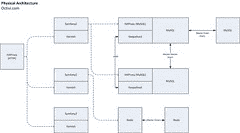

# 使用 HAProxy，PHP，Redis 和 MySQL 处理 10 亿个请求的简便方法来构建成长型启动架构

> 原文： [http://highscalability.com/blog/2014/8/11/the-easy-way-of-building-a-growing-startup-architecture-usin.html](http://highscalability.com/blog/2014/8/11/the-easy-way-of-building-a-growing-startup-architecture-usin.html)

此案例研究是 [Antoni Orfin](http://labs.octivi.com/author/aorfin/) 的来宾帖子， [Octivi](http://octivi.com/?utm_source=highscalability.com&utm_medium=referral&utm_campaign=guest-post) 的联合创始人兼软件架构师。

在文章中，我将向您展示我们基于 HAProxy，PHP，Redis 和 MySQL 开发非常简单的架构的方式，该架构每周无缝处理大约 10 亿个请求。 还应注意进一步扩展该模式和指出不常见模式的可能方法，这些方法特定于该项目。

## 统计：

*   服务器：

    *   3 个应用程序节点

    *   2 个 MySQL + 1 个备份

    *   2 个 Redis

*   应用程序：

    *   应用程序每周处理 1,000,000,000 个请求

    *   单个 Symfony2 实例高达 700 req / s（平均工作日-550 req / s）

    *   平均响应时间-30 毫秒

    *   清漆-超过 12,000 req / s（在压力测试过程中达到）

*   数据存储区：

    *   Redis-160,000,000 条记录，100 GB 数据（我们的主要数据存储！），

    *   MySQL-300,000,000 条记录-300 GB（第三缓存层）

## 平台：

## 

*   监控：

    *   伊辛加

    *   已收集

*   Application:

    *   带有 Keepalived 的 HAProxy

    *   清漆

    *   带有 Symfony2 框架的 PHP（PHP-FPM）

*   Data store:

    *   具有 HAProxy 负载平衡的 MySQL（主-主）

    *   Redis（主从）

# 背景

大约一年前，我们的朋友带着一个苛刻的问题来到我们的办公室。 他们经营着一家快速成长的电子商务初创公司，当时他们想扩展到国际市场。

由于它们仍然是一家初创型公司，因此建议的解决方案必须具有成本效益，以免在下一台服务器上用完钱。 旧版系统是使用标准 LAMP 堆栈构建的，他们已经拥有强大的 PHP 开发人员团队。 引入新技术必须很聪明，以免使体系结构过于复杂，并让他们与现有人员进一步维护平台。

系统架构必须以可扩展的方式设计，以实现其扩展到下一个市场的计划。 所以我们来检查他们的基础设施...

 

以前的系统是单片设计的。 在后台有一些单独的基于 PHP 的 Web 应用程序（该创业公司有许多所谓的前端网站）。 他们中的大多数使用单个数据库，他们共享一些处理业务逻辑的通用代码。

此类应用程序的进一步维护可能是一场噩梦。 由于必须重复某些代码，因此在一个网站中进行更改将导致业务逻辑不一致-他们始终必须在所有 Web 应用程序中进行相同的更改。

从项目管理的角度来看，这也是一个问题-谁负责跨多个代码库分布的那部分代码？

根据这些观察，我们的第一步是将核心业务关键功能提取到单独的服务中（这是本文的范围）。 这是**面向服务的体系结构**的模式。 考虑“关注点分离”原则，但要考虑整个系统。 该服务保持一种特定的高级业务功能的逻辑。 举一个真实的例子-服务可以是搜索引擎，销售系统等。

前端网站正在通过 **REST API** 与服务进行通信。 响应基于 **JSON** 格式。 我们选择它是为了简单起见，而不是像 SOAP 那样对开发人员来说是苛刻的（没人喜欢解析 XML…;-)）

提取的服务无法处理身份验证和会话管理之类的事情。 必须在更高层次上处理这些事情。 前端网站对此负责，因为只有他们才能识别其用户。 这样，我们使服务变得更简单-在进一步扩展问题和编写代码方面。 没什么不好的，因为它需要处理不同类型的思考任务。

## 好处：

-完全独立的开发团队可以轻松开发单独的子系统（Service）。 开发人员不要互相干扰。

-**它不处理用户身份验证**和会话，因此这个常见的扩展问题消失了。

-**业务逻辑保存在一个地方**-跨不同前端网站的功能不再多余。

-**易于使服务公开访问**。

## 缺点：

-**为系统管理员**做的更多工作-服务位于其自己的基础结构中，需要管理员额外注意。

-**保持向后兼容**-在一年的维护之后，API 方法发生了无数变化。 事实是，它们一定不能破坏向后兼容性，因为这会导致对每个前端网站的代码进行更改-以及一次部署所有网站的繁琐工作……一年之后，所有方法仍与 文档的第一版。

# 应用层

与请求流一起，第一层是应用程序。 HAProxy 负载平衡器，Varnish 和 Symfony2 Web 应用程序位于此处。

来自前端网站的请求首先到达 HAProxy，然后将其分发到应用程序节点。

## 应用程序节点配置

*   Xeon [[受电子邮件保护]](/cdn-cgi/l/email-protection) ，64GB RAM，SATA

*   漆

*   阿帕奇 2

*   PHP 5.4.X 作为 PHP-FPM 运行，具有 APC 字节码缓存

我们有三个这样的应用服务器。 双活模式下的 **N + 1 冗余-“备份”服务器正在积极处理请求。**

在每个节点上保留**单独的 Varnish 可以降低缓存命中率，但是这样我们在这里没有 SPOF（单点故障）。 我们这样做是为了保持可用性而不是性能（在我们的案例中这不是问题）。**

已选择 Apache2，因为旧版前端网站服务器也使用了 Apache2。 避免混合使用多种技术，使管理员更易于维护系统。

## Symfony2 应用

该应用程序本身建立在 Symfony2 之上。 这是一个 PHP 全栈框架，提供了许多有用的组件，可加快开发过程。 由于通常将 REST 服务基于复杂框架的决定对于某人来说听起来很奇怪，所以让我澄清一下背后的原因：

*   **访问 PHP / Symfony 开发人员**-客户的 IT 团队由 PHP 开发人员组成。 引入新技术（例如 Node.js）将导致需要雇用能够进一步维护系统的新开发人员。

*   **干净的项目结构**-Symfony2 并不强加完整的项目结构，但具有非常明智的默认结构。 向新开发人员介绍该项目很简单，因为他们对代码很熟悉。

*   **现成的组件**-遵循 DRY 概念...没有人想要重新发明轮子，所以我们没有。 我们广泛使用 Symfony2 控制台组件，它是一个不错的框架，可用于制作 CLI 命令，用于分析应用程序的工具（调试工具栏），记录器等。

在选择使用它之前，我们已经对**进行了性能测试**，以确保它能够处理计划的流量。 我们已经开发了概念证明，并对其进行了 JMeter 的测试。 结果令人印象深刻-700 req / s，响应时间高达 50ms。 它使我们确认，可以将这种复杂的框架用于此类项目。

## 应用程序配置文件&监视

我们正在使用 Symfony2 工具来监视应用程序。 有一个很好的事件探查器组件，我们可以用来收集特定方法的执行时间，尤其是与第三方网络服务进行通信的方法。 这样，我们可以发现潜在的弱点和应用程序中最耗时的部分。

详细日志记录也是必须的。 为此，我们使用了 PHP Monolog 库，该库使我们能够创建格式良好的日志行，开发人员和系统管理员完全可以理解。 必须始终记住要添加尽可能多的细节，我们发现越详细越好。 我们使用不同的日志级别：

*   **调试**-即将发生的事情-例如 在调用外部 Web 服务之前请求信息； 刚刚发生的事情-API 调用的响应

*   **错误**-出了点问题，但请求流没有停止（例如，来自第三方 API 的错误响应）。

*   **严重**-糟糕…应用程序刚刚崩溃了：-)

因此，在生产环境中，您可以看到诸如 Error 之类的痕迹，并且在其下-Critical。 在开发/测试环境中，还记录了调试信息。

我们还将**日志分为单独的文件**（在 Monolog 库中，它们称为“通道”）。 有一个主日志文件，其中记录了所有应用程序范围内的错误以及来自特定渠道的简短日志。 我们将通道中的详细日志保存在它们各自的文件中。

## 可扩展性

扩展应用程序平台层并不困难。 HAProxy 的性能**不会长期耗尽**，我们正在考虑的唯一事情就是使它们冗余以避免 SPoF。

因此，当前模式只是添加下一个应用程序节点。

# 资料层

我们正在使用 Redis 和 MySQL 来存储所有数据。 **MySQL** 主要用作**第三层缓存**层，而 **Redis 是我们的主要数据存储区**。

## 雷迪斯

在设计系统时，我们正在考虑选择合适的数据库来满足计划的需求：

*   保留大量数据（约 250,000,000 条记录）时不会失去性能

*   通常基于特定资源 ID 的简单 GET（无需查找或复杂的 SELECT）

*   可以在单个请求中检索大量资源以最小化延迟

经过调查，我们决定使用 Redis。

*   我们执行的所有操作的复杂度为 O（1）或 O（N），其中 N 是要检索的键的数量。 也就是说，键空间的大小不会影响性能。

*   我们主要使用 MGET 命令来一次检索> 100 个键。 与在循环中进行多个 GET 相比，这可以省去网络延迟。

当前，我们有两台 Redis 服务器以主从复制模式运行。 它们每个都具有以下配置：Xeon [[受电子邮件保护]](/cdn-cgi/l/email-protection) ，128GB，SSD。 内存限制设置为 100 GB ...并且始终被完全消耗:-)

由于应用程序并没有穷尽单个 Redis 服务器的性能限制，因此从服务器主要用作备份并保持高可用性。 如果主机崩溃，我们可以轻松地切换应用程序以使用从机。 复制在执行某些维护任务或迁移服务器时也很方便-轻松切换服务器。

您可能想知道我们的 Redis 一直处于 maxmemory 极限的情况。 大多数键是持久类型的-大约占键空间的 90％。 但是它们的其余部分是纯缓存，我们为其设置了到期 TTL。 现在，密钥空间分为两部分：一部分已设置 TTL（缓存），第二部分未设置（持久数据）。 由于可以设置“ volatile-lru” maxmemory 策略，因此会不断自动删除使用较少的缓存键（只有它们已过期）。

这样，我们就可以**仅保留一个既充当主存储又充当典型缓存**的 Redis 实例。

使用此模式时，必须始终记住监视“过期”键的数量：

db.redis1：6379 >信息键空间

＃键空间

db0：keys = 16XXXXXXX，expires = 11XXXXXX，avg_ttl = 0

当您发现该数字危险地接近零时，请开始分片或增加内存;-)

我们如何监控它？ 有一个 Icinga 支票，用于监视“到期”数是否达到临界点。 我们还收集了 Redis 图，以可视化“丢失键”的比率。

一年后，我可以说我们完全加入了 Redis。 从项目一开始，就没有让我们感到失望-没有任何中断或其他问题。

## 的 MySQL

除了 Redis，我们还使用传统的 MySQL 数据库。 罕见的是，我们通常将其用作第三个缓存层。 我们将最近未使用过的 MySQL 对象存储在其中，而将它们存储在 Redis 中会占用过多的内存，因此我们将它们保存在硬盘上。 这里没有什么花哨的技术，但是我们希望将堆栈保持尽可能简单，以便于维护。

我们有 2 台使用 Xeon [[受电子邮件保护]](/cdn-cgi/l/email-protection) ，64GB RAM，SSD 的 MySQL 服务器。 它们上有一个本地的异步主-主复制。 另外，我们保留单个从节点仅用于备份。

## MySQL 的高可用性

正如您在物理体系结构图上看到的那样，在每个 MySQL 框上，HAProxy 也处于保持状态。 与 MySQL 的连接通过 HAProxy 进行。

在每台数据库服务器中安装 HAProxy 的模式导致保持堆栈的高可用性，并且无需为负载平衡器添加添加下一个服务器。

HAProxy 以主动-被动模式运行（一次仅使用其中之一）。 对它们的可用性的控制是通过保持机制进行的。 在 keepalived 的控制下有一个浮动 IP（VIP）。 它检查主负载均衡器节点的可用性。 发生故障时，第二个（被动）HAProxy 节点将接管 IP。

## Scalability

数据库始终是应用程序中最难的瓶颈。 目前，不需要任何横向扩展操作-到**为止，我们正在通过将 Redis 和 MySQL 移至更大的框来垂直扩展**。 仍有空间，例如 Redis 在具有 128 GB 内存的服务器上运行-可以将其迁移到 256 GB 的节点上。 当然，这种笨重的盒子在快照或仅运行服务器等操作中也有缺点-启动 Redis 服务器将花费更长的时间。

放大（垂直）后，横向扩展。 令人高兴的是，我们已经准备好**易于分片的数据**结构：

Redis 中有 4 种“大量”记录。 可以根据数据类型在 4 台服务器上分片它们。 我们会避免基于散列进行分区，而倾向于**将数据除以记录类型**。 这样，我们仍然可以运行始终在一种类型的键上执行的 MGET。

在 MySQL 中，表是以这种方式进行结构化的，从而可以轻松地将其中的某些表迁移到不同的服务器上-也基于记录类型（表）。

在无法进一步按数据类型进行分区之后，我们将进行散列处理：-)

# 得到教训

*   **不要共享您的数据库**-一次，一个前端网站希望将其会话处理切换为 Redis。 所以他们已经连接到我们的了。 这导致 Redis 缓存空间用尽，并拒绝了我们的应用程序来保存下一个缓存键。 所有缓存已开始仅存储在 MySQL 服务器上，这导致大量的开销。

*   **制作详细的日志**-在日志行中没有太多信息，您将无法快速调试问题所在。 在一种情况下，由于缺乏单一信息，我们无法找到导致问题的原因，因此不得不等待其他问题的发生（在添加了丢失数据的日志之后）。

*   **使用复杂的框架并不会自动意味着“降低网站速度”** -有些人感到惊讶的是，使用全栈框架可以每秒处理如此多的请求。 一切都与智能使用您拥有的工具有关–您甚至可以在 Node.js 中使其运行缓慢：-)选择一种提供良好开发环境的技术，没有人愿意为不友好的工具而烦恼（降低 devops 的士气！）。

## 谁在应用程序背后

该平台由波兰软件公司 [Octivi](http://octivi.com/?utm_source=highscalability.com&utm_medium=referral&utm_campaign=guest-post) 设计。 我们专注于构建注重高性能和可用性的可扩展架构。 我们还要感谢与 IT 部门在客户端方面的大力合作！

# 相关文章

*   [使用 Symfony2](http://labs.octivi.com/handling-1-billion-requests-a-week-with-symfony2/?utm_source=highscalability.com&utm_medium=referral&utm_campaign=guest-post) 一周处理 10 亿个请求-我们整个应用程序的概述

*   [将其推向极限-满足高性能需求的 Symfony2](http://symfony.com/blog/push-it-to-the-limits-symfony2-for-high-performance-needs) -描述了具有 Symfony2 功能的软件体系结构的详细信息

标题是；

“使用 HAProxy，PHP，Redis 和 MySQL 构建增长的启动体系结构的简便方法，每周可处理 10 亿个请求”

在文章中描述了 Varnish 的用法。 我认为标题需要更新。

为什么只有一台 Haproxy 服务器？ 您正在为应用程序节点使用 N + 1，但是前面只有一个负载均衡器吗？ 如果此关键服务器出现故障，将会发生什么？

那么“平均响应时间-30 毫秒”呢？该统计数据是在清漆前面或没有清漆的情况下计算的？

马丁

谁能回答这些初学者的问题？

1）由于 Redis 都在内存中，所以我假设持久保存数据以防两个 Redis 节点都掉下来是 MySQL 的工作吗？

2）如果要使该系统更大，更可扩展，是否会引入消息队列？

3）您是否具有到两个 Mysql 实例以及将来的分片 Redis 节点的单独数据库连接池？

1\. Redis 可以将数据持久保存到磁盘。 它只是不能增长到大于 memory_size
2。如果它需要在请求之外做一些事情而不是
3.不知道。

在“ MySQL 的高可用性”中，我不明白您为什么使用 HAProxy，仅 Keepalived 可以解决问题（主动-被动和热备用）。 有什么原因吗？

Kakwa：HAProxy 允许以下几项：
1\. MySQL 处于主动-主动模式，不仅是主动-被动模式（也可以使用 keepalived 和多个浮动 IP）
2\. HAProxy 之后的 MySQL 服务器权重（服务器不支持） （必须具有相同的硬件）
3.使用“ mysql-check”就可以更轻松地切换到维护模式

@Al：
1-Redis 提供可配置的将数据推送到磁盘。 因此，如果 Redis 发生故障，那么它将与 MISS 缓存和 MySQL 的工作相同，是的。
2-我认为是正确的，甚至他们实际上正在使用消息/作业队列，但在本文中未提及
3-不知道：)

伟大的 AI 问题！

1）不，Redis 可提供存储数据的完全持久性。 您可以在两种模式下进行设置：
RDB-在配置的时间范围内将整个键空间转储到一个文件中
AOF-将每个“查询”保存到文件中
我们正在使用 RDB，但是您可以使用两种模式 与此同时。

2）当然！ 在 Canhnm 之后，的确，我们在 Redis 之上建立了一些队列，因为它为此类事情提供了专用的数据结构。 我们将消息传递用于最耗时的任务。

3）不

嗨，这真的很有趣，谢谢！ 但这只是架构的一部分：提供 JSON 响应的后端服务。 应用程序如何处理该数据并将其提供给最终用户？ 是否有 JS 框架或另一个 PHP 应用程序层？ 谢谢！

几乎找不到您所有的图像 404 :(

您正在使用哪个 PHP 的 Redis 扩展在 PHP 网站中实现 [redis 缓存？ 我知道两个扩展：Predis 和 PHPRedis。 以我的经验，在启用了 varnish 和 memcached 的同一台服务器上，事实证明 Predis 真的很容易配置，并且比 PHPRedis 提供更好的性能。](https://www.cloudways.com/blog/redis-cache-with-custom-php/)